# LuminCore - 女性健康助手


一款专为女性设计的健康追踪应用，帮助用户记录和管理月经周期、身体症状和健康数据。

## 📱 应用概述

LuminCore是一款注重隐私保护的女性健康管理工具，采用纯本地存储方式，无需联网即可使用。应用提供直观的日历视图、智能周期预测和全面的健康数据记录功能，帮助女性更好地了解自己的身体状况，掌握健康规律。通过科学的数据分析，为用户提供个性化的健康洞察和建议。

## ✨ 功能特点

- **月经周期追踪**：记录月经开始和结束日期，自动计算周期长度和规律性
- **日历视图**：直观展示月经期、排卵期和预测的下次月经日期
- **症状记录**：追踪身体症状（如头痛、情绪波动、腹痛等）
- **数据统计**：分析月经周期规律和症状模式，提供个性化健康洞察
- **快速添加**：便捷的界面，快速记录当天的月经状态和症状
- **隐私保护**：所有数据本地存储，保障用户隐私安全
- **智能预测**：基于历史数据预测下次月经日期和排卵期
- **健康提醒**：月经即将来临、排卵期等重要时间点提醒
- **数据备份**：支持导出和导入数据，确保数据安全
- **多主题支持**：提供浅色、深色和自动主题模式

## 💡 应用亮点

- **简洁直观的用户界面**：采用Material Design设计语言，操作简单易上手
- **多维度健康记录**：不仅记录月经周期，还包括身体症状、情绪变化和生活习惯
- **个性化分析报告**：根据用户数据生成专属健康报告，帮助了解身体状况
- **灵活的数据管理**：支持数据导入导出，方便用户备份和迁移
- **完全离线使用**：无需网络连接，保护用户隐私
- **科学的预测算法**：结合用户历史数据和统计模型，提供准确的周期预测
- **全面的症状跟踪**：支持记录30+种常见身体症状和情绪变化

## 📸 应用界面预览

### 主要功能界面

应用采用现代化的Material Design 3设计语言，提供清晰直观的用户界面和流畅的交互体验。主要界面包括日历视图、记录详情、统计分析、快速添加和设置页面等。

### 设计特点

- **一致的设计语言**：遵循Material You设计规范，支持动态主题
- **直观的色彩编码**：不同颜色标记不同的月经周期阶段
- **简洁的信息层次**：重要信息突出显示，次要信息适当弱化
- **流畅的动画过渡**：增强用户操作反馈和界面连贯性
- **适应性布局**：自适应不同屏幕尺寸和方向
- **无障碍设计**：支持屏幕阅读器和其他辅助功能

## 🛠️ 技术架构

- **开发语言**：Kotlin
- **架构模式**：MVVM (Model-View-ViewModel)
- **数据存储**：Room 数据库
- **UI组件**：Material Design 组件
- **导航**：Navigation Component
- **异步处理**：Kotlin Coroutines
- **依赖注入**：Hilt/Dagger
- **响应式编程**：LiveData/Flow
- **单元测试**：JUnit, Mockito
- **UI测试**：Espresso
- **图表库**：MPAndroidChart
- **日期处理**：ThreeTenABP (JSR-310)

### 架构图

```mermaid
graph TB
    subgraph UI["表现层 (UI Layer)"]
        MainActivity["MainActivity<br/>主界面容器"]
        CalendarFragment["CalendarFragment<br/>日历视图"]
        ListFragment["ListFragment<br/>记录列表"]
        QuickAddFragment["QuickAddFragment<br/>快速添加"]
        StatisticsFragment["StatisticsFragment<br/>统计分析"]
        SyncFragment["SyncFragment<br/>同步设置"]
        WearableFragment["WearableFragment<br/>可穿戴设备"]
        CalendarAdapter["CalendarAdapter<br/>日历适配器"]
        RecordsAdapter["RecordsAdapter<br/>记录适配器"]
        DateDetailDialog["DateDetailDialog<br/>日期详情对话框"]
        SymptomsDialog["SymptomsDialog<br/>症状选择对话框"]
        SettingsDialog["SettingsDialog<br/>设置对话框"]
    end
    
    subgraph ViewModelLayer["视图模型层 (ViewModel Layer)"]
        CalendarViewModel["CalendarViewModel<br/>日历业务逻辑"]
        ListViewModel["ListViewModel<br/>记录列表逻辑"]
        QuickAddViewModel["QuickAddViewModel<br/>快速添加逻辑"]
        StatisticsViewModel["StatisticsViewModel<br/>统计分析逻辑"]
        SyncViewModel["SyncViewModel<br/>同步业务逻辑"]
        WearableViewModel["WearableViewModel<br/>可穿戴设备逻辑"]
    end
    
    subgraph Repository["仓库层 (Repository Layer)"]
        MenstrualRepository["MenstrualRepository<br/>月经数据仓库"]
        UserPreferencesRepo["UserPreferencesRepository<br/>用户偏好仓库"]
        BackupRepository["BackupRepository<br/>备份数据仓库"]
        SyncRepository["SyncRepository<br/>同步数据仓库"]
        WearableRepository["WearableRepository<br/>可穿戴设备仓库"]
        AuthRepository["AuthRepository<br/>认证仓库"]
    end
    
    subgraph SyncLayer["云端同步层 (Cloud Sync Layer)"]
        SyncManager["SyncManager<br/>同步管理器"]
        ConflictResolver["ConflictResolver<br/>冲突解决器"]
        NetworkManager["NetworkManager<br/>网络状态监控"]
        EncryptionManager["EncryptionManager<br/>AES-256-GCM加密"]
        
        subgraph CloudServices["云服务"]
            FirebaseAuth["Firebase Auth<br/>谷歌认证"]
            FirebaseFirestore["Firebase Firestore<br/>谷歌数据库"]
            AGConnectAuth["AGConnect Auth<br/>华为认证"]
            AGConnectCloudDB["AGConnect CloudDB<br/>华为云数据库"]
        end
    end
    
    subgraph WearableLayer["可穿戴设备层 (Wearable Layer)"]
        HealthConnect["Health Connect<br/>健康数据中心"]
        GoogleFit["Google Fit<br/>谷歌健康"]
        
        subgraph Devices["支持设备"]
            AppleWatch["Apple Watch<br/>苹果手表"]
            WearOS["Wear OS<br/>安卓手表"]
            HuaweiWatch["Huawei Watch<br/>华为手表"]
            XiaomiBand["Xiaomi Band<br/>小米手环"]
            FitbitDevice["Fitbit Device<br/>Fitbit设备"]
            OuraRing["Oura Ring<br/>智能戒指"]
            SmartScale["Smart Scale<br/>智能体重秤"]
        end
    end
    
    subgraph DataLayer["数据层 (Data Layer)"]
        subgraph Database["本地数据库"]
            AppDatabase["AppDatabase<br/>Room数据库"]
            MenstrualDao["MenstrualDao<br/>数据访问对象"]
            MenstrualRecord["MenstrualRecord<br/>月经记录实体"]
            DateConverter["DateConverter<br/>日期类型转换器"]
            SyncEntity["SyncEntity<br/>同步记录实体"]
            WearableData["WearableData<br/>可穿戴设备数据"]
        end
        
        subgraph LocalStorage["本地存储"]
            SharedPreferences["SharedPreferences<br/>用户偏好"]
            SQLiteMenstrualStorage["SQLiteMenstrualStorage<br/>SQLite存储实现"]
            UserPreferences["UserPreferences<br/>用户偏好管理"]
            EncryptedStorage["EncryptedStorage<br/>加密存储"]
        end
        
        subgraph ExternalData["外部数据源"]
            CloudStorage["CloudStorage<br/>云端存储"]
            BackupService["BackupService<br/>备份服务"]
            SyncService["SyncService<br/>同步服务"]
            WearableDataSource["WearableDataSource<br/>可穿戴数据源"]
        end
    end
    
    subgraph DI["依赖注入 (Hilt/Dagger)"]
        AppModule["AppModule<br/>应用模块"]
        DatabaseModule["DatabaseModule<br/>数据库模块"]
        RepositoryModule["RepositoryModule<br/>仓库模块"]
        NetworkModule["NetworkModule<br/>网络模块"]
        SyncModule["SyncModule<br/>同步模块"]
        WearableModule["WearableModule<br/>可穿戴模块"]
    end
    
    subgraph Utils["工具层 (Utils)"]
        PredictionEngine["PredictionEngine<br/>周期预测引擎"]
        AnalyticsHelper["AnalyticsHelper<br/>数据分析助手"]
        NotificationManager["NotificationManager<br/>通知管理器"]
        SecurityManager["SecurityManager<br/>安全管理器"]
        TestDataGenerator["TestDataGenerator<br/>测试数据生成器"]
        ValidationHelper["ValidationHelper<br/>数据验证助手"]
    end
    
    subgraph TestLayer["测试层 (Test Layer)"]
        UnitTests["Unit Tests<br/>单元测试 (80%+)"]
        EspressoTests["Espresso Tests<br/>UI测试"]
        IntegrationTests["Integration Tests<br/>集成测试"]
        CloudSyncTests["Cloud Sync Tests<br/>云同步测试"]
        WearableTests["Wearable Tests<br/>可穿戴设备测试"]
    end
    
    %% UI层到ViewModel层的连接
    MainActivity --> CalendarViewModel
    CalendarFragment --> CalendarViewModel
    ListFragment --> ListViewModel
    QuickAddFragment --> QuickAddViewModel
    StatisticsFragment --> StatisticsViewModel
    SyncFragment --> SyncViewModel
    WearableFragment --> WearableViewModel
    CalendarAdapter --> CalendarViewModel
    RecordsAdapter --> ListViewModel
    DateDetailDialog --> CalendarViewModel
    SymptomsDialog --> QuickAddViewModel
    SettingsDialog --> SyncViewModel
    
    %% ViewModel层到Repository层的连接
    CalendarViewModel --> MenstrualRepository
    ListViewModel --> MenstrualRepository
    QuickAddViewModel --> MenstrualRepository
    StatisticsViewModel --> MenstrualRepository
    SyncViewModel --> SyncRepository
    WearableViewModel --> WearableRepository
    CalendarViewModel --> UserPreferencesRepo
    StatisticsViewModel --> BackupRepository
    SyncViewModel --> AuthRepository
    
    %% Repository层到数据层和同步层的连接
    MenstrualRepository --> AppDatabase
    MenstrualRepository --> SQLiteMenstrualStorage
    UserPreferencesRepo --> SharedPreferences
    UserPreferencesRepo --> UserPreferences
    BackupRepository --> CloudStorage
    BackupRepository --> BackupService
    SyncRepository --> SyncManager
    WearableRepository --> WearableDataSource
    AuthRepository --> FirebaseAuth
    AuthRepository --> AGConnectAuth
    
    %% 同步层连接
    SyncManager --> ConflictResolver
    SyncManager --> NetworkManager
    SyncManager --> EncryptionManager
    SyncManager --> FirebaseFirestore
    SyncManager --> AGConnectCloudDB
    
    %% 可穿戴设备层连接
    WearableRepository --> HealthConnect
    WearableRepository --> GoogleFit
    HealthConnect --> AppleWatch
    HealthConnect --> WearOS
    HealthConnect --> HuaweiWatch
    GoogleFit --> XiaomiBand
    GoogleFit --> FitbitDevice
    HealthConnect --> OuraRing
    HealthConnect --> SmartScale
    
    %% 数据库内部连接
    AppDatabase --> MenstrualDao
    AppDatabase --> DateConverter
    AppDatabase --> SyncEntity
    AppDatabase --> WearableData
    MenstrualDao --> MenstrualRecord
    
    %% 依赖注入连接
    AppModule --> AppDatabase
    DatabaseModule --> MenstrualDao
    RepositoryModule --> MenstrualRepository
    NetworkModule --> SyncManager
    SyncModule --> ConflictResolver
    WearableModule --> WearableRepository
    
    %% 工具层连接
    StatisticsViewModel --> PredictionEngine
    StatisticsViewModel --> AnalyticsHelper
    CalendarViewModel --> NotificationManager
    MenstrualRepository --> SecurityManager
    SyncRepository --> EncryptionManager
    WearableViewModel --> ValidationHelper
    
    %% 测试层连接
    UnitTests --> MenstrualRepository
    UnitTests --> PredictionEngine
    EspressoTests --> CalendarFragment
    EspressoTests --> StatisticsFragment
    IntegrationTests --> SyncManager
    CloudSyncTests --> ConflictResolver
    WearableTests --> WearableRepository
    TestDataGenerator --> UnitTests
    TestDataGenerator --> IntegrationTests
    
    %% 外部服务连接
    BackupRepository --> SyncService
    SyncManager --> CloudStorage
    
    %% 数据加密连接
    EncryptionManager --> EncryptedStorage
    SecurityManager --> EncryptedStorage
    
    %% 样式定义
    classDef uiClass fill:#e1f5fe,stroke:#01579b,stroke-width:2px
    classDef viewModelClass fill:#f3e5f5,stroke:#4a148c,stroke-width:2px
    classDef repositoryClass fill:#e8f5e8,stroke:#1b5e20,stroke-width:2px
    classDef dataClass fill:#fff3e0,stroke:#e65100,stroke-width:2px
    classDef utilClass fill:#fce4ec,stroke:#880e4f,stroke-width:2px
    classDef syncClass fill:#e8eaf6,stroke:#283593,stroke-width:2px
    classDef wearableClass fill:#f1f8e9,stroke:#33691e,stroke-width:2px
    classDef testClass fill:#fff8e1,stroke:#f57f17,stroke-width:2px
    classDef cloudClass fill:#e0f2f1,stroke:#00695c,stroke-width:2px
    
    class MainActivity,CalendarFragment,ListFragment,QuickAddFragment,StatisticsFragment,SyncFragment,WearableFragment,CalendarAdapter,RecordsAdapter,DateDetailDialog,SymptomsDialog,SettingsDialog uiClass
    class CalendarViewModel,ListViewModel,QuickAddViewModel,StatisticsViewModel,SyncViewModel,WearableViewModel viewModelClass
    class MenstrualRepository,UserPreferencesRepo,BackupRepository,SyncRepository,WearableRepository,AuthRepository repositoryClass
    class AppDatabase,MenstrualDao,MenstrualRecord,DateConverter,SyncEntity,WearableData,SharedPreferences,SQLiteMenstrualStorage,UserPreferences,EncryptedStorage,CloudStorage,BackupService,SyncService,WearableDataSource dataClass
    class PredictionEngine,AnalyticsHelper,NotificationManager,SecurityManager,TestDataGenerator,ValidationHelper utilClass
    class SyncManager,ConflictResolver,NetworkManager,EncryptionManager syncClass
    class HealthConnect,GoogleFit,AppleWatch,WearOS,HuaweiWatch,XiaomiBand,FitbitDevice,OuraRing,SmartScale wearableClass
    class UnitTests,EspressoTests,IntegrationTests,CloudSyncTests,WearableTests testClass
    class FirebaseAuth,FirebaseFirestore,AGConnectAuth,AGConnectCloudDB cloudClass
```



## 📂 项目结构

```
app/src/main/
├── java/top/mizhoubaobei/womenhealth/
│   ├── data/                           # 数据层
│   │   ├── AppDatabase.kt              # Room 数据库配置
│   │   ├── DateConverter.kt            # 日期类型转换器
│   │   ├── MenstrualDao.kt             # 数据访问对象
│   │   ├── MenstrualRecord.kt          # 月经记录实体
│   │   ├── SQLiteMenstrualStorage.kt   # SQLite存储实现
│   │   └── preference/                 # 用户偏好设置
│   │       └── UserPreferences.kt      # 用户偏好管理
│   ├── ui/                             # 用户界面
│   │   ├── calendar/                   # 日历功能
│   │   │   ├── CalendarAdapter.kt      # 日历适配器
│   │   │   ├── CalendarDay.kt          # 日历日期模型
│   │   │   ├── CalendarFragment.kt     # 日历页面
│   │   │   ├── CalendarViewModel.kt    # 日历视图模型
│   │   │   └── DateDetailDialog.kt     # 日期详情对话框
│   │   ├── list/                       # 记录列表功能
│   │   │   ├── AddRecordDialog.kt      # 添加记录对话框
│   │   │   ├── ListFragment.kt         # 记录列表页面
│   │   │   ├── ListViewModel.kt        # 列表视图模型
│   │   │   └── RecordsAdapter.kt       # 记录适配器
│   │   ├── quickadd/                   # 快速添加功能
│   │   │   ├── QuickAddFragment.kt     # 快速添加页面
│   │   │   ├── QuickAddViewModel.kt    # 快速添加视图模型
│   │   │   └── SymptomsDialog.kt       # 症状选择对话框
│   │   ├── statistics/                 # 统计分析功能
│   │   │   ├── StatisticsFragment.kt   # 统计页面
│   │   │   ├── StatisticsViewModel.kt  # 统计视图模型
│   │   │   └── SymptomStatAdapter.kt   # 症状统计适配器
│   │   └── MainActivity.kt             # 主活动
│   └── WomenHealthApplication.kt       # 应用程序类
└── res/                                # 资源文件
    ├── drawable/                       # 图像资源
    │   ├── bg_calendar_ovulation.xml   # 排卵期背景
    │   ├── bg_calendar_period.xml      # 月经期背景
    │   ├── bg_calendar_predicted.xml   # 预测期背景
    │   ├── bg_calendar_today.xml       # 今日背景
    │   ├── bg_input_field.xml          # 输入框背景
    │   ├── circle_indicator.xml        # 圆形指示器
    │   ├── ic_add_24.xml               # 添加图标
    │   ├── ic_analytics_24.xml         # 分析图标
    │   ├── ic_calendar_24.xml          # 日历图标
    │   ├── ic_check_24.xml             # 勾选图标
    │   ├── ic_chevron_left_24.xml      # 左箭头图标
    │   ├── ic_chevron_right_24.xml     # 右箭头图标
    │   ├── ic_delete_24.xml            # 删除图标
    │   ├── ic_error.xml                # 错误图标
    │   ├── ic_launcher.xml             # 应用图标
    │   ├── ic_launcher_round.xml       # 圆形应用图标
    │   ├── ic_list_24.xml              # 列表图标
    │   └── ic_note_24.xml              # 笔记图标
    ├── layout/                         # 布局文件
    │   ├── activity_main.xml           # 主活动布局
    │   ├── dialog_add_record.xml       # 添加记录对话框布局
    │   ├── dialog_date_detail.xml      # 日期详情对话框布局
    │   ├── dialog_symptoms.xml         # 症状对话框布局
    │   ├── fragment_calendar.xml       # 日历页面布局
    │   ├── fragment_list.xml           # 记录列表布局
    │   ├── fragment_quick_add.xml      # 快速添加布局
    │   ├── fragment_statistics.xml     # 统计页面布局
    │   ├── item_calendar_day.xml       # 日历日项布局
    │   ├── item_flow_stat.xml          # 流量统计项布局
    │   ├── item_menstrual_record.xml   # 月经记录项布局
    │   ├── item_record.xml             # 记录项布局
    │   └── item_symptom_stat.xml       # 症状统计项布局
    ├── menu/                           # 菜单配置
    │   └── bottom_nav_menu.xml         # 底部导航菜单
    ├── navigation/                     # 导航图
    │   └── mobile_navigation.xml       # 移动端导航图
    ├── values/                         # 字符串、颜色等资源
    │   ├── colors.xml                  # 颜色定义
    │   ├── strings.xml                 # 字符串资源
    │   ├── styles.xml                  # 样式定义
    │   └── themes.xml                  # 主题定义
    └── xml/                            # XML配置
        ├── backup_rules.xml            # 备份规则
        └── data_extraction_rules.xml   # 数据提取规则
```

## 📱 主要功能模块

### 日历模块
- 月视图日历展示，支持月份切换和今日快速定位
- 不同颜色标记月经期、排卵期和预测期
- 点击日期查看/编辑详细信息
- 日期详情对话框支持记录月经状态、症状和备注
- 长按日期可快速标记月经开始/结束
- 支持周视图和月视图切换
- 提供月经周期阶段指示器

### 记录列表模块
- 展示所有月经记录
- 添加、编辑和删除记录
- 按时间排序，支持筛选和搜索
- 详细展示每次月经的开始日期、结束日期、持续天数和周期长度
- 支持按月份分组查看
- 提供记录导出功能

### 快速添加模块
- 一键记录当天状态
- 选择症状和流量等级（轻、中、重）
- 添加备注和情绪记录
- 支持修改日期，补充历史记录
- 常用症状快速选择
- 自定义症状添加

### 统计分析模块
- 月经周期长度统计
- 症状频率分析
- 健康趋势可视化
- 周期规律性评估
- 个性化健康建议
- 月经周期变化趋势图
- 症状关联性分析

### 设置模块
- 个人信息设置
- 提醒设置（月经提醒、排卵期提醒等）
- 数据备份与恢复
- 主题和界面定制
- 隐私设置
- 应用锁设置
- 语言选择

## 🔍 日期详情对话框

日期详情对话框是应用的核心功能之一，允许用户查看和编辑特定日期的月经和症状记录：

- **月经状态切换**：一键标记当天是否为月经期
- **流量选择**：轻、中、重三级流量选择
- **症状多选**：支持选择多种身体症状
- **备注功能**：添加文字备注记录特殊情况
- **日期选择**：可修改日期，方便补充历史记录
- **情绪记录**：记录当天情绪状态
- **活动记录**：记录特殊活动（如运动、旅行等）

## 📋 安装要求

- Android 8.0 (API 级别 26) 或更高版本
- 约 20MB 存储空间
- 权限需求：
  - 存储权限（用于数据备份）
  - 通知权限（用于健康提醒）
  - 振动权限（用于提醒反馈）

## 🚀 安装方式

1. **直接下载APK安装**
   - 从[GitHub Releases](https://github.com/xiaomizhoubaobei/womenhealth-app/releases)下载最新版本
   - 在Android设备上打开APK文件进行安装
   - 首次安装需要允许"未知来源"应用安装权限

2. **开发者安装**
   - 克隆仓库：`git clone https://github.com/xiaomizhoubaobei/womenhealth-app.git`
   - 使用Android Studio打开项目
   - 点击"Run"按钮在设备或模拟器上安装

## 📖 使用指南

### 首次使用
- 输入最近一次月经日期和平均周期长度
- 设置提醒偏好
- 选择界面主题
- 完成个人健康信息问卷（可选）

### 日常使用
- 在日历页面查看月经预测和排卵期
- 点击日期记录当天状态
- 使用快速添加功能一键记录
- 查看统计页面了解健康趋势

### 数据管理
- 在设置中备份/恢复数据
- 导出健康报告（PDF/CSV格式）
- 查看统计分析了解身体规律
- 定期清理过期数据（可选）

### 高级功能
- 设置自定义提醒
- 添加自定义症状
- 配置数据可视化图表
- 启用应用锁保护隐私

## 🔒 隐私说明

本应用高度重视用户隐私保护：
- 所有数据均存储在用户设备本地，不会上传至任何服务器或与第三方共享
- 不收集用户个人身份信息
- 支持数据加密存储
- 可设置应用锁保护隐私
- 备份文件采用加密格式
- 不包含任何第三方分析或广告SDK

## 👩‍💻 开发者信息

- **开发者**：祁潇潇 (米粥宝贝)
- **联系方式**：
  - 邮箱：womenhealth@x.mizhoubaobei.top
  - 学术邮箱：qixiaoxin@stu.sqxy.edu.cn
- **问题反馈**：https://github.com/xiaomizhoubaobei/womenhealth-app/issues

## 🔗 相关链接

- [更新日志](CHANGELOG.md)
- [贡献指南](CONTRIBUTING.md)
- [行为准则](CODE_OF_CONDUCT.md)

## GitHub Actions 工作流

本项目配置了以下GitHub Actions工作流：

### 1. Build and Release APK (构建和发布)
- **触发条件**: Push到master分支或手动触发
- **功能**:
  - 构建Release版本APK
  - 使用签名配置
  - 自动创建GitHub Release
  - 上传APK到Release页面

### 2. Sync to Multiple Platforms (多平台同步)
- 自动同步代码到多个代码托管平台

## GitHub Secrets配置

在仓库设置中配置以下Secrets（如果未配置，将使用默认值）：

| Secret名称 | 描述 | 默认值 |
|-----------|------|--------|
| RELEASE_STORE_PASSWORD | Keystore密码 | 无 |
| RELEASE_KEY_ALIAS | 密钥别名 | 无 |
| RELEASE_KEY_PASSWORD | 密钥密码 | 无 |

**安全建议**: 建议在GitHub Secrets中配置新的密码，不要使用默认值。

## 构建配置

项目使用以下配置：
- **编译SDK**: 35
- **最低SDK**: 30
- **目标SDK**: 35
- **Java版本**: 11
- **Kotlin版本**: 与Android Gradle插件兼容

## 签名配置

Release版本使用以下签名配置（通过GitHub Secrets管理）：
- Keystore文件: `release.keystore`
- 密钥别名: `womenhealth`
- 启用V1-V4签名

## 环境要求

- JDK 11
- Android SDK 35
- Gradle 8.0+

## 快速开始

1. 克隆项目
2. 配置签名信息到GitHub Secrets
3. Push到master分支触发自动构建
4. 在GitHub Releases页面下载APK

## 构建产物

- **Debug APK**: `app/build/outputs/apk/debug/`
- **Release APK**: `app/build/outputs/apk/release/`
- **GitHub Release**: 自动创建并上传APK

## 📲 APP上架计划

LuminCore计划在2026年国庆节前完成全平台上架，目前正在进行相关准备工作：

### 国内应用商店
- **华为应用市场**：预计2026年8月上架
- **小米应用商店**：预计2026年8月上架
- **OPPO软件商店**：预计2026年9月上架
- **vivo应用商店**：预计2026年9月上架
- **应用宝**：预计2026年9月上架
- **百度手机助手**：预计2026年9月上架

### 国际应用商店
- **Google Play**：预计2026年8月上架
- **三星Galaxy Store**：预计2026年9月上架

### 上架准备工作
- **应用商店素材准备**：应用图标、截图、宣传图、描述文案等
- **应用商店政策合规**：确保应用符合各应用商店的政策要求
- **隐私政策完善**：根据各应用商店要求完善隐私政策
- **用户协议制定**：制定符合法律法规的用户协议
- **应用内容分级**：完成应用内容分级评估

## 🔮 开发计划与路线图

### 2026年第一季度
- **核心功能开发**
  - 完成基础月经周期追踪功能
  - 实现日历视图和基本数据记录
  - 开发本地数据库存储系统
  - 构建MVVM架构基础框架

### 2026年第二季度
- **功能扩展与优化**
  - 添加体重和基础体温记录功能
  - 开发症状记录与分析系统
  - 优化数据可视化图表
  - 实现智能周期预测算法
  - 增加多语言支持（中文、英文、日文）

### 2026年第三季度
- **高级功能开发**
  - 集成健康建议和科普文章系统
  - 开发多用户切换功能
  - 添加健康日记功能
  - 实现数据备份与恢复系统
  - 开发应用锁与隐私保护功能
  - **云端同步系统开发**
    - 构建安全的云端数据存储架构
    - 实现端到端加密数据传输
    - 开发可选择性同步机制
    - 设计多设备数据合并和冲突解决方案

### 2026年第四季度
- **平台扩展与上架准备**
  - 开发iOS版本
  - 构建Web端访问界面
  - 完善云端同步生态系统
    - 开发数据分析和导出工具
    - 增强数据安全和隐私保护措施
  - 应用商店上架准备
    - 准备应用商店素材
    - 完善隐私政策和用户协议
    - 进行应用内容分级评估
    - 对接各应用商店支付系统（如需）

### 2027年展望
- **生态系统扩展**
  - 开发可穿戴设备集成功能
  - 添加AI驱动的健康分析系统
  - 构建开发者API和插件系统
  - 探索与其他健康应用的数据互通
  - 研发高级数据可视化和预测模型

### 技术研发重点
- **性能优化**
  - 优化应用启动时间和响应速度
  - 减少内存占用和电池消耗
  - 实现高效的数据处理算法
- **用户体验提升**
  - 进行用户研究和可用性测试
  - 优化UI/UX设计
  - 实现流畅的动画和交互效果
- **安全与隐私**
  - 实施高级数据加密方案
  - 开发匿名化数据分析系统
  - 遵循全球隐私法规标准

## 🤝 参与贡献

欢迎对项目提出建议和改进！如果您想参与贡献，请：

1. Fork 本仓库
2. 创建您的特性分支 (`git checkout -b feature/AmazingFeature`)
3. 提交您的更改 (`git commit -m '添加某个特性'`)
4. 推送到分支 (`git push origin feature/AmazingFeature`)
5. 打开一个 Pull Request

请确保遵循我们的[贡献指南](CONTRIBUTING.md)和[行为准则](CODE_OF_CONDUCT.md)。

## 🌟 致谢

- 感谢所有为项目提供反馈和建议的用户
- 感谢开源社区提供的优秀库和工具
- 特别感谢参与测试的女性健康专家和志愿者

## 📄 许可证

版权所有 © 2025 祁潇潇

本软件已申请软件著作权保护。允许个人用户出于非商业目的使用、查看和学习本软件的源代码。未经版权所有者明确书面许可，禁止将本软件用于任何商业目的，禁止重新分发本软件的原始或修改版本，禁止基于本软件创建衍生作品。

详细许可条款请参阅项目根目录中的LICENSE文件。

---