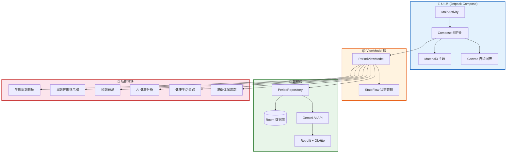
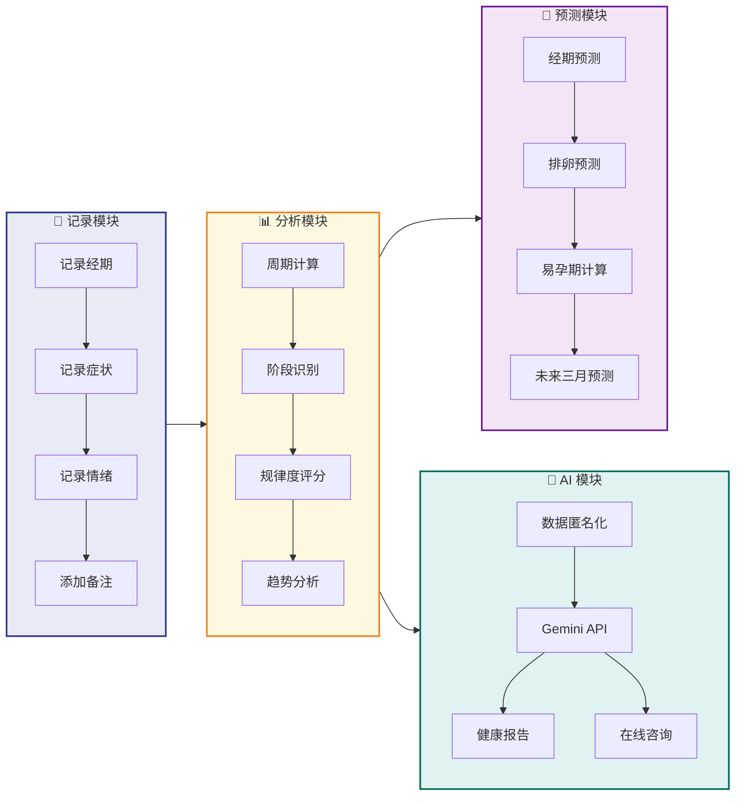
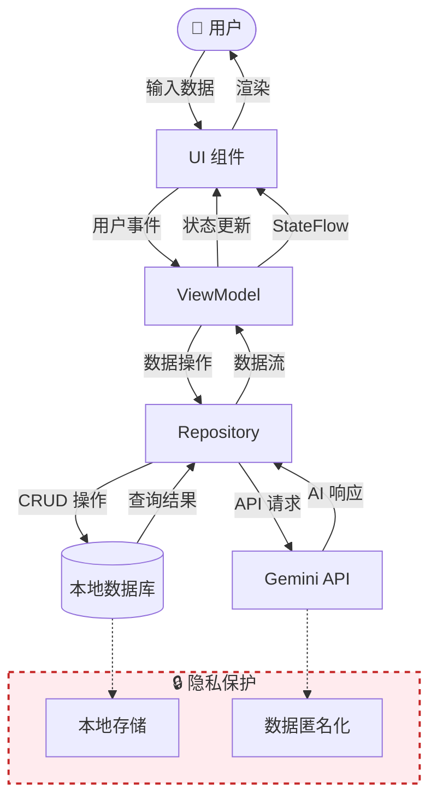
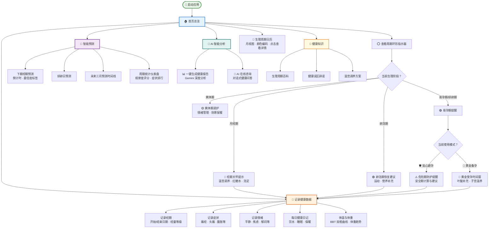
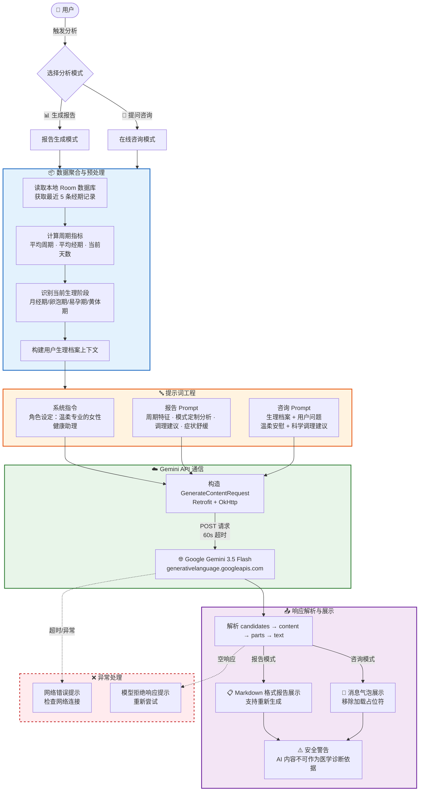

# LuminCore - 健康助手


一款专为女性设计的智能健康追踪应用，集成 AI 健康分析与周期预测，帮助用户记录和管理月经周期、身体症状和健康数据。

## 📁 项目目录结构

```
womenhealth-app-kaifa/
├── app/                                    # Android 应用模块
│   ├── build.gradle.kts                    # 应用模块构建脚本
│   ├── proguard-rules.pro                  # ProGuard 混淆规则
│   ├── google-services.json                # Google 服务配置
│   ├── agconnect-services.json             # 华为 AGC 服务配置
│   └── src/
│       ├── main/
│       │   ├── AndroidManifest.xml         # 应用清单文件
│       │   ├── java/top/mizhoubaobei/womenhealth/
│       │   │   ├── MainActivity.kt         # 主 Activity（单页架构）
│       │   │   ├── data/                   # 数据层
│       │   │   │   ├── api/
│       │   │   │   │   └── GeminiApi.kt    # Gemini AI REST API 客户端
│       │   │   │   ├── database/
│       │   │   │   │   ├── AppDatabase.kt  # Room 数据库定义
│       │   │   │   │   ├── PeriodDao.kt    # 月经记录 DAO
│       │   │   │   │   └── PeriodRecord.kt # 月经记录实体
│       │   │   │   └── repository/
│       │   │   │       └── PeriodRepository.kt  # 数据仓库 + 周期分析算法
│       │   │   └── ui/                     # UI 层
│       │   │       ├── components/         # Compose UI 组件
│       │   │       │   ├── AddRecordSheet.kt           # 经期记录表单
│       │   │       │   ├── AiAnalysisCard.kt           # AI 健康分析卡片
│       │   │       │   ├── BbtWeightTrackerCard.kt     # 基础体温与体重追踪
│       │   │       │   ├── CalendarSection.kt          # 生理周期日历
│       │   │       │   ├── CycleAnalyticsCard.kt       # 周期统计分析仪表盘
│       │   │       │   ├── CycleEncyclopediaCard.kt    # 生理周期百科
│       │   │       │   ├── CycleTrendChartCard.kt      # 周期趋势折线图
│       │   │       │   ├── CycleWheel.kt               # 周期环形进度指示器
│       │   │       │   ├── FuturePredictionsCard.kt    # 未来三月预测时间线
│       │   │       │   ├── HealingGuideCard.kt         # 温宫调养方案卡片
│       │   │       │   ├── MythBusterCard.kt           # 健康误区辟谣轮播
│       │   │       │   ├── NextPeriodPredictionCard.kt # 下期经期预测看板
│       │   │       │   └── WellnessTrackerCard.kt      # 每日健康生活追踪
│       │   │       ├── theme/              # Material3 主题配置
│       │   │       │   ├── Color.kt
│       │   │       │   ├── Theme.kt
│       │   │       │   └── Type.kt
│       │   │       └── viewmodel/          # ViewModel 层
│       │   │           └── PeriodViewModel.kt  # 主 ViewModel
│       │   └── res/                        # 资源文件
│       │       ├── drawable/               # 矢量图资源
│       │       ├── mipmap-*/               # 应用图标（多分辨率）
│       │       ├── values/                 # 字符串、颜色、主题
│       │       └── xml/                    # 备份规则配置
│       ├── test/                           # 单元测试
│       │   ├── java/top/mizhoubaobei/womenhealth/
│       │   │   ├── ExampleUnitTest.kt
│       │   │   ├── ExampleRobolectricTest.kt
│       │   │   └── GreetingScreenshotTest.kt
│       │   └── screenshots/                # 截图测试资源
│       └── androidTest/                    # 仪器测试
│           └── java/top/mizhoubaobei/womenhealth/
│               └── ExampleInstrumentedTest.kt
├── gradle/                                 # Gradle 配置
│   ├── libs.versions.toml                  # 版本目录（统一依赖管理）
│   └── wrapper/                            # Gradle Wrapper
├── plans/                                  # 开发计划文档（40+ 份规划）
├── .github/                                # GitHub 配置
│   ├── workflows/                          # CI/CD 工作流
│   │   ├── build-and-release.yml
│   │   └── sync-to-coding.yml
│   ├── ISSUE_TEMPLATE/                     # Issue 模板
│   └── pull_request_template.md            # PR 模板
├── .cnb/                                   # CNB 平台配置
│   └── web_trigger.yml
├── build.gradle.kts                        # 根项目构建脚本
├── settings.gradle.kts                     # Gradle 设置
├── gradle.properties                       # Gradle 属性
├── gradlew / gradlew.bat                   # Gradle Wrapper 脚本
├── README.md                               # 项目说明文档
├── CHANGELOG.md                            # 更新日志
├── CONTRIBUTING.md                         # 贡献指南
├── CODE_OF_CONDUCT.md                      # 行为准则
├── LICENSE                                 # 许可证
├── SECURITY.md                             # 安全政策
├── DEVELOPMENT_PLAN.md                     # 开发计划
├── IMPROVEMENT_PLAN.md                     # 改进计划
├── CI_CD_SIGNING_CONFIG.md                 # CI/CD 签名配置
└── local.properties.example                # 本地配置示例
```

## 📱 应用概述

LuminCore 是一款注重隐私保护的女性健康管理工具，采用纯本地存储方式，数据不会上传至任何服务器。应用提供直观的日历视图、智能周期预测、AI 健康分析和全面的健康数据记录功能，帮助女性更好地了解自己的身体状况，掌握健康规律。

应用内置**贴心避孕**和**黄金备孕**双模式，根据不同使用场景提供针对性的健康建议和预测分析。

## 📊 项目流程图

### 技术架构流程图


```mermaid
graph TB
    subgraph UI层["🎨 UI 层 (Jetpack Compose)"]
        MainActivity[MainActivity]
        ComposeUI[Compose 组件树]
        Theme[Material3 主题]
        Canvas[Canvas 自绘图表]
    end

    subgraph ViewModel层["📦 ViewModel 层"]
        PeriodVM[PeriodViewModel]
        StateFlow[StateFlow 状态管理]
    end

    subgraph Data层["💾 数据层"]
        Repository[PeriodRepository]
        RoomDB[(Room 数据库)]
        GeminiAPI[Gemini AI API]
        Retrofit[Retrofit + OkHttp]
    end

    subgraph 功能模块["🔧 功能模块"]
        Calendar[生理周期日历]
        CycleWheel[周期环形指示器]
        Prediction[经期预测]
        AIAnalysis[AI 健康分析]
        HealthTrack[健康生活追踪]
        BBT[基础体温追踪]
    end

    MainActivity --> ComposeUI
    ComposeUI --> Theme
    ComposeUI --> Canvas
    ComposeUI --> PeriodVM
    PeriodVM --> StateFlow
    PeriodVM --> Repository
    Repository --> RoomDB
    Repository --> GeminiAPI
    GeminiAPI --> Retrofit

    PeriodVM --> Calendar
    PeriodVM --> CycleWheel
    PeriodVM --> Prediction
    PeriodVM --> AIAnalysis
    PeriodVM --> HealthTrack
    PeriodVM --> BBT

    style UI层 fill:#E3F2FD,stroke:#1565C0,stroke-width:2px
    style ViewModel层 fill:#FFF3E0,stroke:#E65100,stroke-width:2px
    style Data层 fill:#E8F5E9,stroke:#2E7D32,stroke-width:2px
    style 功能模块 fill:#FCE4EC,stroke:#C62828,stroke-width:2px
```

### 核心功能流程图


```mermaid
graph LR
    subgraph 记录模块["📝 记录模块"]
        A[记录经期] --> B[记录症状]
        B --> C[记录情绪]
        C --> D[添加备注]
    end

    subgraph 分析模块["📊 分析模块"]
        E[周期计算] --> F[阶段识别]
        F --> G[规律度评分]
        G --> H[趋势分析]
    end

    subgraph 预测模块["🔮 预测模块"]
        I[经期预测] --> J[排卵预测]
        J --> K[易孕期计算]
        K --> L[未来三月预测]
    end

    subgraph AI模块["🤖 AI 模块"]
        M[数据匿名化] --> N[Gemini API]
        N --> O[健康报告]
        N --> P[在线咨询]
    end

    记录模块 --> 分析模块
    分析模块 --> 预测模块
    分析模块 --> AI模块

    style 记录模块 fill:#E8EAF6,stroke:#283593,stroke-width:2px
    style 分析模块 fill:#FFF8E1,stroke:#F57F17,stroke-width:2px
    style 预测模块 fill:#F3E5F5,stroke:#6A1B9A,stroke-width:2px
    style AI模块 fill:#E0F2F1,stroke:#00695C,stroke-width:2px
```

### 数据流向图


```mermaid
flowchart TD
    User([👤 用户]) --> |输入数据| UI[UI 组件]
    UI --> |用户事件| VM[ViewModel]
    VM --> |状态更新| UI
    VM --> |数据操作| Repo[Repository]

    Repo --> |CRUD 操作| DB[(本地数据库)]
    DB --> |查询结果| Repo

    Repo --> |API 请求| API[Gemini API]
    API --> |AI 响应| Repo

    Repo --> |数据流| VM
    VM --> |StateFlow| UI
    UI --> |渲染| User

    subgraph 安全层["🔒 隐私保护"]
        LocalStore[本地存储]
        Anonymize[数据匿名化]
    end

    DB -.-> LocalStore
    API -.-> Anonymize

    style 安全层 fill:#FFEBEE,stroke:#C62828,stroke-width:2px,stroke-dasharray: 5 5
```

### 用户使用流程图


```mermaid
flowchart TD
    Start([🚀 启动应用]) --> Home[🏠 首页总览]
    Home --> CycleWheel[⭕ 查看周期环形指示器]
    CycleWheel --> Phase{当前生理阶段？}

    Phase -->|月经期| PeriodTips[🔴 经期关怀提示<br/>温宫调养 · 红糖水 · 泡足]
    Phase -->|卵泡期| FollicularTips[🟢 卵泡期恢复建议<br/>运动 · 营养补充]
    Phase -->|易孕期/排卵期| OvulationTips[🟣 易孕期提醒]
    Phase -->|黄体期| LutealTips[🟡 黄体期调护<br/>情绪管理 · 防寒保暖]

    OvulationTips --> ModeCheck{当前使用模式？}
    ModeCheck -->|🛡️ 贴心避孕| SafeWarning[⚠️ 危险期防护提醒<br/>安全期计算与建议]
    ModeCheck -->|🌸 黄金备孕| ConceiveWindow[👶 黄金受孕时间窗<br/>叶酸补充 · 子宫温养]

    Home --> Record[📝 记录健康数据]
    Record --> R1[记录经期<br/>开始/结束日期 · 经量等级]
    Record --> R2[记录症状<br/>痛经 · 头痛 · 腹胀等]
    Record --> R3[记录情绪<br/>平静 · 焦虑 · 郁闷等]
    Record --> R4[每日健康日记<br/>饮水 · 睡眠 · 保暖]
    Record --> R5[体温与体重<br/>BBT 双相曲线 · 体重趋势]

    Home --> Predict[🔮 智能预测]
    Predict --> P1[下期经期预测<br/>倒计时 · 置信度标签]
    Predict --> P2[排卵日预测]
    Predict --> P3[未来三月预测时间线]
    Predict --> P4[周期统计仪表盘<br/>规律度评分 · 症状排行]

    Home --> AI[🤖 AI 智能分析]
    AI --> AIReport[📊 一键生成健康报告<br/>Gemini 深度分析]
    AI --> AIChat[💬 AI 在线咨询<br/>对话式健康问答]

    Home --> Calendar[📅 生理周期日历<br/>月视图 · 颜色编码 · 点击查看详情]

    Home --> Knowledge[📖 健康知识]
    Knowledge --> K1[生理周期百科]
    Knowledge --> K2[健康误区辟谣]
    Knowledge --> K3[温宫调养方案]

    PeriodTips --> Record
    FollicularTips --> Record
    SafeWarning --> Record
    ConceiveWindow --> Record

    style Start fill:#E8F5E9,stroke:#2E7D32,stroke-width:2px
    style Home fill:#E3F2FD,stroke:#1565C0,stroke-width:2px
    style Record fill:#FFF3E0,stroke:#E65100,stroke-width:2px
    style Predict fill:#F3E5F5,stroke:#6A1B9A,stroke-width:2px
    style AI fill:#E0F2F1,stroke:#00695C,stroke-width:2px
    style Knowledge fill:#FFF8E1,stroke:#F57F17,stroke-width:2px
```

### AI 分析流程图


```mermaid
flowchart TD
    User([👤 用户]) --> |触发分析| Trigger{选择分析模式}

    Trigger -->|📊 生成报告| ReportMode[报告生成模式]
    Trigger -->|💬 提问咨询| ChatMode[在线咨询模式]

    subgraph 数据准备["📦 数据聚合与预处理"]
        FetchRecords[读取本地 Room 数据库<br/>获取最近 5 条经期记录]
        CalcMetrics[计算周期指标<br/>平均周期 · 平均经期 · 当前天数]
        PhaseDetect[识别当前生理阶段<br/>月经期/卵泡期/易孕期/黄体期]
        BuildContext[构建用户生理档案上下文]
        FetchRecords --> CalcMetrics --> PhaseDetect --> BuildContext
    end

    subgraph 提示词构建["🔤 提示词工程"]
        SysPrompt[系统指令<br/>角色设定：温柔专业的女性健康助理]
        ReportPrompt[报告 Prompt<br/>周期特征 · 模式定制分析 · 调理建议 · 症状舒缓]
        ChatPrompt[咨询 Prompt<br/>生理档案 + 用户问题<br/>温柔安慰 + 科学调理建议]
    end

    ReportMode --> 数据准备
    ChatMode --> 数据准备
    BuildContext --> 提示词构建
    SysPrompt --> ApiCall
    ReportPrompt --> ApiCall
    ChatPrompt --> ApiCall

    subgraph API调用["☁️ Gemini API 通信"]
        ApiCall[构造 GenerateContentRequest<br/>Retrofit + OkHttp]
        GeminiAPI[🌐 Google Gemini 3.5 Flash<br/>generativelanguage.googleapis.com]
        ApiCall --> |POST 请求<br/>60s 超时| GeminiAPI
    end

    subgraph 响应处理["📤 响应解析与展示"]
        ParseResponse[解析 candidates → content → parts → text]
        ParseResponse --> |报告模式| ReportDisplay[📋 Markdown 格式报告展示<br/>支持重新生成]
        ParseResponse --> |咨询模式| ChatDisplay[💬 消息气泡展示<br/>移除加载占位符]
        SafetyDisclaimer[⚠️ 安全警告<br/>AI 内容不可作为医学诊断依据]
    end

    GeminiAPI --> ParseResponse
    ReportDisplay --> SafetyDisclaimer
    ChatDisplay --> SafetyDisclaimer

    subgraph 错误处理["❌ 异常处理"]
        NetworkError[网络错误提示<br/>检查网络连接]
        ModelError[模型拒绝响应提示<br/>重新尝试]
    end

    GeminiAPI -.-> |超时/异常| NetworkError
    ParseResponse -.-> |空响应| ModelError

    style 数据准备 fill:#E3F2FD,stroke:#1565C0,stroke-width:2px
    style 提示词构建 fill:#FFF3E0,stroke:#E65100,stroke-width:2px
    style API调用 fill:#E8F5E9,stroke:#2E7D32,stroke-width:2px
    style 响应处理 fill:#F3E5F5,stroke:#6A1B9A,stroke-width:2px
    style 错误处理 fill:#FFEBEE,stroke:#C62828,stroke-width:2px,stroke-dasharray: 5 5
```

## ✨ 已实现功能

### 核心追踪
- **月经周期追踪**：记录月经开始和结束日期、经量等级（极少/较少/正常/较多）
- **症状记录**：支持 6 种常见症状（痛经、头痛、腹胀、乳房胀痛、粉刺、无症状）
- **情绪记录**：追踪 6 种情绪状态（平静、敏感、郁闷、开朗、疲惫、焦虑）
- **备忘录**：为每次记录添加自由文字备注
- **历史记录管理**：查看和删除所有历史经期记录

### 智能预测与分析
- **智能周期预测**：基于历史数据计算平均周期长度，预测下次月经日期和排卵期
- **周期四阶段识别**：自动识别月经期、卵泡期、易孕期（排卵期）、黄体期
- **下期经期预测看板**：展示预测置信度（初步推测/高精确推算），提供经前准备建议
- **未来三月预测时间线**：展示未来 3 个月的经期和易孕期预测
- **周期统计分析仪表盘**：累计记录数、平均行经天数、平均周期跨度、规律度评分、症状/情绪频次排行
- **周期趋势图**：Canvas 自绘的 6 个月周期长度趋势折线图

### 健康生活追踪
- **基础体温 (BBT) 追踪**：滑块调节 + 精细步进按钮，7 天体温趋势曲线图
- **体重追踪**：7 天体重波动趋势曲线图
- **每日健康日记**：饮水量追踪（8 杯目标）、饮品类型选择（暖宫姜茶/红糖水/益母草饮/温开水）、睡眠质量、保暖感受
- **温宫调养方案**：温热食疗、艾叶泡足、三阴交穴位按摩，根据当前周期阶段动态推荐

### AI 智能分析
- **AI 健康报告生成**：调用 Gemini 3.5 Flash 模型，基于历史数据一键生成个性化周期分析报告
- **AI 在线咨询**：对话式健康问答，推荐提问卡片一键速问
- **系统提示定制**：AI 角色设定为专业女性生理健康调理助理

### 可视化与交互
- **周期环形进度指示器**：Canvas 自绘的环形图，四色分段（月经期/卵泡期/易孕期/黄体期），脉冲动画定位当前天数
- **生理周期日历**：月视图日历，颜色编码标记经期（粉色）、预测期（橙色）、排卵/易孕（紫色），点击查看当日详情
- **生理周期百科**：各生理阶段的科学知识介绍
- **健康误区辟谣**：轮播卡片形式的健康知识科普

### 模式切换
- **贴心避孕模式**：重点提示易孕危险期，提供安全期防护建议
- **黄金备孕模式**：重点分析排卵日和黄金受孕时间窗，提供叶酸补充和子宫温养建议

## 💡 应用亮点

- **全 Jetpack Compose 架构**：采用声明式 UI，无 XML 布局，流畅的动画过渡
- **Material Design 3 设计语言**：支持动态主题，统一的圆角卡片风格
- **Canvas 自绘图表**：体温/体重趋势图、周期环形指示器均为原生 Canvas 绘制，无第三方图表库依赖
- **完全离线使用**：核心数据本地 Room 数据库存储，无需网络连接
- **AI 增强分析**：集成 Google Gemini 大模型，提供智能健康洞察
- **双模式适配**：避孕与备孕场景一键切换，预测和建议随之变化
- **Edge-to-Edge 全屏显示**：沉浸式 UI 体验

## 🛠️ 技术架构

### 架构模式
- **MVVM** (Model-View-ViewModel)
- **单 Activity 架构**：`MainActivity` + Compose 组件树
- **响应式数据流**：`StateFlow` + `collectAsStateWithLifecycle`

### 技术栈

| 类别 | 技术 | 版本 |
|------|------|------|
| 语言 | Kotlin | 2.2.10 |
| 构建工具 | Android Gradle Plugin | 9.1.1 |
| UI 框架 | Jetpack Compose (BOM) | 2024.09.00 |
| 设计系统 | Material3 | (BOM 管理) |
| 数据库 | Room | 2.7.0 |
| 网络层 | Retrofit + OkHttp | 2.12.0 / 4.10.0 |
| JSON 序列化 | Moshi | 1.15.2 |
| 异步处理 | Kotlin Coroutines | 1.10.2 |
| 生命周期 | Lifecycle (ViewModel, Runtime) | 2.8.7 |
| Activity | Activity Compose | 1.10.1 |
| Core | AndroidX Core KTX | 1.18.0 |
| KSP | KSP (注解处理) | 2.3.5 |
| 密钥管理 | Secrets Gradle Plugin | 2.0.1 |
| 云服务 | Firebase BOM | 34.12.0 |

### 测试框架

| 框架 | 版本 | 用途 |
|------|------|------|
| JUnit | 4.13.2 | 单元测试 |
| Robolectric | 4.16.1 | Android 环境单元测试 |
| Roborazzi | 1.59.0 | 截图测试 |
| Espresso | 3.7.0 | UI 仪器测试 |
| Coroutines Test | 1.10.2 | 协程测试 |

## 📱 主要功能模块

### 周期环形指示器
- Canvas 自绘的环形进度图，四色分段展示月经期、卵泡期、易孕期、黄体期
- 脉冲动画定位当前周期天数
- 中央 HUD 显示当前天数、生理阶段和距下次经期天数

### 生理周期日历
- 月视图日历，支持月份切换
- 颜色编码：粉色标记经期、橙色标记预测期、紫色标记排卵/易孕期
- 点击日期查看详情卡片（经量、症状、情绪、备注）
- 图例标注各类颜色含义

### 下期经期预测看板
- 大字展示预测来潮日期和倒计时
- 置信度标签（初步推测/高精确推算）随记录数自动升级
- 周期转段进度图（Canvas 自绘时间线）
- 经前贴心备忘清单
- 模拟日历同步功能

### AI 智能分析中心
- **报告模式**：一键生成 Gemini 加持的周期分析报告，支持重新生成
- **咨询模式**：对话式 AI 问答，推荐提问卡片，消息气泡布局
- 安全警告提示：AI 生成内容不可作为医学诊断依据

### 基础体温与体重追踪
- 滑块 + 精细步进按钮（±0.05°C / ±0.2kg）
- 7 天趋势曲线图（Canvas 自绘贝塞尔曲线 + 渐变填充）
- 双 Tab 切换（BBT / 体重）
- 科学小贴士：体温双相分布、体重水钠潴留原理

### 每日健康生活追踪
- 饮水量进度条（8 杯目标）
- 饮品类型快速选择（暖宫姜茶/红糖水/益母草饮/温开水）
- 睡眠质量与保暖感受自评
- 温宫调养方案：食疗/泡足/穴位按摩打卡，根据周期阶段动态推荐

### 周期统计分析仪表盘
- 累计记录数、平均行经天数、平均周期跨度
- 生理周期规律度评分（标准差算法）
- 频发症状排行、情绪波动偏好（进度条可视化）

## 📋 安装要求

- Android 7.0 (API 级别 24) 或更高版本
- 约 20MB 存储空间
- 权限需求：
  - 网络权限（用于 AI 分析功能）

## 🚀 安装方式

### 直接下载 APK 安装
1. 从 [GitHub Releases](https://github.com/xiaomizhoubaobei/womenhealth-app/releases) 下载最新版本
2. 在 Android 设备上打开 APK 文件进行安装
3. 首次安装需要允许"未知来源"应用安装权限

### 开发者安装
```bash
# 克隆仓库
git clone https://github.com/xiaomizhoubaobei/womenhealth-app.git

# 使用 Android Studio 打开项目
# 点击 "Run" 按钮在设备或模拟器上安装
```

## 🔧 构建配置

| 配置项 | 值 |
|--------|-----|
| compileSdk | 36 |
| minSdk | 24 |
| targetSdk | 36 |
| Java 版本 | 11 |
| Kotlin 版本 | 2.1.10 |
| AGP 版本 | 9.1.1 |
| 应用 ID | `top.mizhoubaobei.womenhealth` |
| 版本号 | 0.0.1 (versionCode: 1) |
| 项目名称 | LuminCore |

### AI 功能配置

AI 健康分析功能需要配置 Gemini API Key：

1. **CI 环境**：通过环境变量 `GEMINI_API_KEY` 注入
2. **本地开发**：在 `gradle.properties` 中添加 `GEMINI_API_KEY=your_key`

### 签名配置

Release 版本使用以下签名配置（通过 GitHub Secrets 管理）：

| Secret 名称 | 描述 |
|-------------|------|
| `RELEASE_STORE_FILE` | Keystore 文件路径 |
| `RELEASE_STORE_PASSWORD` / `KEYSTORE_PASSWORD` | Keystore 密码 |
| `RELEASE_KEY_ALIAS` / `KEY_ALIAS` | 密钥别名 |
| `RELEASE_KEY_PASSWORD` / `KEY_PASSWORD` | 密钥密码 |

签名支持 V1-V4 全版本签名方案。Debug 版本使用项目内置的 `debug.keystore`。

### 环境要求

- JDK 11
- Android SDK 36
- Gradle 8.0+

## 🔒 隐私说明

本应用高度重视用户隐私保护：
- 所有经期、症状、情绪数据均存储在用户设备本地（Room 数据库），不会上传至任何服务器
- 不收集用户个人身份信息
- AI 分析功能通过 Google Gemini API 实现，仅发送匿名化的周期统计数据，不包含个人身份信息
- 支持数据备份与恢复

## 👩‍💻 开发者信息

- **开发者**：祁潇潇 (米粥宝贝)
- **联系方式**：
  - 邮箱：womenhealth@x.mizhoubaobei.top
  - 学术邮箱：qixiaoxin@stu.sqxy.edu.cn
- **问题反馈**：https://github.com/xiaomizhoubaobei/womenhealth-app/issues

## 🔗 相关链接

- [更新日志](CHANGELOG.md)
- [贡献指南](CONTRIBUTING.md)
- [行为准则](CODE_OF_CONDUCT.md)

## 🤝 参与贡献

欢迎对项目提出建议和改进！如果您想参与贡献，请：

1. Fork 本仓库
2. 创建您的特性分支 (`git checkout -b feature/AmazingFeature`)
3. 提交您的更改 (`git commit -m '添加某个特性'`)
4. 推送到分支 (`git push origin feature/AmazingFeature`)
5. 打开一个 Pull Request

请确保遵循我们的[贡献指南](CONTRIBUTING.md)和[行为准则](CODE_OF_CONDUCT.md)。

## 🌟 致谢

- 感谢所有为项目提供反馈和建议的用户
- 感谢开源社区提供的优秀库和工具
- 特别感谢参与测试的女性健康专家和志愿者

## 📄 许可证

版权所有 © 2025 祁潇潇

本软件已申请软件著作权保护。允许个人用户出于非商业目的使用、查看和学习本软件的源代码。未经版权所有者明确书面许可，禁止将本软件用于任何商业目的，禁止重新分发本软件的原始或修改版本，禁止基于本软件创建衍生作品。

详细许可条款请参阅项目根目录中的 LICENSE 文件。
