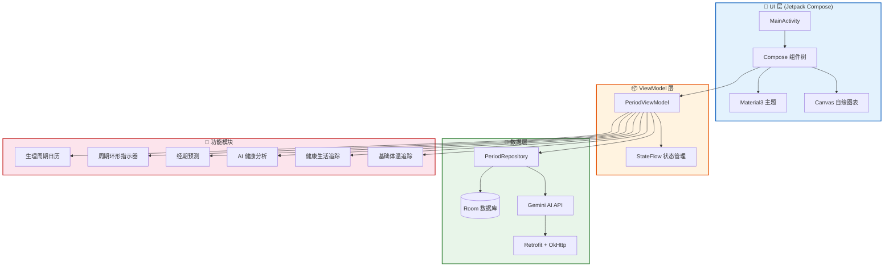
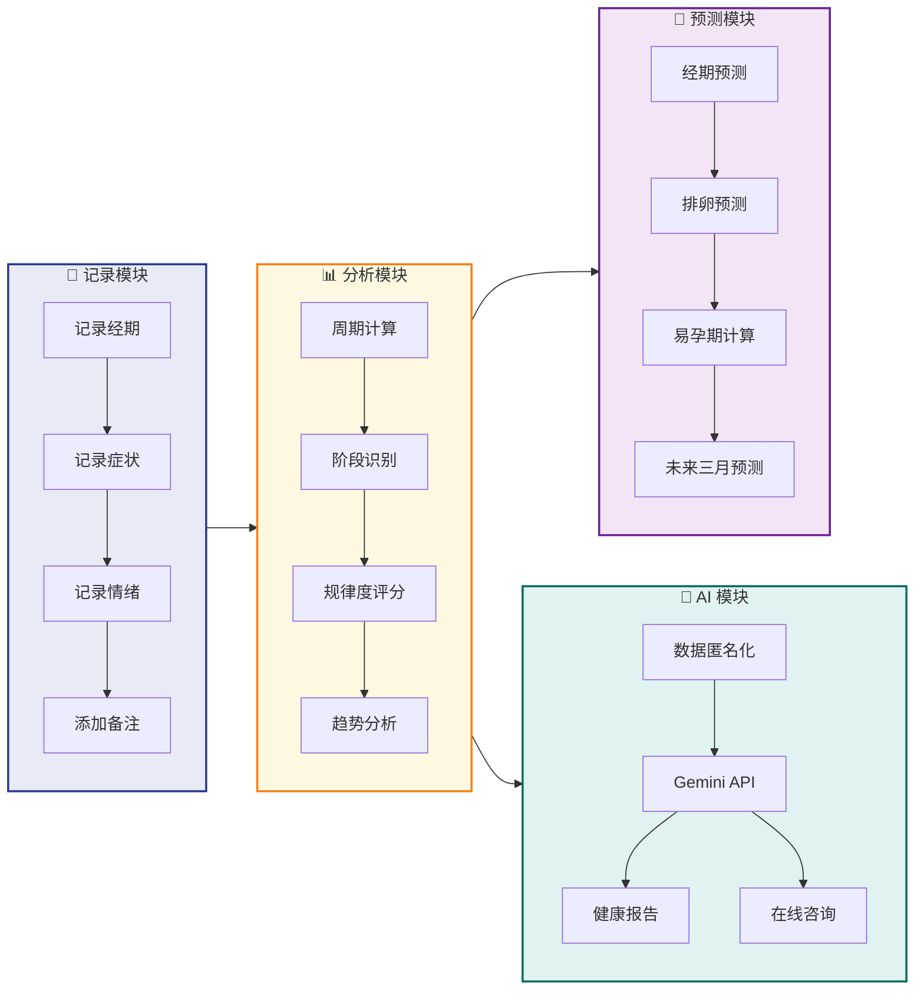
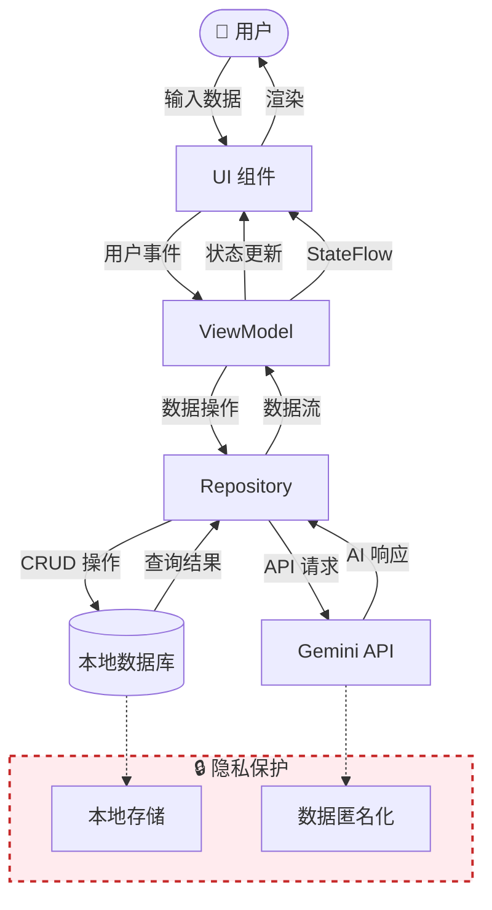
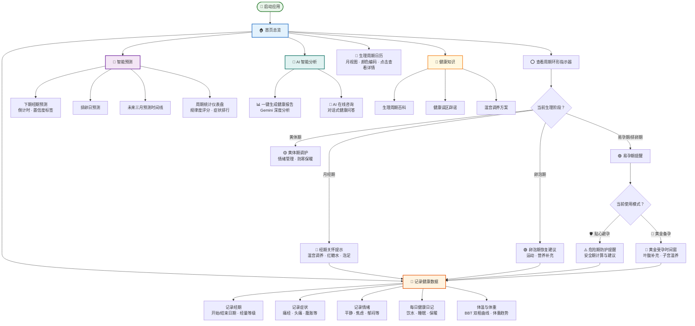
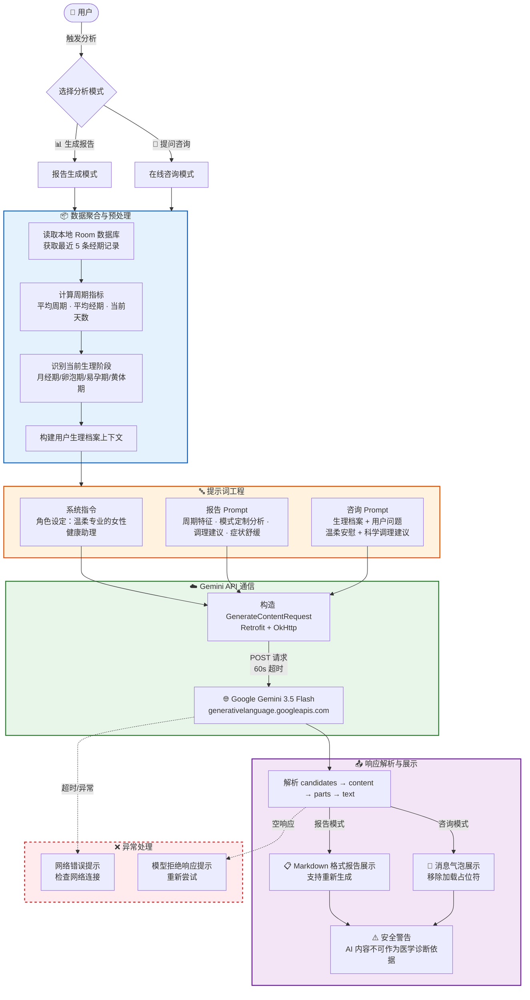

# 📊 项目流程图

> 本文档包含 LuminCore 健康助手应用的核心流程图，展示技术架构、功能模块、数据流和用户交互流程。

## 技术架构流程图

```mermaid
graph TB
    subgraph UI层["🎨 UI 层 (Jetpack Compose)"]
        MainActivity[MainActivity]
        ComposeUI[Compose 组件树]
        Theme[Material3 主题]
        Canvas[Canvas 自绘图表]
    end

    subgraph ViewModel层["📦 ViewModel 层"]
        PeriodVM[PeriodViewModel]
        StateFlow[StateFlow 状态管理]
    end

    subgraph Data层["💾 数据层"]
        Repository[PeriodRepository]
        RoomDB[(Room 数据库)]
        GeminiAPI[Gemini AI API]
        Retrofit[Retrofit + OkHttp]
    end

    subgraph 功能模块["🔧 功能模块"]
        Calendar[生理周期日历]
        CycleWheel[周期环形指示器]
        Prediction[经期预测]
        AIAnalysis[AI 健康分析]
        HealthTrack[健康生活追踪]
        BBT[基础体温追踪]
    end

    MainActivity --> ComposeUI
    ComposeUI --> Theme
    ComposeUI --> Canvas
    ComposeUI --> PeriodVM
    PeriodVM --> StateFlow
    PeriodVM --> Repository
    Repository --> RoomDB
    Repository --> GeminiAPI
    GeminiAPI --> Retrofit

    PeriodVM --> Calendar
    PeriodVM --> CycleWheel
    PeriodVM --> Prediction
    PeriodVM --> AIAnalysis
    PeriodVM --> HealthTrack
    PeriodVM --> BBT

    style UI层 fill:#E3F2FD,stroke:#1565C0,stroke-width:2px
    style ViewModel层 fill:#FFF3E0,stroke:#E65100,stroke-width:2px
    style Data层 fill:#E8F5E9,stroke:#2E7D32,stroke-width:2px
    style 功能模块 fill:#FCE4EC,stroke:#C62828,stroke-width:2px
```

## 核心功能流程图

```mermaid
graph LR
    subgraph 记录模块["📝 记录模块"]
        A[记录经期] --> B[记录症状]
        B --> C[记录情绪]
        C --> D[添加备注]
    end

    subgraph 分析模块["📊 分析模块"]
        E[周期计算] --> F[阶段识别]
        F --> G[规律度评分]
        G --> H[趋势分析]
    end

    subgraph 预测模块["🔮 预测模块"]
        I[经期预测] --> J[排卵预测]
        J --> K[易孕期计算]
        K --> L[未来三月预测]
    end

    subgraph AI模块["🤖 AI 模块"]
        M[数据匿名化] --> N[Gemini API]
        N --> O[健康报告]
        N --> P[在线咨询]
    end

    记录模块 --> 分析模块
    分析模块 --> 预测模块
    分析模块 --> AI模块

    style 记录模块 fill:#E8EAF6,stroke:#283593,stroke-width:2px
    style 分析模块 fill:#FFF8E1,stroke:#F57F17,stroke-width:2px
    style 预测模块 fill:#F3E5F5,stroke:#6A1B9A,stroke-width:2px
    style AI模块 fill:#E0F2F1,stroke:#00695C,stroke-width:2px
```

## 数据流向图

```mermaid
flowchart TD
    User([👤 用户]) --> |输入数据| UI[UI 组件]
    UI --> |用户事件| VM[ViewModel]
    VM --> |状态更新| UI
    VM --> |数据操作| Repo[Repository]

    Repo --> |CRUD 操作| DB[(本地数据库)]
    DB --> |查询结果| Repo

    Repo --> |API 请求| API[Gemini API]
    API --> |AI 响应| Repo

    Repo --> |数据流| VM
    VM --> |StateFlow| UI
    UI --> |渲染| User

    subgraph 安全层["🔒 隐私保护"]
        LocalStore[本地存储]
        Anonymize[数据匿名化]
    end

    DB -.-> LocalStore
    API -.-> Anonymize

    style 安全层 fill:#FFEBEE,stroke:#C62828,stroke-width:2px,stroke-dasharray: 5 5
```

## 用户使用流程图

```mermaid
flowchart TD
    Start([🚀 启动应用]) --> Home[🏠 首页总览]
    Home --> CycleWheel[⭕ 查看周期环形指示器]
    CycleWheel --> Phase{当前生理阶段？}

    Phase -->|月经期| PeriodTips[🔴 经期关怀提示<br/>温宫调养 · 红糖水 · 泡足]
    Phase -->|卵泡期| FollicularTips[🟢 卵泡期恢复建议<br/>运动 · 营养补充]
    Phase -->|易孕期/排卵期| OvulationTips[🟣 易孕期提醒]
    Phase -->|黄体期| LutealTips[🟡 黄体期调护<br/>情绪管理 · 防寒保暖]

    OvulationTips --> ModeCheck{当前使用模式？}
    ModeCheck -->|🛡️ 贴心避孕| SafeWarning[⚠️ 危险期防护提醒<br/>安全期计算与建议]
    ModeCheck -->|🌸 黄金备孕| ConceiveWindow[👶 黄金受孕时间窗<br/>叶酸补充 · 子宫温养]

    Home --> Record[📝 记录健康数据]
    Record --> R1[记录经期<br/>开始/结束日期 · 经量等级]
    Record --> R2[记录症状<br/>痛经 · 头痛 · 腹胀等]
    Record --> R3[记录情绪<br/>平静 · 焦虑 · 郁闷等]
    Record --> R4[每日健康日记<br/>饮水 · 睡眠 · 保暖]
    Record --> R5[体温与体重<br/>BBT 双相曲线 · 体重趋势]

    Home --> Predict[🔮 智能预测]
    Predict --> P1[下期经期预测<br/>倒计时 · 置信度标签]
    Predict --> P2[排卵日预测]
    Predict --> P3[未来三月预测时间线]
    Predict --> P4[周期统计仪表盘<br/>规律度评分 · 症状排行]

    Home --> AI[🤖 AI 智能分析]
    AI --> AIReport[📊 一键生成健康报告<br/>Gemini 深度分析]
    AI --> AIChat[💬 AI 在线咨询<br/>对话式健康问答]

    Home --> Calendar[📅 生理周期日历<br/>月视图 · 颜色编码 · 点击查看详情]

    Home --> Knowledge[📖 健康知识]
    Knowledge --> K1[生理周期百科]
    Knowledge --> K2[健康误区辟谣]
    Knowledge --> K3[温宫调养方案]

    PeriodTips --> Record
    FollicularTips --> Record
    SafeWarning --> Record
    ConceiveWindow --> Record

    style Start fill:#E8F5E9,stroke:#2E7D32,stroke-width:2px
    style Home fill:#E3F2FD,stroke:#1565C0,stroke-width:2px
    style Record fill:#FFF3E0,stroke:#E65100,stroke-width:2px
    style Predict fill:#F3E5F5,stroke:#6A1B9A,stroke-width:2px
    style AI fill:#E0F2F1,stroke:#00695C,stroke-width:2px
    style Knowledge fill:#FFF8E1,stroke:#F57F17,stroke-width:2px
```

## AI 分析流程图

```mermaid
flowchart TD
    User([👤 用户]) --> |触发分析| Trigger{选择分析模式}

    Trigger -->|📊 生成报告| ReportMode[报告生成模式]
    Trigger -->|💬 提问咨询| ChatMode[在线咨询模式]

    subgraph 数据准备["📦 数据聚合与预处理"]
        FetchRecords[读取本地 Room 数据库<br/>获取最近 5 条经期记录]
        CalcMetrics[计算周期指标<br/>平均周期 · 平均经期 · 当前天数]
        PhaseDetect[识别当前生理阶段<br/>月经期/卵泡期/易孕期/黄体期]
        BuildContext[构建用户生理档案上下文]
        FetchRecords --> CalcMetrics --> PhaseDetect --> BuildContext
    end

    subgraph 提示词构建["🔤 提示词工程"]
        SysPrompt[系统指令<br/>角色设定：温柔专业的女性健康助理]
        ReportPrompt[报告 Prompt<br/>周期特征 · 模式定制分析 · 调理建议 · 症状舒缓]
        ChatPrompt[咨询 Prompt<br/>生理档案 + 用户问题<br/>温柔安慰 + 科学调理建议]
    end

    ReportMode --> 数据准备
    ChatMode --> 数据准备
    BuildContext --> 提示词构建
    SysPrompt --> ApiCall
    ReportPrompt --> ApiCall
    ChatPrompt --> ApiCall

    subgraph API调用["☁️ Gemini API 通信"]
        ApiCall[构造 GenerateContentRequest<br/>Retrofit + OkHttp]
        GeminiAPI[🌐 Google Gemini 3.5 Flash<br/>generativelanguage.googleapis.com]
        ApiCall --> |POST 请求<br/>60s 超时| GeminiAPI
    end

    subgraph 响应处理["📤 响应解析与展示"]
        ParseResponse[解析 candidates → content → parts → text]
        ParseResponse --> |报告模式| ReportDisplay[📋 Markdown 格式报告展示<br/>支持重新生成]
        ParseResponse --> |咨询模式| ChatDisplay[💬 消息气泡展示<br/>移除加载占位符]
        SafetyDisclaimer[⚠️ 安全警告<br/>AI 内容不可作为医学诊断依据]
    end

    GeminiAPI --> ParseResponse
    ReportDisplay --> SafetyDisclaimer
    ChatDisplay --> SafetyDisclaimer

    subgraph 错误处理["❌ 异常处理"]
        NetworkError[网络错误提示<br/>检查网络连接]
        ModelError[模型拒绝响应提示<br/>重新尝试]
    end

    GeminiAPI -.-> |超时/异常| NetworkError
    ParseResponse -.-> |空响应| ModelError

    style 数据准备 fill:#E3F2FD,stroke:#1565C0,stroke-width:2px
    style 提示词构建 fill:#FFF3E0,stroke:#E65100,stroke-width:2px
    style API调用 fill:#E8F5E9,stroke:#2E7D32,stroke-width:2px
    style 响应处理 fill:#F3E5F5,stroke:#6A1B9A,stroke-width:2px
    style 错误处理 fill:#FFEBEE,stroke:#C62828,stroke-width:2px,stroke-dasharray: 5 5
```
