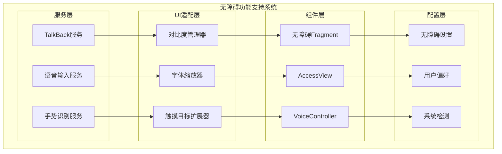
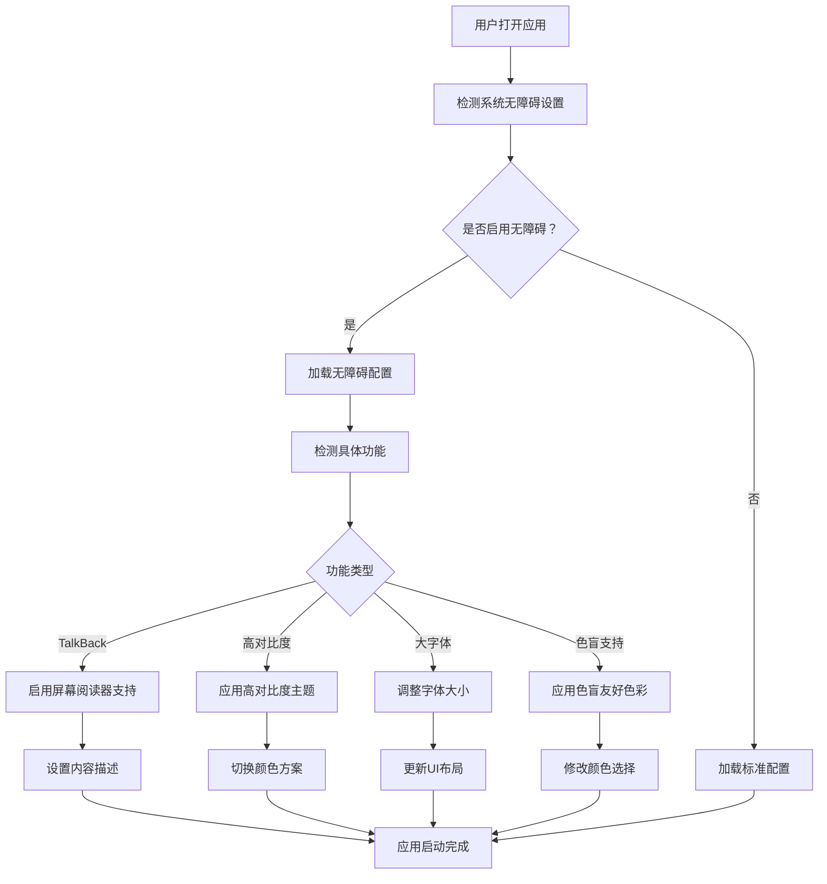

# LuminCore 无障碍功能支持详细计划


## 📋 项目概述

### 系统目标
构建全面的无障碍功能支持体系，确保LuminCore应用对所有用户群体都能提供平等、便捷的使用体验，包括视觉障碍、听觉障碍、运动障碍和认知障碍用户。

### 核心价值
- **包容设计**：确保每个用户都能独立使用应用
- **法规合规**：满足国际无障碍标准和法规要求
- **用户体验**：为特殊需求用户提供优质体验
- **社会责任**：体现企业的社会责任和价值观

## 🎯 功能需求分析

### 1. 无障碍支持类型

#### 1.1 视觉无障碍支持
```kotlin
enum class VisualAccessibilityFeature(
    val displayName: String,
    val description: String,
    val priority: AccessibilityPriority
) {
    SCREEN_READER_SUPPORT("屏幕阅读器支持", "完整的TalkBack/VoiceOver支持", AccessibilityPriority.HIGH),
    HIGH_CONTRAST_MODE("高对比度模式", "提供高对比度配色方案", AccessibilityPriority.HIGH),
    LARGE_TEXT_SUPPORT("大字体支持", "支持系统字体缩放", AccessibilityPriority.HIGH),
    COLOR_BLIND_SUPPORT("色盲友好", "色盲用户友好的界面设计", AccessibilityPriority.MEDIUM),
    VOICE_NAVIGATION("语音导航", "语音控制界面导航", AccessibilityPriority.MEDIUM)
}
```

#### 1.2 运动无障碍支持
```kotlin
enum class MotorAccessibilityFeature(
    val displayName: String,
    val description: String
) {
    LARGE_TOUCH_TARGETS("大触摸目标", "符合无障碍标准的触摸区域大小"),
    GESTURE_ALTERNATIVES("手势替代", "为复杂手势提供替代操作方式"),
    VOICE_INPUT("语音输入", "支持语音输入替代文字输入"),
    SWITCH_CONTROL("开关控制", "支持外部开关设备控制"),
    STICKY_KEYS("粘滞键", "支持单手操作的按键组合")
}
```

#### 1.3 认知无障碍支持
```kotlin
enum class CognitiveAccessibilityFeature(
    val displayName: String,
    val description: String
) {
    SIMPLE_INTERFACE("简化界面", "提供简化版界面选项"),
    CLEAR_NAVIGATION("清晰导航", "简单明确的导航结构"),
    CONSISTENT_LAYOUT("一致布局", "保持界面元素位置一致"),
    HELPFUL_TOOLTIPS("帮助提示", "提供上下文相关的帮助信息"),
    ERROR_PREVENTION("错误预防", "防止用户操作错误的设计")
}
```

## 🏗️ 技术架构设计

### 1. 无障碍系统架构



### 2. 无障碍支持流程



### 3. 核心组件实现

#### 3.1 无障碍管理器
```kotlin
@Singleton
class AccessibilityManager @Inject constructor(
    private val context: Context,
    private val userPreferencesRepository: UserPreferencesRepository
) {
    
    fun isAccessibilityEnabled(): Boolean {
        val accessibilityManager = context.getSystemService(Context.ACCESSIBILITY_SERVICE) 
            as android.view.accessibility.AccessibilityManager
        return accessibilityManager.isEnabled
    }
    
    fun isTalkBackEnabled(): Boolean {
        val accessibilityManager = context.getSystemService(Context.ACCESSIBILITY_SERVICE) 
            as android.view.accessibility.AccessibilityManager
        
        val serviceList = accessibilityManager.getEnabledAccessibilityServiceList(
            AccessibilityServiceInfo.FEEDBACK_SPOKEN
        )
        
        return serviceList.any { 
            it.id.contains("talkback", ignoreCase = true) 
        }
    }
    
    fun setupAccessibilityForView(view: View, config: AccessibilityConfig) {
        view.apply {
            // 设置内容描述
            contentDescription = config.contentDescription
            
            // 设置可获得焦点
            isFocusable = config.isFocusable
            isFocusableInTouchMode = config.isFocusableInTouchMode
            
            // 设置重要性级别
            importantForAccessibility = when (config.importance) {
                AccessibilityImportance.YES -> View.IMPORTANT_FOR_ACCESSIBILITY_YES
                AccessibilityImportance.NO -> View.IMPORTANT_FOR_ACCESSIBILITY_NO
                AccessibilityImportance.AUTO -> View.IMPORTANT_FOR_ACCESSIBILITY_AUTO
            }
            
            // 设置角色
            if (Build.VERSION.SDK_INT >= Build.VERSION_CODES.P) {
                accessibilityClassName = config.roleDescription
            }
            
            // 设置状态描述
            if (Build.VERSION.SDK_INT >= Build.VERSION_CODES.R) {
                stateDescription = config.stateDescription
            }
            
            // 设置触摸委托扩大触摸区域
            if (config.expandTouchTarget) {
                expandTouchTarget(this)
            }
        }
    }
    
    private fun expandTouchTarget(view: View) {
        val parent = view.parent as? View ?: return
        
        parent.post {
            val rect = Rect()
            view.getHitRect(rect)
            
            // 扩展到至少48dp
            val minSize = (48 * context.resources.displayMetrics.density).toInt()
            val expandX = maxOf(0, (minSize - rect.width()) / 2)
            val expandY = maxOf(0, (minSize - rect.height()) / 2)
            
            rect.inset(-expandX, -expandY)
            parent.touchDelegate = TouchDelegate(rect, view)
        }
    }
    
    fun announceForAccessibility(view: View, message: String) {
        if (isTalkBackEnabled()) {
            view.announceForAccessibility(message)
        }
    }
    
    fun sendAccessibilityEvent(view: View, eventType: Int) {
        view.sendAccessibilityEvent(eventType)
    }
}
```

#### 3.2 对比度和字体管理器
```kotlin
@Singleton
class AccessibilityThemeManager @Inject constructor(
    private val context: Context,
    private val userPreferencesRepository: UserPreferencesRepository
) {
    
    private val _isHighContrastEnabled = MutableLiveData<Boolean>()
    val isHighContrastEnabled: LiveData<Boolean> = _isHighContrastEnabled
    
    private val _fontScale = MutableLiveData<Float>()
    val fontScale: LiveData<Float> = _fontScale
    
    init {
        detectSystemAccessibilitySettings()
    }
    
    private fun detectSystemAccessibilitySettings() {
        // 检测系统高对比度设置
        val isHighContrast = Settings.Secure.getInt(
            context.contentResolver,
            "high_text_contrast_enabled",
            0
        ) == 1
        
        _isHighContrastEnabled.value = isHighContrast
        
        // 检测系统字体缩放
        val fontScale = context.resources.configuration.fontScale
        _fontScale.value = fontScale
    }
    
    fun applyHighContrastTheme(activity: Activity) {
        if (_isHighContrastEnabled.value == true) {
            activity.setTheme(R.style.Theme_LuminCore_HighContrast)
        }
    }
    
    fun getAccessibilityColors(): AccessibilityColorScheme {
        return if (_isHighContrastEnabled.value == true) {
            AccessibilityColorScheme(
                primary = Color.parseColor("#FFFFFF"),
                onPrimary = Color.parseColor("#000000"),
                background = Color.parseColor("#000000"),
                onBackground = Color.parseColor("#FFFFFF"),
                surface = Color.parseColor("#1C1C1C"),
                onSurface = Color.parseColor("#FFFFFF"),
                error = Color.parseColor("#FF6B6B"),
                onError = Color.parseColor("#000000")
            )
        } else {
            AccessibilityColorScheme() // 默认颜色
        }
    }
    
    fun adjustTextSize(textView: TextView) {
        val baseTextSize = textView.textSize
        val scaledSize = baseTextSize * (_fontScale.value ?: 1f)
        textView.setTextSize(TypedValue.COMPLEX_UNIT_PX, scaledSize)
    }
}
```

#### 3.3 语音交互管理器
```kotlin
@Singleton
class VoiceInteractionManager @Inject constructor(
    private val context: Context
) : RecognitionListener {
    
    private var speechRecognizer: SpeechRecognizer? = null
    private var textToSpeech: TextToSpeech? = null
    private var voiceCommandListener: VoiceCommandListener? = null
    
    fun initializeVoiceServices() {
        // 初始化语音识别
        speechRecognizer = SpeechRecognizer.createSpeechRecognizer(context).apply {
            setRecognitionListener(this@VoiceInteractionManager)
        }
        
        // 初始化文本转语音
        textToSpeech = TextToSpeech(context) { status ->
            if (status == TextToSpeech.SUCCESS) {
                textToSpeech?.language = Locale.getDefault()
                textToSpeech?.setSpeechRate(0.9f)
            }
        }
    }
    
    fun startVoiceInput(listener: VoiceCommandListener) {
        this.voiceCommandListener = listener
        
        val intent = Intent(RecognizerIntent.ACTION_RECOGNIZE_SPEECH).apply {
            putExtra(RecognizerIntent.EXTRA_LANGUAGE_MODEL, RecognizerIntent.LANGUAGE_MODEL_FREE_FORM)
            putExtra(RecognizerIntent.EXTRA_LANGUAGE, Locale.getDefault())
            putExtra(RecognizerIntent.EXTRA_PROMPT, "请说出您要记录的症状或操作...")
            putExtra(RecognizerIntent.EXTRA_MAX_RESULTS, 5)
        }
        
        speechRecognizer?.startListening(intent)
    }
    
    fun speak(text: String) {
        textToSpeech?.speak(
            text,
            TextToSpeech.QUEUE_FLUSH,
            null,
            "accessibility_announcement"
        )
    }
    
    override fun onResults(results: Bundle?) {
        val matches = results?.getStringArrayList(SpeechRecognizer.RESULTS_RECOGNITION)
        matches?.firstOrNull()?.let { command ->
            processVoiceCommand(command)
        }
    }
    
    private fun processVoiceCommand(command: String) {
        when {
            command.contains("记录", ignoreCase = true) -> {
                voiceCommandListener?.onRecordCommand(extractSymptomFromCommand(command))
            }
            command.contains("日历", ignoreCase = true) -> {
                voiceCommandListener?.onNavigateToCalendar()
            }
            command.contains("统计", ignoreCase = true) -> {
                voiceCommandListener?.onNavigateToStatistics()
            }
            command.contains("设置", ignoreCase = true) -> {
                voiceCommandListener?.onNavigateToSettings()
            }
            else -> {
                voiceCommandListener?.onUnknownCommand(command)
            }
        }
    }
    
    private fun extractSymptomFromCommand(command: String): String? {
        val symptoms = listOf("头痛", "腹痛", "情绪波动", "疲劳", "恶心")
        return symptoms.find { command.contains(it, ignoreCase = true) }
    }
    
    override fun onError(error: Int) {
        val errorMessage = when (error) {
            SpeechRecognizer.ERROR_AUDIO -> "音频录制错误"
            SpeechRecognizer.ERROR_CLIENT -> "客户端错误"
            SpeechRecognizer.ERROR_NETWORK -> "网络错误"
            SpeechRecognizer.ERROR_NO_MATCH -> "未识别到语音"
            SpeechRecognizer.ERROR_RECOGNIZER_BUSY -> "识别服务忙碌"
            SpeechRecognizer.ERROR_SERVER -> "服务器错误"
            SpeechRecognizer.ERROR_SPEECH_TIMEOUT -> "语音超时"
            else -> "未知错误"
        }
        voiceCommandListener?.onError(errorMessage)
    }
    
    fun destroy() {
        speechRecognizer?.destroy()
        textToSpeech?.shutdown()
    }
}
```

### 4. 自定义无障碍组件

#### 4.1 无障碍增强Fragment
```kotlin
abstract class AccessibleFragment : Fragment() {
    
    protected lateinit var accessibilityManager: AccessibilityManager
    protected lateinit var themeManager: AccessibilityThemeManager
    protected lateinit var voiceManager: VoiceInteractionManager
    
    override fun onCreate(savedInstanceState: Bundle?) {
        super.onCreate(savedInstanceState)
        
        accessibilityManager = AccessibilityManager(requireContext())
        themeManager = AccessibilityThemeManager(requireContext())
        voiceManager = VoiceInteractionManager(requireContext())
    }
    
    override fun onViewCreated(view: View, savedInstanceState: Bundle?) {
        super.onViewCreated(view, savedInstanceState)
        
        setupAccessibility()
        observeAccessibilitySettings()
    }
    
    private fun setupAccessibility() {
        // 设置页面标题供屏幕阅读器读取
        requireActivity().title = getPageTitle()
        
        // 发送页面变更事件
        view?.sendAccessibilityEvent(AccessibilityEvent.TYPE_WINDOW_STATE_CHANGED)
        
        // 为所有交互元素设置无障碍属性
        setupViewAccessibility()
        
        // 设置焦点顺序
        setupFocusOrder()
    }
    
    protected abstract fun getPageTitle(): String
    protected abstract fun setupViewAccessibility()
    protected abstract fun setupFocusOrder()
    
    private fun observeAccessibilitySettings() {
        themeManager.isHighContrastEnabled.observe(viewLifecycleOwner) { enabled ->
            if (enabled) {
                applyHighContrastStyles()
            }
        }
        
        themeManager.fontScale.observe(viewLifecycleOwner) { scale ->
            adjustTextSizes(scale)
        }
    }
    
    protected open fun applyHighContrastStyles() {
        // 子类可重写以应用特定的高对比度样式
    }
    
    protected open fun adjustTextSizes(scale: Float) {
        // 子类可重写以调整文字大小
    }
    
    protected fun announceMessage(message: String) {
        accessibilityManager.announceForAccessibility(requireView(), message)
    }
    
    protected fun makeViewAccessible(
        view: View,
        contentDescription: String,
        role: String? = null,
        state: String? = null
    ) {
        val config = AccessibilityConfig(
            contentDescription = contentDescription,
            roleDescription = role,
            stateDescription = state,
            isFocusable = true,
            importance = AccessibilityImportance.YES,
            expandTouchTarget = true
        )
        accessibilityManager.setupAccessibilityForView(view, config)
    }
}
```

#### 4.2 无障碍日历组件
```kotlin
class AccessibleCalendarView @JvmOverloads constructor(
    context: Context,
    attrs: AttributeSet? = null,
    defStyleAttr: Int = 0
) : RecyclerView(context, attrs, defStyleAttr) {
    
    private var currentMonth: String = ""
    private var selectedDate: String = ""
    
    init {
        setupAccessibility()
    }
    
    private fun setupAccessibility() {
        // 设置日历的角色
        accessibilityClassName = "android.widget.GridView"
        contentDescription = "月经周期日历"
        
        // 设置导航说明
        accessibilityDelegate = object : AccessibilityDelegate() {
            override fun onInitializeAccessibilityNodeInfo(
                host: View,
                info: AccessibilityNodeInfo
            ) {
                super.onInitializeAccessibilityNodeInfo(host, info)
                
                info.addAction(
                    AccessibilityNodeInfo.AccessibilityAction(
                        AccessibilityNodeInfo.ACTION_SCROLL_FORWARD,
                        "下个月"
                    )
                )
                info.addAction(
                    AccessibilityNodeInfo.AccessibilityAction(
                        AccessibilityNodeInfo.ACTION_SCROLL_BACKWARD,
                        "上个月"
                    )
                )
            }
            
            override fun performAccessibilityAction(
                host: View,
                action: Int,
                args: Bundle?
            ): Boolean {
                when (action) {
                    AccessibilityNodeInfo.ACTION_SCROLL_FORWARD -> {
                        navigateToNextMonth()
                        return true
                    }
                    AccessibilityNodeInfo.ACTION_SCROLL_BACKWARD -> {
                        navigateToPreviousMonth()
                        return true
                    }
                }
                return super.performAccessibilityAction(host, action, args)
            }
        }
    }
    
    fun updateMonthAccessibility(monthName: String) {
        currentMonth = monthName
        announceForAccessibility("当前显示$monthName")
    }
    
    fun updateSelectedDateAccessibility(date: String, hasRecord: Boolean) {
        selectedDate = date
        val description = if (hasRecord) {
            "$date，有记录"
        } else {
            "$date，无记录"
        }
        announceForAccessibility(description)
    }
    
    private fun navigateToNextMonth() {
        // 实现月份导航逻辑
        announceForAccessibility("切换到下个月")
    }
    
    private fun navigateToPreviousMonth() {
        // 实现月份导航逻辑
        announceForAccessibility("切换到上个月")
    }
}
```

## 📊 实施计划

### 第一阶段：基础无障碍支持（2周）
- [ ] 实现AccessibilityManager核心功能
- [ ] 为所有UI组件添加contentDescription
- [ ] 确保键盘导航和焦点管理
- [ ] 扩大触摸目标到最小48dp

### 第二阶段：高级无障碍功能（3周）
- [ ] 集成TalkBack屏幕阅读器支持
- [ ] 实现高对比度主题
- [ ] 添加语音输入功能
- [ ] 创建语音导航系统

### 第三阶段：认知无障碍支持（2周）
- [ ] 开发简化界面选项
- [ ] 添加上下文帮助系统
- [ ] 实现错误预防机制
- [ ] 创建无障碍设置页面

### 第四阶段：测试和优化（1周）
- [ ] 无障碍自动化测试
- [ ] 真实用户测试
- [ ] 性能优化
- [ ] 文档和培训材料

## 🎯 成功指标

### 技术指标
- WCAG 2.1 AA级合规性 100%
- TalkBack兼容性 > 95%
- 触摸目标大小合规率 100%
- 颜色对比度 > 4.5:1

### 用户体验指标
- 无障碍用户满意度 > 4.5/5
- 任务完成率 > 90%
- 错误率 < 5%
- 学习曲线缩短 40%

## 📚 技术依赖

### 无障碍API
- AccessibilityManager
- AccessibilityService
- AccessibilityNodeInfo
- TalkBack集成

### 语音功能
- SpeechRecognizer
- TextToSpeech
- VoiceInteractionService

### 主题和UI
- 高对比度主题资源
- 大字体支持
- 触摸目标扩展

## 🔄 后续优化方向

1. **AI辅助无障碍**：智能语音助手和自然语言理解
2. **眼动追踪**：支持眼动控制设备
3. **脑机接口**：探索新兴无障碍技术
4. **多语言无障碍**：支持多语言的无障碍功能
5. **个性化适配**：基于用户障碍类型的个性化界面

---

**文档版本**: 1.0.0
**创建日期**: 2025年8月25日
**计划负责人**: 祁潇潇
**审核状态**: 已审核
**预计开始时间**: 2027年1月1日
**预计完成时间**: 2029年3月31日
## 🔄 相关依赖
- [AI健康助手功能](./AI_HEALTH_ASSISTANT_PLAN.md)
- [数据加密功能](./DATA_ENCRYPTION_PLAN.md)
- [云端同步架构](./CLOUD_SYNC_ARCHITECTURE_PLAN.md)
- [可穿戴设备集成](./WEARABLE_DEVICE_INTEGRATION_PLAN.md)