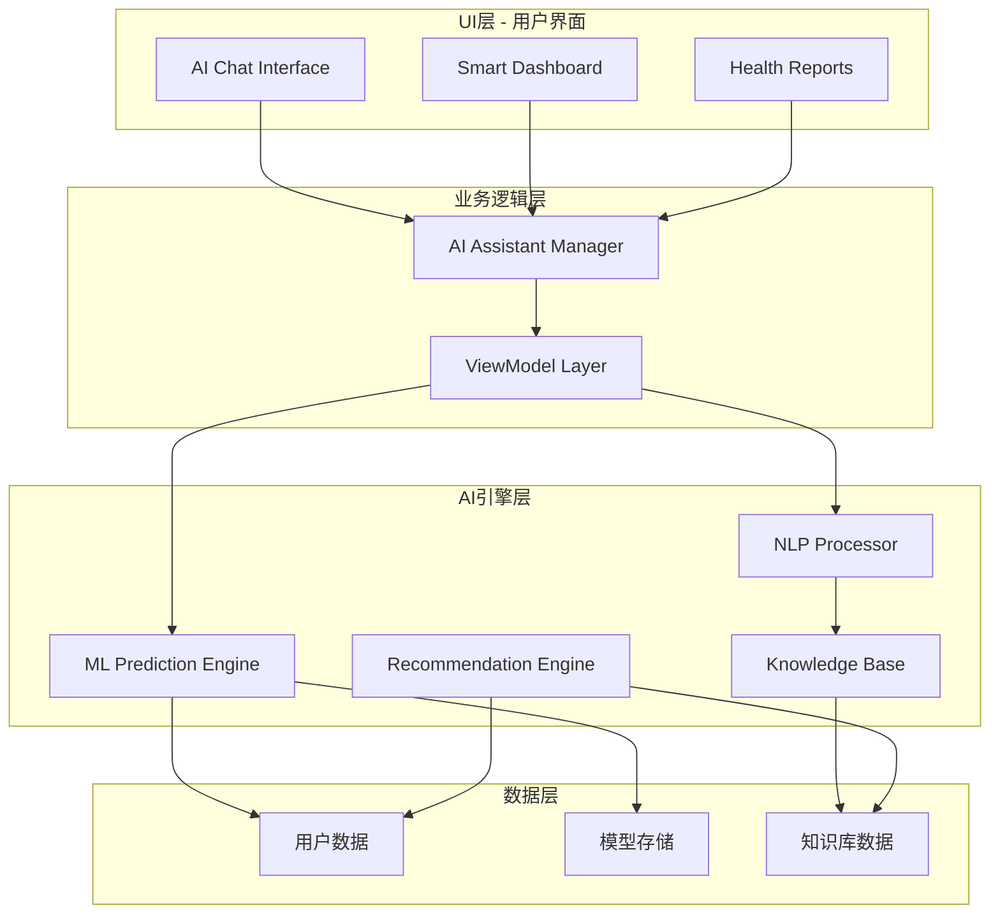
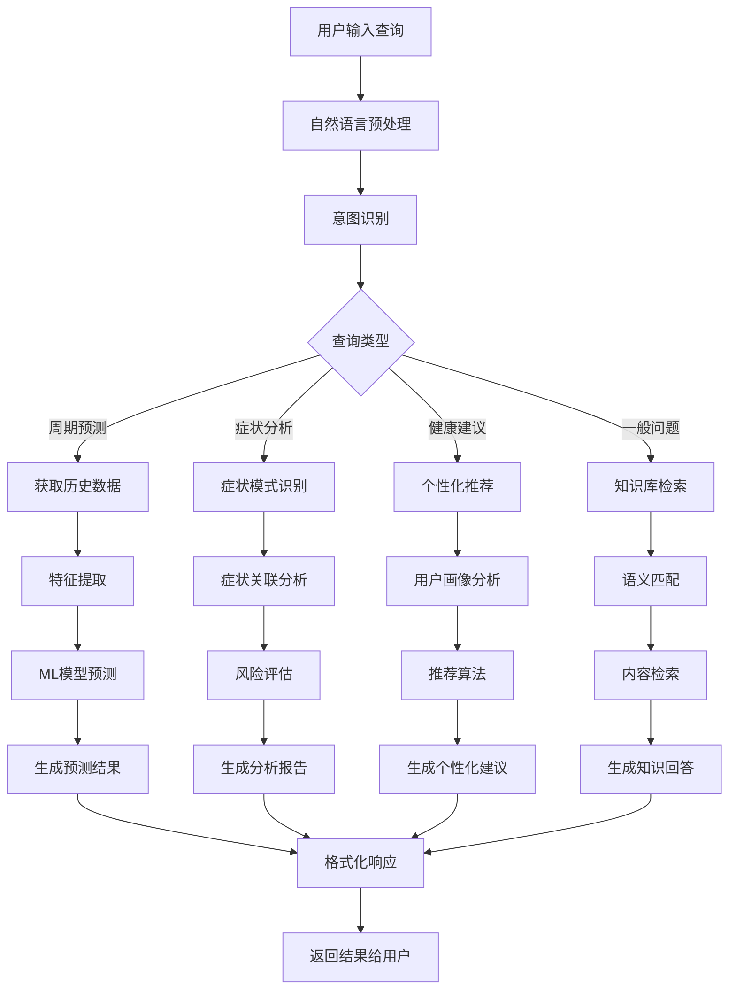

# LuminCore AI健康助手详细计划

## 1. 功能概述

### 1.1 目标与价值
- **智能健康分析**：基于用户数据提供专业的健康洞察
- **个性化建议**：根据个体差异提供定制化健康建议
- **预测性分析**：利用AI算法预测健康趋势和风险
- **智能交互**：自然语言对话式健康咨询体验

### 1.2 核心功能
- **智能周期预测**：基于机器学习的高精度周期预测
- **症状模式识别**：识别症状规律和异常情况
- **健康风险评估**：评估潜在健康风险并提供预警
- **个性化建议引擎**：生成定制化的生活方式建议
- **智能问答系统**：24/7健康咨询和疑问解答

## 2. 技术架构设计

### 2.1 整体架构



### 2.2 AI处理流程



### 2.3 技术栈选择
- **机器学习框架**: TensorFlow Lite for Mobile
- **自然语言处理**: 本地NLP + 云端API（可选）
- **本地AI模型**: ONNX Runtime Android
- **数据分析**: Apache Commons Math
- **图表展示**: MPAndroidChart
- **推荐系统**: 协同过滤 + 内容过滤

## 3. 核心组件设计

### 3.1 AI助手管理器
```kotlin
// AIAssistantManager.kt
@Singleton
class AIAssistantManager @Inject constructor(
    private val predictionEngine: PredictionEngine,
    private val nlpProcessor: NLPProcessor,
    private val knowledgeBase: HealthKnowledgeBase,
    private val recommendationEngine: RecommendationEngine
) {
    
    private val _assistantState = MutableStateFlow<AIAssistantState>(AIAssistantState.Idle)
    val assistantState: StateFlow<AIAssistantState> = _assistantState.asStateFlow()
    
    suspend fun processUserQuery(query: String): AIResponse {
        return try {
            _assistantState.value = AIAssistantState.Processing
            
            // 1. 自然语言理解
            val intent = nlpProcessor.extractIntent(query)
            val entities = nlpProcessor.extractEntities(query)
            
            // 2. 生成响应
            val response = when (intent.category) {
                IntentCategory.CYCLE_PREDICTION -> handleCyclePrediction(entities)
                IntentCategory.SYMPTOM_ANALYSIS -> handleSymptomAnalysis(entities)
                IntentCategory.HEALTH_ADVICE -> handleHealthAdvice(entities)
                IntentCategory.GENERAL_QUESTION -> handleGeneralQuestion(query)
                else -> generateFallbackResponse(query)
            }
            
            _assistantState.value = AIAssistantState.Ready
            response
            
        } catch (e: Exception) {
            _assistantState.value = AIAssistantState.Error(e.message ?: "AI处理错误")
            AIResponse.error("抱歉，我暂时无法理解您的问题，请稍后再试。")
        }
    }
    
    private suspend fun handleCyclePrediction(entities: List<Entity>): AIResponse {
        val prediction = predictionEngine.predictNextCycle()
        return AIResponse.success(
            text = "根据您的历史数据，预测您的下次月经将在${prediction.nextCycleDate}开始，置信度${prediction.confidence}%。",
            data = mapOf(
                "nextCycleDate" to prediction.nextCycleDate,
                "confidence" to prediction.confidence
            )
        )
    }
    
    sealed class AIAssistantState {
        object Idle : AIAssistantState()
        object Processing : AIAssistantState()
        object Ready : AIAssistantState()
        data class Error(val message: String) : AIAssistantState()
    }
}
```

### 3.2 机器学习预测引擎
```kotlin
// PredictionEngine.kt
@Singleton
class PredictionEngine @Inject constructor(
    private val modelManager: MLModelManager,
    private val dataPreprocessor: DataPreprocessor,
    private val repository: MenstrualRecordRepository
) {
    
    suspend fun predictNextCycle(): CyclePrediction {
        return withContext(Dispatchers.Default) {
            try {
                // 1. 获取用户历史数据
                val records = repository.getAllRecords()
                
                // 2. 数据预处理
                val processedData = dataPreprocessor.prepareCycleData(records)
                
                if (processedData.cycleCount < 3) {
                    return@withContext generateStatisticalPrediction(processedData)
                }
                
                // 3. 特征提取
                val features = extractCycleFeatures(processedData)
                
                // 4. 模型预测
                val model = modelManager.loadCyclePredictionModel()
                val prediction = model.predict(features)
                
                CyclePrediction(
                    nextCycleDate = prediction.nextCycleDate,
                    confidence = prediction.confidence,
                    averageCycleLength = processedData.averageCycleLength
                )
                
            } catch (e: Exception) {
                Log.e("PredictionEngine", "ML prediction failed", e)
                generateFallbackPrediction()
            }
        }
    }
    
    suspend fun analyzeSymptomPatterns(symptoms: List<String>): SymptomAnalysis {
        return withContext(Dispatchers.Default) {
            val records = repository.getRecordsWithSymptoms()
            val patterns = identifySymptomPatterns(symptoms, records)
            val severity = assessSymptomSeverity(symptoms)
            
            SymptomAnalysis(
                patterns = patterns,
                severityLevel = severity,
                recommendations = generateSymptomRecommendations(symptoms, severity)
            )
        }
    }
    
    private fun extractCycleFeatures(data: ProcessedCycleData): FloatArray {
        return floatArrayOf(
            data.averageCycleLength.toFloat(),
            data.cycleVariability.toFloat(),
            data.daysSinceLastCycle.toFloat(),
            data.symptomIntensityScore.toFloat()
        )
    }
}
```

### 3.3 自然语言处理器
```kotlin
// NLPProcessor.kt
@Singleton
class NLPProcessor {
    
    fun extractIntent(query: String): Intent {
        val normalizedQuery = preprocessText(query)
        
        return when {
            containsKeywords(normalizedQuery, listOf("预测", "下次", "什么时候")) -> 
                Intent(IntentCategory.CYCLE_PREDICTION, 0.9f)
            containsKeywords(normalizedQuery, listOf("症状", "疼痛", "不舒服")) -> 
                Intent(IntentCategory.SYMPTOM_ANALYSIS, 0.8f)
            containsKeywords(normalizedQuery, listOf("建议", "怎么办", "如何")) -> 
                Intent(IntentCategory.HEALTH_ADVICE, 0.7f)
            else -> Intent(IntentCategory.GENERAL_QUESTION, 0.5f)
        }
    }
    
    fun extractEntities(query: String): List<Entity> {
        val entities = mutableListOf<Entity>()
        val normalizedQuery = preprocessText(query)
        
        // 症状实体提取
        val symptomMap = mapOf(
            "头痛|头疼" to "头痛",
            "腹痛|肚子疼" to "腹痛",
            "腰痛|腰酸" to "腰痛",
            "疲劳|累" to "疲劳"
        )
        
        symptomMap.forEach { (pattern, symptom) ->
            if (Regex(pattern).containsMatchIn(normalizedQuery)) {
                entities.add(Entity(EntityType.SYMPTOM, symptom))
            }
        }
        
        return entities
    }
    
    private fun preprocessText(text: String): String {
        return text.trim().lowercase()
    }
    
    private fun containsKeywords(text: String, keywords: List<String>): Boolean {
        return keywords.any { text.contains(it) }
    }
}
```

### 3.4 健康知识库
```kotlin
// HealthKnowledgeBase.kt
@Singleton
class HealthKnowledgeBase {
    
    private val knowledgeMap = mapOf(
        "cycle_basics" to HealthKnowledge(
            title = "月经周期基础",
            content = "正常月经周期为21-35天，月经期3-7天。分为月经期、卵泡期、排卵期、黄体期四个阶段。",
            category = "基础知识"
        ),
        "pain_relief" to HealthKnowledge(
            title = "痛经缓解",
            content = "热敷腹部、适度运动、充足休息、避免生冷食物可有效缓解痛经。",
            category = "症状管理"
        )
    )
    
    private val faqList = listOf(
        FAQ("月经推迟几天算正常？", "7天以内属于正常范围，超过7天建议关注。"),
        FAQ("如何缓解痛经？", "热敷、轻运动、充足休息，严重时可服用止痛药。"),
        FAQ("排卵期有什么症状？", "白带增多、轻微腹痛、体温略升高。")
    )
    
    fun searchKnowledge(query: String): List<HealthKnowledge> {
        val keywords = query.split(" ")
        return knowledgeMap.values.filter { knowledge ->
            keywords.any { keyword ->
                knowledge.title.contains(keyword) || knowledge.content.contains(keyword)
            }
        }
    }
    
    fun getFAQ(): List<FAQ> = faqList
}

data class HealthKnowledge(
    val title: String,
    val content: String,
    val category: String
)

data class FAQ(
    val question: String,
    val answer: String
)
```

### 3.5 推荐引擎
```kotlin
// RecommendationEngine.kt
@Singleton
class RecommendationEngine @Inject constructor(
    private val repository: MenstrualRecordRepository
) {
    
    suspend fun generatePersonalizedRecommendations(): List<HealthRecommendation> {
        val recommendations = mutableListOf<HealthRecommendation>()
        val recentRecords = repository.getRecentRecords(30)
        
        // 基于症状频率的建议
        val frequentSymptoms = analyzeFrequentSymptoms(recentRecords)
        frequentSymptoms.forEach { symptom ->
            recommendations.add(getSymptomRecommendation(symptom))
        }
        
        // 基于周期规律性的建议
        val cycleRegularity = analyzeCycleRegularity(recentRecords)
        if (cycleRegularity < 0.8) {
            recommendations.add(
                HealthRecommendation(
                    title = "改善周期规律性",
                    content = "建议规律作息、均衡饮食、适度运动来改善周期规律性。",
                    priority = 80
                )
            )
        }
        
        return recommendations.sortedByDescending { it.priority }
    }
    
    private fun getSymptomRecommendation(symptom: String): HealthRecommendation {
        return when (symptom) {
            "头痛" -> HealthRecommendation(
                title = "缓解头痛",
                content = "保证充足睡眠，减少屏幕时间，适当按摩。",
                priority = 75
            )
            "腹痛" -> HealthRecommendation(
                title = "缓解腹痛", 
                content = "使用热敷，进行轻度运动，喝温水。",
                priority = 85
            )
            else -> HealthRecommendation(
                title = "症状管理",
                content = "建议记录症状变化，必要时咨询医生。",
                priority = 60
            )
        }
    }
}

data class HealthRecommendation(
    val title: String,
    val content: String,
    val priority: Int
)
```

## 4. UI界面设计

### 4.1 AI聊天界面
```kotlin
// AIChatFragment.kt
class AIChatFragment : Fragment() {
    
    private lateinit var binding: FragmentAiChatBinding
    private lateinit var viewModel: AIChatViewModel
    private lateinit var chatAdapter: ChatAdapter
    
    override fun onViewCreated(view: View, savedInstanceState: Bundle?) {
        super.onViewCreated(view, savedInstanceState)
        
        setupRecyclerView()
        setupInputArea()
        observeViewModel()
    }
    
    private fun setupInputArea() {
        binding.btnSend.setOnClickListener {
            val query = binding.etInput.text.toString().trim()
            if (query.isNotEmpty()) {
                viewModel.sendMessage(query)
                binding.etInput.text.clear()
            }
        }
        
        binding.btnVoice.setOnClickListener {
            startVoiceInput()
        }
    }
    
    private fun observeViewModel() {
        viewModel.chatMessages.observe(viewLifecycleOwner) { messages ->
            chatAdapter.submitList(messages)
            binding.rvChat.scrollToPosition(messages.size - 1)
        }
        
        viewModel.isLoading.observe(viewLifecycleOwner) { isLoading ->
            binding.progressBar.isVisible = isLoading
        }
    }
}
```

### 4.2 智能仪表板
```kotlin
// SmartDashboardFragment.kt
class SmartDashboardFragment : Fragment() {
    
    private lateinit var binding: FragmentSmartDashboardBinding
    private lateinit var viewModel: SmartDashboardViewModel
    
    override fun onViewCreated(view: View, savedInstanceState: Bundle?) {
        super.onViewCreated(view, savedInstanceState)
        
        observeViewModel()
        setupCards()
    }
    
    private fun observeViewModel() {
        viewModel.predictions.observe(viewLifecycleOwner) { predictions ->
            updatePredictionCard(predictions)
        }
        
        viewModel.recommendations.observe(viewLifecycleOwner) { recommendations ->
            updateRecommendationCards(recommendations)
        }
        
        viewModel.healthInsights.observe(viewLifecycleOwner) { insights ->
            updateInsightsCard(insights)
        }
    }
    
    private fun updatePredictionCard(predictions: CyclePrediction) {
        binding.tvNextCycle.text = "下次月经: ${predictions.nextCycleDate}"
        binding.tvConfidence.text = "准确度: ${predictions.confidence}%"
        binding.progressConfidence.progress = predictions.confidence
    }
}
```

## 5. 实施计划

### 第一阶段：核心AI引擎（3周）
- **Week 1**: AI助手管理器和基础架构
- **Week 2**: 机器学习预测引擎实现
- **Week 3**: 自然语言处理器开发

### 第二阶段：知识库和推荐（2.5周）
- **Week 4**: 健康知识库构建
- **Week 5**: 推荐引擎实现
- **Week 6**: 数据集成和测试

### 第三阶段：UI集成和优化（1.5周）
- **Week 7**: UI界面开发和集成
- **Week 8**: 性能优化和用户测试

## 6. 技术特色

### 6.1 本地优先
- 核心AI模型本地运行，保护隐私
- 离线可用的基础功能
- 可选的云端增强服务

### 6.2 个性化学习
- 用户行为学习和适应
- 个性化建议生成
- 持续优化预测准确性

### 6.3 科学可靠
- 基于医学知识的建议
- 统计学和机器学习结合
- 透明的置信度展示

## 7. 性能和隐私

### 7.1 性能优化
- TensorFlow Lite模型优化
- 异步处理避免UI阻塞
- 智能缓存机制

### 7.2 隐私保护
- 本地数据处理
- 加密存储用户数据
- 最小化数据传输

## 8. 成功指标

### 8.1 功能指标
- 周期预测准确率 > 85%
- 用户查询响应时间 < 2秒
- 推荐接受率 > 60%

### 8.2 用户体验
- 用户满意度 > 4.5/5
- 日活跃用户增长 > 20%
- AI功能使用率 > 40%

## 🔄 相关依赖

- [健康知识库计划](./HEALTH_KNOWLEDGE_BASE_PLAN.md)
- [智能症状关联分析计划](./INTELLIGENT_SYMPTOM_CORRELATION_ANALYSIS_PLAN.md)
- [周期预测置信度显示计划](./CYCLE_PREDICTION_CONFIDENCE_DISPLAY_PLAN.md)
- [健康评分系统计划](./HEALTH_SCORING_SYSTEM_PLAN.md)
- [数据可视化计划](./DATA_VISUALIZATION_PLAN.md)
- [数据备份同步计划](./DATA_BACKUP_SYNC_PLAN.md)
- [数据加密计划](./DATA_ENCRYPTION_PLAN.md)
- [新增AI分析模型计划](./ADD_NEW_AI_MODELS_PLAN.md)

## 📋 文档信息

```
# LuminCore AI健康助手详细计划

## 1. 功能概述

### 1.1 目标与价值
- **智能健康分析**：基于用户数据提供专业的健康洞察
- **个性化建议**：根据个体差异提供定制化健康建议
- **预测性分析**：利用AI算法预测健康趋势和风险
- **智能交互**：自然语言对话式健康咨询体验

### 1.2 核心功能
- **智能周期预测**：基于机器学习的高精度周期预测
- **症状模式识别**：识别症状规律和异常情况
- **健康风险评估**：评估潜在健康风险并提供预警
- **个性化建议引擎**：生成定制化的生活方式建议
- **智能问答系统**：24/7健康咨询和疑问解答

## 2. 技术架构设计

### 2.1 整体架构

``mermaid
graph TB
    subgraph "UI层 - 用户界面"
        A[AI Chat Interface]
        B[Smart Dashboard]
        C[Health Reports]
    end
    
    subgraph "业务逻辑层"
        D[AI Assistant Manager]
        E[ViewModel Layer]
    end
    
    subgraph "AI引擎层"
        F[ML Prediction Engine]
        G[NLP Processor]
        H[Knowledge Base]
        I[Recommendation Engine]
    end
    
    subgraph "数据层"
        J[用户数据]
        K[模型存储]
        L[知识库数据]
    end
    
    A --> D
    B --> D
    C --> D
    D --> E
    E --> F
    E --> G
    F --> J
    G --> H
    H --> L
    F --> K
    I --> J
    I --> L
```

### 2.2 AI处理流程

``mermaid
flowchart TD
    A[用户输入查询] --> B[自然语言预处理]
    B --> C[意图识别]
    C --> D{查询类型}
    
    D -->|周期预测| E[获取历史数据]
    D -->|症状分析| F[症状模式识别]
    D -->|健康建议| G[个性化推荐]
    D -->|一般问题| H[知识库检索]
    
    E --> I[特征提取]
    I --> J[ML模型预测]
    J --> K[生成预测结果]
    
    F --> L[症状关联分析]
    L --> M[风险评估]
    M --> N[生成分析报告]
    
    G --> O[用户画像分析]
    O --> P[推荐算法]
    P --> Q[生成个性化建议]
    
    H --> R[语义匹配]
    R --> S[内容检索]
    S --> T[生成知识回答]
    
    K --> U[格式化响应]
    N --> U
    Q --> U
    T --> U
    
    U --> V[返回结果给用户]
```

### 2.3 技术栈选择
- **机器学习框架**: TensorFlow Lite for Mobile
- **自然语言处理**: 本地NLP + 云端API（可选）
- **本地AI模型**: ONNX Runtime Android
- **数据分析**: Apache Commons Math
- **图表展示**: MPAndroidChart
- **推荐系统**: 协同过滤 + 内容过滤

## 3. 核心组件设计

### 3.1 AI助手管理器
```kotlin
// AIAssistantManager.kt
@Singleton
class AIAssistantManager @Inject constructor(
    private val predictionEngine: PredictionEngine,
    private val nlpProcessor: NLPProcessor,
    private val knowledgeBase: HealthKnowledgeBase,
    private val recommendationEngine: RecommendationEngine
) {
    
    private val _assistantState = MutableStateFlow<AIAssistantState>(AIAssistantState.Idle)
    val assistantState: StateFlow<AIAssistantState> = _assistantState.asStateFlow()
    
    suspend fun processUserQuery(query: String): AIResponse {
        return try {
            _assistantState.value = AIAssistantState.Processing
            
            // 1. 自然语言理解
            val intent = nlpProcessor.extractIntent(query)
            val entities = nlpProcessor.extractEntities(query)
            
            // 2. 生成响应
            val response = when (intent.category) {
                IntentCategory.CYCLE_PREDICTION -> handleCyclePrediction(entities)
                IntentCategory.SYMPTOM_ANALYSIS -> handleSymptomAnalysis(entities)
                IntentCategory.HEALTH_ADVICE -> handleHealthAdvice(entities)
                IntentCategory.GENERAL_QUESTION -> handleGeneralQuestion(query)
                else -> generateFallbackResponse(query)
            }
            
            _assistantState.value = AIAssistantState.Ready
            response
            
        } catch (e: Exception) {
            _assistantState.value = AIAssistantState.Error(e.message ?: "AI处理错误")
            AIResponse.error("抱歉，我暂时无法理解您的问题，请稍后再试。")
        }
    }
    
    private suspend fun handleCyclePrediction(entities: List<Entity>): AIResponse {
        val prediction = predictionEngine.predictNextCycle()
        return AIResponse.success(
            text = "根据您的历史数据，预测您的下次月经将在${prediction.nextCycleDate}开始，置信度${prediction.confidence}%。",
            data = mapOf(
                "nextCycleDate" to prediction.nextCycleDate,
                "confidence" to prediction.confidence
            )
        )
    }
    
    sealed class AIAssistantState {
        object Idle : AIAssistantState()
        object Processing : AIAssistantState()
        object Ready : AIAssistantState()
        data class Error(val message: String) : AIAssistantState()
    }
}
```

### 3.2 机器学习预测引擎
```kotlin
// PredictionEngine.kt
@Singleton
class PredictionEngine @Inject constructor(
    private val modelManager: MLModelManager,
    private val dataPreprocessor: DataPreprocessor,
    private val repository: MenstrualRecordRepository
) {
    
    suspend fun predictNextCycle(): CyclePrediction {
        return withContext(Dispatchers.Default) {
            try {
                // 1. 获取用户历史数据
                val records = repository.getAllRecords()
                
                // 2. 数据预处理
                val processedData = dataPreprocessor.prepareCycleData(records)
                
                if (processedData.cycleCount < 3) {
                    return@withContext generateStatisticalPrediction(processedData)
                }
                
                // 3. 特征提取
                val features = extractCycleFeatures(processedData)
                
                // 4. 模型预测
                val model = modelManager.loadCyclePredictionModel()
                val prediction = model.predict(features)
                
                CyclePrediction(
                    nextCycleDate = prediction.nextCycleDate,
                    confidence = prediction.confidence,
                    averageCycleLength = processedData.averageCycleLength
                )
                
            } catch (e: Exception) {
                Log.e("PredictionEngine", "ML prediction failed", e)
                generateFallbackPrediction()
            }
        }
    }
    
    suspend fun analyzeSymptomPatterns(symptoms: List<String>): SymptomAnalysis {
        return withContext(Dispatchers.Default) {
            val records = repository.getRecordsWithSymptoms()
            val patterns = identifySymptomPatterns(symptoms, records)
            val severity = assessSymptomSeverity(symptoms)
            
            SymptomAnalysis(
                patterns = patterns,
                severityLevel = severity,
                recommendations = generateSymptomRecommendations(symptoms, severity)
            )
        }
    }
    
    private fun extractCycleFeatures(data: ProcessedCycleData): FloatArray {
        return floatArrayOf(
            data.averageCycleLength.toFloat(),
            data.cycleVariability.toFloat(),
            data.daysSinceLastCycle.toFloat(),
            data.symptomIntensityScore.toFloat()
        )
    }
}
```

### 3.3 自然语言处理器
```kotlin
// NLPProcessor.kt
@Singleton
class NLPProcessor {
    
    fun extractIntent(query: String): Intent {
        val normalizedQuery = preprocessText(query)
        
        return when {
            containsKeywords(normalizedQuery, listOf("预测", "下次", "什么时候")) -> 
                Intent(IntentCategory.CYCLE_PREDICTION, 0.9f)
            containsKeywords(normalizedQuery, listOf("症状", "疼痛", "不舒服")) -> 
                Intent(IntentCategory.SYMPTOM_ANALYSIS, 0.8f)
            containsKeywords(normalizedQuery, listOf("建议", "怎么办", "如何")) -> 
                Intent(IntentCategory.HEALTH_ADVICE, 0.7f)
            else -> Intent(IntentCategory.GENERAL_QUESTION, 0.5f)
        }
    }
    
    fun extractEntities(query: String): List<Entity> {
        val entities = mutableListOf<Entity>()
        val normalizedQuery = preprocessText(query)
        
        // 症状实体提取
        val symptomMap = mapOf(
            "头痛|头疼" to "头痛",
            "腹痛|肚子疼" to "腹痛",
            "腰痛|腰酸" to "腰痛",
            "疲劳|累" to "疲劳"
        )
        
        symptomMap.forEach { (pattern, symptom) ->
            if (Regex(pattern).containsMatchIn(normalizedQuery)) {
                entities.add(Entity(EntityType.SYMPTOM, symptom))
            }
        }
        
        return entities
    }
    
    private fun preprocessText(text: String): String {
        return text.trim().lowercase()
    }
    
    private fun containsKeywords(text: String, keywords: List<String>): Boolean {
        return keywords.any { text.contains(it) }
    }
}
```

### 3.4 健康知识库
```kotlin
// HealthKnowledgeBase.kt
@Singleton
class HealthKnowledgeBase {
    
    private val knowledgeMap = mapOf(
        "cycle_basics" to HealthKnowledge(
            title = "月经周期基础",
            content = "正常月经周期为21-35天，月经期3-7天。分为月经期、卵泡期、排卵期、黄体期四个阶段。",
            category = "基础知识"
        ),
        "pain_relief" to HealthKnowledge(
            title = "痛经缓解",
            content = "热敷腹部、适度运动、充足休息、避免生冷食物可有效缓解痛经。",
            category = "症状管理"
        )
    )
    
    private val faqList = listOf(
        FAQ("月经推迟几天算正常？", "7天以内属于正常范围，超过7天建议关注。"),
        FAQ("如何缓解痛经？", "热敷、轻运动、充足休息，严重时可服用止痛药。"),
        FAQ("排卵期有什么症状？", "白带增多、轻微腹痛、体温略升高。")
    )
    
    fun searchKnowledge(query: String): List<HealthKnowledge> {
        val keywords = query.split(" ")
        return knowledgeMap.values.filter { knowledge ->
            keywords.any { keyword ->
                knowledge.title.contains(keyword) || knowledge.content.contains(keyword)
            }
        }
    }
    
    fun getFAQ(): List<FAQ> = faqList
}

data class HealthKnowledge(
    val title: String,
    val content: String,
    val category: String
)

data class FAQ(
    val question: String,
    val answer: String
)
```

### 3.5 推荐引擎
```kotlin
// RecommendationEngine.kt
@Singleton
class RecommendationEngine @Inject constructor(
    private val repository: MenstrualRecordRepository
) {
    
    suspend fun generatePersonalizedRecommendations(): List<HealthRecommendation> {
        val recommendations = mutableListOf<HealthRecommendation>()
        val recentRecords = repository.getRecentRecords(30)
        
        // 基于症状频率的建议
        val frequentSymptoms = analyzeFrequentSymptoms(recentRecords)
        frequentSymptoms.forEach { symptom ->
            recommendations.add(getSymptomRecommendation(symptom))
        }
        
        // 基于周期规律性的建议
        val cycleRegularity = analyzeCycleRegularity(recentRecords)
        if (cycleRegularity < 0.8) {
            recommendations.add(
                HealthRecommendation(
                    title = "改善周期规律性",
                    content = "建议规律作息、均衡饮食、适度运动来改善周期规律性。",
                    priority = 80
                )
            )
        }
        
        return recommendations.sortedByDescending { it.priority }
    }
    
    private fun getSymptomRecommendation(symptom: String): HealthRecommendation {
        return when (symptom) {
            "头痛" -> HealthRecommendation(
                title = "缓解头痛",
                content = "保证充足睡眠，减少屏幕时间，适当按摩。",
                priority = 75
            )
            "腹痛" -> HealthRecommendation(
                title = "缓解腹痛", 
                content = "使用热敷，进行轻度运动，喝温水。",
                priority = 85
            )
            else -> HealthRecommendation(
                title = "症状管理",
                content = "建议记录症状变化，必要时咨询医生。",
                priority = 60
            )
        }
    }
}

data class HealthRecommendation(
    val title: String,
    val content: String,
    val priority: Int
)
```

## 4. UI界面设计

### 4.1 AI聊天界面
```kotlin
// AIChatFragment.kt
class AIChatFragment : Fragment() {
    
    private lateinit var binding: FragmentAiChatBinding
    private lateinit var viewModel: AIChatViewModel
    private lateinit var chatAdapter: ChatAdapter
    
    override fun onViewCreated(view: View, savedInstanceState: Bundle?) {
        super.onViewCreated(view, savedInstanceState)
        
        setupRecyclerView()
        setupInputArea()
        observeViewModel()
    }
    
    private fun setupInputArea() {
        binding.btnSend.setOnClickListener {
            val query = binding.etInput.text.toString().trim()
            if (query.isNotEmpty()) {
                viewModel.sendMessage(query)
                binding.etInput.text.clear()
            }
        }
        
        binding.btnVoice.setOnClickListener {
            startVoiceInput()
        }
    }
    
    private fun observeViewModel() {
        viewModel.chatMessages.observe(viewLifecycleOwner) { messages ->
            chatAdapter.submitList(messages)
            binding.rvChat.scrollToPosition(messages.size - 1)
        }
        
        viewModel.isLoading.observe(viewLifecycleOwner) { isLoading ->
            binding.progressBar.isVisible = isLoading
        }
    }
}
```

### 4.2 智能仪表板
```kotlin
// SmartDashboardFragment.kt
class SmartDashboardFragment : Fragment() {
    
    private lateinit var binding: FragmentSmartDashboardBinding
    private lateinit var viewModel: SmartDashboardViewModel
    
    override fun onViewCreated(view: View, savedInstanceState: Bundle?) {
        super.onViewCreated(view, savedInstanceState)
        
        observeViewModel()
        setupCards()
    }
    
    private fun observeViewModel() {
        viewModel.predictions.observe(viewLifecycleOwner) { predictions ->
            updatePredictionCard(predictions)
        }
        
        viewModel.recommendations.observe(viewLifecycleOwner) { recommendations ->
            updateRecommendationCards(recommendations)
        }
        
        viewModel.healthInsights.observe(viewLifecycleOwner) { insights ->
            updateInsightsCard(insights)
        }
    }
    
    private fun updatePredictionCard(predictions: CyclePrediction) {
        binding.tvNextCycle.text = "下次月经: ${predictions.nextCycleDate}"
        binding.tvConfidence.text = "准确度: ${predictions.confidence}%"
        binding.progressConfidence.progress = predictions.confidence
    }
}
```

## 5. 实施计划

### 第一阶段：核心AI引擎（3周）
- **Week 1**: AI助手管理器和基础架构
- **Week 2**: 机器学习预测引擎实现
- **Week 3**: 自然语言处理器开发

### 第二阶段：知识库和推荐（2.5周）
- **Week 4**: 健康知识库构建
- **Week 5**: 推荐引擎实现
- **Week 6**: 数据集成和测试

### 第三阶段：UI集成和优化（1.5周）
- **Week 7**: UI界面开发和集成
- **Week 8**: 性能优化和用户测试

## 6. 技术特色

### 6.1 本地优先
- 核心AI模型本地运行，保护隐私
- 离线可用的基础功能
- 可选的云端增强服务

### 6.2 个性化学习
- 用户行为学习和适应
- 个性化建议生成
- 持续优化预测准确性

### 6.3 科学可靠
- 基于医学知识的建议
- 统计学和机器学习结合
- 透明的置信度展示

## 7. 性能和隐私

### 7.1 性能优化
- TensorFlow Lite模型优化
- 异步处理避免UI阻塞
- 智能缓存机制

### 7.2 隐私保护
- 本地数据处理
- 加密存储用户数据
- 最小化数据传输

## 8. 成功指标

### 8.1 功能指标
- 周期预测准确率 > 85%
- 用户查询响应时间 < 2秒
- 推荐接受率 > 60%

### 8.2 用户体验
- 用户满意度 > 4.5/5
- 日活跃用户增长 > 20%
- AI功能使用率 > 40%

通过以上详细的AI健康助手规划，LuminCore将为用户提供智能、个性化、科学的健康管理体验，成为用户可信赖的健康伙伴。

---

**文档版本**: 1.0.0
**创建日期**: 2025年8月25日
**计划负责人**: 祁潇潇
**审核状态**: 已审核
**预计开始时间**: 2030年1月1日
**预计完成时间**: 2032年12月31日
## 🔄 相关依赖
- [AI健康助手功能](./AI_HEALTH_ASSISTANT_PLAN.md)
- [数据加密功能](./DATA_ENCRYPTION_PLAN.md)
- [云端同步架构](./CLOUD_SYNC_ARCHITECTURE_PLAN.md)
- [可穿戴设备集成](./WEARABLE_DEVICE_INTEGRATION_PLAN.md)

### 3.3 支持的AI模型API

LuminCore AI健康助手支持多种云端AI模型API，用户可以根据需要选择使用：

1. **文心一言（百度）** - 强大的中文自然语言处理能力
2. **通义千问（阿里）** - 综合性大模型，适合多领域问答
3. **DeepSeek** - 专业代码和逻辑推理能力
4. **云雀大模型（字节）** - 高效的文本生成和理解能力
5. **智谱AI** - 专业知识图谱和推理能力
6. **Kimi（月之暗面）** - 长文本处理和复杂推理能力，特别适合生成详细的健康分析报告

所有云端API调用都遵循严格的数据隐私保护原则，仅传输必要的匿名化特征数据，不包含任何个人身份信息。
