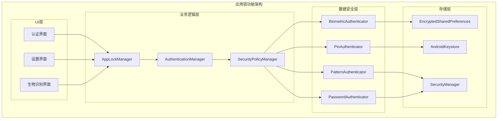
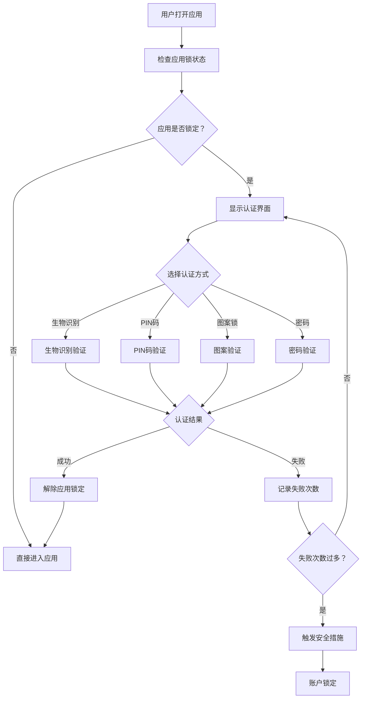

# LuminCore应用锁功能详细计划

## 1. 功能概述

### 1.1 目标与价值
- **隐私保护**：确保女性健康数据的绝对私密性
- **安全访问**：防止他人未经授权访问敏感信息
- **用户信任**：增强用户对应用安全性的信心
- **合规要求**：满足健康数据保护的法规要求

### 1.2 核心功能
- 生物识别认证（指纹、面部识别）
- PIN码认证
- 图案锁认证
- 密码认证
- 自动锁定机制
- 认证失败保护
- 紧急模式

## 2. 技术架构设计

### 2.1 整体架构



### 2.2 认证流程



### 2.2 技术栈选择
- **生物识别**: AndroidX BiometricPrompt API
- **加密算法**: AES-256-GCM
- **密钥存储**: Android Keystore System
- **本地存储**: EncryptedSharedPreferences
- **哈希算法**: SHA-256 with Salt
- **模式匹配**: 自定义PatternView组件

## 3. 详细设计方案

### 3.1 认证方式设计

#### 3.1.1 生物识别认证
```kotlin
// BiometricAuthenticator.kt
class BiometricAuthenticator(private val context: Context) {
    
    private val biometricManager = BiometricManager.from(context)
    
    fun authenticate(
        onSuccess: () -> Unit,
        onError: (String) -> Unit,
        onUserCancel: () -> Unit
    ) {
        when (biometricManager.canAuthenticate(BIOMETRIC_STRONG)) {
            BiometricManager.BIOMETRIC_SUCCESS -> {
                showBiometricPrompt(onSuccess, onError, onUserCancel)
            }
            BiometricManager.BIOMETRIC_ERROR_NO_HARDWARE -> {
                onError("设备不支持生物识别")
            }
            BiometricManager.BIOMETRIC_ERROR_HW_UNAVAILABLE -> {
                onError("生物识别暂不可用")
            }
            BiometricManager.BIOMETRIC_ERROR_NONE_ENROLLED -> {
                onError("未设置生物识别")
            }
        }
    }
    
    private fun showBiometricPrompt(
        onSuccess: () -> Unit,
        onError: (String) -> Unit,
        onUserCancel: () -> Unit
    ) {
        val executor = ContextCompat.getMainExecutor(context)
        val biometricPrompt = BiometricPrompt(
            context as FragmentActivity,
            executor,
            object : BiometricPrompt.AuthenticationCallback() {
                override fun onAuthenticationError(errorCode: Int, errString: CharSequence) {
                    when (errorCode) {
                        BiometricPrompt.ERROR_USER_CANCELED -> onUserCancel()
                        else -> onError(errString.toString())
                    }
                }
                
                override fun onAuthenticationSucceeded(result: BiometricPrompt.AuthenticationResult) {
                    onSuccess()
                }
                
                override fun onAuthenticationFailed() {
                    onError("认证失败，请重试")
                }
            }
        )
        
        val promptInfo = BiometricPrompt.PromptInfo.Builder()
            .setTitle("验证身份")
            .setSubtitle("使用生物识别解锁LuminCore")
            .setNegativeButtonText("取消")
            .build()
        
        biometricPrompt.authenticate(promptInfo)
    }
}
```

#### 3.1.2 PIN码认证
```kotlin
// PinAuthenticator.kt
class PinAuthenticator(
    private val context: Context,
    private val securityManager: SecurityManager
) {
    
    companion object {
        private const val PIN_LENGTH = 4
        private const val MAX_ATTEMPTS = 5
    }
    
    fun setupPin(pin: String): Boolean {
        return try {
            val hashedPin = securityManager.hashPin(pin)
            securityManager.savePin(hashedPin)
            true
        } catch (e: Exception) {
            false
        }
    }
    
    fun verifyPin(pin: String): AuthResult {
        val storedPin = securityManager.getStoredPin()
        val hashedPin = securityManager.hashPin(pin)
        
        return if (hashedPin == storedPin) {
            securityManager.resetFailedAttempts()
            AuthResult.Success
        } else {
            val attempts = securityManager.incrementFailedAttempts()
            if (attempts >= MAX_ATTEMPTS) {
                AuthResult.AccountLocked
            } else {
                AuthResult.Failed(MAX_ATTEMPTS - attempts)
            }
        }
    }
    
    sealed class AuthResult {
        object Success : AuthResult()
        data class Failed(val remainingAttempts: Int) : AuthResult()
        object AccountLocked : AuthResult()
    }
}
```

#### 3.1.3 图案锁认证
```kotlin
// PatternAuthenticator.kt
class PatternAuthenticator(
    private val context: Context,
    private val securityManager: SecurityManager
) {
    
    fun setupPattern(pattern: List<Int>): Boolean {
        return try {
            val hashedPattern = securityManager.hashPattern(pattern)
            securityManager.savePattern(hashedPattern)
            true
        } catch (e: Exception) {
            false
        }
    }
    
    fun verifyPattern(pattern: List<Int>): AuthResult {
        val storedPattern = securityManager.getStoredPattern()
        val hashedPattern = securityManager.hashPattern(pattern)
        
        return if (hashedPattern == storedPattern) {
            securityManager.resetFailedAttempts()
            AuthResult.Success
        } else {
            val attempts = securityManager.incrementFailedAttempts()
            if (attempts >= MAX_ATTEMPTS) {
                AuthResult.AccountLocked
            } else {
                AuthResult.Failed(MAX_ATTEMPTS - attempts)
            }
        }
    }
}
```

### 3.2 核心组件设计

#### 3.2.1 AppLockManager
```kotlin
// AppLockManager.kt
@Singleton
class AppLockManager @Inject constructor(
    private val context: Context,
    private val securityManager: SecurityManager,
    private val biometricAuthenticator: BiometricAuthenticator,
    private val pinAuthenticator: PinAuthenticator,
    private val patternAuthenticator: PatternAuthenticator,
    private val passwordAuthenticator: PasswordAuthenticator
) {
    
    private val _lockState = MutableLiveData<LockState>()
    val lockState: LiveData<LockState> = _lockState
    
    private var lastActiveTime = System.currentTimeMillis()
    private var isAuthenticated = false
    
    fun initialize() {
        _lockState.value = if (isAppLockEnabled()) {
            LockState.Locked
        } else {
            LockState.Unlocked
        }
    }
    
    fun enableAppLock(authMethod: AuthMethod, credential: String): Boolean {
        return when (authMethod) {
            AuthMethod.PIN -> pinAuthenticator.setupPin(credential)
            AuthMethod.PATTERN -> patternAuthenticator.setupPattern(parsePattern(credential))
            AuthMethod.PASSWORD -> passwordAuthenticator.setupPassword(credential)
            AuthMethod.BIOMETRIC -> {
                securityManager.enableBiometric()
                true
            }
        }
    }
    
    fun authenticate(authMethod: AuthMethod, credential: String? = null) {
        when (authMethod) {
            AuthMethod.BIOMETRIC -> authenticateWithBiometric()
            AuthMethod.PIN -> authenticateWithPin(credential!!)
            AuthMethod.PATTERN -> authenticateWithPattern(parsePattern(credential!!))
            AuthMethod.PASSWORD -> authenticateWithPassword(credential!!)
        }
    }
    
    private fun authenticateWithBiometric() {
        biometricAuthenticator.authenticate(
            onSuccess = { onAuthenticationSuccess() },
            onError = { error -> onAuthenticationError(error) },
            onUserCancel = { onAuthenticationCancel() }
        )
    }
    
    private fun authenticateWithPin(pin: String) {
        when (val result = pinAuthenticator.verifyPin(pin)) {
            is PinAuthenticator.AuthResult.Success -> onAuthenticationSuccess()
            is PinAuthenticator.AuthResult.Failed -> onAuthenticationFailed(result.remainingAttempts)
            is PinAuthenticator.AuthResult.AccountLocked -> onAccountLocked()
        }
    }
    
    fun lockApp() {
        isAuthenticated = false
        _lockState.value = LockState.Locked
    }
    
    fun updateActivity() {
        lastActiveTime = System.currentTimeMillis()
        if (shouldAutoLock()) {
            lockApp()
        }
    }
    
    private fun shouldAutoLock(): Boolean {
        val autoLockTime = securityManager.getAutoLockTime()
        return System.currentTimeMillis() - lastActiveTime > autoLockTime
    }
    
    sealed class LockState {
        object Unlocked : LockState()
        object Locked : LockState()
        data class Failed(val remainingAttempts: Int) : LockState()
        object AccountLocked : LockState()
    }
    
    enum class AuthMethod {
        BIOMETRIC, PIN, PATTERN, PASSWORD
    }
}
```

#### 3.2.2 SecurityManager
```kotlin
// SecurityManager.kt
@Singleton
class SecurityManager @Inject constructor(
    private val context: Context
) {
    
    private val keyAlias = "LuminCore_AppLock_Key"
    private val sharedPrefs = EncryptedSharedPreferences.create(
        "app_lock_prefs",
        keyAlias,
        context,
        EncryptedSharedPreferences.PrefKeyEncryptionScheme.AES256_SIV,
        EncryptedSharedPreferences.PrefValueEncryptionScheme.AES256_GCM
    )
    
    fun hashPin(pin: String): String {
        val salt = getSalt()
        return hashWithSalt(pin, salt)
    }
    
    fun hashPattern(pattern: List<Int>): String {
        val patternString = pattern.joinToString("")
        val salt = getSalt()
        return hashWithSalt(patternString, salt)
    }
    
    fun hashPassword(password: String): String {
        val salt = getSalt()
        return hashWithSalt(password, salt)
    }
    
    private fun hashWithSalt(input: String, salt: String): String {
        val digest = MessageDigest.getInstance("SHA-256")
        val saltedInput = input + salt
        val hashedBytes = digest.digest(saltedInput.toByteArray())
        return Base64.encodeToString(hashedBytes, Base64.NO_WRAP)
    }
    
    private fun getSalt(): String {
        return sharedPrefs.getString("salt", null) ?: generateAndSaveSalt()
    }
    
    private fun generateAndSaveSalt(): String {
        val salt = UUID.randomUUID().toString()
        sharedPrefs.edit().putString("salt", salt).apply()
        return salt
    }
    
    fun savePin(hashedPin: String) {
        sharedPrefs.edit().putString("pin", hashedPin).apply()
    }
    
    fun getStoredPin(): String? {
        return sharedPrefs.getString("pin", null)
    }
    
    fun incrementFailedAttempts(): Int {
        val attempts = sharedPrefs.getInt("failed_attempts", 0) + 1
        sharedPrefs.edit().putInt("failed_attempts", attempts).apply()
        
        if (attempts >= 5) {
            setAccountLocked(true)
        }
        
        return attempts
    }
    
    fun resetFailedAttempts() {
        sharedPrefs.edit().remove("failed_attempts").apply()
        setAccountLocked(false)
    }
    
    private fun setAccountLocked(locked: Boolean) {
        sharedPrefs.edit().putBoolean("account_locked", locked).apply()
        if (locked) {
            sharedPrefs.edit().putLong("lock_time", System.currentTimeMillis()).apply()
        }
    }
    
    fun isAccountLocked(): Boolean {
        if (!sharedPrefs.getBoolean("account_locked", false)) {
            return false
        }
        
        val lockTime = sharedPrefs.getLong("lock_time", 0)
        val lockDuration = 30 * 60 * 1000L // 30分钟
        
        return System.currentTimeMillis() - lockTime < lockDuration
    }
}
```

### 3.3 UI组件设计

#### 3.3.1 解锁界面
```kotlin
// UnlockActivity.kt
class UnlockActivity : AppCompatActivity() {
    
    private lateinit var binding: ActivityUnlockBinding
    private lateinit var appLockManager: AppLockManager
    
    override fun onCreate(savedInstanceState: Bundle?) {
        super.onCreate(savedInstanceState)
        binding = ActivityUnlockBinding.inflate(layoutInflater)
        setContentView(binding.root)
        
        appLockManager = (application as WomenHealthApplication).appLockManager
        
        setupUI()
        observeAuthState()
    }
    
    private fun setupUI() {
        val authMethod = getEnabledAuthMethod()
        
        when (authMethod) {
            AuthMethod.BIOMETRIC -> setupBiometricAuth()
            AuthMethod.PIN -> setupPinAuth()
            AuthMethod.PATTERN -> setupPatternAuth()
            AuthMethod.PASSWORD -> setupPasswordAuth()
        }
        
        binding.btnEmergencyAccess.setOnClickListener {
            showEmergencyDialog()
        }
    }
    
    private fun setupBiometricAuth() {
        binding.biometricContainer.visibility = View.VISIBLE
        binding.btnBiometric.setOnClickListener {
            appLockManager.authenticate(AuthMethod.BIOMETRIC)
        }
    }
    
    private fun setupPinAuth() {
        binding.pinContainer.visibility = View.VISIBLE
        binding.pinView.setOnPinEnteredListener { pin ->
            appLockManager.authenticate(AuthMethod.PIN, pin)
        }
    }
    
    private fun observeAuthState() {
        appLockManager.lockState.observe(this) { state ->
            when (state) {
                is AppLockManager.LockState.Unlocked -> {
                    finish()
                }
                is AppLockManager.LockState.Failed -> {
                    showError("认证失败，还有${state.remainingAttempts}次机会")
                }
                is AppLockManager.LockState.AccountLocked -> {
                    showAccountLockedDialog()
                }
            }
        }
    }
    
    private fun showEmergencyDialog() {
        AlertDialog.Builder(this)
            .setTitle("紧急访问")
            .setMessage("紧急访问将清除所有应用锁设置，是否继续？")
            .setPositiveButton("确认") { _, _ ->
                handleEmergencyAccess()
            }
            .setNegativeButton("取消", null)
            .show()
    }
}
```

#### 3.3.2 应用锁设置界面
```kotlin
// AppLockSettingsFragment.kt
class AppLockSettingsFragment : Fragment() {
    
    private lateinit var binding: FragmentAppLockSettingsBinding
    private lateinit var viewModel: AppLockSettingsViewModel
    
    override fun onCreateView(
        inflater: LayoutInflater,
        container: ViewGroup?,
        savedInstanceState: Bundle?
    ): View {
        binding = FragmentAppLockSettingsBinding.inflate(inflater, container, false)
        return binding.root
    }
    
    override fun onViewCreated(view: View, savedInstanceState: Bundle?) {
        super.onViewCreated(view, savedInstanceState)
        
        setupViews()
        observeViewModel()
    }
    
    private fun setupViews() {
        binding.switchAppLock.setOnCheckedChangeListener { _, isChecked ->
            if (isChecked) {
                showAuthMethodSelection()
            } else {
                viewModel.disableAppLock()
            }
        }
        
        binding.btnChangeLockMethod.setOnClickListener {
            showAuthMethodSelection()
        }
        
        binding.seekBarAutoLock.setOnSeekBarChangeListener(object : SeekBar.OnSeekBarChangeListener {
            override fun onProgressChanged(seekBar: SeekBar?, progress: Int, fromUser: Boolean) {
                updateAutoLockTime(progress)
            }
            override fun onStartTrackingTouch(seekBar: SeekBar?) {}
            override fun onStopTrackingTouch(seekBar: SeekBar?) {}
        })
    }
    
    private fun showAuthMethodSelection() {
        val methods = arrayOf("生物识别", "PIN码", "图案锁", "密码")
        
        AlertDialog.Builder(requireContext())
            .setTitle("选择认证方式")
            .setItems(methods) { _, which ->
                when (which) {
                    0 -> setupBiometric()
                    1 -> setupPin()
                    2 -> setupPattern()
                    3 -> setupPassword()
                }
            }
            .show()
    }
}
```

## 4. 实施计划

### 第一阶段：核心架构搭建（2周）

#### Week 1: 基础架构
- [ ] 创建SecurityManager类
- [ ] 实现加密存储机制
- [ ] 设计AppLockManager接口
- [ ] 搭建基础UI框架

#### Week 2: 认证框架
- [ ] 实现BiometricAuthenticator
- [ ] 创建认证状态管理
- [ ] 设计错误处理机制
- [ ] 实现自动锁定逻辑

### 第二阶段：认证方式实现（2周）

#### Week 3: 生物识别 + PIN码
- [ ] 完成生物识别认证
- [ ] 实现PIN码认证
- [ ] 创建PIN输入界面
- [ ] 添加失败重试机制

#### Week 4: 图案锁 + 密码
- [ ] 实现图案锁认证
- [ ] 创建图案绘制组件
- [ ] 实现密码认证
- [ ] 完善UI交互效果

### 第三阶段：安全增强（1.5周）

#### Week 5-6: 安全特性
- [ ] 实现防暴力破解
- [ ] 添加账户锁定机制
- [ ] 创建紧急访问功能
- [ ] 实现数据加密保护

### 第四阶段：集成测试（1.5周）

#### Week 6-7: 测试与优化
- [ ] 单元测试编写
- [ ] 集成测试验证
- [ ] 性能优化调整
- [ ] 用户体验完善

## 5. 安全策略

### 5.1 数据保护
- 使用Android Keystore存储敏感密钥
- 所有认证数据使用AES-256加密
- PIN/密码使用SHA-256+Salt哈希存储
- 生物识别模板由系统安全存储

### 5.2 防攻击机制
- 限制认证失败次数（最多5次）
- 失败后账户锁定30分钟
- 防暴力破解延时递增
- 检测调试和Root环境

### 5.3 隐私保护
- 不在日志中记录敏感信息
- 截屏时隐藏敏感内容
- 后台时模糊应用界面
- 定期清理临时数据

## 6. 用户体验优化

### 6.1 便捷性设计
- 支持多种认证方式组合
- 智能推荐最适合的认证方式
- 快速切换认证方法
- 记住用户偏好设置

### 6.2 无障碍支持
- 语音提示和反馈
- 大字体和高对比度支持
- 屏幕阅读器兼容
- 简化操作流程

### 6.3 错误处理
- 清晰的错误提示信息
- 友好的帮助和指导
- 恢复机制和备用方案
- 客服联系方式

## 7. 性能考虑

### 7.1 启动性能
- 延迟初始化非关键组件
- 缓存认证状态
- 优化加密算法调用
- 减少UI渲染时间

### 7.2 内存管理
- 及时清理敏感数据
- 避免内存泄漏
- 优化图片资源
- 控制缓存大小

### 7.3 电池优化
- 减少后台运行时间
- 优化定时器使用
- 智能锁定策略
- 避免频繁唤醒

## 8. 测试策略

### 8.1 功能测试
- 各认证方式正确性验证
- 失败场景处理测试
- 边界条件测试
- 兼容性测试

### 8.2 安全测试
- 暴力破解测试
- 数据加密验证
- 权限检查测试
- 逆向工程防护测试

### 8.3 性能测试
- 启动时间测试
- 认证响应时间测试
- 内存占用测试
- 电池消耗测试

## 9. 部署和维护

### 9.1 版本发布
- 灰度发布策略
- 回滚预案
- 用户引导教程
- 反馈收集机制

### 9.2 监控告警
- 认证成功率监控
- 异常情况告警
- 性能指标跟踪
- 用户反馈分析

### 9.3 后续优化
- 基于用户反馈优化
- 安全漏洞修复
- 新认证技术集成
- 用户体验改进

## 10. 风险评估

### 10.1 技术风险
- **生物识别兼容性**: 不同设备支持程度不同
  - 缓解措施：提供多种备用认证方式
- **加密性能影响**: 可能影响应用启动速度  
  - 缓解措施：异步处理和性能优化

### 10.2 用户体验风险
- **认证流程复杂**: 可能增加使用门槛
  - 缓解措施：提供详细引导和帮助
- **忘记认证信息**: 用户可能被锁定
  - 缓解措施：多重恢复机制

### 10.3 安全风险
- **社会工程学攻击**: 通过欺骗获取认证信息
  - 缓解措施：用户安全教育和多重验证
- **设备丢失**: 物理访问设备的风险
  - 缓解措施：远程锁定和数据擦除

通过以上详细的规划和实施，LuminCore应用锁功能将为用户提供强大的隐私保护，确保女性健康数据的安全性和私密性。

---

**文档版本**: 1.0.0
**创建日期**: 2025年8月25日
**计划负责人**: 祁潇潇
**审核状态**: 已审核
**预计开始时间**: 2027年7月1日
**预计完成时间**: 2027年12月31日
## 🔄 相关依赖
- [AI健康助手功能](./AI_HEALTH_ASSISTANT_PLAN.md)
- [数据加密功能](./DATA_ENCRYPTION_PLAN.md)
- [云端同步架构](./CLOUD_SYNC_ARCHITECTURE_PLAN.md)
- [可穿戴设备集成](./WEARABLE_DEVICE_INTEGRATION_PLAN.md)