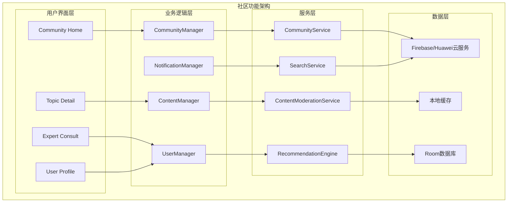
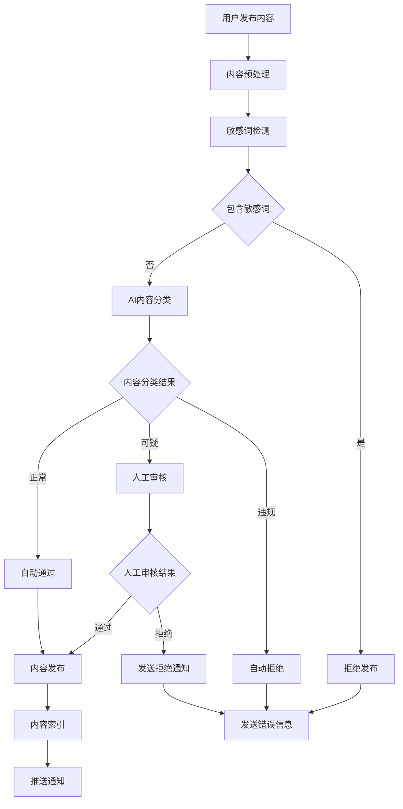

# LuminCore社区功能详细计划

## 1. 功能概述

### 1.1 目标与价值
- **知识共享**：构建女性健康知识分享和交流平台
- **情感支持**：为用户提供温暖的情感支持和陪伴
- **经验交流**：分享健康管理经验和生活技巧
- **专业指导**：邀请专业医师提供健康指导
- **隐私保护**：确保用户在安全匿名的环境中交流

### 1.2 核心功能
- **话题讨论**：围绕女性健康话题的讨论区
- **经验分享**：用户分享健康管理心得和技巧
- **问答互助**：用户间的健康问题互助解答
- **专家咨询**：专业医师定期在线答疑
- **匿名模式**：保护用户隐私的匿名交流
- **内容审核**：AI+人工双重内容审核机制

## 2. 技术架构设计

### 2.1 整体架构



### 2.2 内容审核流程



### 2.2 技术栈选择
- **云端数据库**: Firebase Firestore + 华为CloudDB
- **实时通信**: WebSocket + Server-Sent Events
- **内容审核**: MLKit + 自定义规则引擎
- **图片处理**: Glide + 压缩优化
- **推送通知**: Firebase Cloud Messaging
- **本地缓存**: Room数据库 + SharedPreferences

## 3. 核心组件设计

### 3.1 社区管理器
``kotlin
// CommunityManager.kt
@Singleton
class CommunityManager @Inject constructor(
    private val communityService: CommunityService,
    private val contentModerator: ContentModerationService,
    private val notificationManager: NotificationManager
) {
    
    private val _communityState = MutableStateFlow<CommunityState>(CommunityState.Loading)
    val communityState: StateFlow<CommunityState> = _communityState.asStateFlow()
    
    suspend fun loadCommunityHome(): CommunityHomeData {
        return try {
            _communityState.value = CommunityState.Loading
            
            val deferred = listOf(
                async { communityService.getHotTopics() },
                async { communityService.getLatestPosts() },
                async { communityService.getRecommendedExperts() }
            )
            
            val (hotTopics, latestPosts, experts) = deferred.awaitAll()
            
            val homeData = CommunityHomeData(
                hotTopics = hotTopics as List<Topic>,
                latestPosts = latestPosts as List<Post>,
                recommendedExperts = experts as List<Expert>
            )
            
            _communityState.value = CommunityState.Success
            homeData
            
        } catch (e: Exception) {
            _communityState.value = CommunityState.Error(e.message ?: "加载失败")
            CommunityHomeData.empty()
        }
    }
    
    suspend fun publishPost(post: PostDraft): PublishResult {
        return try {
            // 1. 内容审核
            val moderationResult = contentModerator.moderateContent(post.content)
            if (!moderationResult.isApproved) {
                return PublishResult.Rejected(moderationResult.reason)
            }
            
            // 2. 发布帖子
            val publishedPost = communityService.publishPost(post)
            
            // 3. 发送通知
            notificationManager.notifyFollowers(publishedPost)
            
            PublishResult.Success(publishedPost)
        } catch (e: Exception) {
            PublishResult.Error(e.message ?: "发布失败")
        }
    }
    
    sealed class CommunityState {
        object Loading : CommunityState()
        object Success : CommunityState()
        data class Error(val message: String) : CommunityState()
    }
}
```

### 3.2 社区服务层
``kotlin
// CommunityService.kt
@Singleton
class CommunityService @Inject constructor(
    private val firebaseService: FirebaseCommunityService,
    private val huaweiService: HuaweiCommunityService,
    private val localDatabase: CommunityDatabase
) {
    
    private val primaryService: CommunityProvider
        get() = if (isGoogleServicesAvailable()) firebaseService else huaweiService
    
    suspend fun getHotTopics(limit: Int = 10): List<Topic> {
        return withContext(Dispatchers.IO) {
            try {
                val cloudTopics = primaryService.getHotTopics(limit)
                localDatabase.topicDao().insertAll(cloudTopics.map { it.toEntity() })
                cloudTopics
            } catch (e: Exception) {
                localDatabase.topicDao().getHotTopics(limit).map { it.toDomain() }
            }
        }
    }
    
    suspend fun publishPost(post: PostDraft): Post {
        return withContext(Dispatchers.IO) {
            val cloudPost = primaryService.publishPost(post)
            localDatabase.postDao().insert(cloudPost.toEntity())
            cloudPost
        }
    }
    
    suspend fun searchContent(query: String): List<SearchResult> {
        return withContext(Dispatchers.IO) {
            val localResults = searchLocalContent(query)
            val cloudResults = try {
                primaryService.searchContent(query)
            } catch (e: Exception) {
                emptyList()
            }
            
            (localResults + cloudResults).distinctBy { it.id }
        }
    }
}

interface CommunityProvider {
    suspend fun getHotTopics(limit: Int): List<Topic>
    suspend fun getLatestPosts(limit: Int): List<Post>
    suspend fun publishPost(post: PostDraft): Post
    suspend fun searchContent(query: String): List<SearchResult>
    suspend fun likePost(postId: String, userId: String): Boolean
}
```

### 3.3 内容审核服务
``kotlin
// ContentModerationService.kt
@Singleton
class ContentModerationService @Inject constructor(
    private val sensitiveWordFilter: SensitiveWordFilter,
    private val textClassifier: TextClassifier
) {
    
    suspend fun moderateContent(content: String): ModerationResult {
        return withContext(Dispatchers.Default) {
            try {
                // 1. 敏感词检测
                val sensitiveCheck = sensitiveWordFilter.check(content)
                if (!sensitiveCheck.isClean) {
                    return@withContext ModerationResult.rejected("包含敏感词")
                }
                
                // 2. ML分类检测
                val mlResult = textClassifier.classify(content)
                if (mlResult.toxicityScore > 0.7f) {
                    return@withContext ModerationResult.rejected("内容可能不当")
                }
                
                // 3. 健康相关性检测
                val relevanceScore = calculateHealthRelevance(content)
                if (relevanceScore < 0.1f) {
                    return@withContext ModerationResult.flagged("与健康话题相关性较低")
                }
                
                ModerationResult.approved()
            } catch (e: Exception) {
                ModerationResult.needsReview("审核失败，需要人工审核")
            }
        }
    }
    
    private fun calculateHealthRelevance(content: String): Float {
        val healthKeywords = setOf(
            "月经", "经期", "排卵", "健康", "症状", "疼痛", "情绪", "饮食", "运动"
        )
        val words = content.split(Regex("\\s+"))
        val healthWordCount = words.count { word -> 
            healthKeywords.any { keyword -> word.contains(keyword) }
        }
        return healthWordCount.toFloat() / words.size.coerceAtLeast(1)
    }
}

data class ModerationResult(
    val status: ModerationStatus,
    val reason: String? = null
) {
    val isApproved: Boolean get() = status == ModerationStatus.APPROVED
    
    companion object {
        fun approved() = ModerationResult(ModerationStatus.APPROVED)
        fun rejected(reason: String) = ModerationResult(ModerationStatus.REJECTED, reason)
        fun flagged(reason: String) = ModerationResult(ModerationStatus.FLAGGED, reason)
        fun needsReview(reason: String) = ModerationResult(ModerationStatus.NEEDS_REVIEW, reason)
    }
}

enum class ModerationStatus {
    APPROVED, REJECTED, FLAGGED, NEEDS_REVIEW
}
```

### 3.4 专家咨询系统
``kotlin
// ExpertConsultationService.kt
@Singleton
class ExpertConsultationService @Inject constructor(
    private val expertRepository: ExpertRepository,
    private val consultationRepository: ConsultationRepository
) {
    
    suspend fun getAvailableExperts(specialization: String? = null): List<Expert> {
        return expertRepository.getOnlineExperts(specialization)
            .filter { it.isAvailableForConsultation() }
            .sortedByDescending { it.rating }
    }
    
    suspend fun submitConsultation(consultation: ConsultationRequest): ConsultationResult {
        return try {
            // 1. 内容审核
            val moderationResult = ContentModerationService().moderateContent(consultation.question)
            if (!moderationResult.isApproved) {
                return ConsultationResult.Rejected(moderationResult.reason ?: "内容不符合规范")
            }
            
            // 2. 匹配专家
            val matchedExpert = findBestMatchExpert(consultation)
            
            // 3. 创建咨询记录
            val consultationRecord = consultationRepository.createConsultation(
                consultation.copy(expertId = matchedExpert.id)
            )
            
            ConsultationResult.Success(consultationRecord)
        } catch (e: Exception) {
            ConsultationResult.Error(e.message ?: "提交失败")
        }
    }
    
    private suspend fun findBestMatchExpert(consultation: ConsultationRequest): Expert {
        val availableExperts = getAvailableExperts()
        return availableExperts.maxByOrNull { expert ->
            var score = expert.rating * 0.6f
            if (expert.specializations.any { spec -> 
                consultation.question.contains(spec, ignoreCase = true) 
            }) {
                score += 0.4f
            }
            score
        } ?: throw IllegalStateException("当前没有可用的专家")
    }
}

data class ConsultationRequest(
    val userId: String,
    val question: String,
    val category: String,
    val isAnonymous: Boolean = true,
    val expertId: String? = null
)

sealed class ConsultationResult {
    data class Success(val consultation: Consultation) : ConsultationResult()
    data class Rejected(val reason: String) : ConsultationResult()
    data class Error(val message: String) : ConsultationResult()
}
```

## 4. 数据模型设计

### 4.1 核心实体
``kotlin
data class Topic(
    val id: String,
    val title: String,
    val description: String,
    val category: TopicCategory,
    val participantCount: Int,
    val postCount: Int,
    val isHot: Boolean,
    val createdAt: Long
)

data class Post(
    val id: String,
    val authorId: String,
    val authorName: String,
    val isAnonymous: Boolean,
    val topicId: String,
    val title: String,
    val content: String,
    val images: List<String>,
    val likeCount: Int,
    val commentCount: Int,
    val isLikedByCurrentUser: Boolean,
    val createdAt: Long
)

data class Comment(
    val id: String,
    val postId: String,
    val authorId: String,
    val authorName: String,
    val isAnonymous: Boolean,
    val content: String,
    val likeCount: Int,
    val createdAt: Long
)

data class Expert(
    val id: String,
    val name: String,
    val title: String,
    val specializations: List<String>,
    val avatar: String?,
    val rating: Float,
    val isOnline: Boolean,
    val consultationCount: Int
)

enum class TopicCategory {
    MENSTRUAL_HEALTH, REPRODUCTIVE_HEALTH, MENTAL_HEALTH, 
    NUTRITION, EXERCISE, GENERAL_DISCUSSION
}
```

### 4.2 Room数据库实体
``kotlin
@Entity(tableName = "community_posts")
data class PostEntity(
    @PrimaryKey val id: String,
    val authorId: String,
    val topicId: String,
    val title: String,
    val content: String,
    val likeCount: Int,
    val commentCount: Int,
    val createdAt: Long
)

@Dao
interface PostDao {
    @Query("SELECT * FROM community_posts ORDER BY createdAt DESC LIMIT :limit")
    suspend fun getLatestPosts(limit: Int): List<PostEntity>
    
    @Query("SELECT * FROM community_posts WHERE title LIKE :query OR content LIKE :query")
    suspend fun searchPosts(query: String): List<PostEntity>
    
    @Insert(onConflict = OnConflictStrategy.REPLACE)
    suspend fun insert(post: PostEntity)
}
```

## 5. UI界面设计

### 5.1 社区首页
``kotlin
// CommunityHomeFragment.kt
class CommunityHomeFragment : Fragment() {
    
    private lateinit var binding: FragmentCommunityHomeBinding
    private lateinit var viewModel: CommunityHomeViewModel
    
    override fun onViewCreated(view: View, savedInstanceState: Bundle?) {
        super.onViewCreated(view, savedInstanceState)
        
        setupRecyclerViews()
        setupFab()
        observeViewModel()
        viewModel.loadCommunityHome()
    }
    
    private fun setupRecyclerViews() {
        binding.rvHotTopics.adapter = TopicsAdapter { topic ->
            findNavController().navigate(
                CommunityHomeFragmentDirections.actionToTopicDetail(topic.id)
            )
        }
        
        binding.rvLatestPosts.adapter = PostsAdapter(
            onPostClick = { post ->
                findNavController().navigate(
                    CommunityHomeFragmentDirections.actionToPostDetail(post.id)
                )
            },
            onLikeClick = { post -> viewModel.likePost(post.id) }
        )
    }
    
    private fun setupFab() {
        binding.fabNewPost.setOnClickListener {
            findNavController().navigate(
                CommunityHomeFragmentDirections.actionToCreatePost()
            )
        }
    }
}
```

### 5.2 发帖界面
``kotlin
// CreatePostFragment.kt
class CreatePostFragment : Fragment() {
    
    private lateinit var binding: FragmentCreatePostBinding
    private lateinit var viewModel: CreatePostViewModel
    
    override fun onViewCreated(view: View, savedInstanceState: Bundle?) {
        super.onViewCreated(view, savedInstanceState)
        
        setupToolbar()
        setupTopicSelection()
        setupAnonymousSwitch()
        setupPublishButton()
        observeViewModel()
    }
    
    private fun setupPublishButton() {
        binding.btnPublish.setOnClickListener {
            val title = binding.etTitle.text.toString().trim()
            val content = binding.etContent.text.toString().trim()
            val isAnonymous = binding.switchAnonymous.isChecked
            
            if (validateInput(title, content)) {
                val post = PostDraft(
                    title = title,
                    content = content,
                    isAnonymous = isAnonymous,
                    topicId = viewModel.selectedTopicId.value ?: ""
                )
                viewModel.publishPost(post)
            }
        }
    }
    
    private fun observeViewModel() {
        viewModel.publishResult.observe(viewLifecycleOwner) { result ->
            when (result) {
                is PublishResult.Success -> {
                    Toast.makeText(context, "发布成功", Toast.LENGTH_SHORT).show()
                    findNavController().navigateUp()
                }
                is PublishResult.Error -> {
                    Toast.makeText(context, result.message, Toast.LENGTH_LONG).show()
                }
                is PublishResult.Rejected -> {
                    showModerationDialog(result.reason)
                }
            }
        }
    }
}
```

## 6. 实施计划

### 第一阶段：基础架构（3周）
- **Week 1**: 社区管理器和基础服务层
- **Week 2**: 数据模型和本地数据库
- **Week 3**: 基础UI组件和导航框架

### 第二阶段：核心功能（3周）
- **Week 4**: 话题和帖子发布功能
- **Week 5**: 评论和互动系统
- **Week 6**: 内容审核和搜索功能

### 第三阶段：高级功能（2周）
- **Week 7**: 专家咨询系统
- **Week 8**: 推送通知和性能优化

## 7. 安全和隐私保护

### 7.1 用户隐私
- **匿名模式**：用户可选择匿名发帖和评论
- **数据脱敏**：自动隐藏或模糊敏感个人信息
- **权限控制**：细粒度的隐私设置选项
- **数据删除**：用户可随时删除自己的内容

### 7.2 内容安全
- **多层审核**：AI预审核 + 人工复审机制
- **举报系统**：用户举报 + 自动违规检测
- **敏感词过滤**：实时敏感内容过滤
- **专家认证**：严格的专家资质审核流程

### 7.3 技术安全
- **数据加密**：传输和存储数据全程加密
- **访问控制**：基于角色的权限管理
- **防护机制**：防刷屏、防垃圾信息
- **监控告警**：异常行为实时监控

## 8. 成功指标

### 8.1 用户参与
- 日活跃用户 > 1000
- 用户发帖率 > 5%
- 平均会话时长 > 10分钟
- 用户留存率 > 60%

### 8.2 内容质量
- 内容审核通过率 > 95%
- 用户举报处理率 > 99%
- 专家回复率 > 80%
- 用户满意度 > 4.5/5

### 8.3 技术指标
- 响应时间 < 2秒
- 系统可用性 > 99.9%
- 数据同步成功率 > 99%
- 内容加载成功率 > 98%

通过以上详细的社区功能规划，LuminCore将为用户构建一个安全、温馨、专业的女性健康交流平台，促进知识分享和情感支持，帮助更多女性更好地关注和管理自己的健康。

---

**文档版本**: 1.0.0
**创建日期**: 2025年8月25日
**计划负责人**: 祁潇潇
**审核状态**: 已审核
**预计开始时间**: 2029年7月1日
**预计完成时间**: 2029年9月30日
## 🔄 相关依赖
- [AI健康助手功能](./AI_HEALTH_ASSISTANT_PLAN.md)
- [数据加密功能](./DATA_ENCRYPTION_PLAN.md)
- [云端同步架构](./CLOUD_SYNC_ARCHITECTURE_PLAN.md)
- [可穿戴设备集成](./WEARABLE_DEVICE_INTEGRATION_PLAN.md)
