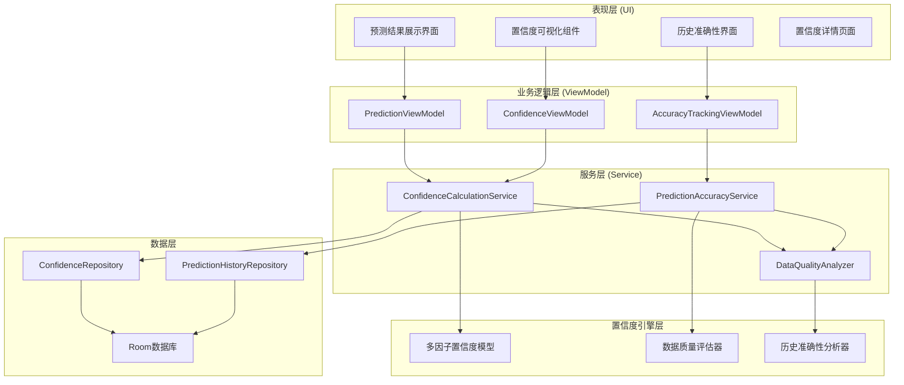
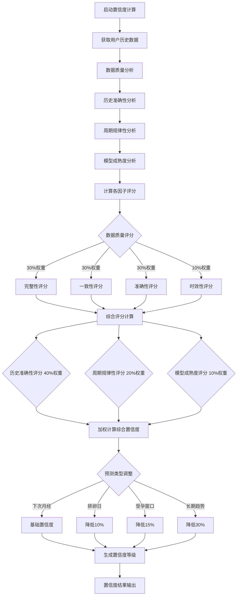

# LuminCore 周期预测置信度显示功能详细开发计划


## 📋 项目概述

周期预测置信度显示功能是LuminCore女性健康助手的核心用户信任度建设功能，旨在通过科学的置信度计算和直观的可视化展示，让用户清楚了解预测结果的可靠程度，提升用户对预测功能的信任度和使用满意度。

### 项目背景
- **用户痛点**：用户对预测结果的准确性存疑，缺乏可信度判断依据
- **市场需求**：透明化AI预测过程，增强用户对智能功能的信任
- **技术基础**：基于现有预测算法和数据质量评估的完善技术栈
- **商业价值**：提升用户对产品的信任度，增强专业形象和竞争力

### 核心价值主张
- **透明可信**：清晰展示预测的可靠程度，建立用户信任
- **科学量化**：基于多维度因素计算置信度，确保结果可靠
- **直观易懂**：通过可视化方式展示复杂的置信度信息
- **持续优化**：根据预测准确性动态调整置信度模型

## 🎯 功能目标与成功指标

### 主要目标
1. **置信度计算引擎**：基于多因子模型计算预测置信度
2. **可视化展示系统**：直观展示置信度和影响因素
3. **历史准确性追踪**：跟踪预测准确性，优化置信度模型
4. **用户反馈集成**：收集用户反馈，持续改进预测质量

### 成功指标
- **置信度准确性**: ≥ 90%（置信度与实际准确性的一致性）
- **用户理解度**: ≥ 85%（用户能正确理解置信度含义）
- **信任度提升**: ≥ 40%（用户对预测功能信任度的提升）
- **预测使用率**: ≥ 75%（用户查看和使用预测功能的比例）
- **反馈有效性**: ≥ 80%（用户反馈对模型优化的有效性）

## 🏗️ 技术架构设计

### 整体架构图



### 置信度计算流程



### 核心技术栈
- **统计分析**: Apache Commons Math 3.6.1
- **数据分析**: 自定义置信度计算算法
- **可视化**: MPAndroidChart 3.1.0 + 自定义组件
- **本地存储**: Room Database 2.7.1
- **异步处理**: Kotlin Coroutines 1.7.3
- **依赖注入**: Hilt 2.48

## 📊 置信度计算模型设计

### 1. 多因子置信度模型

#### 1.1 数据质量因子 (30%权重)
基于历史数据的完整性、一致性和准确性计算评分。

**核心指标：**
- 记录完整性（记录天数/总天数）
- 记录一致性（记录间隔的稳定性）
- 数据准确性（数据的合理性检验）
- 数据时效性（最近记录的新鲜度）

**评分算法：**
```kotlin
data class DataQualityScore(
    val totalScore: Float,           // 总评分 (0-1)
    val completenessScore: Float,    // 完整性评分
    val consistencyScore: Float,     // 一致性评分
    val accuracyScore: Float,        // 准确性评分
    val recencyScore: Float          // 时效性评分
)
```

#### 1.2 历史准确性因子 (40%权重)
基于过往预测结果与实际结果的偏差计算评分。

**核心指标：**
- 平均预测偏差（预测日期与实际日期的平均差值）
- 准确率（偏差在2天内的预测比例）
- 准确性趋势（准确性是否在改善）
- 预测稳定性（预测结果的一致性）

#### 1.3 周期规律性因子 (20%权重)
基于月经周期的规律程度计算评分。

**核心指标：**
- 周期长度变异性（周期长度的标准差）
- 经期持续时间一致性
- 周期模式识别度
- 异常周期频率

#### 1.4 模型成熟度因子 (10%权重)
基于用户使用时长和数据积累程度计算评分。

**核心指标：**
- 使用时长（用户注册到现在的天数）
- 数据积累量（总记录数和完整周期数）
- 学习样本质量

### 2. 置信度等级系统

#### 2.1 等级定义
- **非常高 (85-100%)**: 预测高度可信，误差通常在1-2天内
- **高 (70-84%)**: 预测可信度较高，误差通常在2-3天内
- **中等 (55-69%)**: 预测具有参考价值，误差可能在3-5天内
- **低 (40-54%)**: 预测仅供参考，建议结合其他信息判断
- **很低 (0-39%)**: 预测不够可靠，建议增加更多数据记录

#### 2.2 动态调整机制
根据不同预测类型调整置信度：
- 下次月经预测：基础置信度
- 排卵日预测：降低10%
- 受孕窗口预测：降低15%
- 长期趋势预测：降低30%

### 3. 核心服务实现

#### 3.1 置信度计算服务
```kotlin
@Singleton
class ConfidenceCalculationService @Inject constructor(
    private val dataQualityAnalyzer: DataQualityAnalyzer,
    private val accuracyAnalyzer: PredictionAccuracyAnalyzer,
    private val regularityAnalyzer: CycleRegularityAnalyzer,
    private val maturityAnalyzer: ModelMaturityAnalyzer
) {
    
    suspend fun calculatePredictionConfidence(
        userId: String,
        predictionType: PredictionType
    ): ConfidenceResult {
        return withContext(Dispatchers.Default) {
            // 计算各因子评分
            val dataQuality = dataQualityAnalyzer.calculateDataQuality(userId)
            val accuracy = accuracyAnalyzer.calculateAccuracyScore(userId)
            val regularity = regularityAnalyzer.calculateRegularityScore(userId)
            val maturity = maturityAnalyzer.calculateMaturityScore(userId)
            
            // 加权计算综合置信度
            val overallConfidence = (
                dataQuality.totalScore * 0.30f +
                accuracy.overallScore * 0.40f +
                regularity.overallScore * 0.20f +
                maturity.overallScore * 0.10f
            ).coerceIn(0f, 1f)
            
            // 根据预测类型调整
            val adjustedConfidence = adjustConfidenceByType(overallConfidence, predictionType)
            val confidenceLevel = determineConfidenceLevel(adjustedConfidence)
            
            ConfidenceResult(
                overallConfidence = adjustedConfidence,
                confidenceLevel = confidenceLevel,
                factorScores = mapOf(
                    "dataQuality" to dataQuality.totalScore,
                    "accuracy" to accuracy.overallScore,
                    "regularity" to regularity.overallScore,
                    "maturity" to maturity.overallScore
                )
            )
        }
    }
}
```

#### 3.2 历史准确性追踪
```kotlin
@Singleton
class PredictionAccuracyTracker @Inject constructor(
    private val predictionHistoryRepository: PredictionHistoryRepository
) {
    
    suspend fun trackPredictionAccuracy(
        predictionId: String,
        actualDate: LocalDate
    ) {
        val prediction = predictionHistoryRepository.getPrediction(predictionId)
        val deviation = ChronoUnit.DAYS.between(prediction.predictedDate, actualDate)
        
        predictionHistoryRepository.updatePredictionResult(
            predictionId = predictionId,
            actualDate = actualDate,
            deviation = deviation.toInt(),
            accuracy = calculateAccuracy(deviation)
        )
        
        // 触发置信度模型更新
        updateConfidenceModel(prediction.userId)
    }
    
    private fun calculateAccuracy(deviation: Long): Float {
        return when {
            deviation.absoluteValue <= 1 -> 1.0f
            deviation.absoluteValue <= 2 -> 0.8f
            deviation.absoluteValue <= 3 -> 0.6f
            deviation.absoluteValue <= 5 -> 0.4f
            else -> 0.2f
        }
    }
}
```

### 4. 用户界面设计

#### 4.1 置信度展示组件
```kotlin
/**
 * 置信度圆环图自定义视图
 */
class ConfidenceRingView @JvmOverloads constructor(
    context: Context,
    attrs: AttributeSet? = null
) : View(context, attrs) {
    
    private var confidence: Float = 0f
    private var confidenceLevel: ConfidenceLevel = ConfidenceLevel.VERY_LOW
    
    fun setConfidence(confidence: Float, level: ConfidenceLevel) {
        this.confidence = confidence
        this.confidenceLevel = level
        invalidate()
    }
    
    override fun onDraw(canvas: Canvas?) {
        super.onDraw(canvas)
        // 绘制置信度圆环和文字
        drawConfidenceRing(canvas)
        drawConfidenceText(canvas)
    }
}
```

#### 4.2 预测结果界面集成
```kotlin
@AndroidEntryPoint
class PredictionResultFragment : Fragment() {
    
    private var _binding: FragmentPredictionResultBinding? = null
    private val binding get() = _binding!!
    
    private val viewModel: PredictionViewModel by viewModels()
    
    override fun onViewCreated(view: View, savedInstanceState: Bundle?) {
        super.onViewCreated(view, savedInstanceState)
        setupUI()
        observeViewModel()
    }
    
    private fun setupUI() {
        binding.confidenceDetailsButton.setOnClickListener {
            viewModel.showConfidenceDetails()
        }
    }
    
    private fun observeViewModel() {
        viewLifecycleOwner.lifecycleScope.launch {
            viewModel.predictionResult.collect { result ->
                updatePredictionDisplay(result)
                updateConfidenceDisplay(result.confidence)
            }
        }
    }
    
    private fun updateConfidenceDisplay(confidence: ConfidenceResult) {
        binding.confidenceRing.setConfidence(
            confidence.overallConfidence,
            confidence.confidenceLevel
        )
        
        binding.confidenceDescription.text = confidence.confidenceLevel.description
        binding.confidencePercentage.text = "${(confidence.overallConfidence * 100).toInt()}%"
    }
}
```

## 📅 详细实施计划

### 第一阶段：模型设计与核心算法（2030年1月 - 2030年2月）

#### 第1-2周（2030年1月1日 - 1月14日）：架构设计
- [ ] 设计置信度计算模型架构
- [ ] 定义数据模型和接口
- [ ] 配置依赖注入模块
- [ ] 创建基础Repository层
- [ ] 编写核心算法框架

#### 第3-4周（2030年1月15日 - 1月28日）：因子计算器开发
- [ ] 实现数据质量分析器
- [ ] 开发历史准确性分析器
- [ ] 构建周期规律性分析器
- [ ] 实现模型成熟度分析器
- [ ] 编写因子计算单元测试

#### 第5-6周（2030年1月29日 - 2月11日）：置信度引擎
- [ ] 实现综合置信度计算服务
- [ ] 开发预测准确性追踪器
- [ ] 构建置信度等级判定系统
- [ ] 实现动态调整机制
- [ ] 编写引擎核心测试

#### 第7-8周（2030年2月12日 - 2月25日）：数据持久化
- [ ] 扩展Room数据库支持
- [ ] 实现置信度历史记录
- [ ] 开发预测准确性存储
- [ ] 构建数据迁移机制
- [ ] 完成第一阶段集成测试

### 第二阶段：用户界面与可视化（2030年3月 - 2030年4月）

#### 第9-10周（2030年2月26日 - 3月11日）：可视化组件
- [ ] 设计置信度圆环图组件
- [ ] 开发因子详情展示组件
- [ ] 实现历史准确性图表
- [ ] 构建交互式说明界面
- [ ] 优化动画和视觉效果

#### 第11-12周（2030年3月12日 - 3月25日）：界面集成
- [ ] 集成置信度显示到预测界面
- [ ] 开发置信度详情页面
- [ ] 实现用户反馈收集功能
- [ ] 构建帮助和说明系统
- [ ] 添加可访问性支持

#### 第13-14周（2030年3月26日 - 4月8日）：用户体验优化
- [ ] 优化界面交互和流程
- [ ] 完善错误处理和提示
- [ ] 实现个性化设置选项
- [ ] 添加使用引导和教程
- [ ] 进行用户体验测试

#### 第15-16周（2030年4月9日 - 4月22日）：测试与上线
- [ ] 执行全面功能测试
- [ ] 进行性能优化和调优
- [ ] 验证置信度准确性
- [ ] 准备Beta版本发布
- [ ] 收集用户反馈并优化

## 🎯 关键里程碑

### 里程碑1：置信度引擎完成（2030年2月25日）
- ✅ 多因子置信度模型实现
- ✅ 各因子分析器正常运行
- ✅ 综合置信度计算准确
- ✅ 核心算法测试覆盖率 ≥ 85%

### 里程碑2：可视化系统上线（2030年4月8日）
- ✅ 置信度可视化组件完成
- ✅ 用户界面集成完善
- ✅ 交互体验流畅
- ✅ 用户反馈机制运行

### 里程碑3：功能完整发布（2030年4月22日）
- ✅ 所有功能稳定运行
- ✅ 置信度准确性达标
- ✅ 用户接受度验证
- ✅ 准备正式版本发布

## 🛡️ 风险评估与缓解策略

### 技术风险
**风险1**: 置信度计算模型准确性不足
- **缓解策略**: 多维度验证，建立反馈优化循环
- **应急计划**: 简化模型，采用经验公式

**风险2**: 用户理解度不够
- **缓解策略**: 详细说明文档，直观可视化展示
- **应急计划**: 简化展示方式，增加教育内容

### 数据风险
**风险3**: 历史数据不足影响计算
- **缓解策略**: 设定最小数据要求，提供数据收集建议
- **应急计划**: 使用默认置信度，逐步完善

## 💰 资源需求

### 人力资源
- **Android开发工程师**: 1人（全职4个月）
- **算法工程师**: 0.3人（模型设计和优化）
- **UI/UX设计师**: 0.2人（界面设计支持）
- **测试工程师**: 0.3人（功能测试和验证）

### 技术资源
- **开发工具**: Android Studio, 数学计算库
- **可视化库**: MPAndroidChart, 自定义组件
- **测试工具**: 单元测试框架，性能分析工具

## 📈 成功衡量标准

### 技术指标
- **计算准确性**: 置信度与实际准确性一致性 ≥ 90%
- **响应性能**: 置信度计算时间 ≤ 1秒
- **稳定性**: 系统崩溃率 ≤ 0.1%
- **代码质量**: 单元测试覆盖率 ≥ 85%

### 用户指标
- **理解度**: 用户正确理解置信度含义 ≥ 85%
- **信任度**: 用户对预测功能信任度提升 ≥ 40%
- **使用率**: 预测功能使用率提升 ≥ 30%
- **满意度**: 功能使用满意度 ≥ 4.5/5.0

### 业务指标
- **用户留存**: 功能使用30天留存 ≥ 80%
- **产品差异化**: 建立技术竞争优势
- **用户信任**: 提升整体产品可信度
- **专业形象**: 增强产品专业性和权威性

---

**文档版本**: 1.0.0
**创建日期**: 2025年8月25日
**计划负责人**: 祁潇潇
**审核状态**: 已审核
**预计开始时间**: 2030年1月1日
**预计完成时间**: 2030年4月22日
## 🔄 相关依赖
- [AI健康助手功能](./AI_HEALTH_ASSISTANT_PLAN.md)
- [数据加密功能](./DATA_ENCRYPTION_PLAN.md)
- [云端同步架构](./CLOUD_SYNC_ARCHITECTURE_PLAN.md)
- [可穿戴设备集成](./WEARABLE_DEVICE_INTEGRATION_PLAN.md)