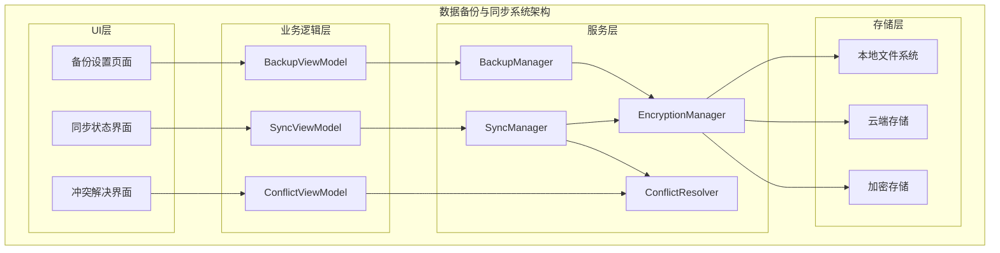
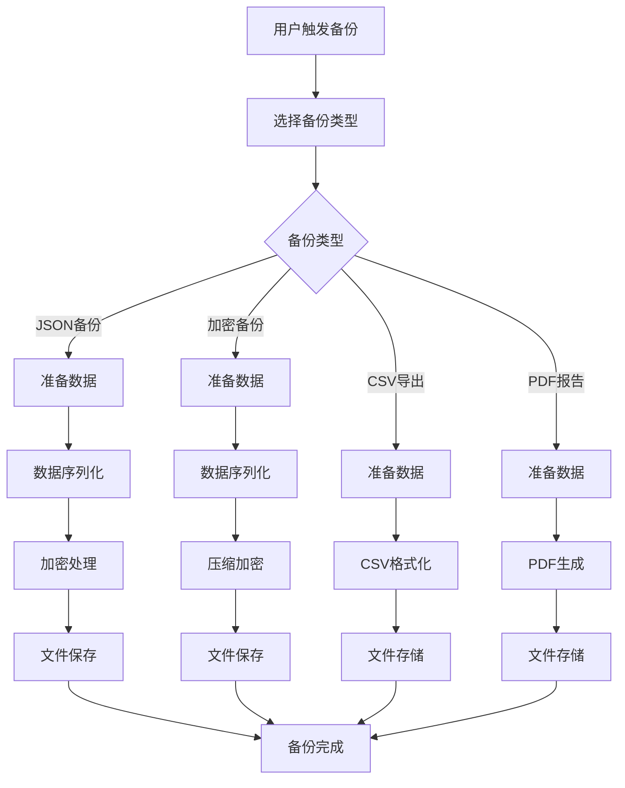
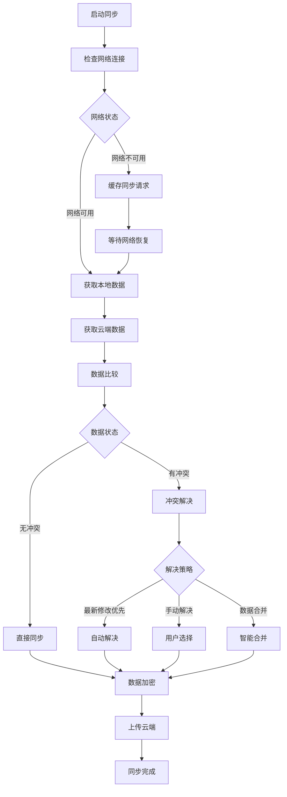

# LuminCore 数据备份与同步详细计划


## 📋 项目概述

### 系统目标
开发一套安全、可靠的数据备份与同步系统，保障用户健康数据的安全性，支持多设备间的无缝数据同步，同时严格保护用户隐私。

### 核心价值
- **数据安全**：防止用户数据丢失，提供可靠的备份方案
- **多设备同步**：实现跨设备的数据一致性
- **隐私保护**：端到端加密，用户数据完全私密
- **离线优先**：支持离线备份，网络可选

## 🎯 功能需求分析

### 1. 备份方案类型

#### 1.1 本地备份
```kotlin
enum class LocalBackupType(
    val displayName: String,
    val fileExtension: String,
    val encryptionRequired: Boolean
) {
    JSON_BACKUP("JSON格式备份", ".json", true),
    ENCRYPTED_BACKUP("加密备份文件", ".lbk", true),
    CSV_EXPORT("CSV数据导出", ".csv", false),
    PDF_REPORT("PDF健康报告", ".pdf", false)
}
```

#### 1.2 云端同步选项
```kotlin
enum class CloudSyncProvider(
    val displayName: String,
    val isEnabled: Boolean,
    val encryptionSupport: Boolean
) {
    GOOGLE_DRIVE("Google Drive", true, true),
    ICLOUD("iCloud", false, true), // 暂不支持
    DROPBOX("Dropbox", false, true), // 暂不支持
    CUSTOM_SERVER("自定义服务器", false, true), // 未来支持
    LOCAL_NETWORK("局域网同步", true, true)
}
```

### 2. 数据同步策略

#### 2.1 同步模式
```kotlin
enum class SyncMode(
    val displayName: String,
    val description: String
) {
    MANUAL_SYNC("手动同步", "用户主动触发同步"),
    AUTO_SYNC_WIFI("WiFi自动同步", "连接WiFi时自动同步"),
    SCHEDULED_SYNC("定时同步", "按计划自动同步"),
    REAL_TIME_SYNC("实时同步", "数据变化时立即同步")
}

data class SyncConfig(
    val syncMode: SyncMode,
    val wifiOnlySync: Boolean = true,
    val syncFrequency: SyncFrequency,
    val autoResolveConflicts: Boolean = false,
    val encryptionEnabled: Boolean = true
)
```

#### 2.2 冲突解决策略
```kotlin
enum class ConflictResolutionStrategy(
    val displayName: String,
    val description: String
) {
    LAST_MODIFIED_WINS("最新修改优先", "以最后修改时间为准"),
    MANUAL_RESOLUTION("手动解决", "用户选择保留哪个版本"),
    MERGE_DATA("数据合并", "尝试智能合并数据"),
    DEVICE_PRIORITY("设备优先级", "按设备优先级决定")
}
```

## 🏗️ 技术架构设计

### 1. 系统架构图



### 2. 数据备份流程



### 3. 数据同步流程



### 2. 核心组件实现

#### 2.1 备份管理器
```kotlin
@Singleton
class BackupManager @Inject constructor(
    private val context: Context,
    private val repository: MenstrualRepository,
    private val encryptionManager: EncryptionManager,
    private val gson: Gson
) {
    
    suspend fun createLocalBackup(
        backupType: LocalBackupType,
        includePersonalData: Boolean = true
    ): Result<Uri> {
        return try {
            val backupData = prepareBackupData(includePersonalData)
            val backupFile = when (backupType) {
                LocalBackupType.JSON_BACKUP -> createJsonBackup(backupData)
                LocalBackupType.ENCRYPTED_BACKUP -> createEncryptedBackup(backupData)
                LocalBackupType.CSV_EXPORT -> createCsvExport(backupData)
                LocalBackupType.PDF_REPORT -> createPdfReport(backupData)
            }
            
            Result.Success(backupFile)
        } catch (e: Exception) {
            Log.e("BackupManager", "Failed to create backup", e)
            Result.Error(e)
        }
    }
    
    private suspend fun prepareBackupData(includePersonalData: Boolean): BackupData {
        val allRecords = repository.getAllRecords().first()
        val userPreferences = if (includePersonalData) {
            // 获取用户偏好设置
            getUserPreferences()
        } else {
            null
        }
        
        return BackupData(
            version = BuildConfig.VERSION_NAME,
            backupDate = Date(),
            deviceId = getDeviceId(),
            records = allRecords,
            preferences = userPreferences,
            checksum = calculateChecksum(allRecords)
        )
    }
    
    private suspend fun createJsonBackup(backupData: BackupData): Uri {
        val jsonString = gson.toJson(backupData)
        val encryptedData = encryptionManager.encrypt(jsonString)
        
        val filename = "lumincore_backup_${SimpleDateFormat("yyyyMMdd_HHmmss", Locale.getDefault()).format(Date())}.json"
        val file = File(context.getExternalFilesDir("backups"), filename)
        
        file.writeText(encryptedData)
        return FileProvider.getUriForFile(context, "${context.packageName}.fileprovider", file)
    }
    
    private suspend fun createEncryptedBackup(backupData: BackupData): Uri {
        val jsonString = gson.toJson(backupData)
        val compressedData = compressData(jsonString.toByteArray())
        val encryptedData = encryptionManager.encryptBytes(compressedData)
        
        val filename = "lumincore_backup_${SimpleDateFormat("yyyyMMdd_HHmmss", Locale.getDefault()).format(Date())}.lbk"
        val file = File(context.getExternalFilesDir("backups"), filename)
        
        file.writeBytes(encryptedData)
        return FileProvider.getUriForFile(context, "${context.packageName}.fileprovider", file)
    }
    
    suspend fun restoreFromBackup(backupUri: Uri, backupType: LocalBackupType): Result<RestoreResult> {
        return try {
            val backupData = when (backupType) {
                LocalBackupType.JSON_BACKUP -> restoreFromJson(backupUri)
                LocalBackupType.ENCRYPTED_BACKUP -> restoreFromEncrypted(backupUri)
                else -> return Result.Error(IllegalArgumentException("不支持的备份类型"))
            }
            
            // 验证备份数据完整性
            if (!validateBackupData(backupData)) {
                return Result.Error(IllegalStateException("备份数据验证失败"))
            }
            
            // 执行数据恢复
            val result = performDataRestore(backupData)
            Result.Success(result)
            
        } catch (e: Exception) {
            Log.e("BackupManager", "Failed to restore backup", e)
            Result.Error(e)
        }
    }
    
    private suspend fun performDataRestore(backupData: BackupData): RestoreResult {
        val existingRecords = repository.getAllRecords().first()
        val newRecords = backupData.records
        
        // 分析数据差异
        val conflicts = detectConflicts(existingRecords, newRecords)
        
        return if (conflicts.isEmpty()) {
            // 没有冲突，直接合并数据
            mergeRecords(existingRecords, newRecords)
            RestoreResult.Success(
                restoredRecords = newRecords.size,
                conflicts = emptyList()
            )
        } else {
            // 有冲突，需要用户处理
            RestoreResult.ConflictsDetected(
                conflicts = conflicts,
                pendingData = backupData
            )
        }
    }
}
```

#### 2.2 同步管理器
```kotlin
@Singleton
class SyncManager @Inject constructor(
    private val context: Context,
    private val repository: MenstrualRepository,
    private val backupManager: BackupManager,
    private val encryptionManager: EncryptionManager,
    private val networkManager: NetworkManager,
    private val driveService: GoogleDriveService
) {
    
    private val _syncStatus = MutableLiveData<SyncStatus>()
    val syncStatus: LiveData<SyncStatus> = _syncStatus
    
    suspend fun syncToCloud(syncConfig: SyncConfig): Result<SyncResult> {
        return try {
            _syncStatus.postValue(SyncStatus.InProgress)
            
            // 检查网络连接
            if (!networkManager.isNetworkAvailable()) {
                return Result.Error(NetworkException("网络连接不可用"))
            }
            
            // 创建本地备份
            val backupResult = backupManager.createLocalBackup(
                LocalBackupType.ENCRYPTED_BACKUP,
                includePersonalData = true
            )
            
            val backupUri = when (backupResult) {
                is Result.Success -> backupResult.data
                is Result.Error -> return Result.Error(backupResult.exception)
            }
            
            // 上传到云端
            val uploadResult = uploadToCloud(backupUri, syncConfig)
            
            _syncStatus.postValue(
                if (uploadResult.isSuccess) SyncStatus.Success 
                else SyncStatus.Failed(uploadResult.exceptionOrNull())
            )
            
            uploadResult
            
        } catch (e: Exception) {
            _syncStatus.postValue(SyncStatus.Failed(e))
            Result.Error(e)
        }
    }
    
    private suspend fun uploadToCloud(backupUri: Uri, syncConfig: SyncConfig): Result<SyncResult> {
        return when (syncConfig.cloudProvider) {
            CloudSyncProvider.GOOGLE_DRIVE -> uploadToGoogleDrive(backupUri)
            CloudSyncProvider.LOCAL_NETWORK -> uploadToLocalNetwork(backupUri)
            else -> Result.Error(UnsupportedOperationException("不支持的云端提供商"))
        }
    }
    
    private suspend fun uploadToGoogleDrive(backupUri: Uri): Result<SyncResult> {
        return try {
            val inputStream = context.contentResolver.openInputStream(backupUri)
                ?: return Result.Error(IOException("无法读取备份文件"))
            
            val metadata = com.google.api.services.drive.model.File().apply {
                name = "lumincore_sync_${System.currentTimeMillis()}.lbk"
                parents = listOf(getOrCreateSyncFolder())
            }
            
            val mediaContent = InputStreamContent("application/octet-stream", inputStream)
            val uploadResult = driveService.files().create(metadata, mediaContent).execute()
            
            Result.Success(SyncResult.CloudSync(
                fileId = uploadResult.id,
                uploadTime = Date(),
                fileSize = getFileSize(backupUri)
            ))
            
        } catch (e: Exception) {
            Result.Error(e)
        }
    }
    
    suspend fun syncFromCloud(syncConfig: SyncConfig): Result<List<CloudBackupFile>> {
        return try {
            _syncStatus.postValue(SyncStatus.InProgress)
            
            val cloudFiles = when (syncConfig.cloudProvider) {
                CloudSyncProvider.GOOGLE_DRIVE -> getGoogleDriveFiles()
                CloudSyncProvider.LOCAL_NETWORK -> getLocalNetworkFiles()
                else -> return Result.Error(UnsupportedOperationException("不支持的云端提供商"))
            }
            
            _syncStatus.postValue(SyncStatus.Success)
            Result.Success(cloudFiles)
            
        } catch (e: Exception) {
            _syncStatus.postValue(SyncStatus.Failed(e))
            Result.Error(e)
        }
    }
    
    suspend fun resolveConflicts(
        conflicts: List<DataConflict>,
        resolutions: List<ConflictResolution>
    ): Result<Unit> {
        return try {
            conflicts.forEachIndexed { index, conflict ->
                val resolution = resolutions[index]
                when (resolution.strategy) {
                    ConflictResolutionStrategy.LAST_MODIFIED_WINS -> {
                        resolveByTimestamp(conflict)
                    }
                    ConflictResolutionStrategy.MANUAL_RESOLUTION -> {
                        applyManualResolution(conflict, resolution)
                    }
                    ConflictResolutionStrategy.MERGE_DATA -> {
                        mergeConflictedData(conflict)
                    }
                    ConflictResolutionStrategy.DEVICE_PRIORITY -> {
                        resolveByDevicePriority(conflict)
                    }
                }
            }
            
            Result.Success(Unit)
        } catch (e: Exception) {
            Result.Error(e)
        }
    }
}
```

#### 2.3 加密管理器
```kotlin
@Singleton
class EncryptionManager @Inject constructor(
    private val context: Context
) {
    
    private val keyAlias = "lumincore_backup_key"
    private val transformation = "AES/GCM/NoPadding"
    
    init {
        generateOrGetSecretKey()
    }
    
    private fun generateOrGetSecretKey(): SecretKey {
        val keyStore = KeyStore.getInstance("AndroidKeyStore")
        keyStore.load(null)
        
        return if (keyStore.containsAlias(keyAlias)) {
            (keyStore.getEntry(keyAlias, null) as KeyStore.SecretKeyEntry).secretKey
        } else {
            val keyGenerator = KeyGenerator.getInstance(KeyProperties.KEY_ALGORITHM_AES, "AndroidKeyStore")
            val keyGenParameterSpec = KeyGenParameterSpec.Builder(
                keyAlias,
                KeyProperties.PURPOSE_ENCRYPT or KeyProperties.PURPOSE_DECRYPT
            )
                .setBlockModes(KeyProperties.BLOCK_MODE_GCM)
                .setEncryptionPaddings(KeyProperties.ENCRYPTION_PADDING_NONE)
                .setUserAuthenticationRequired(false)
                .build()
                
            keyGenerator.init(keyGenParameterSpec)
            keyGenerator.generateKey()
        }
    }
    
    fun encrypt(data: String): String {
        return encryptBytes(data.toByteArray()).let { encryptedBytes ->
            Base64.encodeToString(encryptedBytes, Base64.DEFAULT)
        }
    }
    
    fun encryptBytes(data: ByteArray): ByteArray {
        val cipher = Cipher.getInstance(transformation)
        cipher.init(Cipher.ENCRYPT_MODE, getSecretKey())
        
        val iv = cipher.iv
        val encryptedData = cipher.doFinal(data)
        
        // 将IV和加密数据合并
        return iv + encryptedData
    }
    
    fun decrypt(encryptedData: String): String {
        val encryptedBytes = Base64.decode(encryptedData, Base64.DEFAULT)
        return decryptBytes(encryptedBytes).let { decryptedBytes ->
            String(decryptedBytes, Charsets.UTF_8)
        }
    }
    
    fun decryptBytes(encryptedData: ByteArray): ByteArray {
        val cipher = Cipher.getInstance(transformation)
        
        // 分离IV和加密数据
        val iv = encryptedData.sliceArray(0..11) // GCM IV is 12 bytes
        val actualEncryptedData = encryptedData.sliceArray(12 until encryptedData.size)
        
        val spec = GCMParameterSpec(128, iv)
        cipher.init(Cipher.DECRYPT_MODE, getSecretKey(), spec)
        
        return cipher.doFinal(actualEncryptedData)
    }
    
    private fun getSecretKey(): SecretKey {
        val keyStore = KeyStore.getInstance("AndroidKeyStore")
        keyStore.load(null)
        return (keyStore.getEntry(keyAlias, null) as KeyStore.SecretKeyEntry).secretKey
    }
    
    fun generateBackupPassword(): String {
        val chars = "ABCDEFGHIJKLMNOPQRSTUVWXYZabcdefghijklmnopqrstuvwxyz0123456789"
        return (1..16)
            .map { chars.random() }
            .joinToString("")
    }
}
```

## 🗃️ 数据模型设计

### 1. 备份相关实体
```kotlin
@Serializable
data class BackupData(
    val version: String,
    val backupDate: Date,
    val deviceId: String,
    val records: List<MenstrualRecord>,
    val preferences: UserPreferences?,
    val checksum: String,
    val metadata: BackupMetadata = BackupMetadata()
)

@Serializable
data class BackupMetadata(
    val recordCount: Int = 0,
    val dateRange: DateRange? = null,
    val backupSize: Long = 0L,
    val compressionRatio: Float = 1.0f,
    val encryptionAlgorithm: String = "AES-256-GCM"
)

data class CloudBackupFile(
    val id: String,
    val name: String,
    val createdDate: Date,
    val size: Long,
    val deviceId: String,
    val checksum: String,
    val isCorrupted: Boolean = false
)

data class DataConflict(
    val conflictType: ConflictType,
    val localRecord: MenstrualRecord?,
    val cloudRecord: MenstrualRecord?,
    val conflictDetails: String
)

enum class ConflictType {
    MODIFIED_BOTH_SIDES,
    DELETED_LOCALLY_MODIFIED_REMOTELY,
    MODIFIED_LOCALLY_DELETED_REMOTELY,
    DUPLICATE_RECORDS
}

data class ConflictResolution(
    val conflictId: String,
    val strategy: ConflictResolutionStrategy,
    val selectedRecord: MenstrualRecord?,
    val mergeResult: MenstrualRecord?
)
```

### 2. 同步状态管理
```kotlin
sealed class SyncStatus {
    object Idle : SyncStatus()
    object InProgress : SyncStatus()
    object Success : SyncStatus()
    data class Failed(val error: Throwable?) : SyncStatus()
    data class ConflictDetected(val conflicts: List<DataConflict>) : SyncStatus()
}

sealed class SyncResult {
    data class LocalBackup(
        val backupUri: Uri,
        val backupSize: Long,
        val recordCount: Int
    ) : SyncResult()
    
    data class CloudSync(
        val fileId: String,
        val uploadTime: Date,
        val fileSize: Long
    ) : SyncResult()
    
    data class RestoreComplete(
        val restoredRecords: Int,
        val conflictsResolved: Int
    ) : SyncResult()
}

sealed class RestoreResult {
    data class Success(
        val restoredRecords: Int,
        val conflicts: List<DataConflict>
    ) : RestoreResult()
    
    data class ConflictsDetected(
        val conflicts: List<DataConflict>,
        val pendingData: BackupData
    ) : RestoreResult()
    
    data class Failed(val error: Throwable) : RestoreResult()
}
```

## 📱 用户界面设计

### 1. 备份设置Fragment
```kotlin
@HiltViewModel
class BackupViewModel @Inject constructor(
    private val backupManager: BackupManager,
    private val syncManager: SyncManager
) : ViewModel() {
    
    private val _backupStatus = MutableLiveData<BackupStatus>()
    val backupStatus: LiveData<BackupStatus> = _backupStatus
    
    private val _syncStatus = MutableLiveData<SyncStatus>()
    val syncStatus: LiveData<SyncStatus> = _syncStatus
    
    fun createLocalBackup(backupType: LocalBackupType) {
        viewModelScope.launch {
            _backupStatus.value = BackupStatus.InProgress
            
            val result = backupManager.createLocalBackup(backupType)
            _backupStatus.value = when (result) {
                is Result.Success -> BackupStatus.Success(result.data)
                is Result.Error -> BackupStatus.Failed(result.exception)
            }
        }
    }
    
    fun setupCloudSync(provider: CloudSyncProvider) {
        viewModelScope.launch {
            _syncStatus.value = SyncStatus.InProgress
            
            // 配置云端同步
            val config = SyncConfig(
                syncMode = SyncMode.MANUAL_SYNC,
                cloudProvider = provider,
                encryptionEnabled = true
            )
            
            val result = syncManager.setupCloudSync(config)
            _syncStatus.value = when (result) {
                is Result.Success -> SyncStatus.Success
                is Result.Error -> SyncStatus.Failed(result.exception)
            }
        }
    }
    
    fun restoreFromBackup(backupUri: Uri, backupType: LocalBackupType) {
        viewModelScope.launch {
            _backupStatus.value = BackupStatus.InProgress
            
            val result = backupManager.restoreFromBackup(backupUri, backupType)
            _backupStatus.value = when (result) {
                is Result.Success -> {
                    when (val restoreResult = result.data) {
                        is RestoreResult.Success -> BackupStatus.RestoreComplete(
                            restoreResult.restoredRecords
                        )
                        is RestoreResult.ConflictsDetected -> BackupStatus.ConflictsDetected(
                            restoreResult.conflicts
                        )
                        is RestoreResult.Failed -> BackupStatus.Failed(restoreResult.error)
                    }
                }
                is Result.Error -> BackupStatus.Failed(result.exception)
            }
        }
    }
}
```

### 2. 冲突解决界面
```kotlin
class ConflictResolutionFragment : Fragment() {
    
    private var _binding: FragmentConflictResolutionBinding? = null
    private val binding get() = _binding!!
    
    private val viewModel: ConflictResolutionViewModel by viewModels()
    private lateinit var conflictAdapter: ConflictAdapter
    
    override fun onViewCreated(view: View, savedInstanceState: Bundle?) {
        super.onViewCreated(view, savedInstanceState)
        
        setupRecyclerView()
        setupObservers()
        setupClickListeners()
        
        val conflicts = arguments?.getSerializable("conflicts") as? List<DataConflict>
        conflicts?.let { viewModel.loadConflicts(it) }
    }
    
    private fun setupRecyclerView() {
        conflictAdapter = ConflictAdapter { conflict, resolution ->
            viewModel.setConflictResolution(conflict, resolution)
        }
        
        binding.recyclerViewConflicts.apply {
            adapter = conflictAdapter
            layoutManager = LinearLayoutManager(context)
        }
    }
    
    private fun setupClickListeners() {
        binding.btnResolveAll.setOnClickListener {
            viewModel.resolveAllConflicts()
        }
        
        binding.btnCancelRestore.setOnClickListener {
            findNavController().navigateUp()
        }
    }
}
```

## 📊 实施计划

### 第一阶段：本地备份（2周）
- [ ] 实现加密管理器和安全存储
- [ ] 开发JSON和加密备份功能
- [ ] 创建CSV导出和PDF报告生成
- [ ] 实现本地备份恢复功能

### 第二阶段：云端同步基础（3周）
- [ ] 集成Google Drive API
- [ ] 实现文件上传下载功能
- [ ] 开发同步状态管理
- [ ] 添加网络状态检测

### 第三阶段：冲突解决（2周）
- [ ] 实现数据冲突检测算法
- [ ] 开发冲突解决策略
- [ ] 创建冲突解决用户界面
- [ ] 实现数据合并逻辑

### 第四阶段：优化测试（1周）
- [ ] 性能优化和错误处理
- [ ] 安全性测试和加密验证
- [ ] 用户体验测试
- [ ] 文档和帮助系统

## 🎯 成功指标

### 技术指标
- 备份创建时间 < 5秒
- 数据恢复成功率 > 99%
- 加密解密性能 < 1秒
- 同步冲突解决率 > 95%

### 用户体验指标
- 备份功能使用率 > 60%
- 云同步启用率 > 40%
- 数据恢复成功率 > 98%
- 用户满意度 > 4.5/5

## 📚 技术依赖

### 新增依赖
```kotlin
// Google Drive API
implementation 'com.google.android.gms:play-services-drive:17.0.0'
implementation 'com.google.api-client:google-api-client-android:1.32.1'

// 加密库
implementation 'androidx.security:security-crypto:1.1.0-alpha06'

// 文件处理
implementation 'androidx.documentfile:documentfile:1.0.1'

// 压缩库
implementation 'org.apache.commons:commons-compress:1.21'
```

### 权限要求
```xml
<!-- 文件访问权限 -->
<uses-permission android:name="android.permission.READ_EXTERNAL_STORAGE" />
<uses-permission android:name="android.permission.WRITE_EXTERNAL_STORAGE" />

<!-- 网络权限 -->
<uses-permission android:name="android.permission.INTERNET" />
<uses-permission android:name="android.permission.ACCESS_NETWORK_STATE" />

<!-- Google账户权限 -->
<uses-permission android:name="android.permission.GET_ACCOUNTS" />
```

## 🔐 安全考虑

### 1. 数据加密
- 使用AES-256-GCM加密算法
- 密钥存储在Android Keystore
- 备份文件完整性校验
- 端到端加密保护

### 2. 隐私保护
- 用户数据不经过第三方服务器
- 云端存储文件完全加密
- 支持匿名备份选项
- 定期清理临时文件

## 🔄 后续优化方向

1. **增量同步**：只同步变更的数据，提高效率
2. **多云支持**：支持更多云存储提供商
3. **自动备份**：智能调度的自动备份功能
4. **版本控制**：保留多个备份版本历史
5. **跨平台同步**：支持iOS和Web端数据同步

---

**文档版本**: 1.0.0
**创建日期**: 2025年8月25日
**计划负责人**: 祁潇潇
**审核状态**: 已审核
**预计开始时间**: 2027年1月1日
**预计完成时间**: 2027年3月31日
## 🔄 相关依赖
- [AI健康助手功能](./AI_HEALTH_ASSISTANT_PLAN.md)
- [数据加密功能](./DATA_ENCRYPTION_PLAN.md)
- [云端同步架构](./CLOUD_SYNC_ARCHITECTURE_PLAN.md)
- [可穿戴设备集成](./WEARABLE_DEVICE_INTEGRATION_PLAN.md)