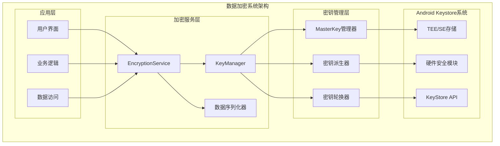
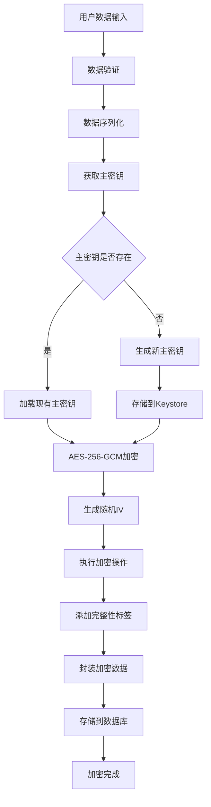

# LuminCore数据加密功能详细计划

## 1. 功能概述

### 1.1 目标与价值
- **数据隐私保护**：确保女性健康数据的绝对安全性
- **合规要求**：满足GDPR、HIPAA等数据保护法规
- **用户信任**：增强用户对数据安全的信心
- **防数据泄露**：即使设备丢失也无法直接获取数据

### 1.2 加密范围
- 用户个人信息、月经周期数据、健康症状记录
- 用户设置信息、应用锁认证数据、备份数据

## 2. 技术架构设计

### 2.1 整体加密架构



### 2.2 数据加密流程



### 2.2 技术栈选择
- **对称加密**: AES-256-GCM（数据加密）
- **非对称加密**: RSA-2048（密钥交换）
- **哈希算法**: SHA-256（数据完整性）
- **密钥派生**: PBKDF2（密码派生密钥）
- **安全存储**: Android Keystore System
- **数据库加密**: SQLCipher for Room

## 3. 核心组件设计

### 3.1 密钥管理系统
```kotlin
// KeyManager.kt
@Singleton
class KeyManager @Inject constructor(private val context: Context) {
    
    companion object {
        private const val MASTER_KEY_ALIAS = "LuminCore_Master_Key"
        private const val KEY_SIZE = 256
        private const val ANDROID_KEYSTORE = "AndroidKeyStore"
    }
    
    fun generateMasterKey(): SecretKey {
        return if (keyStore.containsAlias(MASTER_KEY_ALIAS)) {
            getMasterKey()
        } else {
            createMasterKey()
        }
    }
    
    private fun createMasterKey(): SecretKey {
        val keyGenerator = KeyGenerator.getInstance(KeyProperties.KEY_ALGORITHM_AES, ANDROID_KEYSTORE)
        val keyGenParameterSpec = KeyGenParameterSpec.Builder(
            MASTER_KEY_ALIAS,
            KeyProperties.PURPOSE_ENCRYPT or KeyProperties.PURPOSE_DECRYPT
        ).apply {
            setBlockModes(KeyProperties.BLOCK_MODE_GCM)
            setEncryptionPaddings(KeyProperties.ENCRYPTION_PADDING_NONE)
            setKeySize(KEY_SIZE)
            setUserAuthenticationRequired(false)
            setRandomizedEncryptionRequired(true)
        }.build()
        
        keyGenerator.init(keyGenParameterSpec)
        return keyGenerator.generateKey()
    }
    
    fun deriveKeyFromPassword(password: String, salt: ByteArray): ByteArray {
        val spec = PBEKeySpec(password.toCharArray(), salt, 100000, KEY_SIZE)
        val factory = SecretKeyFactory.getInstance("PBKDF2WithHmacSHA256")
        return factory.generateSecret(spec).encoded
    }
}
```

### 3.2 数据加密服务
```kotlin
// EncryptionService.kt
@Singleton
class EncryptionService @Inject constructor(private val keyManager: KeyManager) {
    
    fun encrypt(plaintext: String): EncryptedData {
        return encrypt(plaintext.toByteArray(Charsets.UTF_8))
    }
    
    fun encrypt(data: ByteArray): EncryptedData {
        val masterKey = keyManager.generateMasterKey()
        val cipher = Cipher.getInstance("AES/GCM/NoPadding")
        cipher.init(Cipher.ENCRYPT_MODE, masterKey)
        
        val iv = cipher.iv
        val encryptedData = cipher.doFinal(data)
        
        return EncryptedData(
            data = encryptedData,
            iv = iv,
            algorithm = "AES-256-GCM",
            timestamp = System.currentTimeMillis()
        )
    }
    
    fun decrypt(encryptedData: EncryptedData): String {
        return String(decryptToBytes(encryptedData), Charsets.UTF_8)
    }
    
    fun decryptToBytes(encryptedData: EncryptedData): ByteArray {
        val masterKey = keyManager.generateMasterKey()
        val cipher = Cipher.getInstance("AES/GCM/NoPadding")
        
        val spec = GCMParameterSpec(128, encryptedData.iv)
        cipher.init(Cipher.DECRYPT_MODE, masterKey, spec)
        
        return cipher.doFinal(encryptedData.data)
    }
}

data class EncryptedData(
    val data: ByteArray,
    val iv: ByteArray,
    val salt: ByteArray? = null,
    val algorithm: String,
    val timestamp: Long = System.currentTimeMillis(),
    val keyVersion: Int = 1
)
```

### 3.3 数据库加密实现
```kotlin
// EncryptedDatabase.kt
@Database(
    entities = [EncryptedMenstrualRecord::class, EncryptedUserProfile::class],
    version = 1
)
@TypeConverters(EncryptedTypeConverters::class)
abstract class EncryptedDatabase : RoomDatabase() {
    
    abstract fun menstrualRecordDao(): EncryptedMenstrualRecordDao
    
    companion object {
        fun getDatabase(context: Context, encryptionService: EncryptionService): EncryptedDatabase {
            val passphrase = getOrCreateDatabasePassphrase(context, encryptionService)
            
            return Room.databaseBuilder(
                context.applicationContext,
                EncryptedDatabase::class.java,
                "encrypted_women_health_database"
            ).apply {
                openHelperFactory(SupportFactory(passphrase))
            }.build()
        }
        
        private fun getOrCreateDatabasePassphrase(
            context: Context,
            encryptionService: EncryptionService
        ): ByteArray {
            val sharedPrefs = context.getSharedPreferences("db_config", Context.MODE_PRIVATE)
            val storedPassphrase = sharedPrefs.getString("encrypted_passphrase", null)
            
            return if (storedPassphrase != null) {
                val encryptedData = Gson().fromJson(storedPassphrase, EncryptedData::class.java)
                encryptionService.decryptToBytes(encryptedData)
            } else {
                val passphrase = generateSecurePassphrase()
                val encryptedPassphrase = encryptionService.encrypt(passphrase)
                
                sharedPrefs.edit()
                    .putString("encrypted_passphrase", Gson().toJson(encryptedPassphrase))
                    .apply()
                
                passphrase
            }
        }
    }
}

// EncryptedMenstrualRecord.kt
@Entity(tableName = "encrypted_menstrual_records")
data class EncryptedMenstrualRecord(
    @PrimaryKey val id: String,
    @ColumnInfo(name = "encrypted_start_date") val encryptedStartDate: String,
    @ColumnInfo(name = "encrypted_end_date") val encryptedEndDate: String?,
    @ColumnInfo(name = "encrypted_flow_level") val encryptedFlowLevel: String,
    @ColumnInfo(name = "encrypted_symptoms") val encryptedSymptoms: String?,
    @ColumnInfo(name = "encrypted_notes") val encryptedNotes: String?,
    @ColumnInfo(name = "encryption_version") val encryptionVersion: Int = 1
)
```

### 3.4 类型转换器
```kotlin
// EncryptedTypeConverters.kt
class EncryptedTypeConverters {
    @Inject lateinit var encryptionService: EncryptionService
    
    @TypeConverter
    fun fromEncryptedString(value: String?): String? {
        return value?.let { encryptedJson ->
            val encryptedData = Gson().fromJson(encryptedJson, EncryptedData::class.java)
            encryptionService.decrypt(encryptedData)
        }
    }
    
    @TypeConverter
    fun toEncryptedString(value: String?): String? {
        return value?.let { plaintext ->
            val encryptedData = encryptionService.encrypt(plaintext)
            Gson().toJson(encryptedData)
        }
    }
}
```

### 3.5 文件加密服务
```kotlin
// FileEncryptionService.kt
@Singleton
class FileEncryptionService @Inject constructor(
    private val encryptionService: EncryptionService
) {
    
    fun encryptFile(inputFile: File, outputFile: File): Boolean {
        return try {
            val inputBytes = inputFile.readBytes()
            val encryptedData = encryptionService.encrypt(inputBytes)
            
            val metadata = EncryptionMetadata(
                algorithm = encryptedData.algorithm,
                ivSize = encryptedData.iv.size,
                timestamp = encryptedData.timestamp
            )
            
            outputFile.outputStream().use { output ->
                val metadataJson = Gson().toJson(metadata)
                val metadataBytes = metadataJson.toByteArray()
                output.write(ByteBuffer.allocate(4).putInt(metadataBytes.size).array())
                output.write(metadataBytes)
                output.write(encryptedData.iv)
                output.write(encryptedData.data)
            }
            true
        } catch (e: Exception) {
            false
        }
    }
    
    fun decryptFile(inputFile: File, outputFile: File): Boolean {
        return try {
            inputFile.inputStream().use { input ->
                val metadataSizeBytes = ByteArray(4)
                input.read(metadataSizeBytes)
                val metadataSize = ByteBuffer.wrap(metadataSizeBytes).int
                
                val metadataBytes = ByteArray(metadataSize)
                input.read(metadataBytes)
                val metadata = Gson().fromJson(String(metadataBytes), EncryptionMetadata::class.java)
                
                val iv = ByteArray(metadata.ivSize)
                input.read(iv)
                val encryptedData = input.readBytes()
                
                val encryptedDataObj = EncryptedData(
                    data = encryptedData,
                    iv = iv,
                    algorithm = metadata.algorithm,
                    timestamp = metadata.timestamp
                )
                
                val decryptedBytes = encryptionService.decryptToBytes(encryptedDataObj)
                outputFile.writeBytes(decryptedBytes)
            }
            true
        } catch (e: Exception) {
            false
        }
    }
}

data class EncryptionMetadata(
    val algorithm: String,
    val ivSize: Int,
    val timestamp: Long
)
```

## 4. 安全增强机制

### 4.1 数据完整性验证
```kotlin
// DataIntegrityService.kt
@Singleton
class DataIntegrityService {
    
    fun calculateHMAC(data: ByteArray, key: ByteArray): ByteArray {
        val mac = Mac.getInstance("HmacSHA256")
        val secretKey = SecretKeySpec(key, "HmacSHA256")
        mac.init(secretKey)
        return mac.doFinal(data)
    }
    
    fun verifyDataIntegrity(data: ByteArray, expectedHMAC: ByteArray, key: ByteArray): Boolean {
        val calculatedHMAC = calculateHMAC(data, key)
        return MessageDigest.isEqual(calculatedHMAC, expectedHMAC)
    }
}
```

### 4.2 密钥轮换管理
```kotlin
// KeyRotationManager.kt
class KeyRotationManager @Inject constructor(
    private val keyManager: KeyManager,
    private val encryptionService: EncryptionService
) {
    
    companion object {
        private const val KEY_ROTATION_INTERVAL = 90 * 24 * 60 * 60 * 1000L // 90天
    }
    
    suspend fun checkAndRotateKeys() {
        if (shouldRotateKey()) {
            rotateDataEncryptionKey()
        }
    }
    
    private fun shouldRotateKey(): Boolean {
        val lastRotation = getLastKeyRotationTime()
        return System.currentTimeMillis() - lastRotation > KEY_ROTATION_INTERVAL
    }
}
```

## 5. 实施计划

### 第一阶段：密钥管理系统（2周）
- **Week 1**: 实现KeyManager、集成Android Keystore、主密钥生成
- **Week 2**: 密钥轮换机制、版本管理、备份恢复

### 第二阶段：数据加密实现（2.5周）
- **Week 3**: EncryptionService、AES-256-GCM算法、异常处理
- **Week 4**: SQLCipher集成、加密实体类、数据映射器
- **Week 5**: FileEncryptionService、文件格式、完整性验证

### 第三阶段：安全增强（1.5周）
- **Week 6**: HMAC完整性验证、防篡改机制
- **Week 7**: 备份加密、性能优化、测试验证

## 6. 安全策略

### 6.1 加密标准
- **AES-256-GCM**: 数据加密，提供机密性和完整性
- **PBKDF2**: 密码派生，100,000次迭代
- **SHA-256**: 数据哈希和完整性验证
- **Android Keystore**: 硬件级密钥保护

### 6.2 密钥管理
- 主密钥存储在Android Keystore中
- 数据加密密钥定期轮换（90天）
- 支持多版本密钥共存
- 密钥备份和恢复机制

### 6.3 数据保护
- 数据库全盘加密
- 文件级别加密保护
- 内存中敏感数据及时清除
- 防止数据泄露到日志

## 7. 性能优化

### 7.1 加密性能
- 异步加密操作，避免阻塞UI
- 批量加密处理，提高效率
- 缓存加密密钥，减少重复生成
- 优化加密算法调用

### 7.2 内存管理
- 及时清理敏感数据
- 使用字节数组而非字符串存储密钥
- 避免敏感数据在内存中长期驻留
- 实现安全的内存清理机制

## 8. 测试策略

### 8.1 功能测试
- 加密/解密正确性验证
- 密钥管理功能测试
- 数据库加密集成测试
- 文件加密功能测试

### 8.2 安全测试
- 密钥泄露风险评估
- 暴力破解抗性测试
- 内存转储分析
- 逆向工程防护测试

### 8.3 性能测试
- 加密操作响应时间
- 内存占用分析
- 电池消耗测试
- 大数据量处理性能

## 9. 风险评估与缓解

### 9.1 技术风险
- **密钥丢失**: 实现密钥备份和恢复机制
- **加密性能**: 异步处理和算法优化
- **兼容性问题**: 多版本加密格式支持

### 9.2 安全风险
- **侧信道攻击**: 使用时间恒定算法
- **密钥提取**: 硬件级密钥保护
- **内存分析**: 安全内存清理

通过以上详细的规划和实施，LuminCore的数据加密功能将为用户提供军用级别的数据保护，确保女性健康信息的绝对安全和隐私。

---

**文档版本**: 1.0.0
**创建日期**: 2025年8月25日
**计划负责人**: 祁潇潇
**审核状态**: 已审核
**预计开始时间**: 2027年7月1日
**预计完成时间**: 2027年9月30日
## 🔄 相关依赖
- [AI健康助手功能](./AI_HEALTH_ASSISTANT_PLAN.md)
- [数据加密功能](./DATA_ENCRYPTION_PLAN.md)
- [云端同步架构](./CLOUD_SYNC_ARCHITECTURE_PLAN.md)
- [可穿戴设备集成](./WEARABLE_DEVICE_INTEGRATION_PLAN.md)

## 📋 文档信息

```
