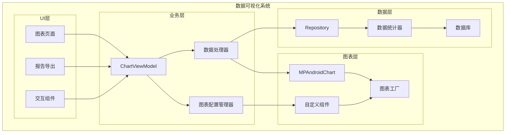
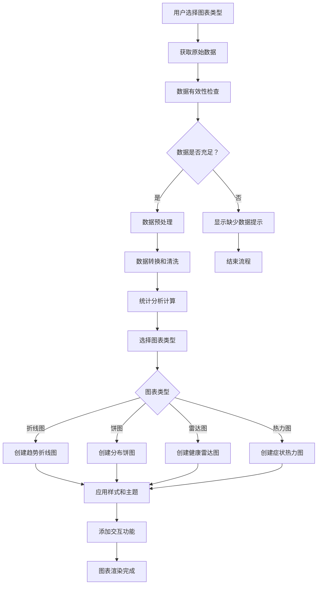

# LuminCore 数据可视化优化详细计划


## 📋 项目概述

### 系统目标
开发一套全面的数据可视化系统，将用户的月经周期、症状记录和健康数据转化为直观、美观、可交互的图表和报告。

### 核心价值
- **直观展示**：复杂数据简单化，一目了然
- **趋势分析**：长期健康趋势的可视化呈现
- **个性化洞察**：基于个人数据的定制化图表
- **决策支持**：为健康管理提供数据支撑

## 🎯 功能需求分析

### 1. 可视化组件类型

#### 1.1 周期趋势图表
```kotlin
enum class CycleChartType(
    val displayName: String,
    val chartType: ChartType
) {
    CYCLE_LENGTH_TREND("周期长度趋势", ChartType.LINE_CHART),
    PERIOD_DURATION_TREND("经期长度趋势", ChartType.LINE_CHART),
    CYCLE_REGULARITY("周期规律性", ChartType.BAR_CHART),
    PREDICTION_ACCURACY("预测准确性", ChartType.SCATTER_CHART)
}
```

#### 1.2 症状分析图表
```kotlin
enum class SymptomChartType(
    val displayName: String,
    val chartType: ChartType
) {
    SYMPTOM_FREQUENCY("症状频率统计", ChartType.PIE_CHART),
    SYMPTOM_INTENSITY_HEATMAP("症状强度热力图", ChartType.HEATMAP),
    SYMPTOM_CORRELATION("症状关联分析", ChartType.CORRELATION_MATRIX),
    MONTHLY_SYMPTOM_PATTERN("月度症状模式", ChartType.CALENDAR_CHART)
}
```

#### 1.3 健康报告图表
```kotlin
enum class HealthReportChartType(
    val displayName: String,
    val chartType: ChartType
) {
    HEALTH_SCORE_RADAR("健康评分雷达图", ChartType.RADAR_CHART),
    FLOW_DISTRIBUTION("流量分布饼图", ChartType.PIE_CHART),
    YEARLY_OVERVIEW("年度健康概览", ChartType.COMBINED_CHART),
    COMPARISON_CHART("对比分析图", ChartType.BAR_CHART)
}
```

## 🏗️ 技术架构设计

### 1. 系统架构



### 2. 图表生成流程



### 2. 核心组件实现

#### 2.1 图表工厂类
```kotlin
@Singleton
class ChartFactory @Inject constructor(
    private val context: Context,
    private val styleManager: ChartStyleManager,
    private val dataProcessor: ChartDataProcessor
) {
    
    fun createCycleTrendChart(
        data: List<MenstrualRecord>,
        config: ChartConfig
    ): LineChart {
        val chart = LineChart(context)
        
        // 处理数据
        val processedData = dataProcessor.processCycleTrendData(data)
        val dataSet = createCycleTrendDataSet(processedData)
        
        // 应用样式
        styleManager.applyCycleTrendStyle(chart, dataSet, config.styleConfig)
        
        // 设置数据
        chart.data = LineData(dataSet)
        chart.invalidate()
        
        return chart
    }
    
    private fun createCycleTrendDataSet(data: List<CycleDataPoint>): LineDataSet {
        val entries = data.mapIndexed { index, point ->
            Entry(index.toFloat(), point.cycleLength.toFloat())
        }
        
        return LineDataSet(entries, "周期长度").apply {
            mode = LineDataSet.Mode.CUBIC_BEZIER
            setDrawFilled(true)
            setDrawCircles(true)
            lineWidth = 2f
            circleRadius = 4f
            color = Color.parseColor("#E91E63")
            fillColor = Color.parseColor("#FCE4EC")
        }
    }
    
    fun createSymptomPieChart(
        data: List<MenstrualRecord>,
        config: ChartConfig
    ): PieChart {
        val chart = PieChart(context)
        
        // 处理症状频率数据
        val pieEntries = dataProcessor.processSymptomFrequencyData(data)
        val dataSet = PieDataSet(pieEntries, "症状分布").apply {
            colors = listOf(
                Color.parseColor("#E91E63"),
                Color.parseColor("#9C27B0"),
                Color.parseColor("#3F51B5"),
                Color.parseColor("#2196F3"),
                Color.parseColor("#00BCD4")
            )
            valueTextSize = 12f
            valueTextColor = Color.WHITE
        }
        
        chart.data = PieData(dataSet)
        chart.description.isEnabled = false
        chart.setUsePercentValues(true)
        
        return chart
    }
    
    fun createHealthRadarChart(
        healthMetrics: HealthMetrics,
        config: ChartConfig
    ): RadarChart {
        val chart = RadarChart(context)
        
        val entries = listOf(
            RadarEntry(healthMetrics.cycleRegularity),
            RadarEntry(healthMetrics.symptomSeverity),
            RadarEntry(healthMetrics.overallWellness),
            RadarEntry(healthMetrics.predictabilityScore),
            RadarEntry(healthMetrics.dataCompletion)
        )
        
        val dataSet = RadarDataSet(entries, "健康评分").apply {
            color = Color.parseColor("#E91E63")
            fillColor = Color.parseColor("#FCE4EC")
            setDrawFilled(true)
            fillAlpha = 180
            lineWidth = 2f
        }
        
        chart.data = RadarData(dataSet)
        styleManager.applyRadarChartStyle(chart, config.styleConfig)
        
        return chart
    }
}
```

#### 2.2 数据处理器
```kotlin
@Singleton
class ChartDataProcessor @Inject constructor(
    private val repository: MenstrualRepository,
    private val statisticsCalculator: StatisticsCalculator
) {
    
    suspend fun processCycleTrendData(records: List<MenstrualRecord>): List<CycleDataPoint> {
        return records.windowed(2) { (current, previous) ->
            val cycleLength = ChronoUnit.DAYS.between(
                previous.startDate.toInstant(),
                current.startDate.toInstant()
            ).toInt()
            
            CycleDataPoint(
                date = current.startDate,
                cycleLength = cycleLength,
                periodLength = calculatePeriodLength(current),
                isRegular = isRegularCycle(cycleLength)
            )
        }.reversed()
    }
    
    suspend fun processSymptomFrequencyData(records: List<MenstrualRecord>): List<PieEntry> {
        val symptomCounts = mutableMapOf<String, Int>()
        
        records.forEach { record ->
            record.symptoms?.split(",")?.forEach { symptom ->
                val trimmedSymptom = symptom.trim()
                symptomCounts[trimmedSymptom] = symptomCounts.getOrDefault(trimmedSymptom, 0) + 1
            }
        }
        
        return symptomCounts.map { (symptom, count) ->
            PieEntry(count.toFloat(), symptom)
        }.sortedByDescending { it.value }
    }
    
    suspend fun processHealthMetrics(records: List<MenstrualRecord>): HealthMetrics {
        return HealthMetrics(
            cycleRegularity = statisticsCalculator.calculateCycleRegularity(records),
            symptomSeverity = 5f - statisticsCalculator.calculateSymptomSeverity(records),
            overallWellness = statisticsCalculator.calculateOverallWellness(records),
            predictabilityScore = statisticsCalculator.calculatePredictabilityScore(records),
            dataCompletion = statisticsCalculator.calculateDataCompletion(records)
        )
    }
}
```

## 📊 数据模型设计

### 1. 图表数据模型
```kotlin
data class ChartConfig(
    val chartType: ChartType,
    val styleConfig: ChartStyleConfig,
    val animationEnabled: Boolean = true,
    val interactionEnabled: Boolean = true
)

data class ChartStyleConfig(
    val primaryColor: Int = Color.parseColor("#E91E63"),
    val secondaryColor: Int = Color.parseColor("#FCE4EC"),
    val backgroundColor: Int = Color.WHITE,
    val textColor: Int = Color.parseColor("#212121"),
    val gridColor: Int = Color.parseColor("#E0E0E0"),
    val titleTextSize: Float = 16f,
    val labelTextSize: Float = 12f,
    val animationDuration: Int = 1000
)

data class CycleDataPoint(
    val date: Date,
    val cycleLength: Int,
    val periodLength: Int?,
    val isRegular: Boolean
)

data class HealthMetrics(
    val cycleRegularity: Float, // 0-5
    val symptomSeverity: Float, // 0-5
    val overallWellness: Float, // 0-5
    val predictabilityScore: Float, // 0-5
    val dataCompletion: Float // 0-5
)
```

### 2. ViewModel实现
```kotlin
@HiltViewModel
class VisualizationViewModel @Inject constructor(
    private val repository: MenstrualRepository,
    private val chartDataProcessor: ChartDataProcessor,
    private val chartFactory: ChartFactory
) : ViewModel() {
    
    private val _cycleTrendData = MutableLiveData<List<CycleDataPoint>>()
    val cycleTrendData: LiveData<List<CycleDataPoint>> = _cycleTrendData
    
    private val _symptomData = MutableLiveData<List<PieEntry>>()
    val symptomData: LiveData<List<PieEntry>> = _symptomData
    
    private val _healthMetrics = MutableLiveData<HealthMetrics>()
    val healthMetrics: LiveData<HealthMetrics> = _healthMetrics
    
    private val _isLoading = MutableLiveData<Boolean>()
    val isLoading: LiveData<Boolean> = _isLoading
    
    fun loadChartData() {
        viewModelScope.launch {
            _isLoading.value = true
            try {
                val records = repository.getAllRecords().first()
                
                // 处理周期趋势数据
                val cycleTrend = chartDataProcessor.processCycleTrendData(records)
                _cycleTrendData.value = cycleTrend
                
                // 处理症状数据
                val symptoms = chartDataProcessor.processSymptomFrequencyData(records)
                _symptomData.value = symptoms
                
                // 处理健康指标
                val metrics = chartDataProcessor.processHealthMetrics(records)
                _healthMetrics.value = metrics
                
            } catch (e: Exception) {
                Log.e("VisualizationVM", "Failed to load chart data", e)
            } finally {
                _isLoading.value = false
            }
        }
    }
    
    fun refreshData() {
        loadChartData()
    }
    
    fun exportChart(chartType: ChartType): String? {
        return try {
            // 实现图表导出逻辑
            when (chartType) {
                ChartType.CYCLE_TREND -> exportCycleTrendChart()
                ChartType.SYMPTOM_PIE -> exportSymptomChart()
                ChartType.HEALTH_RADAR -> exportHealthChart()
                else -> null
            }
        } catch (e: Exception) {
            Log.e("VisualizationVM", "Failed to export chart", e)
            null
        }
    }
}
```

## 📱 用户界面设计

### 1. 图表展示Fragment
```kotlin
class VisualizationFragment : Fragment() {
    
    private var _binding: FragmentVisualizationBinding? = null
    private val binding get() = _binding!!
    
    private val viewModel: VisualizationViewModel by viewModels()
    
    override fun onCreateView(
        inflater: LayoutInflater,
        container: ViewGroup?,
        savedInstanceState: Bundle?
    ): View {
        _binding = FragmentVisualizationBinding.inflate(inflater, container, false)
        return binding.root
    }
    
    override fun onViewCreated(view: View, savedInstanceState: Bundle?) {
        super.onViewCreated(view, savedInstanceState)
        
        setupTabs()
        setupObservers()
        setupClickListeners()
        
        viewModel.loadChartData()
    }
    
    private fun setupTabs() {
        val adapter = ChartPagerAdapter(this)
        binding.viewPager.adapter = adapter
        
        TabLayoutMediator(binding.tabLayout, binding.viewPager) { tab, position ->
            tab.text = when (position) {
                0 -> "周期趋势"
                1 -> "症状分析"
                2 -> "健康报告"
                else -> ""
            }
        }.attach()
    }
    
    private fun setupObservers() {
        viewModel.cycleTrendData.observe(viewLifecycleOwner) { data ->
            displayCycleTrendChart(data)
        }
        
        viewModel.symptomData.observe(viewLifecycleOwner) { data ->
            displaySymptomChart(data)
        }
        
        viewModel.healthMetrics.observe(viewLifecycleOwner) { metrics ->
            displayHealthChart(metrics)
        }
        
        viewModel.isLoading.observe(viewLifecycleOwner) { isLoading ->
            binding.progressBar.visibility = if (isLoading) View.VISIBLE else View.GONE
        }
    }
    
    private fun displayCycleTrendChart(data: List<CycleDataPoint>) {
        val chartFactory = ChartFactory(requireContext())
        val config = ChartConfig(
            chartType = ChartType.LINE_CHART,
            styleConfig = ChartStyleConfig()
        )
        
        val chart = chartFactory.createCycleTrendChart(data, config)
        binding.chartContainer.removeAllViews()
        binding.chartContainer.addView(chart)
    }
}
```

## 📈 实施计划

### 第一阶段：基础架构（2周）
- [ ] 集成MPAndroidChart库到项目
- [ ] 设计图表数据模型和处理器
- [ ] 实现基础的图表工厂类
- [ ] 创建样式管理器

### 第二阶段：核心图表（3周）
- [ ] 实现周期长度趋势图
- [ ] 开发症状频率饼图
- [ ] 创建健康评分雷达图
- [ ] 添加流量分布图表

### 第三阶段：高级功能（2周）
- [ ] 实现症状强度热力图
- [ ] 开发数据对比功能
- [ ] 添加图表交互能力
- [ ] 实现图表导出功能

### 第四阶段：优化测试（1周）
- [ ] 性能优化和内存管理
- [ ] 用户体验测试
- [ ] 单元测试覆盖
- [ ] 文档完善

## 🎯 成功指标

### 技术指标
- 图表渲染时间 < 500ms
- 内存使用增加 < 10MB
- 滑动流畅度 60fps
- 崩溃率 < 0.1%

### 用户体验指标
- 图表使用率 > 70%
- 用户满意度 > 4.6/5
- 导出功能使用率 > 30%
- 页面停留时间增加 40%

## 📚 技术依赖

### 新增依赖
```kotlin
// MPAndroidChart图表库
implementation 'com.github.PhilJay:MPAndroidChart:v3.1.0'

// 图片处理（用于图表导出）
implementation 'androidx.core:core-ktx:1.12.0'

// PDF生成（用于报告导出）
implementation 'com.itextpdf:itextpdf:5.5.13.3'
```

### 权限要求
```xml
<!-- 保存导出的图表文件 -->
<uses-permission android:name="android.permission.WRITE_EXTERNAL_STORAGE" />
<uses-permission android:name="android.permission.READ_EXTERNAL_STORAGE" />
```

## 🔄 后续优化方向

1. **动态图表**：支持实时数据更新的动态图表
2. **3D可视化**：为复杂数据提供3D展示
3. **AR展示**：使用增强现实技术展示健康数据
4. **自定义主题**：用户可自定义图表颜色和样式
5. **机器学习可视化**：将AI分析结果可视化

---

**文档版本**: 1.0.0
**创建日期**: 2025年8月25日
**计划负责人**: 祁潇潇
**审核状态**: 已审核
**预计开始时间**: 2028年10月1日
**预计完成时间**: 2028年12月31日
## 🔄 相关依赖
- [AI健康助手功能](./AI_HEALTH_ASSISTANT_PLAN.md)
- [数据加密功能](./DATA_ENCRYPTION_PLAN.md)
- [云端同步架构](./CLOUD_SYNC_ARCHITECTURE_PLAN.md)
- [可穿戴设备集成](./WEARABLE_DEVICE_INTEGRATION_PLAN.md)