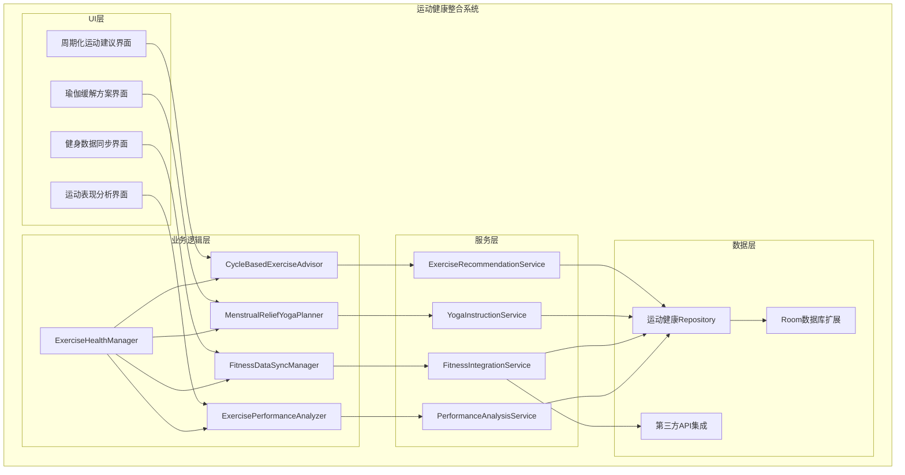
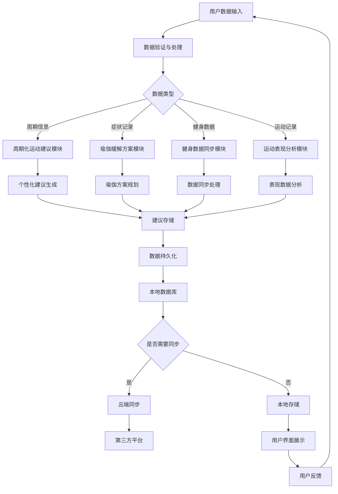

# LuminCore运动健康整合详细计划


## 📋 项目概述

### 功能目标
开发一套完整的运动健康整合系统，为用户提供基于月经周期的个性化运动建议、经期痛经缓解瑜伽方案、主流健身APP数据同步和运动表现分析功能，帮助用户更好地结合生理周期进行科学运动。

### 核心价值
- **周期化运动**：基于月经周期阶段提供个性化运动强度建议
- **痛经缓解**：提供专门针对经期痛经的瑜伽动作方案
- **数据整合**：与主流健身APP无缝数据同步
- **表现分析**：分析月经周期对运动能力的影响

## 🎯 功能需求分析

### 1. 周期化运动建议系统

#### 1.1 月经周期阶段划分
```kotlin
enum class MenstrualCyclePhase(
    val displayName: String,
    val typicalDays: IntRange
) {
    MENSTRUATION("月经期", 1..5),
    FOLLICULAR("卵泡期", 6..14),
    OVULATION("排卵期", 15..16),
    LUTEAL("黄体期", 17..28)
}

data class CycleBasedExerciseRecommendation(
    val phase: MenstrualCyclePhase,
    val recommendedIntensity: ExerciseIntensity,
    val recommendedActivities: List<ExerciseType>,
    val注意事项: List<String>,
    val benefits: String
)

enum class ExerciseIntensity {
    LOW, // 低强度
    MODERATE, // 中等强度
    HIGH // 高强度
}

enum class ExerciseType {
    YOGA, // 瑜伽
    WALKING, // 步行
    SWIMMING, // 游泳
    CYCLING, // 骑行
    STRENGTH_TRAINING, // 力量训练
    HIIT, // 高强度间歇训练
    PILATES, // 普拉提
    DANCING, // 舞蹈
    STRETCHING // 拉伸
}
```

#### 1.2 个性化运动建议引擎
```kotlin
class CycleBasedExerciseAdvisor {
    
    fun generateExerciseRecommendations(
        userProfiles: UserProfile,
        currentCycleDay: Int,
        symptoms: List<SymptomRecord>
    ): List<CycleBasedExerciseRecommendation> {
        val currentPhase = determineCyclePhase(currentCycleDay)
        val recommendations = mutableListOf<CycleBasedExerciseRecommendation>()
        
        // 基于周期阶段的推荐
        recommendations.add(generatePhaseBasedRecommendation(currentPhase))
        
        // 基于症状的调整
        if (symptoms.any { it.type == SymptomType.CRAMP && it.severity >= SymptomSeverity.MODERATE }) {
            recommendations.add(generateCrampAdjustedRecommendation())
        }
        
        // 基于用户偏好的调整
        recommendations.addAll(generatePreferenceBasedRecommendations(userProfiles))
        
        return recommendations
    }
    
    private fun determineCyclePhase(day: Int): MenstrualCyclePhase {
        return when (day) {
            in MenstrualCyclePhase.MENSTRUATION.typicalDays -> MenstrualCyclePhase.MENSTRUATION
            in MenstrualCyclePhase.FOLLICULAR.typicalDays -> MenstrualCyclePhase.FOLLICULAR
            in MenstrualCyclePhase.OVULATION.typicalDays -> MenstrualCyclePhase.OVULATION
            in MenstrualCyclePhase.LUTEAL.typicalDays -> MenstrualCyclePhase.LUTEAL
            else -> MenstrualCyclePhase.MENSTRUATION // 默认
        }
    }
}
```

### 2. 瑜伽缓解方案系统

#### 2.1 经期瑜伽动作库
```kotlin
data class YogaPoseForMenstrualRelief(
    val id: String,
    val name: String, // 动作名称
    val englishName: String, // 英文名称
    val description: String, // 动作描述
    val benefits: String, // 功效
    val steps: List<String>, // 动作步骤
    val duration: Int, // 建议持续时间（秒）
    val difficulty: YogaDifficulty, // 难度等级
    val targetSymptoms: List<SymptomType>, // 针对症状
    val contraindications: List<String>, // 禁忌症
    val imageUrl: String? // 动作图片URL
)

enum class YogaDifficulty {
    BEGINNER, // 初学者
    INTERMEDIATE, // 中级
    ADVANCED // 高级
}

data class YogaRoutine(
    val id: String,
    val name: String,
    val description: String,
    val poses: List<YogaPoseForMenstrualRelief>,
    val estimatedDuration: Int, // 预估时长（分钟）
    val targetSymptoms: List<SymptomType>,
    val recommendedPhase: MenstrualCyclePhase?
)
```

#### 2.2 痛经缓解方案生成器
```kotlin
class MenstrualReliefYogaPlanner {
    
    fun generateReliefRoutine(
        symptomSeverity: Map<SymptomType, SymptomSeverity>,
        userLevel: YogaDifficulty
    ): YogaRoutine {
        val targetSymptoms = symptomSeverity.filter { 
            it.value >= SymptomSeverity.MODERATE 
        }.keys.toList()
        
        val suitablePoses = findSuitablePoses(targetSymptoms, userLevel)
        
        return YogaRoutine(
            id = UUID.randomUUID().toString(),
            name = "经期痛经缓解瑜伽",
            description = "针对您当前症状的个性化瑜伽缓解方案",
            poses = suitablePoses,
            estimatedDuration = calculateDuration(suitablePoses),
            targetSymptoms = targetSymptoms,
            recommendedPhase = null
        )
    }
    
    private fun findSuitablePoses(
        symptoms: List<SymptomType>,
        level: YogaDifficulty
    ): List<YogaPoseForMenstrualRelief> {
        // 根据症状和用户水平筛选合适的瑜伽动作
        return yogaPoseRepository.findBySymptomsAndDifficulty(symptoms, level)
    }
}
```

### 3. 健身数据同步系统

#### 3.1 第三方健身APP集成
```kotlin
data class FitnessAppIntegration(
    val appId: String,
    val appName: String,
    val supportedDataTypes: Set<FitnessDataType>,
    val authType: AuthType,
    val syncFrequency: SyncFrequency
)

enum class FitnessDataType {
    STEPS, // 步数
    HEART_RATE, // 心率
    CALORIES_BURNED, // 消耗卡路里
    ACTIVE_MINUTES, // 活跃分钟数
    SLEEP_DATA, // 睡眠数据
    WORKOUTS // 训练记录
}

enum class AuthType {
    OAUTH2, // OAuth 2.0
    API_KEY, // API密钥
    MANUAL_ENTRY // 手动输入
}

enum class SyncFrequency {
    REALTIME, // 实时同步
    HOURLY, // 每小时同步
    DAILY // 每日同步
}

data class FitnessDataRecord(
    val id: String,
    val userId: String,
    val sourceApp: String,
    val dataType: FitnessDataType,
    val value: Any,
    val unit: String,
    val timestamp: Date,
    val duration: Int? = null // 持续时间（秒）
)
```

#### 3.2 数据同步管理器
```kotlin
class FitnessDataSyncManager @Inject constructor(
    private val fitnessAppRepository: FitnessAppRepository,
    private val fitnessDataRepository: FitnessDataRepository,
    private val menstrualRepository: MenstrualRepository
) {
    
    suspend fun syncAllConnectedApps(userId: String): SyncResult {
        val connectedApps = fitnessAppRepository.getConnectedApps(userId)
        val syncResults = mutableListOf<SyncResult>()
        
        for (app in connectedApps) {
            try {
                val result = syncAppData(userId, app)
                syncResults.add(result)
            } catch (e: Exception) {
                syncResults.add(SyncResult.Error(app.appName, e.message ?: "同步失败"))
            }
        }
        
        return aggregateSyncResults(syncResults)
    }
    
    private suspend fun syncAppData(userId: String, app: FitnessAppIntegration): SyncResult {
        return try {
            // 1. 获取授权
            val authToken = authenticateWithApp(app)
            
            // 2. 获取数据
            val fitnessData = fetchFitnessData(app, authToken)
            
            // 3. 转换和存储数据
            val convertedData = convertToStandardFormat(fitnessData, app)
            fitnessDataRepository.saveAll(convertedData)
            
            // 4. 关联月经周期数据
            associateWithMenstrualCycle(userId, convertedData)
            
            SyncResult.Success(app.appName, convertedData.size)
        } catch (e: Exception) {
            SyncResult.Error(app.appName, e.message ?: "同步失败")
        }
    }
}
```

### 4. 运动表现分析系统

#### 4.1 周期与表现关联分析
```kotlin
data class ExercisePerformanceAnalysis(
    val userId: String,
    val cyclePhase: MenstrualCyclePhase,
    val performanceMetrics: Map<PerformanceMetric, PerformanceData>,
    val insights: List<PerformanceInsight>,
    val recommendations: List<PerformanceRecommendation>,
    val analysisPeriod: DateRange
)

enum class PerformanceMetric {
    ENDURANCE, // 耐力
    STRENGTH, // 力量
    FLEXIBILITY, // 柔韧性
    BALANCE, // 平衡性
    REACTION_TIME, // 反应时间
    POWER // 爆发力
}

data class PerformanceData(
    val metric: PerformanceMetric,
    val averageValue: Double,
    val trend: PerformanceTrend,
    val cyclePhaseComparison: Map<MenstrualCyclePhase, Double>
)

enum class PerformanceTrend {
    IMPROVING, // 提升
    DECLINING, // 下降
    STABLE // 稳定
}

data class PerformanceInsight(
    val insightType: InsightType,
    val title: String,
    val description: String,
    val confidence: Float, // 置信度 0.0-1.0
    val supportingData: List<Any>
)

enum class InsightType {
    CYCLE_IMPACT, // 周期影响
    PERFORMANCE_PATTERN, // 表现模式
    IMPROVEMENT_OPPORTUNITY // 提升机会
}
```

#### 4.2 智能分析引擎
```kotlin
class ExercisePerformanceAnalyzer @Inject constructor(
    private val fitnessDataRepository: FitnessDataRepository,
    private val menstrualRepository: MenstrualRepository
) {
    
    suspend fun analyzeCyclePerformanceImpact(userId: String): ExercisePerformanceAnalysis {
        // 1. 获取用户健身数据
        val fitnessData = fitnessDataRepository.getUserFitnessData(userId, getLastThreeMonths())
        
        // 2. 获取用户月经周期数据
        val menstrualRecords = menstrualRepository.getUserRecords(userId, getLastThreeMonths())
        
        // 3. 关联数据并分析
        val cyclePerformanceMap = correlateFitnessWithCycle(fitnessData, menstrualRecords)
        
        // 4. 生成洞察
        val insights = generatePerformanceInsights(cyclePerformanceMap)
        
        // 5. 生成建议
        val recommendations = generatePerformanceRecommendations(cyclePerformanceMap)
        
        return ExercisePerformanceAnalysis(
            userId = userId,
            cyclePhase = getCurrentCyclePhase(menstrualRecords),
            performanceMetrics = calculatePerformanceMetrics(cyclePerformanceMap),
            insights = insights,
            recommendations = recommendations,
            analysisPeriod = getLastThreeMonths()
        )
    }
    
    private fun correlateFitnessWithCycle(
        fitnessData: List<FitnessDataRecord>,
        menstrualRecords: List<MenstrualRecord>
    ): Map<MenstrualCyclePhase, List<FitnessDataRecord>> {
        // 实现健身数据与月经周期的关联分析
        val result = mutableMapOf<MenstrualCyclePhase, List<FitnessDataRecord>>()
        
        for (phase in MenstrualCyclePhase.values()) {
            val phaseData = fitnessData.filter { record ->
                val cycleDay = getCycleDay(record.timestamp, menstrualRecords)
                cycleDay in phase.typicalDays
            }
            result[phase] = phaseData
        }
        
        return result
    }
}
```

## 🏗️ 技术架构设计

### 1. 核心组件架构



### 2. 数据流设计



## 🗃️ 数据模型设计

### 1. 周期化运动建议实体
```kotlin
@Entity(tableName = "cycle_exercise_recommendations")
data class CycleExerciseRecommendationEntity(
    @PrimaryKey(autoGenerate = true)
    val id: Long = 0,
    
    @ColumnInfo(name = "user_id")
    val userId: String,
    
    @ColumnInfo(name = "cycle_phase")
    val cyclePhase: String,
    
    @ColumnInfo(name = "exercise_type")
    val exerciseType: String,
    
    @ColumnInfo(name = "intensity")
    val intensity: String,
    
    @ColumnInfo(name = "recommendation_text")
    val recommendationText: String,
    
    @ColumnInfo(name = "benefits")
    val benefits: String,
    
    @ColumnInfo(name = "注意事项")
    val注意事项: String?,
    
    @ColumnInfo(name = "generated_date")
    val generatedDate: Date,
    
    @ColumnInfo(name = "is_active")
    val isActive: Boolean = true,
    
    @ColumnInfo(name = "created_at")
    val createdAt: Date = Date(),
    
    @ColumnInfo(name = "updated_at")
    val updatedAt: Date = Date()
)
```

### 2. 瑜伽缓解方案实体
```kotlin
@Entity(tableName = "yoga_relief_poses")
data class YogaReliefPoseEntity(
    @PrimaryKey
    val id: String,
    
    @ColumnInfo(name = "name")
    val name: String,
    
    @ColumnInfo(name = "english_name")
    val englishName: String,
    
    @ColumnInfo(name = "description")
    val description: String,
    
    @ColumnInfo(name = "benefits")
    val benefits: String,
    
    @ColumnInfo(name = "steps")
    val steps: String, // JSON格式存储步骤
    
    @ColumnInfo(name = "duration")
    val duration: Int,
    
    @ColumnInfo(name = "difficulty")
    val difficulty: String,
    
    @ColumnInfo(name = "target_symptoms")
    val targetSymptoms: String, // JSON格式存储症状列表
    
    @ColumnInfo(name = "contraindications")
    val contraindications: String?, // JSON格式存储禁忌症
    
    @ColumnInfo(name = "image_url")
    val imageUrl: String?,
    
    @ColumnInfo(name = "created_at")
    val createdAt: Date = Date()
)

@Entity(tableName = "yoga_routines")
data class YogaRoutineEntity(
    @PrimaryKey
    val id: String,
    
    @ColumnInfo(name = "user_id")
    val userId: String,
    
    @ColumnInfo(name = "name")
    val name: String,
    
    @ColumnInfo(name = "description")
    val description: String,
    
    @ColumnInfo(name = "poses")
    val poses: String, // JSON格式存储动作ID列表
    
    @ColumnInfo(name = "estimated_duration")
    val estimatedDuration: Int,
    
    @ColumnInfo(name = "target_symptoms")
    val targetSymptoms: String, // JSON格式存储症状列表
    
    @ColumnInfo(name = "recommended_phase")
    val recommendedPhase: String?,
    
    @ColumnInfo(name = "created_at")
    val createdAt: Date = Date(),
    
    @ColumnInfo(name = "updated_at")
    val updatedAt: Date = Date()
)
```

### 3. 健身数据同步实体
```kotlin
@Entity(tableName = "fitness_app_integrations")
data class FitnessAppIntegrationEntity(
    @PrimaryKey
    val appId: String,
    
    @ColumnInfo(name = "user_id")
    val userId: String,
    
    @ColumnInfo(name = "app_name")
    val appName: String,
    
    @ColumnInfo(name = "supported_data_types")
    val supportedDataTypes: String, // JSON格式存储数据类型
    
    @ColumnInfo(name = "auth_type")
    val authType: String,
    
    @ColumnInfo(name = "sync_frequency")
    val syncFrequency: String,
    
    @ColumnInfo(name = "auth_token")
    val authToken: String?,
    
    @ColumnInfo(name = "is_connected")
    val isConnected: Boolean = true,
    
    @ColumnInfo(name = "last_sync_time")
    val lastSyncTime: Date?,
    
    @ColumnInfo(name = "created_at")
    val createdAt: Date = Date(),
    
    @ColumnInfo(name = "updated_at")
    val updatedAt: Date = Date()
)

@Entity(tableName = "fitness_data_records")
data class FitnessDataRecordEntity(
    @PrimaryKey
    val id: String,
    
    @ColumnInfo(name = "user_id")
    val userId: String,
    
    @ColumnInfo(name = "source_app")
    val sourceApp: String,
    
    @ColumnInfo(name = "data_type")
    val dataType: String,
    
    @ColumnInfo(name = "value")
    val value: String, // 存储为字符串以支持不同数据类型
    
    @ColumnInfo(name = "unit")
    val unit: String,
    
    @ColumnInfo(name = "timestamp")
    val timestamp: Date,
    
    @ColumnInfo(name = "duration")
    val duration: Int?,
    
    @ColumnInfo(name = "created_at")
    val createdAt: Date = Date()
)
```

### 4. 运动表现分析实体
```kotlin
@Entity(tableName = "performance_analyses")
data class PerformanceAnalysisEntity(
    @PrimaryKey
    val id: String,
    
    @ColumnInfo(name = "user_id")
    val userId: String,
    
    @ColumnInfo(name = "cycle_phase")
    val cyclePhase: String,
    
    @ColumnInfo(name = "performance_metrics")
    val performanceMetrics: String, // JSON格式存储指标数据
    
    @ColumnInfo(name = "insights")
    val insights: String, // JSON格式存储洞察
    
    @ColumnInfo(name = "recommendations")
    val recommendations: String, // JSON格式存储建议
    
    @ColumnInfo(name = "analysis_period_start")
    val analysisPeriodStart: Date,
    
    @ColumnInfo(name = "analysis_period_end")
    val analysisPeriodEnd: Date,
    
    @ColumnInfo(name = "generated_date")
    val generatedDate: Date,
    
    @ColumnInfo(name = "created_at")
    val createdAt: Date = Date()
)

@Entity(tableName = "performance_insights")
data class PerformanceInsightEntity(
    @PrimaryKey(autoGenerate = true)
    val id: Long = 0,
    
    @ColumnInfo(name = "analysis_id")
    val analysisId: String,
    
    @ColumnInfo(name = "insight_type")
    val insightType: String,
    
    @ColumnInfo(name = "title")
    val title: String,
    
    @ColumnInfo(name = "description")
    val description: String,
    
    @ColumnInfo(name = "confidence")
    val confidence: Float,
    
    @ColumnInfo(name = "supporting_data")
    val supportingData: String?, // JSON格式存储支持数据
    
    @ColumnInfo(name = "created_at")
    val createdAt: Date = Date()
)
```

## 📊 实施计划

### 第一阶段：基础功能开发（2032年Q1）

#### 第1-4周（2032年1月-1月）
- [ ] 设计数据模型和数据库表结构
- [ ] 实现周期化运动建议核心功能
- [ ] 开发运动建议界面
- [ ] 实现基础瑜伽动作库

#### 第5-8周（2032年2月-2月）
- [ ] 实现瑜伽缓解方案系统
- [ ] 开发瑜伽指导界面
- [ ] 构建瑜伽动作数据库
- [ ] 实现个性化瑜伽方案生成

#### 第9-12周（2032年3月-3月）
- [ ] 实现健身数据同步核心功能
- [ ] 开发健身APP集成界面
- [ ] 构建第三方API集成服务
- [ ] 实现数据同步调度器

### 第二阶段：运动表现分析与集成（2032年Q2）

#### 第13-16周（2032年4月-4月）
- [ ] 实现运动表现分析核心功能
- [ ] 开发数据分析界面
- [ ] 构建数据分析引擎
- [ ] 实现周期与表现关联分析

#### 第17-20周（2032年5月-5月）
- [ ] 集成所有模块功能
- [ ] 开发统一管理界面
- [ ] 构建数据关联机制
- [ ] 实现智能推荐系统

#### 第21-24周（2032年6月-6月）
- [ ] 系统集成测试
- [ ] 用户体验优化
- [ ] 性能调优
- [ ] Bug修复和完善

### 第三阶段：优化与完善（2032年Q3）

#### 第25-28周（2032年7月-7月）
- [ ] 高级功能开发
- [ ] 界面美化和动画效果
- [ ] 多语言支持
- [ ] 无障碍功能优化

#### 第29-32周（2032年8月-8月）
- [ ] 集成测试和Bug修复
- [ ] 用户反馈收集和改进
- [ ] 文档完善和用户指南
- [ ] 准备发布版本

#### 第33-36周（2032年9月-9月）
- [ ] Beta测试和优化
- [ ] 安全性审查
- [ ] 最终版本发布准备
- [ ] 上线和推广

## 🎯 成功指标

### 技术指标
- 系统响应时间 < 2秒
- 数据同步延迟 < 5秒
- 应用崩溃率 < 0.1%
- 运动建议准确率 > 85%

### 用户体验指标
- 功能使用率 > 70%
- 用户满意度 > 4.5/5
- 留存率（30天）> 65%
- 瑜伽方案完成率 > 50%

### 业务指标
- 新用户增长 > 25%
- 付费转化率 > 8%
- 用户平均使用时长 > 15分钟/天
- 健身数据同步率 > 60%

## 🛡️ 风险评估与缓解策略

### 技术风险
**风险1**: 第三方健身APP API变更
- **缓解策略**: 建立抽象层隔离第三方API依赖
- **应急计划**: 提供手动数据导入功能

**风险2**: 数据同步性能问题
- **缓解策略**: 实施增量同步和缓存机制
- **应急计划**: 提供同步频率调节选项

### 用户体验风险
**风险3**: 运动建议个性化不足
- **缓解策略**: 持续优化推荐算法，增加用户反馈机制
- **应急计划**: 提供手动调整建议功能

### 数据风险
**风险4**: 用户健身隐私数据泄露
- **缓解策略**: 实施严格的数据加密和访问控制
- **应急计划**: 建立紧急响应机制，及时通知用户

## 💰 资源需求与预算

### 人力资源
- **Android开发工程师**: 1.5人（全职6个月）
- **算法工程师**: 0.5人（运动数据分析算法）
- **UI/UX设计师**: 0.3人（界面设计）
- **测试工程师**: 0.3人（功能测试）

### 技术资源
- **开发工具**: Android Studio, Git, CI/CD
- **第三方库**: MPAndroidChart, WorkManager, Retrofit
- **测试工具**: 自动化测试框架

### 预算估算
- **人力成本**: 主要成本，约6个月开发周期
- **工具和库**: 主要使用开源方案，成本较低
- **测试和部署**: 标准开发流程，无额外成本

## 📈 长期发展规划

### 短期目标（1年内）
- 完善基础功能，提升用户体验
- 增加更多健身APP集成支持
- 优化算法准确性和性能

### 中期目标（1-3年）
- 集成更多运动健康设备数据
- 增加AI运动教练功能
- 扩展到更多语言和地区

### 长期目标（3-5年）
- 构建完整的运动健康生态系统
- 与健身机构合作提供专业服务
- 发展虚拟健身教练平台

---

**文档版本**: 1.0.0
**创建日期**: 2026年5月20日
**计划负责人**: 祁潇潇
**审核状态**: 已审核
**预计开始时间**: 2032年1月1日
**预计完成时间**: 2032年9月30日
## 🔄 相关依赖
- [可穿戴设备集成](./WEARABLE_DEVICE_INTEGRATION_PLAN.md)
- [智能提醒系统](./SMART_REMINDER_SYSTEM_PLAN.md)
- [云端同步架构](./CLOUD_SYNC_ARCHITECTURE_PLAN.md)
- [数据加密功能](./DATA_ENCRYPTION_PLAN.md)