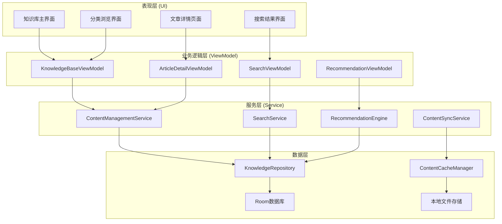
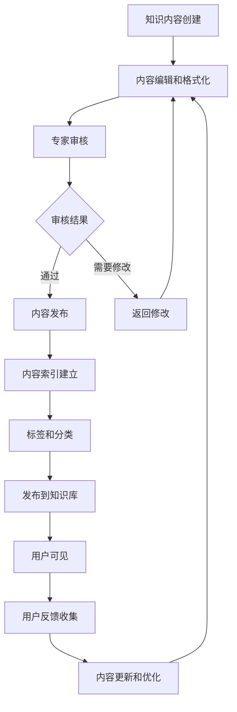

# LuminCore 健康知识库功能详细开发计划


## 📋 项目概述

健康知识库功能是LuminCore女性健康助手的专业知识服务模块，旨在为用户提供权威、准确、个性化的女性健康知识内容，涵盖月经健康、生育知识、营养指导、心理健康等多个维度。

### 项目背景
- **用户痛点**：缺乏可靠的女性健康知识来源，网络信息质量参差不齐
- **市场需求**：用户需要专业、个性化的健康知识指导
- **技术基础**：基于现有用户数据和AI分析能力提供精准推荐
- **商业价值**：建立专业权威形象，提升用户信任度和应用价值

### 核心价值主张
- **专业权威**：医学专家审核的高质量健康知识内容
- **个性化推荐**：基于用户数据和行为的智能内容推荐
- **多维覆盖**：涵盖生理、心理、营养、运动等全方位健康知识
- **持续更新**：定期更新最新的科学研究成果和健康指南

## 🎯 功能目标与成功指标

### 主要目标
1. **知识内容管理**：构建结构化的女性健康知识内容体系
2. **智能推荐系统**：基于用户特征和行为的个性化内容推荐
3. **搜索与发现**：强大的知识搜索和内容发现功能
4. **专家审核机制**：确保内容的专业性和准确性

### 成功指标
- **内容丰富度**: ≥ 500篇高质量知识文章
- **用户参与度**: ≥ 65%（用户使用知识库功能的比例）
- **内容满意度**: ≥ 4.5/5.0（用户对知识内容的评分）
- **搜索成功率**: ≥ 85%（用户搜索找到满意内容的比例）
- **知识应用率**: ≥ 70%（用户表示知识对实际生活有帮助）

## 🏗️ 技术架构设计

### 整体架构图


### 知识内容管理流程


### 核心技术栈
- **数据存储**: Room Database 2.7.1 + SQLite FTS
- **内容管理**: 自定义CMS + Markdown解析
- **搜索引擎**: SQLite FTS + 自定义索引
- **推荐算法**: 协同过滤 + 内容相似度算法
- **UI组件**: Material Design 3 + WebView
- **异步处理**: Kotlin Coroutines 1.7.3
- **依赖注入**: Hilt 2.48

## 📊 核心功能模块设计

### 1. 数据模型设计

#### 1.1 知识文章实体
```kotlin
@Entity(tableName = "knowledge_articles")
data class KnowledgeArticle(
    @PrimaryKey val id: String = UUID.randomUUID().toString(),
    val title: String,                          // 文章标题
    val content: String,                        // 文章内容(Markdown格式)
    val summary: String,                        // 文章摘要
    val category: ArticleCategory,              // 文章分类
    val tags: List<String> = emptyList(),       // 标签
    val author: String,                         // 作者
    val reviewedBy: String? = null,             // 审核专家
    val difficulty: DifficultyLevel,            // 难度等级
    val readingTime: Int,                       // 预计阅读时间(分钟)
    val viewCount: Int = 0,                     // 浏览次数
    val likeCount: Int = 0,                     // 点赞次数
    val isVerified: Boolean = false,            // 是否已验证
    val publishedAt: LocalDateTime,             // 发布时间
    val updatedAt: LocalDateTime = LocalDateTime.now()
)

enum class DifficultyLevel(val displayName: String) {
    BEGINNER("入门级"),
    INTERMEDIATE("进阶级"),
    ADVANCED("专业级")
}
```

### 2. 核心服务实现

#### 2.1 内容管理服务
```kotlin
@Singleton
class ContentManagementService @Inject constructor(
    private val knowledgeRepository: KnowledgeRepository,
    private val searchIndexer: SearchIndexer
) {
    
    suspend fun getArticlesByCategory(
        categoryId: String,
        page: Int = 0,
        pageSize: Int = 20
    ): List<KnowledgeArticle> {
        return withContext(Dispatchers.IO) {
            knowledgeRepository.getArticlesByCategory(categoryId, page, pageSize)
        }
    }
    
    suspend fun getRelatedArticles(
        articleId: String,
        limit: Int = 5
    ): List<KnowledgeArticle> {
        return withContext(Dispatchers.Default) {
            val currentArticle = knowledgeRepository.getArticleById(articleId)
            if (currentArticle == null) return@withContext emptyList()
            
            val relatedByTags = knowledgeRepository.getArticlesByTags(currentArticle.tags)
            val relatedByCategory = knowledgeRepository.getArticlesByCategory(currentArticle.category.id)
            
            (relatedByTags + relatedByCategory)
                .filter { it.id != articleId }
                .distinctBy { it.id }
                .take(limit)
        }
    }
}
```

#### 2.2 智能推荐引擎
```kotlin
@Singleton
class RecommendationEngine @Inject constructor(
    private val knowledgeRepository: KnowledgeRepository,
    private val userProfileService: UserProfileService
) {
    
    suspend fun getPersonalizedRecommendations(
        userId: String,
        limit: Int = 10
    ): List<ArticleRecommendation> {
        return withContext(Dispatchers.Default) {
            val userProfile = userProfileService.getUserProfile(userId)
            val allArticles = knowledgeRepository.getAllArticles()
            
            allArticles
                .map { article ->
                    val score = calculateRecommendationScore(article, userProfile)
                    ArticleRecommendation(
                        article = article,
                        score = score,
                        reason = generateRecommendationReason(article, userProfile)
                    )
                }
                .sortedByDescending { it.score }
                .take(limit)
        }
    }
    
    private fun calculateRecommendationScore(
        article: KnowledgeArticle,
        userProfile: UserProfile
    ): Float {
        var score = 0f
        
        // 基于用户健康状况
        if (isRelevantToUserHealth(article, userProfile)) {
            score += 0.4f
        }
        
        // 基于文章质量
        score += (article.likeCount / (article.viewCount + 1f)) * 0.3f
        
        // 基于发布时间
        val daysSincePublished = ChronoUnit.DAYS.between(article.publishedAt.toLocalDate(), LocalDate.now())
        score += maxOf(0f, (30 - daysSincePublished) / 30f) * 0.3f
        
        return score
    }
}
```

## 📅 详细实施计划

### 第一阶段：基础架构与内容管理（2032年1月 - 2032年3月）

#### 第1-2周（2032年1月1日 - 1月14日）：架构设计
- [ ] 设计知识库数据模型和架构
- [ ] 创建Room数据库表结构
- [ ] 实现基础Repository层
- [ ] 配置依赖注入模块

#### 第3-8周（2032年1月15日 - 2月25日）：核心功能开发
- [ ] 实现内容管理服务
- [ ] 开发搜索功能
- [ ] 构建分类管理系统
- [ ] 实现内容验证机制

#### 第9-12周（2032年2月26日 - 3月25日）：基础UI开发
- [ ] 设计知识库主界面
- [ ] 实现文章详情页面
- [ ] 开发搜索界面
- [ ] 完成第一阶段集成测试

### 第二阶段：智能推荐与高级功能（2032年4月 - 2032年6月）

#### 第13-16周（2032年3月26日 - 4月22日）：推荐系统
- [ ] 开发智能推荐引擎
- [ ] 实现用户画像分析
- [ ] 构建个性化推荐算法
- [ ] 测试推荐准确性

#### 第17-20周（2032年4月23日 - 5月20日）：用户交互功能
- [ ] 实现文章收藏和分享功能
- [ ] 开发用户评分系统
- [ ] 构建阅读历史追踪
- [ ] 实现离线阅读功能

#### 第21-24周（2032年5月21日 - 6月17日）：优化与上线
- [ ] 完善内容质量保证体系
- [ ] 优化用户界面
- [ ] 进行全面测试
- [ ] 准备Beta版本发布

## 🎯 关键里程碑

### 里程碑1：基础功能完成（2032年3月25日）
- ✅ 内容管理系统正常运行
- ✅ 搜索功能实现
- ✅ 基础UI界面完成
- ✅ 单元测试覆盖率 ≥ 80%

### 里程碑2：智能功能上线（2032年5月20日）
- ✅ 推荐系统运行正常
- ✅ 用户交互功能完善
- ✅ 个性化体验实现

### 里程碑3：功能完整发布（2032年6月17日）
- ✅ 所有功能稳定运行
- ✅ 内容质量达到标准
- ✅ 准备正式版本发布

## 🛡️ 风险评估与缓解策略

### 内容风险
**风险1**: 内容质量和准确性控制
- **缓解策略**: 建立专家审核机制，多重验证流程
- **应急计划**: 明确标注内容来源，提供反馈渠道

**风险2**: 内容版权风险
- **缓解策略**: 使用原创或授权内容，明确版权标识
- **应急计划**: 建立内容下架机制

### 技术风险
**风险3**: 搜索性能问题
- **缓解策略**: 优化搜索算法，建立性能监控
- **应急计划**: 采用基础关键词匹配

## 💰 资源需求

### 人力资源
- **Android开发工程师**: 1人（全职6个月）
- **内容编辑/医学顾问**: 0.5人（内容审核）
- **UI/UX设计师**: 0.3人（界面设计）
- **测试工程师**: 0.3人（功能测试）

### 内容资源
- **医学专家咨询**: 专业内容审核
- **内容授权**: 高质量内容使用权
- **翻译服务**: 优质内容本地化

## 📈 成功衡量标准

### 技术指标
- **功能完成度**: 100%核心功能实现
- **搜索响应时间**: ≤ 500ms
- **内容加载速度**: ≤ 2秒
- **系统稳定性**: 崩溃率 ≤ 0.1%

### 用户指标
- **功能采用率**: ≥ 65%
- **用户满意度**: ≥ 4.5/5.0
- **搜索成功率**: ≥ 85%
- **内容价值认知**: ≥ 70%

### 内容指标
- **内容丰富度**: ≥ 500篇优质文章
- **专家审核覆盖**: 100%核心内容
- **用户反馈质量**: 正面反馈率 ≥ 85%

---

**文档版本**: 1.0.0
**创建日期**: 2025年8月25日
**计划负责人**: 祁潇潇
**审核状态**: 已审核
**预计开始时间**: 2032年1月1日
**预计完成时间**: 2032年6月17日
## 🔄 相关依赖
- [AI健康助手功能](./AI_HEALTH_ASSISTANT_PLAN.md)
- [数据加密功能](./DATA_ENCRYPTION_PLAN.md)
- [云端同步架构](./CLOUD_SYNC_ARCHITECTURE_PLAN.md)
- [可穿戴设备集成](./WEARABLE_DEVICE_INTEGRATION_PLAN.md)