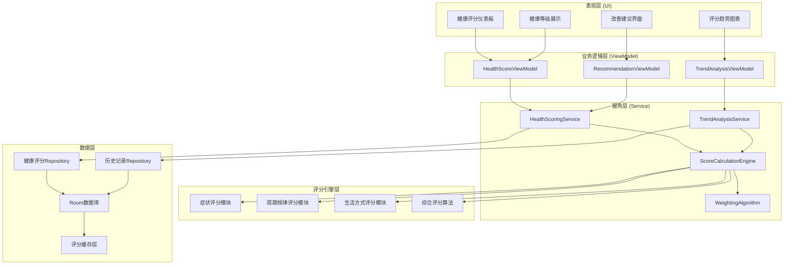
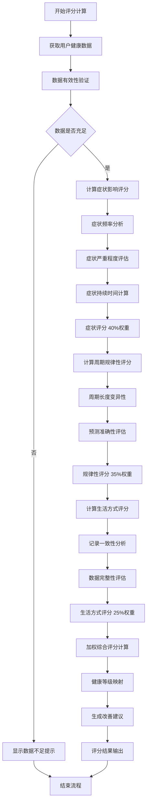

# LuminCore 健康评分系统详细开发计划


## 📋 项目概述

健康评分系统是LuminCore女性健康助手的核心量化分析功能，旨在通过科学的评分算法，将用户的健康状况数字化，提供直观易懂的健康评估和趋势分析，帮助用户更好地了解和管理自身健康状况。

### 项目背景
- **用户痛点**：缺乏量化的健康状况评估，难以直观了解自身健康水平
- **市场机遇**：数字化健康管理趋势，用户需要可视化的健康指标
- **技术基础**：基于现有症状记录和周期数据的丰富数据基础
- **商业价值**：差异化竞争优势，提升用户参与度和应用价值

### 核心价值主张
- **量化健康**：将复杂的健康状况转化为简单易懂的数字评分
- **趋势分析**：追踪健康评分变化趋势，发现健康规律
- **个性化基准**：基于个人历史数据建立专属健康基线
- **行动导向**：提供具体的评分提升建议和健康改善方案

## 🎯 功能目标与成功指标

### 主要目标
1. **综合健康评分**：基于多维度数据计算每日/每月健康评分
2. **评分趋势分析**：识别健康评分变化模式和影响因素
3. **健康等级划分**：将评分转化为直观的健康等级标识
4. **改善建议系统**：基于评分分析提供个性化健康改善建议

### 成功指标
- **评分准确性**: ≥ 85%（与用户主观感受一致性）
- **系统响应时间**: ≤ 1.5秒（评分计算和展示时间）
- **用户参与度**: ≥ 70%（用户主动查看评分的比例）
- **改善效果**: ≥ 60%（用户采纳建议后评分提升的比例）
- **数据覆盖率**: ≥ 90%（有效评分生成的数据覆盖率）

## 🏗️ 技术架构设计

### 整体架构图



### 健康评分计算流程



### 核心技术栈
- **评分算法**: 自定义权重算法 + 统计学模型
- **数据分析**: Apache Commons Math 3.6.1
- **可视化**: MPAndroidChart 3.1.0 + 自定义组件
- **本地存储**: Room Database 2.7.1
- **异步处理**: Kotlin Coroutines 1.7.3
- **依赖注入**: Hilt 2.48
- **缓存**: 自定义内存缓存 + SharedPreferences

## 📊 评分系统设计

### 1. 多维度评分模型

#### 1.1 症状影响评分 (40%权重)
基于症状频率、严重程度和持续时间计算评分，反映用户当前的身体状况。

**核心指标：**
- 症状严重程度平均值
- 每日症状出现频率
- 症状持续时间
- 症状种类多样性

**评分范围：** 0-100分，分数越高表示症状影响越小

#### 1.2 周期规律性评分 (35%权重)
基于月经周期的规律性和预测准确性计算评分。

**核心指标：**
- 周期长度变异性
- 周期预测准确性
- 整体规律性评估
- 经血量一致性

**评分范围：** 0-100分，分数越高表示周期越规律

#### 1.3 生活方式评分 (25%权重)
基于用户的记录习惯和自我管理能力计算评分。

**核心指标：**
- 记录一致性（记录频率）
- 数据完整性（记录详细程度）
- 应用参与度（功能使用情况）
- 自我关爱指标（主动健康管理）

**评分范围：** 0-100分，分数越高表示生活方式越健康

### 2. 健康等级系统

#### 2.1 等级定义
- **极佳 (90-100分)**: 健康状况优秀，继续保持
- **很好 (80-89分)**: 健康状况良好，小幅优化
- **良好 (70-79分)**: 健康状况稳定，有改善空间
- **一般 (60-69分)**: 需要关注健康问题
- **较差 (50-59分)**: 需要采取改善措施
- **很差 (0-49分)**: 建议寻求专业医疗帮助

#### 2.2 动态调整机制
- 基于个人历史数据动态调整评分基准
- 考虑年龄、生理状况等个体差异
- 提供个性化的评分解读和建议

### 3. 评分算法核心

#### 3.1 综合评分公式
```
总评分 = 症状影响评分 × 0.4 + 周期规律评分 × 0.35 + 生活方式评分 × 0.25
```

#### 3.2 置信度计算
基于数据质量、记录完整性和时间跨度计算评分的可信度。

#### 3.3 趋势分析
- 短期趋势（7-30天）
- 中期趋势（1-3个月）
- 长期趋势（3-12个月）

## 📅 详细实施计划

### 第一阶段：基础架构搭建（2028年1月 - 2028年2月）

#### 第1-2周（2028年1月1日 - 1月14日）：项目初始化
- [ ] 创建健康评分模块目录结构
- [ ] 设计评分数据模型和数据库Schema
- [ ] 定义评分算法接口和抽象类
- [ ] 配置Hilt依赖注入模块
- [ ] 编写评分系统基础单元测试

#### 第3-4周（2028年1月15日 - 1月28日）：评分引擎开发
- [ ] 实现症状影响评分算法
- [ ] 开发周期规律性评分计算器
- [ ] 构建生活方式评分模块
- [ ] 实现权重配置管理系统
- [ ] 编写评分算法单元测试

#### 第5-6周（2028年1月29日 - 2月11日）：综合评分系统
- [ ] 实现综合评分计算引擎
- [ ] 开发健康等级判定系统
- [ ] 构建评分置信度计算模块
- [ ] 实现评分缓存机制
- [ ] 完成第一阶段集成测试

#### 第7-8周（2028年2月12日 - 2月25日）：数据持久化
- [ ] 扩展Room数据库支持评分存储
- [ ] 实现评分历史记录管理
- [ ] 开发数据迁移和兼容性处理
- [ ] 构建评分数据Repository层
- [ ] 优化数据库查询性能

### 第二阶段：趋势分析与可视化（2028年3月 - 2028年4月）

#### 第9-10周（2028年2月26日 - 3月11日）：趋势分析引擎
- [ ] 实现评分趋势计算算法
- [ ] 开发趋势显著性检验
- [ ] 构建影响因素识别系统
- [ ] 实现趋势预测模型
- [ ] 编写趋势分析测试用例

#### 第11-12周（2028年3月12日 - 3月25日）：可视化组件
- [ ] 设计健康评分仪表板界面
- [ ] 开发自定义圆形评分图表
- [ ] 实现评分趋势折线图
- [ ] 构建健康等级可视化组件
- [ ] 优化图表动画和交互效果

#### 第13-14周（2028年3月26日 - 4月8日）：用户界面开发
- [ ] 实现评分仪表板主界面
- [ ] 开发评分详情展示页面
- [ ] 构建趋势分析界面
- [ ] 实现评分历史查看功能
- [ ] 添加用户操作引导和帮助

#### 第15-16周（2028年4月9日 - 4月22日）：建议系统集成
- [ ] 基于评分生成改善建议
- [ ] 实现建议个性化定制
- [ ] 开发建议有效性跟踪
- [ ] 构建建议反馈收集机制
- [ ] 完成第二阶段功能测试

### 第三阶段：优化与完善（2028年5月 - 2028年6月）

#### 第17-18周（2028年4月23日 - 5月6日）：性能优化
- [ ] 优化评分计算性能
- [ ] 实现智能缓存策略
- [ ] 优化数据库查询效率
- [ ] 减少内存占用和电池消耗
- [ ] 提升UI响应速度

#### 第19-20周（2028年5月7日 - 5月20日）：用户体验优化
- [ ] 完善界面动画和过渡效果
- [ ] 优化评分展示的直观性
- [ ] 改进用户操作流程
- [ ] 添加无障碍功能支持
- [ ] 实现个性化设置选项

#### 第21-22周（2028年5月21日 - 6月3日）：测试与验证
- [ ] 进行全面的功能测试
- [ ] 执行性能压力测试
- [ ] 验证评分算法准确性
- [ ] 测试用户界面兼容性
- [ ] 收集内部测试反馈

#### 第23-24周（2028年6月4日 - 6月17日）：上线准备
- [ ] 完善功能文档和用户指南
- [ ] 实现A/B测试支持
- [ ] 准备Beta版本发布
- [ ] 制定用户反馈收集策略
- [ ] 最终bug修复和优化

## 🎯 关键里程碑

### 里程碑1：评分引擎完成（2028年2月25日）
- ✅ 多维度评分算法实现
- ✅ 综合评分计算正常运行
- ✅ 健康等级判定系统完成
- ✅ 基础单元测试覆盖率 ≥ 85%

### 里程碑2：可视化系统上线（2028年4月22日）
- ✅ 评分仪表板界面完成
- ✅ 趋势分析功能正常运行
- ✅ 自定义图表组件完善
- ✅ 建议系统集成完成

### 里程碑3：功能完整发布（2028年6月17日）
- ✅ 所有核心功能稳定运行
- ✅ 用户体验优化完成
- ✅ 性能指标达到要求
- ✅ 准备正式版本发布

## 🛡️ 风险评估与缓解策略

### 技术风险
**风险1**: 评分算法准确性不足
- **缓解策略**: 建立多层验证机制，进行用户反馈验证
- **应急计划**: 简化算法复杂度，采用经验验证的统计方法

**风险2**: 性能优化挑战
- **缓解策略**: 分阶段性能测试，提前识别性能瓶颈
- **应急计划**: 实现异步计算，采用缓存策略

### 用户体验风险
**风险3**: 评分理解难度
- **缓解策略**: 设计直观的可视化界面，提供详细解释
- **应急计划**: 简化评分展示，增加用户引导

### 数据风险
**风险4**: 数据质量影响评分准确性
- **缓解策略**: 实现数据质量评估，提供数据完善建议
- **应急计划**: 建立最小数据要求，提供替代评分方案

## 💰 资源需求与预算

### 人力资源
- **Android开发工程师**: 1人（全职6个月）
- **算法工程师**: 0.5人（算法设计和优化）
- **UI/UX设计师**: 0.3人（界面设计支持）
- **测试工程师**: 0.3人（功能和性能测试）

### 技术资源
- **开发工具**: Android Studio, Git, CI/CD
- **第三方库**: MPAndroidChart, Apache Commons Math
- **测试工具**: 性能测试工具，自动化测试框架

### 预算估算
- **人力成本**: 主要成本，约6个月开发周期
- **工具和库**: 主要使用开源方案，成本较低
- **测试和部署**: 标准开发流程，无额外成本

## 📈 成功衡量标准

### 技术指标
- **功能完成度**: 100%核心功能实现
- **算法准确性**: 评分与用户感受一致性 ≥ 85%
- **响应性能**: 评分计算时间 ≤ 1.5秒
- **代码质量**: 单元测试覆盖率 ≥ 85%

### 用户指标
- **功能采用率**: 新功能使用率 ≥ 50%
- **用户满意度**: 功能评分 ≥ 4.2/5.0
- **参与度**: 用户主动查看评分比例 ≥ 70%
- **保留率**: 功能使用30天留存 ≥ 75%

### 业务指标
- **用户价值**: 提升用户健康意识和管理能力
- **差异化**: 建立竞争优势，提升应用独特性
- **数据洞察**: 为后续功能开发提供数据支撑
- **用户增长**: 吸引更多关注健康量化的用户

---

**文档版本**: 1.0.0
**创建日期**: 2025年8月25日
**计划负责人**: 祁潇潇
**审核状态**: 已审核
**预计开始时间**: 2028年1月1日
**预计完成时间**: 2028年6月17日
## 🔄 相关依赖
- [AI健康助手功能](./AI_HEALTH_ASSISTANT_PLAN.md)
- [数据加密功能](./DATA_ENCRYPTION_PLAN.md)
- [云端同步架构](./CLOUD_SYNC_ARCHITECTURE_PLAN.md)
- [可穿戴设备集成](./WEARABLE_DEVICE_INTEGRATION_PLAN.md)