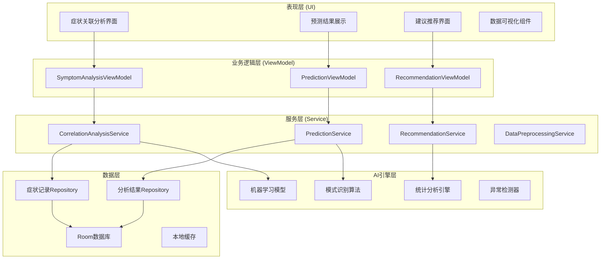
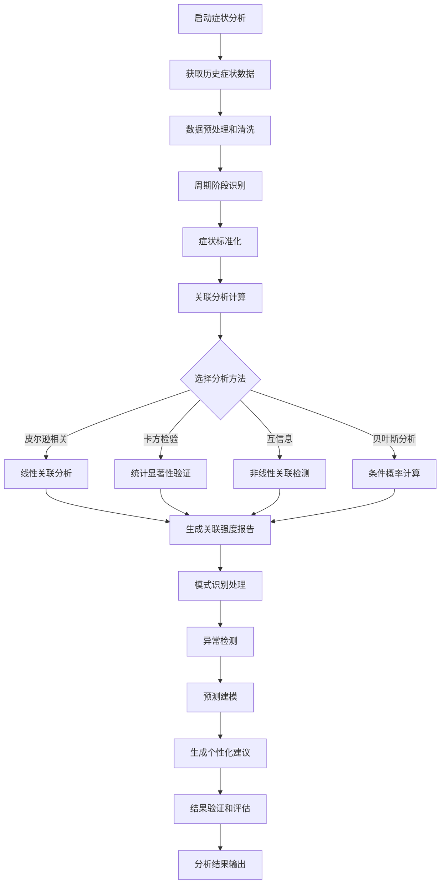

# LuminCore 智能症状关联分析功能开发计划


## 📋 项目概述

智能症状关联分析是LuminCore女性健康助手的核心AI功能之一，旨在通过先进的数据分析算法，发现用户症状与月经周期各阶段之间的深层关联性，为用户提供个性化的健康洞察和预测性建议。

### 项目背景
- **用户痛点**：女性用户难以理解自身症状与月经周期的关联规律
- **市场需求**：缺乏基于个人数据的智能健康分析工具
- **技术机遇**：本地AI技术成熟，可保护隐私的同时提供智能分析
- **商业价值**：差异化功能，提升用户粘性和应用竞争力

### 核心价值主张
- **个性化洞察**：基于个人历史数据的专属健康分析
- **科学性**：采用统计学和机器学习方法，确保分析可靠性
- **预测性**：不仅分析过去，还能预测未来可能出现的症状
- **可操作性**：提供具体的生活方式调整建议

## 🎯 功能目标与成功指标

### 主要目标
1. **症状-周期关联发现**：识别个人症状与月经周期阶段的关联模式
2. **个性化预测**：基于历史数据预测特定周期阶段可能出现的症状
3. **异常检测**：识别异常症状模式，提供健康预警
4. **智能建议**：基于分析结果提供个性化的健康管理建议

### 成功指标
- **预测准确率**: ≥ 80%（症状出现概率预测）
- **用户满意度**: ≥ 4.5/5.0（功能使用评分）
- **功能使用率**: ≥ 60%（月活跃用户中使用该功能的比例）
- **数据洞察价值**: ≥ 75%（用户认为洞察有价值的比例）
- **响应时间**: ≤ 2秒（分析结果生成时间）

## 🏗️ 技术架构设计

### 整体架构图



### 症状关联分析流程



### 核心技术栈
- **机器学习**: TensorFlow Lite for Android 2.14.0
- **统计分析**: Apache Commons Math 3.6.1
- **数据预处理**: 自定义Kotlin实现
- **可视化**: MPAndroidChart 3.1.0 + 自定义组件
- **本地存储**: Room Database 2.7.1
- **异步处理**: Kotlin Coroutines 1.7.3
- **依赖注入**: Hilt 2.48

## 📊 核心功能模块

### 1. 数据预处理模块

#### 核心职责
- 症状数据清洗与标准化
- 周期阶段识别与映射
- 特征工程与数据质量评估

#### 关键组件
```kotlin
@Singleton
class DataPreprocessingService @Inject constructor(
    private val repository: MenstrualRecordRepository,
    private val cycleStageIdentifier: CycleStageIdentifier
) {
    
    suspend fun preprocessSymptomData(
        startDate: LocalDate,
        endDate: LocalDate
    ): ProcessedSymptomData {
        val rawRecords = repository.getRecordsBetween(startDate, endDate)
        val cleanedRecords = cleanRawData(rawRecords)
        val standardizedSymptoms = standardizeSymptoms(cleanedRecords)
        val cycleStageMapping = mapToCycleStages(standardizedSymptoms)
        
        return ProcessedSymptomData(
            cleanedRecords = cleanedRecords,
            standardizedSymptoms = standardizedSymptoms,
            cycleStageMapping = cycleStageMapping,
            dataQuality = assessDataQuality(cleanedRecords)
        )
    }
}
```

### 2. 关联分析引擎

#### 核心职责
- 计算症状与周期阶段的统计关联性
- 识别显著相关的症状模式
- 生成关联强度评估报告

#### 分析算法
- **皮尔逊相关系数**：测量线性关联强度
- **卡方检验**：验证关联性的统计显著性
- **互信息**：捕捉非线性关联关系
- **贝叶斯分析**：计算条件概率

### 3. 智能预测引擎

#### 核心职责
- 基于历史数据预测症状出现概率
- 识别异常症状模式
- 提供预测置信度评估

#### 机器学习模型
- **随机森林**：处理多特征症状预测
- **LSTM神经网络**：捕捉时间序列模式
- **朴素贝叶斯**：快速概率计算
- **支持向量机**：边界情况识别

### 4. 个性化建议系统

#### 核心职责
- 基于分析结果生成健康建议
- 个性化建议内容定制
- 建议有效性跟踪

#### 建议类型
- **症状管理建议**：缓解特定症状的方法
- **生活方式调整**：饮食、运动、作息建议
- **预防性措施**：预防症状恶化的措施
- **医疗建议**：何时需要寻求专业医疗帮助

## 📅 详细实施计划

### 第一阶段：基础架构搭建（2027年1月 - 2027年2月）

#### 第1-2周（2027年1月1日 - 1月14日）：项目初始化
- [ ] 创建功能模块目录结构
- [ ] 设计数据模型和数据库Schema扩展
- [ ] 定义核心接口和抽象类
- [ ] 配置依赖注入模块
- [ ] 编写基础单元测试框架

#### 第3-4周（2027年1月15日 - 1月28日）：数据预处理模块
- [ ] 实现症状数据清洗算法
- [ ] 开发周期阶段识别器
- [ ] 构建特征工程管道
- [ ] 实现数据质量评估器
- [ ] 编写数据预处理单元测试

#### 第5-6周（2027年1月29日 - 2月11日）：统计分析引擎
- [ ] 实现相关性计算算法
- [ ] 开发显著性检验模块
- [ ] 构建关联矩阵生成器
- [ ] 实现异常检测基础算法
- [ ] 编写统计分析测试用例

#### 第7-8周（2027年2月12日 - 2月25日）：基础UI框架
- [ ] 设计症状关联分析界面布局
- [ ] 实现自定义热力图组件
- [ ] 开发数据可视化基础组件
- [ ] 构建用户交互逻辑
- [ ] 完成第一阶段集成测试

### 第二阶段：AI引擎开发（2027年3月 - 2027年4月）

#### 第9-10周（2027年2月26日 - 3月11日）：机器学习模型
- [ ] 集成TensorFlow Lite框架
- [ ] 开发症状预测模型
- [ ] 实现模型训练管道
- [ ] 构建模型评估系统
- [ ] 优化模型性能和大小

#### 第11-12周（2027年3月12日 - 3月25日）：预测引擎
- [ ] 实现症状概率预测
- [ ] 开发预测置信度计算
- [ ] 构建异常模式识别
- [ ] 实现预测结果后处理
- [ ] 编写预测引擎测试

#### 第13-14周（2027年3月26日 - 4月8日）：智能建议系统
- [ ] 构建健康知识库
- [ ] 实现建议生成算法
- [ ] 开发个性化推荐引擎
- [ ] 构建建议有效性跟踪
- [ ] 优化建议质量和相关性

#### 第15-16周（2027年4月9日 - 4月22日）：功能集成与优化
- [ ] 集成所有AI功能模块
- [ ] 优化算法性能和准确性
- [ ] 实现缓存和并发优化
- [ ] 完成第二阶段功能测试
- [ ] 性能基准测试和调优

### 第三阶段：用户界面完善（2027年5月 - 2027年6月）

#### 第17-18周（2027年4月23日 - 5月6日）：高级UI组件
- [ ] 完善症状关联热力图
- [ ] 开发交互式预测图表
- [ ] 实现建议卡片界面
- [ ] 构建数据洞察仪表板
- [ ] 优化界面响应性和流畅度

#### 第19-20周（2027年5月7日 - 5月20日）：用户体验优化
- [ ] 实现界面动画和过渡效果
- [ ] 优化数据加载和显示策略
- [ ] 开发离线使用功能
- [ ] 实现数据导出和分享功能
- [ ] 无障碍功能支持

#### 第21-22周（2027年5月21日 - 6月3日）：完整性测试
- [ ] 用户交互流程测试
- [ ] 数据准确性验证测试
- [ ] 性能压力测试
- [ ] 兼容性测试（不同设备）
- [ ] 用户体验测试

#### 第23-24周（2027年6月4日 - 6月17日）：上线准备
- [ ] 功能文档编写和更新
- [ ] 用户指南和帮助文档
- [ ] 应用内引导流程
- [ ] Beta版本发布和用户反馈收集
- [ ] 最终优化和bug修复

## 🎯 关键里程碑

### 里程碑1：基础架构完成（2027年2月25日）
- ✅ 数据预处理管道正常运行
- ✅ 基础统计分析功能实现
- ✅ 核心UI框架搭建完成
- ✅ 单元测试覆盖率 ≥ 80%

### 里程碑2：AI引擎上线（2027年4月22日）
- ✅ 机器学习模型成功集成
- ✅ 症状预测准确率 ≥ 75%
- ✅ 智能建议系统正常运行
- ✅ 集成测试全部通过

### 里程碑3：功能完整发布（2027年6月17日）
- ✅ 用户界面完善并优化
- ✅ 所有功能正常运行
- ✅ 用户体验测试通过
- ✅ 准备正式版本发布

## 🛡️ 风险评估与缓解策略

### 技术风险
**风险1**: 机器学习模型准确率不达标
- **缓解策略**: 准备多种算法备选方案，建立模型评估基准
- **应急计划**: 如ML效果不佳，回退至统计分析方法

**风险2**: 性能优化挑战
- **缓解策略**: 早期性能测试，分阶段优化策略
- **应急计划**: 简化算法复杂度，使用云端计算辅助

### 数据风险
**风险3**: 用户数据质量不足
- **缓解策略**: 实现数据质量评估，提供数据录入指导
- **应急计划**: 使用合成数据补充，提供数据质量提升建议

### 时间风险
**风险4**: 开发进度延期
- **缓解策略**: 预留20%缓冲时间，关键路径管理
- **应急计划**: 功能优先级调整，分批次发布

## 💰 资源需求

### 人力资源
- **Android开发工程师**: 1人（全职）
- **算法工程师**: 0.5人（兼职支持）
- **UI/UX设计师**: 0.3人（设计支持）
- **测试工程师**: 0.3人（测试支持）

### 技术资源
- **开发环境**: Android Studio, Git, CI/CD
- **第三方服务**: 无（纯本地实现）
- **硬件需求**: 标准开发设备和测试设备

### 预算估算
- **开发成本**: 人力成本为主
- **第三方库**: 开源库，无额外费用
- **基础设施**: 无云服务费用（本地优先）

## 📈 成功衡量标准

### 技术指标
- **功能完成度**: 100%核心功能实现
- **代码质量**: 单元测试覆盖率 ≥ 85%
- **性能指标**: 分析响应时间 ≤ 2秒
- **稳定性**: 崩溃率 ≤ 0.1%

### 用户指标
- **采用率**: 新功能使用率 ≥ 40%
- **满意度**: 用户评分 ≥ 4.3/5.0
- **留存率**: 功能使用30天留存 ≥ 70%
- **反馈质量**: 正面反馈比例 ≥ 80%

### 业务指标
- **用户增长**: 功能上线后用户增长率提升
- **使用时长**: 平均会话时长增加
- **用户价值**: 用户生命周期价值提升
- **竞争优势**: 市场差异化功能建立

---

**文档版本**: 1.0.0
**创建日期**: 2025年8月25日
**计划负责人**: 祁潇潇
**审核状态**: 已审核
**预计开始时间**: 2027年1月1日
**预计完成时间**: 2027年6月17日
## 🔄 相关依赖
- [AI健康助手功能](./AI_HEALTH_ASSISTANT_PLAN.md)
- [数据加密功能](./DATA_ENCRYPTION_PLAN.md)
- [云端同步架构](./CLOUD_SYNC_ARCHITECTURE_PLAN.md)
- [可穿戴设备集成](./WEARABLE_DEVICE_INTEGRATION_PLAN.md)