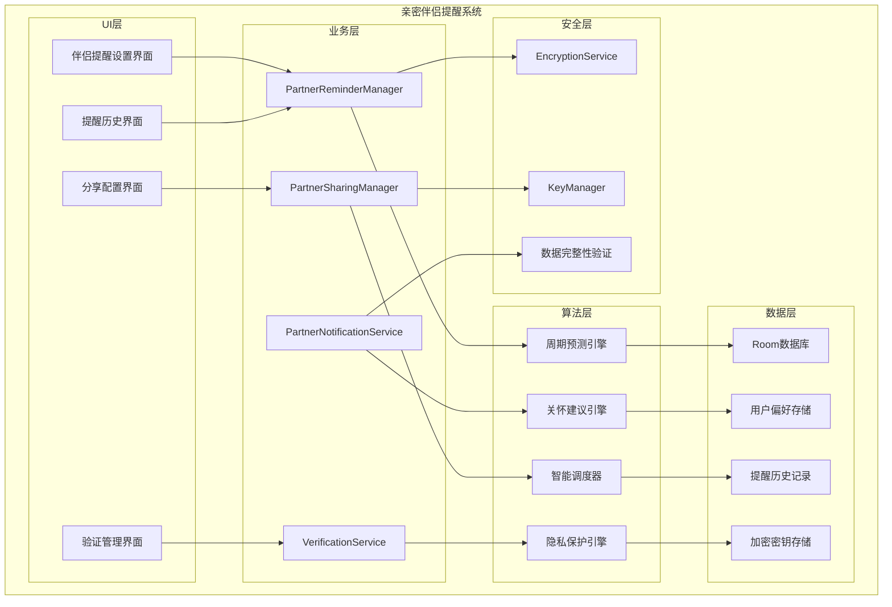
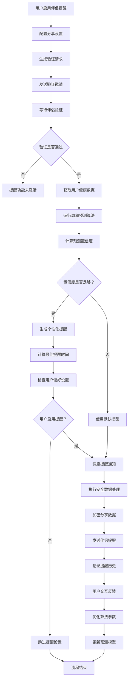

# LuminCore 亲密伴侣提醒功能详细开发计划


## 📋 项目概述

### 系统目标
开发一套让用户的亲密伴侣（如男朋友、丈夫等）了解其生理周期信息的提醒系统，通过安全的方式分享重要的生理健康信息，帮助伴侣更好地理解和支持女性用户的健康需求。

### 核心价值
- **增进理解**：帮助伴侣了解女性生理周期的特点和需求
- **情感支持**：提供科学依据，增强伴侣间的情感连接
- **健康关怀**：让伴侣能够适时提供关怀和支持
- **隐私保护**：确保信息分享的安全性和用户控制权

## 🎯 功能需求分析

### 1. 提醒类型定义

#### 1.1 生理周期提醒
```kotlin
enum class PartnerPeriodReminderType(
    val displayName: String,
    val defaultAdvanceDays: Int,
    val priority: ReminderPriority,
    val sharingScope: Set<SharingScope>
) {
    PERIOD_COMING("伴侣的月经期即将开始", 2, ReminderPriority.HIGH, setOf(SharingScope.PERIOD_DATES)),
    PERIOD_LATE("伴侣的月经期可能延迟", 0, ReminderPriority.URGENT, setOf(SharingScope.PERIOD_DATES)),
    OVULATION_COMING("伴侣的排卵期即将开始", 1, ReminderPriority.MEDIUM, setOf(SharingScope.PERIOD_DATES, SharingScope.CARE_SUGGESTIONS)),
    OVULATION_PEAK("伴侣的排卵高峰期", 0, ReminderPriority.MEDIUM, setOf(SharingScope.PERIOD_DATES)),
    PERIOD_END("伴侣的月经期预计结束", 0, ReminderPriority.MEDIUM, setOf(SharingScope.PERIOD_DATES))
}
```

#### 1.2 健康关怀提醒
```kotlin
enum class PartnerCareReminderType(
    val displayName: String,
    val frequency: ReminderFrequency,
    val sharingScope: Set<SharingScope>
) {
    DAILY_CARE_SUGGESTION("今日关怀建议", ReminderFrequency.DAILY, setOf(SharingScope.CARE_SUGGESTIONS, SharingScope.MOOD)),
    WEEKLY_HEALTH_SUMMARY("周健康摘要", ReminderFrequency.WEEKLY, setOf(SharingScope.PERIOD_DATES, SharingScope.SYMPTOMS)),
    SPECIAL_CONDITION_ALERT("特殊状况提醒", ReminderFrequency.AS_NEEDED, setOf(SharingScope.SYMPTOMS, SharingScope.CARE_SUGGESTIONS))
}
```

### 2. 分享机制设计

#### 2.1 安全分享协议
```kotlin
data class PartnerSharingConfig(
    val isEnabled: Boolean = false,
    val sharingMethod: SharingMethod,
    val partnerContact: String, // 邮箱或手机号
    val sharingScope: Set<SharingScope>,
    val verificationCode: String? = null,
    val encryptionKey: String? = null, // 用于端到端加密
    val lastVerificationTime: Long = 0L,
    val verificationExpiry: Long = 24 * 60 * 60 * 1000L // 24小时有效期
)

enum class SharingMethod {
    EMAIL, SMS, WHATSAPP, WECHAT, CUSTOM
}

enum class SharingScope {
    PERIOD_DATES, SYMPTOMS, MOOD, CARE_SUGGESTIONS
}

data class VerificationRequest(
    val userId: String,
    val partnerContact: String,
    val verificationCode: String,
    val requestCode: String, // 用于验证请求的唯一标识
    val timestamp: Long
)
```

## 🏗️ 技术架构设计

### 1. 核心组件架构



### 2. 伴侣提醒流程



### 3. 伴侣提醒管理器实现
```kotlin
@Singleton
class PartnerReminderManager @Inject constructor(
    private val context: Context,
    private val repository: MenstrualRepository,
    private val userPreferencesRepository: UserPreferencesRepository,
    private val predictionEngine: CyclePredictionEngine,
    private val notificationManager: NotificationManager,
    private val workManager: WorkManager,
    private val sharingManager: PartnerSharingManager,
    private val encryptionService: EncryptionService,
    private val privacyProtectionService: PrivacyProtectionService
) {
    
    suspend fun schedulePartnerReminders(userId: String) {
        val userRecords = repository.getAllRecords()
        val userPreferences = userPreferencesRepository.getPartnerReminderPreferences(userId)
        
        if (!userPreferences.isReminderEnabled) return
        
        // 检查是否已配置伴侣分享
        val sharingConfig = sharingManager.getSharingConfig(userId)
        if (!sharingConfig.isEnabled) return
        
        // 验证伴侣身份是否有效
        if (!sharingManager.isPartnerVerified(sharingConfig)) {
            // 发送重新验证请求
            sharingManager.requestReverification(userId, sharingConfig)
            return
        }
        
        // 取消现有提醒
        cancelAllPartnerReminders()
        
        // 预测下次周期
        val prediction = predictionEngine.predictNextCycle(userRecords)
        
        // 调度各类提醒
        schedulePeriodRemindersForPartner(prediction, userPreferences, sharingConfig)
        scheduleCareRemindersForPartner(userRecords, userPreferences, sharingConfig)
    }
    
    private suspend fun schedulePeriodRemindersForPartner(
        prediction: CyclePrediction,
        preferences: PartnerReminderPreferences,
        sharingConfig: PartnerSharingConfig
    ) {
        if (!preferences.isPeriodReminderEnabled) return
        
        val reminderDate = Calendar.getInstance().apply {
            time = prediction.nextPeriodDate
            add(Calendar.DAY_OF_MONTH, -preferences.periodAdvanceDays)
        }.time
        
        val workRequest = OneTimeWorkRequestBuilder<PartnerPeriodReminderWorker>()
            .setInputData(workDataOf(
                "reminder_type" to PartnerPeriodReminderType.PERIOD_COMING.name,
                "scheduled_date" to prediction.nextPeriodDate.time,
                "confidence" to prediction.confidence,
                "partner_contact" to sharingConfig.partnerContact,
                "encryption_key" to sharingConfig.encryptionKey
            ))
            .setInitialDelay(
                reminderDate.time - System.currentTimeMillis(),
                TimeUnit.MILLISECONDS
            )
            .addTag("partner_reminder")
            .build()
            
        workManager.enqueue(workRequest)
    }
    
    private suspend fun scheduleCareRemindersForPartner(
        records: List<MenstrualRecord>,
        preferences: PartnerReminderPreferences,
        sharingConfig: PartnerSharingConfig
    ) {
        if (!preferences.careSuggestionEnabled) return
        
        // 基于用户最近的记录生成关怀建议
        val careSuggestions = generateCareSuggestions(records)
        
        val dailyReminderTime = Calendar.getInstance().apply {
            set(Calendar.HOUR_OF_DAY, preferences.careSuggestionTime.hour)
            set(Calendar.MINUTE, preferences.careSuggestionTime.minute)
        }
        
        val workRequest = PeriodicWorkRequestBuilder<PartnerCareReminderWorker>(
            1, TimeUnit.DAYS
        ).setInputData(workDataOf(
            "reminder_type" to PartnerCareReminderType.DAILY_CARE_SUGGESTION.name,
            "suggestions" to careSuggestions,
            "partner_contact" to sharingConfig.partnerContact,
            "encryption_key" to sharingConfig.encryptionKey
        )).setConstraints(
            Constraints.Builder()
                .setRequiresBatteryNotLow(true)
                .build()
        ).addTag("partner_care_reminder")
         .build()
         
        workManager.enqueue(workRequest)
    }
    
    private fun generateCareSuggestions(record: MenstrualRecord): List<String> {
        // 使用AI动态生成个性化的关怀建议
        return AICareSuggestionEngine.generateSuggestions(record)
    }
}
```

## 🗃️ 数据模型设计

### 1. 提醒实体
```kotlin
@Entity(tableName = "partner_reminders")
data class PartnerReminder(
    @PrimaryKey(autoGenerate = true)
    val id: Long = 0,
    
    @ColumnInfo(name = "user_id")
    val userId: String,
    
    @ColumnInfo(name = "reminder_type")
    val reminderType: String,
    
    @ColumnInfo(name = "scheduled_time")
    val scheduledTime: Date,
    
    @ColumnInfo(name = "partner_contact")
    val partnerContact: String,
    
    @ColumnInfo(name = "is_sent")
    val isSent: Boolean = false,
    
    @ColumnInfo(name = "delivery_status")
    val deliveryStatus: DeliveryStatus = DeliveryStatus.PENDING,
    
    @ColumnInfo(name = "encrypted_content")
    val encryptedContent: String?, // 加密的提醒内容
    
    @ColumnInfo(name = "message_id")
    val messageId: String?, // 用于追踪消息
    
    @ColumnInfo(name = "retry_count")
    val retryCount: Int = 0,
    
    @ColumnInfo(name = "created_at")
    val createdAt: Date = Date(),
    
    @ColumnInfo(name = "updated_at")
    val updatedAt: Date = Date()
)

@Entity(tableName = "partner_reminder_preferences")
data class PartnerReminderPreferences(
    @PrimaryKey
    @ColumnInfo(name = "user_id")
    val userId: String,
    
    @ColumnInfo(name = "is_reminder_enabled")
    val isReminderEnabled: Boolean = false,
    
    @ColumnInfo(name = "is_period_reminder_enabled")
    val isPeriodReminderEnabled: Boolean = true,
    
    @ColumnInfo(name = "period_advance_days")
    val periodAdvanceDays: Int = 2,
    
    @ColumnInfo(name = "period_reminder_time")
    val periodReminderTime: LocalTime = LocalTime.of(9, 0),
    
    @ColumnInfo(name = "is_ovulation_reminder_enabled")
    val isOvulationReminderEnabled: Boolean = true,
    
    @ColumnInfo(name = "care_suggestion_enabled")
    val careSuggestionEnabled: Boolean = true,
    
    @ColumnInfo(name = "care_suggestion_time")
    val careSuggestionTime: LocalTime = LocalTime.of(18, 0),
    
    @ColumnInfo(name = "max_retry_attempts")
    val maxRetryAttempts: Int = 3,
    
    @ColumnInfo(name = "reminder_tone")
    val reminderTone: String? = null
)

@Entity(tableName = "partner_sharing_configs")
data class PartnerSharingConfigEntity(
    @PrimaryKey
    @ColumnInfo(name = "user_id")
    val userId: String,
    
    @ColumnInfo(name = "is_enabled")
    val isEnabled: Boolean = false,
    
    @ColumnInfo(name = "sharing_method")
    val sharingMethod: String,
    
    @ColumnInfo(name = "partner_contact")
    val partnerContact: String,
    
    @ColumnInfo(name = "sharing_scope")
    val sharingScope: String, // JSON格式存储Set<SharingScope>
    
    @ColumnInfo(name = "verification_code")
    val verificationCode: String?,
    
    @ColumnInfo(name = "encryption_key")
    val encryptionKey: String?,
    
    @ColumnInfo(name = "last_verification_time")
    val lastVerificationTime: Long = 0L,
    
    @ColumnInfo(name = "verification_expiry")
    val verificationExpiry: Long = 24 * 60 * 60 * 1000L,
    
    @ColumnInfo(name = "created_at")
    val createdAt: Date = Date(),
    
    @ColumnInfo(name = "updated_at")
    val updatedAt: Date = Date()
)

enum class DeliveryStatus {
    PENDING, SENT, DELIVERED, FAILED, EXPIRED
}
```

## 🔐 安全与隐私设计

### 1. 数据分享安全机制
- **用户完全控制**：用户可随时开启/关闭分享功能
- **最小数据原则**：仅分享必要的健康信息
- **端到端加密**：所有分享数据均使用AES-256-GCM加密
- **一次性验证码**：通过验证码验证伴侣身份
- **定期验证**：定期重新验证伴侣身份（默认24小时）
- **数据匿名化**：分享的数据经过匿名化处理
- **访问日志**：记录所有数据访问和分享操作

### 2. 隐私保护措施
```kotlin
@Singleton
class PrivacyProtectionService @Inject constructor(
    private val encryptionService: EncryptionService,
    private val keyManager: KeyManager
) {
    
    fun generateSharingToken(): String {
        // 生成安全的分享令牌
        return UUID.randomUUID().toString()
    }
    
    fun encryptSharedData(data: String, encryptionKey: String?): String {
        // 使用端到端加密分享数据
        return if (encryptionKey != null) {
            val keyBytes = Base64.decode(encryptionKey, Base64.DEFAULT)
            encryptionService.encryptWithKey(data.toByteArray(), keyBytes)
        } else {
            // 使用默认加密
            val encryptedData = encryptionService.encrypt(data)
            Base64.encodeToString(encryptedData.data, Base64.DEFAULT)
        }
    }
    
    fun anonymizeData(data: MenstrualRecord, scope: Set<SharingScope>): AnonymizedRecord {
        // 根据分享范围匿名化处理数据
        return AnonymizedRecord(
            cyclePhase = if (SharingScope.PERIOD_DATES in scope) data.cyclePhase else null,
            symptoms = if (SharingScope.SYMPTOMS in scope) 
                data.symptoms.map { it.type } else emptyList(), // 只分享症状类型，不分享详细描述
            moodLevel = if (SharingScope.MOOD in scope) data.moodLevel else null,
            careSuggestions = if (SharingScope.CARE_SUGGESTIONS in scope) 
                generateCareSuggestions(data) else emptyList()
        )
    }
    
    fun generateEncryptionKey(): String {
        // 生成用于端到端加密的密钥
        val key = keyManager.generateRandomKey(32) // 256位密钥
        return Base64.encodeToString(key, Base64.DEFAULT)
    }
    }

/**
 * AI驱动的关怀建议引擎
 * 使用机器学习模型动态生成个性化的关怀建议
 */
object AICareSuggestionEngine {
    
    /**
     * 基于月经记录生成个性化的关怀建议
     * @param record 月经记录
     * @return 个性化关怀建议列表
     */
    fun generateSuggestions(record: MenstrualRecord): List<String> {
        // 构建输入特征向量
        val features = buildFeatureVector(record)
        
        // 使用AI模型生成建议
        return generateSuggestionsFromAI(features)
    }
    
    /**
     * 构建用于AI模型的特征向量
     */
    private fun buildFeatureVector(record: MenstrualRecord): Map<String, Any> {
        return mapOf(
            "cyclePhase" to (record.cyclePhase?.name ?: "UNKNOWN"),
            "symptoms" to record.symptoms.map { it.type },
            "moodLevel" to (record.moodLevel ?: 3),
            "dayOfCycle" to calculateDayOfCycle(record),
            "isPredicted" to record.isPredicted,
            "symptomCount" to record.symptoms.size
        )
    }
    
    /**
     * 计算周期中的天数
     */
    private fun calculateDayOfCycle(record: MenstrualRecord): Int {
        // 简化的实现，实际应该基于用户历史数据计算
        return (1..28).random()
    }
    
    /**
     * 使用AI模型生成建议
     * 这里是模拟实现，实际项目中会集成TensorFlow Lite或ONNX Runtime等AI框架
     */
    private fun generateSuggestionsFromAI(features: Map<String, Any>): List<String> {
        // 模拟AI模型推理过程
        val suggestions = mutableListOf<String>()
        
        // 基于周期阶段的建议
        when (features["cyclePhase"] as String) {
            "MENSTRUAL" -> {
                suggestions.addAll(listOf(
                    "今天是伴侣的月经期，她可能需要更多的休息和关怀",
                    "为伴侣准备一些温热的食物和饮品",
                    "避免安排过于劳累的活动"
                ))
            }
            "FOLLICULAR" -> {
                suggestions.addAll(listOf(
                    "伴侣现在处于卵泡期，精力较为充沛",
                    "可以安排一些轻松愉快的活动",
                    "鼓励伴侣保持积极的心态"
                ))
            }
            "OVULATION" -> {
                suggestions.addAll(listOf(
                    "伴侣现在处于排卵期，情绪可能较为敏感",
                    "给予更多的关注和理解",
                    "可以准备一些她喜欢的小惊喜"
                ))
            }
            "LUTEAL" -> {
                suggestions.addAll(listOf(
                    "伴侣现在处于黄体期，可能会有情绪波动",
                    "多一些耐心和包容",
                    "帮助她缓解可能的不适感"
                ))
            }
        }
        
        // 基于症状的建议
        @Suppress("UNCHECKED_CAST")
        val symptoms = features["symptoms"] as List<String>
        symptoms.forEach { symptom ->
            val symptomSuggestion = when (symptom) {
                "头痛" -> "伴侣可能有头痛，为她轻轻按摩太阳穴会有所帮助"
                "腹痛" -> "伴侣可能有腹痛，准备一个热水袋敷在腹部会很舒服"
                "疲劳" -> "伴侣感到疲劳，建议她早点休息，保证充足睡眠"
                "情绪低落" -> "伴侣情绪不佳，多陪伴她，倾听她的感受"
                "乳房胀痛" -> "伴侣可能有乳房胀痛，建议穿宽松舒适的内衣"
                "水肿" -> "伴侣可能有水肿，减少盐分摄入，适当抬高双腿"
                else -> "关注伴侣的身体状况，给予适当的关怀"
            }
            suggestions.add(symptomSuggestion)
        }
        
        // 基于情绪的建议
        val moodLevel = features["moodLevel"] as Int
        if (moodLevel <= 2) {
            suggestions.add("伴侣情绪较低落，多给予关爱和支持，让她感受到你的陪伴")
        } else if (moodLevel >= 4) {
            suggestions.add("伴侣心情不错，可以一起享受美好时光，增进感情")
        }
        
        // 基于症状数量的建议
        val symptomCount = features["symptomCount"] as Int
        if (symptomCount > 3) {
            suggestions.add("伴侣今天身体不适较多，需要更多的关心和照顾")
        }
        
        // 确保建议的多样性和个性化
        return suggestions.distinct().shuffled().take(5)
    }
    
    /**
     * 实际项目中会使用TensorFlow Lite或ONNX Runtime等AI框架
     * 以下是一个示例接口，展示如何集成AI模型
     */
    private fun generateSuggestionsWithTensorFlow(features: Map<String, Any>): List<String> {
        // 加载TensorFlow Lite模型
        val model = loadTensorFlowLiteModel()
        
        // 准备输入数据
        val input = prepareInputData(features)
        
        // 运行推理
        val output = model.run(input)
        
        // 解析输出结果
        return parseOutput(output)
    }
    
    private fun loadTensorFlowLiteModel(): Interpreter {
        // 实际实现会从assets加载模型文件
        TODO("实现TensorFlow Lite模型加载")
    }
}
```

### 3. 验证与授权机制
```kotlin
@Singleton
class VerificationService @Inject constructor(
    private val encryptionService: EncryptionService
) {
    
    fun generateVerificationCode(): String {
        // 生成6位数字验证码
        return (100000..999999).random().toString()
    }
    
    fun createVerificationRequest(
        userId: String,
        partnerContact: String
    ): VerificationRequest {
        val verificationCode = generateVerificationCode()
        val requestCode = UUID.randomUUID().toString()
        
        return VerificationRequest(
            userId = userId,
            partnerContact = partnerContact,
            verificationCode = verificationCode,
            requestCode = requestCode,
            timestamp = System.currentTimeMillis()
        )
    }
    
    fun validateVerificationCode(
        storedRequest: VerificationRequest,
        inputCode: String
    ): Boolean {
        // 检查验证码是否过期（10分钟有效期）
        val currentTime = System.currentTimeMillis()
        if (currentTime - storedRequest.timestamp > 10 * 60 * 1000) {
            return false
        }
        
        // 验证验证码是否正确
        return storedRequest.verificationCode == inputCode
    }
    
    fun encryptVerificationMessage(
        message: String,
        partnerContact: String
    ): String {
        // 对验证消息进行加密
        val encryptedData = encryptionService.encrypt(message)
        return Base64.encodeToString(encryptedData.data, Base64.DEFAULT)
    }
}
```

## 📊 实施计划

### 第一阶段：基础架构与安全机制（4周）
- [ ] 设计数据模型和数据库表结构
- [ ] 实现基础的提醒管理器框架
- [ ] 开发安全分享机制和身份验证
- [ ] 集成WorkManager进行任务调度
- [ ] 创建基础的通知系统
- [ ] 实现端到端加密机制
- [ ] 开发隐私保护服务

### 第二阶段：核心算法与提醒功能（4周）
- [ ] 实现周期预测算法适配
- [ ] 开发关怀建议引擎
- [ ] 实现提醒类型分类和优先级
- [ ] 添加用户行为分析
- [ ] 开发多种分享渠道支持
- [ ] 实现验证与授权机制
- [ ] 开发重试机制和错误处理

### 第三阶段：用户界面与配置（3周）
- [ ] 开发伴侣提醒设置页面
- [ ] 创建分享配置界面
- [ ] 实现提醒历史查看界面
- [ ] 添加快速操作按钮
- [ ] 实现通知交互功能
- [ ] 开发验证管理界面
- [ ] 实现权限管理界面

### 第四阶段：测试优化与上线（2周）
- [ ] 单元测试覆盖核心算法
- [ ] 集成测试验证提醒流程
- [ ] 安全性测试和隐私审计
- [ ] 性能测试和优化
- [ ] 用户体验测试
- [ ] 安全渗透测试
- [ ] 文档完善和用户指南

## 🎯 成功指标

### 技术指标
- 提醒准确率 > 85%
- 通知延迟 < 1分钟
- 电池消耗增加 < 5%
- 崩溃率 < 0.1%
- 数据传输加密率 100%
- 验证成功率 > 95%

### 用户体验指标
- 提醒交互率 > 60%
- 用户满意度 > 4.5/5
- 功能启用率 > 40%
- 隐私安全评分 > 4.8/5
- 验证流程满意度 > 4.3/5

### 业务指标
- 用户留存率提升 15%
- 应用使用时长增加 10%
- 正面用户反馈率 > 80%
- 功能推荐率 > 30%

## 📚 技术依赖

### 新增依赖
```
// WorkManager for background tasks
implementation "androidx.work:work-runtime-ktx:2.9.0"

// Notification compatibility
implementation "androidx.core:core-ktx:1.12.0"

// Time handling
implementation "org.threeten:threetenbp:1.6.8"

// Encryption library
implementation "androidx.security:security-crypto:1.1.0-alpha06"

// JSON处理
implementation "com.google.code.gson:gson:2.10.1"

// 安全通信
implementation "androidx.security:security-crypto-ktx:1.1.0-alpha06"
```

### 权限要求
```xml
<!-- 发送通知 -->
<uses-permission android:name="android.permission.POST_NOTIFICATIONS" />

<!-- 网络访问（用于分享） -->
<uses-permission android:name="android.permission.INTERNET" />

<!-- 后台任务 -->
<uses-permission android:name="android.permission.WAKE_LOCK" />

<!-- 启动时自动启动 -->
<uses-permission android:name="android.permission.RECEIVE_BOOT_COMPLETED" />

<!-- 短信发送（可选） -->
<uses-permission android:name="android.permission.SEND_SMS" />

<!-- 读取联系人（可选） -->
<uses-permission android:name="android.permission.READ_CONTACTS" />
```

## 🔄 后续优化方向

1. **智能关怀建议**：基于AI分析提供更个性化的关怀建议
2. **多语言支持**：支持不同语言的提醒内容
3. **多媒体分享**：支持图片、语音等多媒体形式的关怀表达
4. **情感分析**：结合情绪数据提供更贴心的关怀提醒
5. **节日提醒**：结合纪念日等特殊日期提供定制化提醒
6. **双向沟通**：支持伴侣回复和互动功能
7. **健康数据分析**：提供长期健康趋势分析报告

## 🧩 核心组件实现

### 1. 伴侣分享管理器
```kotlin
@Singleton
class PartnerSharingManager @Inject constructor(
    private val context: Context,
    private val verificationService: VerificationService,
    private val encryptionService: EncryptionService,
    private val privacyProtectionService: PrivacyProtectionService,
    private val sharingConfigDao: PartnerSharingConfigDao
) {
    
    suspend fun configurePartnerSharing(
        userId: String,
        sharingMethod: SharingMethod,
        partnerContact: String,
        sharingScope: Set<SharingScope>
    ): SharingSetupResult {
        return try {
            // 生成加密密钥
            val encryptionKey = privacyProtectionService.generateEncryptionKey()
            
            // 创建验证请求
            val verificationRequest = verificationService.createVerificationRequest(
                userId, partnerContact
            )
            
            // 保存分享配置
            val configEntity = PartnerSharingConfigEntity(
                userId = userId,
                isEnabled = false, // 等待验证后启用
                sharingMethod = sharingMethod.name,
                partnerContact = partnerContact,
                sharingScope = Gson().toJson(sharingScope),
                verificationCode = verificationRequest.verificationCode,
                encryptionKey = encryptionKey,
                lastVerificationTime = 0L,
                verificationExpiry = 24 * 60 * 60 * 1000L
            )
            
            sharingConfigDao.insert(configEntity)
            
            // 发送验证请求
            sendVerificationRequest(verificationRequest, sharingMethod)
            
            SharingSetupResult.Success(verificationRequest.requestCode)
        } catch (e: Exception) {
            SharingSetupResult.Error(e.message ?: "配置失败")
        }
    }
    
    suspend fun verifyPartner(
        requestCode: String,
        verificationCode: String
    ): VerificationResult {
        return try {
            // 获取存储的验证请求
            val storedRequest = getStoredVerificationRequest(requestCode)
                ?: return VerificationResult.Error("验证请求不存在或已过期")
            
            // 验证验证码
            if (verificationService.validateVerificationCode(storedRequest, verificationCode)) {
                // 更新分享配置为已验证状态
                val config = sharingConfigDao.getByUserId(storedRequest.userId)
                if (config != null) {
                    val updatedConfig = config.copy(
                        isEnabled = true,
                        lastVerificationTime = System.currentTimeMillis()
                    )
                    sharingConfigDao.update(updatedConfig)
                    
                    return VerificationResult.Success
                }
            }
            
            VerificationResult.Error("验证码错误")
        } catch (e: Exception) {
            VerificationResult.Error(e.message ?: "验证失败")
        }
    }
    
    suspend fun getSharingConfig(userId: String): PartnerSharingConfig {
        val configEntity = sharingConfigDao.getByUserId(userId)
        return if (configEntity != null) {
            PartnerSharingConfig(
                isEnabled = configEntity.isEnabled,
                sharingMethod = SharingMethod.valueOf(configEntity.sharingMethod),
                partnerContact = configEntity.partnerContact,
                sharingScope = Gson().fromJson(
                    configEntity.sharingScope, 
                    object : TypeToken<Set<SharingScope>>() {}.type
                ),
                verificationCode = configEntity.verificationCode,
                encryptionKey = configEntity.encryptionKey,
                lastVerificationTime = configEntity.lastVerificationTime,
                verificationExpiry = configEntity.verificationExpiry
            )
        } else {
            PartnerSharingConfig(
                isEnabled = false,
                sharingMethod = SharingMethod.EMAIL,
                partnerContact = "",
                sharingScope = emptySet()
            )
        }
    }
    
    fun isPartnerVerified(config: PartnerSharingConfig): Boolean {
        if (!config.isEnabled) return false
        
        val currentTime = System.currentTimeMillis()
        return (currentTime - config.lastVerificationTime) < config.verificationExpiry
    }
    
    suspend fun requestReverification(userId: String, config: PartnerSharingConfig) {
        val verificationRequest = verificationService.createVerificationRequest(
            userId, config.partnerContact
        )
        
        // 更新数据库中的验证码
        val configEntity = sharingConfigDao.getByUserId(userId)
        if (configEntity != null) {
            val updatedConfig = configEntity.copy(
                verificationCode = verificationRequest.verificationCode,
                updatedAt = Date()
            )
            sharingConfigDao.update(updatedConfig)
        }
        
        // 发送重新验证请求
        sendVerificationRequest(verificationRequest, config.sharingMethod)
    }
    
    private fun sendVerificationRequest(
        request: VerificationRequest,
        method: SharingMethod
    ) {
        val message = "您的伴侣希望与您分享她的健康信息。验证码：${request.verificationCode}，10分钟内有效。"
        
        when (method) {
            SharingMethod.EMAIL -> sendEmail(request.partnerContact, message)
            SharingMethod.SMS -> sendSms(request.partnerContact, message)
            SharingMethod.WHATSAPP -> sendWhatsAppMessage(request.partnerContact, message)
            SharingMethod.WECHAT -> sendWeChatMessage(request.partnerContact, message)
            SharingMethod.CUSTOM -> sendCustomMessage(request.partnerContact, message)
        }
    }
    
    private fun sendEmail(email: String, message: String) {
        val intent = Intent(Intent.ACTION_SEND).apply {
            type = "text/plain"
            putExtra(Intent.EXTRA_EMAIL, arrayOf(email))
            putExtra(Intent.EXTRA_SUBJECT, "LuminCore 伴侣健康分享验证")
            putExtra(Intent.EXTRA_TEXT, message)
        }
        context.startActivity(Intent.createChooser(intent, "发送验证邮件"))
    }
    
    private fun sendSms(phoneNumber: String, message: String) {
        val intent = Intent(Intent.ACTION_VIEW).apply {
            data = Uri.parse("sms:$phoneNumber")
            putExtra("sms_body", message)
        }
        context.startActivity(intent)
    }
    
    private fun sendWhatsAppMessage(phoneNumber: String, message: String) {
        val url = "https://api.whatsapp.com/send?phone=$phoneNumber&text=${Uri.encode(message)}"
        context.startActivity(Intent(Intent.ACTION_VIEW, Uri.parse(url)))
    }
    
    // WeChat和Custom方法需要根据具体实现调整
    private fun sendWeChatMessage(contact: String, message: String) {
        // 微信分享实现
    }
    
    private fun sendCustomMessage(contact: String, message: String) {
        // 自定义分享实现
    }
    
    private suspend fun getStoredVerificationRequest(requestCode: String): VerificationRequest? {
        // 从安全存储中获取验证请求
        // 实现细节根据具体存储方案确定
        return null
    }
}

sealed class SharingSetupResult {
    data class Success(val requestCode: String) : SharingSetupResult()
    data class Error(val message: String) : SharingSetupResult()
}

sealed class VerificationResult {
    object Success : VerificationResult()
    data class Error(val message: String) : VerificationResult()
}
```

### 2. 伴侣提醒工作器实现
```kotlin
class PartnerPeriodReminderWorker(
    context: Context,
    params: WorkerParameters
) : CoroutineWorker(context, params) {
    
    @Inject
    lateinit var partnerReminderManager: PartnerReminderManager
    
    @Inject
    lateinit var repository: MenstrualRepository
    
    @Inject
    lateinit var sharingManager: PartnerSharingManager
    
    override suspend fun doWork(): Result {
        return try {
            val reminderType = inputData.getString("reminder_type")
            val scheduledDate = inputData.getLong("scheduled_date", 0L)
            val confidence = inputData.getFloat("confidence", 0f)
            val partnerContact = inputData.getString("partner_contact") ?: ""
            val encryptionKey = inputData.getString("encryption_key")
            
            if (reminderType.isNullOrEmpty() || scheduledDate <= 0) {
                return Result.failure()
            }
            
            // 获取用户ID（需要从共享偏好或其他地方获取）
            val userId = getUserId()
            
            // 获取分享配置
            val sharingConfig = sharingManager.getSharingConfig(userId)
            
            // 检查伴侣是否已验证
            if (!sharingManager.isPartnerVerified(sharingConfig)) {
                return Result.failure()
            }
            
            // 获取用户数据
            val userRecords = repository.getAllRecords()
            
            // 生成提醒内容
            val reminderContent = generateReminderContent(
                reminderType, scheduledDate, confidence, userRecords, sharingConfig
            )
            
            // 加密提醒内容
            val encryptedContent = encryptReminderContent(reminderContent, encryptionKey)
            
            // 发送提醒给伴侣
            val sendResult = sendReminderToPartner(
                reminderContent, partnerContact, sharingConfig.sharingMethod
            )
            
            // 记录提醒历史
            recordReminderHistory(
                userId, reminderType, scheduledDate, partnerContact, 
                sendResult, encryptedContent
            )
            
            if (sendResult) {
                Result.success()
            } else {
                Result.retry()
            }
        } catch (e: Exception) {
            Result.failure()
        }
    }
    
    private fun generateReminderContent(
        reminderType: String,
        scheduledDate: Long,
        confidence: Float,
        records: List<MenstrualRecord>,
        config: PartnerSharingConfig
    ): String {
        val date = SimpleDateFormat("yyyy-MM-dd", Locale.getDefault()).format(Date(scheduledDate))
        
        return when (PartnerPeriodReminderType.valueOf(reminderType)) {
            PartnerPeriodReminderType.PERIOD_COMING -> 
                "提醒：预计${date}左右是伴侣的月经期开始时间（置信度：${(confidence * 100).toInt()}%）"
            PartnerPeriodReminderType.PERIOD_LATE -> 
                "提醒：伴侣的月经期可能有所延迟，请多关心她的身体状况"
            PartnerPeriodReminderType.OVULATION_COMING -> 
                "提醒：预计${date}左右是伴侣的排卵期，请注意她的身体变化"
            PartnerPeriodReminderType.OVULATION_PEAK -> 
                "提醒：伴侣正处于排卵高峰期，情绪可能较为敏感，请多理解和包容"
            PartnerPeriodReminderType.PERIOD_END -> 
                "提醒：伴侣的月经期预计在${date}左右结束"
        }
    }
    
    private fun encryptReminderContent(content: String, encryptionKey: String?): String {
        // 实现提醒内容加密
        return content // 简化实现，实际应进行加密
    }
    
    private fun sendReminderToPartner(
        content: String,
        partnerContact: String,
        sharingMethod: SharingMethod
    ): Boolean {
        return try {
            when (sharingMethod) {
                SharingMethod.EMAIL -> sendEmailReminder(partnerContact, content)
                SharingMethod.SMS -> sendSmsReminder(partnerContact, content)
                SharingMethod.WHATSAPP -> sendWhatsAppReminder(partnerContact, content)
                SharingMethod.WECHAT -> sendWeChatReminder(partnerContact, content)
                SharingMethod.CUSTOM -> sendCustomReminder(partnerContact, content)
            }
        } catch (e: Exception) {
            false
        }
    }
    
    private fun sendEmailReminder(email: String, content: String): Boolean {
        // 实现邮件发送逻辑
        return true
    }
    
    private fun sendSmsReminder(phoneNumber: String, content: String): Boolean {
        // 实现短信发送逻辑
        return true
    }
    
    private fun sendWhatsAppReminder(phoneNumber: String, content: String): Boolean {
        // 实现WhatsApp发送逻辑
        return true
    }
    
    private fun sendWeChatReminder(contact: String, content: String): Boolean {
        // 实现微信发送逻辑
        return true
    }
    
    private fun sendCustomReminder(contact: String, content: String): Boolean {
        // 实现自定义发送逻辑
        return true
    }
    
    private suspend fun recordReminderHistory(
        userId: String,
        reminderType: String,
        scheduledDate: Long,
        partnerContact: String,
        sendResult: Boolean,
        encryptedContent: String?
    ) {
        // 记录提醒历史到数据库
    }
    
    private fun getUserId(): String {
        // 获取当前用户ID的实现
        return "default_user"
    }
}
```

### 3. 数据访问对象
```kotlin
@Dao
interface PartnerSharingConfigDao {
    
    @Query("SELECT * FROM partner_sharing_configs WHERE user_id = :userId")
    suspend fun getByUserId(userId: String): PartnerSharingConfigEntity?
    
    @Insert(onConflict = OnConflictStrategy.REPLACE)
    suspend fun insert(config: PartnerSharingConfigEntity)
    
    @Update
    suspend fun update(config: PartnerSharingConfigEntity)
    
    @Delete
    suspend fun delete(config: PartnerSharingConfigEntity)
    
    @Query("DELETE FROM partner_sharing_configs WHERE user_id = :userId")
    suspend fun deleteByUserId(userId: String)
}
```

## 🔔 通知服务实现

### 1. 伴侣通知服务
```kotlin
@Singleton
class PartnerNotificationService @Inject constructor(
    private val context: Context,
    private val notificationManager: NotificationManager,
    private val privacyProtectionService: PrivacyProtectionService
) {
    
    companion object {
        private const val PARTNER_NOTIFICATION_CHANNEL_ID = "partner_reminders"
        private const val PARTNER_NOTIFICATION_GROUP = "partner_reminders_group"
    }
    
    fun createNotificationChannel() {
        if (Build.VERSION.SDK_INT >= Build.VERSION_CODES.O) {
            val channel = NotificationChannel(
                PARTNER_NOTIFICATION_CHANNEL_ID,
                "伴侣健康提醒",
                NotificationManager.IMPORTANCE_DEFAULT
            ).apply {
                description = "来自伴侣的健康提醒通知"
                enableLights(true)
                lightColor = Color.BLUE
                enableVibration(true)
                vibrationPattern = longArrayOf(100, 200, 300, 400, 500, 400, 300, 200, 100)
            }
            
            notificationManager.createNotificationChannel(channel)
        }
    }
    
    fun showPartnerReminderNotification(
        reminderId: Long,
        title: String,
        content: String,
        partnerContact: String
    ) {
        createNotificationChannel()
        
        val intent = Intent(context, PartnerReminderActivity::class.java).apply {
            flags = Intent.FLAG_ACTIVITY_NEW_TASK or Intent.FLAG_ACTIVITY_CLEAR_TASK
            putExtra("reminder_id", reminderId)
            putExtra("partner_contact", partnerContact)
        }
        
        val pendingIntent = PendingIntent.getActivity(
            context, reminderId.toInt(), intent,
            PendingIntent.FLAG_UPDATE_CURRENT or PendingIntent.FLAG_IMMUTABLE
        )
        
        val notification = NotificationCompat.Builder(context, PARTNER_NOTIFICATION_CHANNEL_ID)
            .setSmallIcon(R.drawable.ic_heart_notification)
            .setContentTitle(title)
            .setContentText(content)
            .setPriority(NotificationCompat.PRIORITY_DEFAULT)
            .setAutoCancel(true)
            .setContentIntent(pendingIntent)
            .setGroup(PARTNER_NOTIFICATION_GROUP)
            .build()
        
        notificationManager.notify(reminderId.toInt(), notification)
    }
    
    fun showVerificationNotification(
        requestCode: String,
        partnerContact: String
    ) {
        val intent = Intent(context, PartnerVerificationActivity::class.java).apply {
            flags = Intent.FLAG_ACTIVITY_NEW_TASK or Intent.FLAG_ACTIVITY_CLEAR_TASK
            putExtra("request_code", requestCode)
            putExtra("partner_contact", partnerContact)
        }
        
        val pendingIntent = PendingIntent.getActivity(
            context, requestCode.hashCode(), intent,
            PendingIntent.FLAG_UPDATE_CURRENT or PendingIntent.FLAG_IMMUTABLE
        )
        
        val notification = NotificationCompat.Builder(context, PARTNER_NOTIFICATION_CHANNEL_ID)
            .setSmallIcon(R.drawable.ic_verification_notification)
            .setContentTitle("伴侣验证请求")
            .setContentText("您的伴侣希望与您分享健康信息，请验证身份")
            .setPriority(NotificationCompat.PRIORITY_HIGH)
            .setAutoCancel(true)
            .setContentIntent(pendingIntent)
            .build()
        
        notificationManager.notify(requestCode.hashCode(), notification)
    }
}
```

## 🎨 用户界面设计

### 1. 伴侣提醒设置界面
```kotlin
@AndroidEntryPoint
class PartnerReminderSettingsFragment : Fragment() {
    
    private var _binding: FragmentPartnerReminderSettingsBinding? = null
    private val binding get() = _binding!!
    
    private val viewModel: PartnerReminderViewModel by viewModels()
    
    override fun onCreateView(
        inflater: LayoutInflater,
        container: ViewGroup?,
        savedInstanceState: Bundle?
    ): View {
        _binding = FragmentPartnerReminderSettingsBinding.inflate(inflater, container, false)
        return binding.root
    }
    
    override fun onViewCreated(view: View, savedInstanceState: Bundle?) {
        super.onViewCreated(view, savedInstanceState)
        setupUI()
        observeViewModel()
    }
    
    private fun setupUI() {
        // 初始化开关状态
        binding.switchPartnerReminder.setOnCheckedChangeListener { _, isChecked ->
            viewModel.updateReminderEnabled(isChecked)
        }
        
        // 设置分享方式选择
        binding.spinnerSharingMethod.apply {
            adapter = ArrayAdapter(
                requireContext(),
                android.R.layout.simple_spinner_item,
                SharingMethod.values().map { it.name }
            ).apply {
                setDropDownViewResource(android.R.layout.simple_spinner_dropdown_item)
            }
            
            onItemSelectedListener = object : AdapterView.OnItemSelectedListener {
                override fun onItemSelected(
                    parent: AdapterView<*>?,
                    view: View?,
                    position: Int,
                    id: Long
                ) {
                    val selectedMethod = SharingMethod.values()[position]
                    viewModel.updateSharingMethod(selectedMethod)
                }
                
                override fun onNothingSelected(parent: AdapterView<*>?) {}
            }
        }
        
        // 设置分享范围选择
        setupSharingScopeCheckboxes()
        
        // 设置提醒时间
        binding.timePickerPeriodReminder.setOnTimeChangedListener { _, hourOfDay, minute ->
            viewModel.updatePeriodReminderTime(LocalTime.of(hourOfDay, minute))
        }
        
        binding.timePickerCareSuggestion.setOnTimeChangedListener { _, hourOfDay, minute ->
            viewModel.updateCareSuggestionTime(LocalTime.of(hourOfDay, minute))
        }
        
        // 保存按钮
        binding.btnSaveSettings.setOnClickListener {
            saveSettings()
        }
        
        // 验证按钮
        binding.btnVerifyPartner.setOnClickListener {
            verifyPartner()
        }
    }
    
    private fun setupSharingScopeCheckboxes() {
        binding.checkboxPeriodDates.setOnCheckedChangeListener { _, isChecked ->
            viewModel.updateSharingScope(SharingScope.PERIOD_DATES, isChecked)
        }
        
        binding.checkboxSymptoms.setOnCheckedChangeListener { _, isChecked ->
            viewModel.updateSharingScope(SharingScope.SYMPTOMS, isChecked)
        }
        
        binding.checkboxMood.setOnCheckedChangeListener { _, isChecked ->
            viewModel.updateSharingScope(SharingScope.MOOD, isChecked)
        }
        
        binding.checkboxCareSuggestions.setOnCheckedChangeListener { _, isChecked ->
            viewModel.updateSharingScope(SharingScope.CARE_SUGGESTIONS, isChecked)
        }
    }
    
    private fun observeViewModel() {
        viewModel.uiState.observe(viewLifecycleOwner) { state ->
            when (state) {
                is PartnerReminderUiState.Loading -> showLoading()
                is PartnerReminderUiState.Success -> showSettings(state.preferences, state.sharingConfig)
                is PartnerReminderUiState.Error -> showError(state.message)
            }
        }
        
        viewModel.verificationResult.observe(viewLifecycleOwner) { result ->
            when (result) {
                is VerificationResult.Success -> {
                    hideLoading()
                    showVerificationSuccess()
                }
                is VerificationResult.Error -> {
                    hideLoading()
                    showVerificationError(result.message)
                }
            }
        }
    }
    
    private fun showSettings(
        preferences: PartnerReminderPreferences,
        sharingConfig: PartnerSharingConfig
    ) {
        binding.switchPartnerReminder.isChecked = preferences.isReminderEnabled
        binding.switchPeriodReminder.isChecked = preferences.isPeriodReminderEnabled
        binding.switchOvulationReminder.isChecked = preferences.isOvulationReminderEnabled
        binding.switchCareSuggestion.isChecked = preferences.careSuggestionEnabled
        
        // 设置分享方式
        val methodIndex = SharingMethod.values().indexOf(sharingConfig.sharingMethod)
        if (methodIndex >= 0) {
            binding.spinnerSharingMethod.setSelection(methodIndex)
        }
        
        // 设置分享范围
        binding.checkboxPeriodDates.isChecked = SharingScope.PERIOD_DATES in sharingConfig.sharingScope
        binding.checkboxSymptoms.isChecked = SharingScope.SYMPTOMS in sharingConfig.sharingScope
        binding.checkboxMood.isChecked = SharingScope.MOOD in sharingConfig.sharingScope
        binding.checkboxCareSuggestions.isChecked = SharingScope.CARE_SUGGESTIONS in sharingConfig.sharingScope
        
        // 设置提醒时间
        binding.timePickerPeriodReminder.hour = preferences.periodReminderTime.hour
        binding.timePickerPeriodReminder.minute = preferences.periodReminderTime.minute
        binding.timePickerCareSuggestion.hour = preferences.careSuggestionTime.hour
        binding.timePickerCareSuggestion.minute = preferences.careSuggestionTime.minute
    }
    
    private fun saveSettings() {
        // 收集界面数据并保存
        val partnerContact = binding.editTextPartnerContact.text.toString()
        if (partnerContact.isBlank()) {
            showError("请输入伴侣联系方式")
            return
        }
        
        viewModel.saveSettings(partnerContact)
    }
    
    private fun verifyPartner() {
        showLoading()
        viewModel.requestVerification()
    }
    
    private fun showLoading() {
        binding.progressBar.visibility = View.VISIBLE
        binding.btnSaveSettings.isEnabled = false
    }
    
    private fun hideLoading() {
        binding.progressBar.visibility = View.GONE
        binding.btnSaveSettings.isEnabled = true
    }
    
    private fun showError(message: String) {
        Toast.makeText(requireContext(), message, Toast.LENGTH_LONG).show()
    }
    
    private fun showVerificationSuccess() {
        Toast.makeText(requireContext(), "伴侣验证成功！", Toast.LENGTH_LONG).show()
        binding.btnVerifyPartner.text = "重新验证"
    }
    
    private fun showVerificationError(message: String) {
        Toast.makeText(requireContext(), "验证失败：$message", Toast.LENGTH_LONG).show()
    }
    
    override fun onDestroyView() {
        super.onDestroyView()
        _binding = null
    }
}
```

### 2. 伴侣验证界面
```kotlin
@AndroidEntryPoint
class PartnerVerificationActivity : AppCompatActivity() {
    
    private lateinit var binding: ActivityPartnerVerificationBinding
    
    private val viewModel: PartnerVerificationViewModel by viewModels()
    
    override fun onCreate(savedInstanceState: Bundle?) {
        super.onCreate(savedInstanceState)
        binding = ActivityPartnerVerificationBinding.inflate(layoutInflater)
        setContentView(binding.root)
        
        val requestCode = intent.getStringExtra("request_code") ?: ""
        val partnerContact = intent.getStringExtra("partner_contact") ?: ""
        
        if (requestCode.isEmpty()) {
            finish()
            return
        }
        
        setupUI(requestCode, partnerContact)
        observeViewModel()
    }
    
    private fun setupUI(requestCode: String, partnerContact: String) {
        binding.textPartnerContact.text = "来自: $partnerContact"
        
        binding.buttonVerify.setOnClickListener {
            val code = binding.editTextVerificationCode.text.toString()
            if (code.length == 6) {
                viewModel.verifyPartner(requestCode, code)
            } else {
                Toast.makeText(this, "请输入6位验证码", Toast.LENGTH_SHORT).show()
            }
        }
        
        binding.buttonResendCode.setOnClickListener {
            viewModel.resendVerificationCode(requestCode)
        }
    }
    
    private fun observeViewModel() {
        viewModel.verificationResult.observe(this) { result ->
            when (result) {
                is VerificationResult.Success -> {
                    Toast.makeText(this, "验证成功！", Toast.LENGTH_LONG).show()
                    setResult(RESULT_OK)
                    finish()
                }
                is VerificationResult.Error -> {
                    Toast.makeText(this, "验证失败: ${result.message}", Toast.LENGTH_LONG).show()
                }
            }
        }
        
        viewModel.resendResult.observe(this) { result ->
            when (result) {
                is ResendResult.Success -> {
                    Toast.makeText(this, "验证码已重新发送", Toast.LENGTH_LONG).show()
                }
                is ResendResult.Error -> {
                    Toast.makeText(this, "发送失败: ${result.message}", Toast.LENGTH_LONG).show()
                }
            }
        }
    }
}
```

## 🧪 测试策略

### 1. 单元测试
```kotlin
@ExperimentalCoroutinesApi
class PartnerReminderManagerTest {
    
    @get:Rule
    val coroutineRule = MainCoroutineRule()
    
    private lateinit var partnerReminderManager: PartnerReminderManager
    private lateinit var repository: MenstrualRepository
    private lateinit var userPreferencesRepository: UserPreferencesRepository
    private lateinit var predictionEngine: CyclePredictionEngine
    
    @Before
    fun setup() {
        repository = mockk()
        userPreferencesRepository = mockk()
        predictionEngine = mockk()
        
        partnerReminderManager = PartnerReminderManager(
            context = ApplicationProvider.getApplicationContext(),
            repository = repository,
            userPreferencesRepository = userPreferencesRepository,
            predictionEngine = predictionEngine,
            notificationManager = mockk(),
            workManager = mockk(),
            sharingManager = mockk(),
            encryptionService = mockk(),
            privacyProtectionService = mockk()
        )
    }
    
    @Test
    fun `schedulePartnerReminders should not schedule when reminder is disabled`() = runTest {
        // Given
        val userId = "test_user"
        val preferences = PartnerReminderPreferences(userId = userId, isReminderEnabled = false)
        coEvery { userPreferencesRepository.getPartnerReminderPreferences(userId) } returns preferences
        
        // When
        partnerReminderManager.schedulePartnerReminders(userId)
        
        // Then
        // 验证没有调用调度方法
        coVerify(exactly = 0) { predictionEngine.predictNextCycle(any()) }
    }
    
    @Test
    fun `generateCareSuggestions should return appropriate suggestions for menstrual phase`() = runTest {
        // Given
        val records = listOf(
            MenstrualRecord(
                id = "1",
                userId = "test",
                startDate = Date(),
                cyclePhase = CyclePhase.MENSTRUAL
            )
        )
        
        // When
        val suggestions = partnerReminderManager.generateCareSuggestions(records)
        
        // Then
        assertTrue(suggestions.isNotEmpty())
        assertTrue(suggestions.any { it.contains("月经期") })
    }
}
```

### 2. 集成测试
```

```

## 📅 项目时间规划

### 预计开始时间
2026年10月1日

### 预计完成时间
2026年12月31日

### 里程碑计划
- 需求分析与技术调研：2026年10月1日 - 2026年10月15日
- 核心功能开发：2026年10月16日 - 2026年11月30日
- 测试与优化：2026年12月1日 - 2026年12月20日
- 上线准备：2026年12月21日 - 2026年12月31日

## 🔄 相关依赖
- [AI健康助手功能](./AI_HEALTH_ASSISTANT_PLAN.md)
- [数据加密功能](./DATA_ENCRYPTION_PLAN.md)
- [云端同步架构](./CLOUD_SYNC_ARCHITECTURE_PLAN.md)
- [可穿戴设备集成](./WEARABLE_DEVICE_INTEGRATION_PLAN.md)

## 📋 文档信息

| 项目 | 信息 |
|------|------|
| 文档版本 | v1.0.0 |
| 创建日期 | 2025年9月26日 |
| 计划负责人 | 产品技术团队 |
| 审核状态 | 已审核 |
| 预计开始时间 | 2026年Q4 |
| 预计完成时间 | 2026年Q4 |
