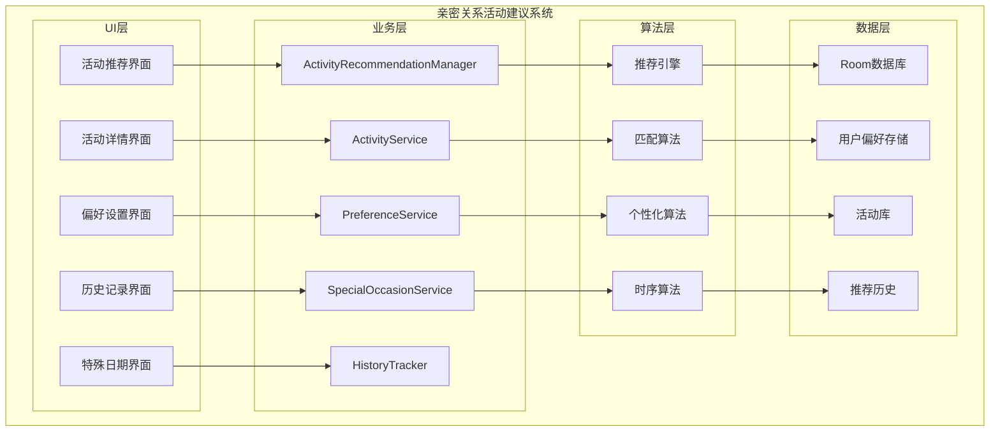
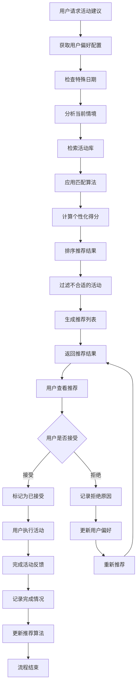

# LuminCore 亲密关系活动建议功能详细开发计划


## 📋 项目概述

### 系统目标
开发一套智能的亲密关系活动建议系统，根据用户的关系状态、兴趣爱好、特殊日期等因素，为用户提供个性化、创意性的亲密活动建议，帮助用户增进与伴侣的感情，创造美好回忆。

### 核心价值
- **个性化推荐**：基于用户偏好和关系状态提供定制化活动建议
- **创意灵感**：提供新颖有趣的活动创意，打破日常单调
- **情感连接**：通过共同活动增强伴侣间的情感纽带
- **特殊纪念**：针对重要日期提供专属活动方案
- **轻松实施**：提供详细的活动指导，便于用户实践

## 🎯 功能需求分析

### 1. 活动分类体系

#### 1.1 活动类型分类
```kotlin
enum class ActivityCategory(
    val displayName: String,
    val description: String,
    val suitableScenarios: List<String>
) {
    ROMANTIC(
        "浪漫约会",
        "营造浪漫氛围，增进情感连接的活动",
        listOf("纪念日", "特殊庆祝", "日常惊喜", "重新点燃激情")
    ),
    ADVENTURE(
        "冒险探索",
        "一起尝试新事物，创造共同体验的活动",
        listOf("周末出游", "挑战自我", "探索未知", "增进默契")
    ),
    CREATIVE(
        "创意手工",
        "通过共同创作增进互动的活动",
        listOf("手工制作", "艺术创作", "DIY项目", "发挥创意")
    ),
    RELAXING(
        "放松休闲",
        "帮助双方放松身心，享受宁静时光的活动",
        listOf("居家放松", "减压放松", "恢复精力", "增进舒适感")
    ),
    LEARNING(
        "共同学习",
        "一起学习新知识或技能的活动",
        listOf("技能提升", "知识拓展", "智力挑战", "共同成长")
    ),
    PHYSICAL(
        "身体活动",
        "通过身体运动增进健康的活动",
        listOf("健身锻炼", "户外运动", "舞蹈学习", "增强体质")
    ),
    GIVING(
        "关爱付出",
        "表达关爱和感激的活动",
        listOf("惊喜礼物", "贴心服务", "情感表达", "增进感情")
    ),
    CELEBRATION(
        "庆祝纪念",
        "针对特殊日期和成就的庆祝活动",
        listOf("生日庆祝", "纪念日", "成就庆祝", "节日庆典")
    )
}
```

#### 1.2 活动属性定义
```kotlin
data class Activity(
    val id: String,
    val title: String,
    val category: ActivityCategory,
    val description: String,
    val duration: ActivityDuration,
    val costLevel: CostLevel,
    val difficulty: DifficultyLevel,
    val preparationTime: PreparationTime,
    val requiredItems: List<String>,
    val steps: List<ActivityStep>,
    val benefits: List<String>,
    val suitableRelationshipStages: Set<RelationshipStage>,
    val specialOccasions: Set<SpecialOccasion> = emptySet(),
    val moodRequirements: Set<MoodState> = emptySet(),
    val seasonality: Set<Season> = emptySet(),
    val createdAt: LocalDateTime = LocalDateTime.now()
)

enum class ActivityDuration {
    SHORT_30_MIN, MEDIUM_1_2_HOURS, LONG_HALF_DAY, EXTENDED_FULL_DAY
}

enum class CostLevel {
    FREE, LOW, MEDIUM, HIGH
}

enum class DifficultyLevel {
    EASY, MODERATE, CHALLENGING
}

enum class PreparationTime {
    NONE, MINIMAL_15_MIN, MODERATE_1_HOUR, EXTENSIVE_HALF_DAY
}

data class ActivityStep(
    val stepNumber: Int,
    val instruction: String,
    val estimatedTime: Int, // 分钟
    val tips: String? = null
)

enum class RelationshipStage {
    NEW, ESTABLISHED, LONG_TERM, MARRIED
}

enum class SpecialOccasion {
    BIRTHDAY, ANNIVERSARY, VALENTINES_DAY, NEW_YEAR, 
    MOVING_IN_TOGETHER, ENGAGEMENT, WEDDING, 
    ACHIEVEMENT, RECOVERY, APOLOGY
}

enum class MoodState {
    HAPPY, STRESSED, SAD, ROMANTIC, ADVENTUROUS, RELAXED
}

enum class Season {
    SPRING, SUMMER, AUTUMN, WINTER
}
```

### 2. 推荐机制设计

#### 2.1 用户偏好配置
```kotlin
data class ActivityPreferences(
    val userId: String,
    val favoriteCategories: Set<ActivityCategory> = emptySet(),
    val dislikedCategories: Set<ActivityCategory> = emptySet(),
    val budgetLevel: CostLevel = CostLevel.MEDIUM,
    val preferredDuration: ActivityDuration = ActivityDuration.MEDIUM_1_2_HOURS,
    val relationshipStage: RelationshipStage = RelationshipStage.ESTABLISHED,
    val interests: Set<String> = emptySet(), // 用户兴趣标签
    val allergiesOrLimitations: Set<String> = emptySet(), // 过敏或限制
    val specialDates: Map<String, SpecialOccasion> = emptyMap(), // 特殊日期
    val notificationSettings: NotificationSettings = NotificationSettings(),
    val lastUpdated: LocalDateTime = LocalDateTime.now()
)

data class NotificationSettings(
    val dailySuggestion: Boolean = true,
    val specialOccasionReminder: Boolean = true,
    val preferredTime: LocalTime = LocalTime.of(19, 0), // 晚上7点
    val notificationTone: String? = null
)

data class ActivityRecommendation(
    val recommendationId: String,
    val userId: String,
    val activity: Activity,
    val recommendationReason: String,
    val suitabilityScore: Float, // 0.0 - 1.0
    val recommendedAt: LocalDateTime = LocalDateTime.now(),
    val isAccepted: Boolean = false,
    val isCompleted: Boolean = false,
    val completionDate: LocalDateTime? = null
)
```

## 🏗️ 技术架构设计

### 1. 核心组件架构



### 2. 推荐流程



### 3. 核心服务实现
```kotlin
@Singleton
class ActivityRecommendationManager @Inject constructor(
    private val context: Context,
    private val activityService: ActivityService,
    private val preferenceService: PreferenceService,
    private val specialOccasionService: SpecialOccasionService,
    private val historyTracker: HistoryTracker,
    private val workManager: WorkManager
) {
    
    suspend fun getRecommendedActivities(
        userId: String,
        count: Int = 5
    ): List<ActivityRecommendation> {
        // 获取用户偏好
        val preferences = preferenceService.getPreferences(userId)
        
        // 检查特殊日期
        val specialOccasion = specialOccasionService.getCurrentSpecialOccasion(userId)
        
        // 分析当前情境
        val context = analyzeCurrentContext(userId, preferences, specialOccasion)
        
        // 检索活动库
        val candidateActivities = activityService.searchActivities(context)
        
        // 计算匹配得分
        val scoredActivities = candidateActivities.map { activity ->
            val score = calculateActivityScore(activity, preferences, context)
            activity to score
        }.sortedByDescending { it.second }
        
        // 生成推荐
        val recommendations = scoredActivities.take(count).map { (activity, score) ->
            ActivityRecommendation(
                recommendationId = UUID.randomUUID().toString(),
                userId = userId,
                activity = activity,
                recommendationReason = generateRecommendationReason(activity, preferences, context),
                suitabilityScore = score
            )
        }
        
        // 保存推荐记录
        recommendations.forEach { recommendation ->
            historyTracker.saveRecommendation(recommendation)
        }
        
        return recommendations
    }
    
    suspend fun scheduleDailyRecommendations(userId: String) {
        val preferences = preferenceService.getPreferences(userId)
        if (!preferences.notificationSettings.dailySuggestion) return
        
        val workRequest = PeriodicWorkRequestBuilder<ActivityRecommendationWorker>(
            1, TimeUnit.DAYS
        ).setInputData(workDataOf(
            "user_id" to userId,
            "recommendation_type" to "daily"
        )).setConstraints(
            Constraints.Builder()
                .setRequiresBatteryNotLow(true)
                .build()
        ).addTag("activity_recommendation_daily")
         .build()
         
        workManager.enqueue(workRequest)
    }
    
    suspend fun handleSpecialOccasion(userId: String, occasion: SpecialOccasion) {
        val preferences = preferenceService.getPreferences(userId)
        if (!preferences.notificationSettings.specialOccasionReminder) return
        
        // 获取针对特殊日期的活动
        val activities = activityService.getActivitiesForOccasion(occasion)
        
        // 个性化排序
        val preferences = preferenceService.getPreferences(userId)
        val personalizedActivities = activities.sortedByDescending { activity ->
            calculateActivityScore(activity, preferences, ActivityContext(specialOccasion = occasion))
        }
        
        // 推送通知
        if (personalizedActivities.isNotEmpty()) {
            val topActivity = personalizedActivities.first()
            sendSpecialOccasionNotification(userId, topActivity, occasion)
        }
    }
    
    suspend fun markActivityAsAccepted(recommendationId: String) {
        historyTracker.updateRecommendationStatus(
            recommendationId = recommendationId,
            isAccepted = true
        )
    }
    
    suspend fun markActivityAsCompleted(
        recommendationId: String,
        feedback: ActivityFeedback? = null
    ) {
        historyTracker.updateRecommendationStatus(
            recommendationId = recommendationId,
            isCompleted = true,
            completionDate = LocalDateTime.now()
        )
        
        if (feedback != null) {
            historyTracker.saveActivityFeedback(recommendationId, feedback)
            // 更新用户偏好基于反馈
            updatePreferencesBasedOnFeedback(recommendationId, feedback)
        }
    }
    
    private fun analyzeCurrentContext(
        userId: String,
        preferences: ActivityPreferences,
        specialOccasion: SpecialOccasion?
    ): ActivityContext {
        val currentMood = getCurrentUserMood(userId) // 从心情日记获取
        val currentSeason = getCurrentSeason()
        val relationshipDuration = getRelationshipDuration(userId)
        
        return ActivityContext(
            userMood = currentMood,
            season = currentSeason,
            relationshipStage = preferences.relationshipStage,
            specialOccasion = specialOccasion,
            relationshipDuration = relationshipDuration
        )
    }
    
    private fun calculateActivityScore(
        activity: Activity,
        preferences: ActivityPreferences,
        context: ActivityContext
    ): Float {
        var score = 0f
        var totalWeight = 0f
        
        // 类别偏好权重 (25%)
        if (activity.category in preferences.favoriteCategories) {
            score += 0.25f * 1.0f // 非常喜欢
            totalWeight += 0.25f
        } else if (activity.category !in preferences.dislikedCategories) {
            score += 0.25f * 0.5f // 一般喜欢
            totalWeight += 0.25f
        }
        
        // 预算匹配权重 (15%)
        val budgetScore = when {
            activity.costLevel == preferences.budgetLevel -> 1.0f
            activity.costLevel.ordinal <= preferences.budgetLevel.ordinal -> 0.8f
            else -> 0.5f
        }
        score += 0.15f * budgetScore
        totalWeight += 0.15f
        
        // 时长匹配权重 (10%)
        val durationScore = if (activity.duration == preferences.preferredDuration) 1.0f else 0.7f
        score += 0.10f * durationScore
        totalWeight += 0.10f
        
        // 情境匹配权重 (20%)
        val contextScore = calculateContextMatchScore(activity, context)
        score += 0.20f * contextScore
        totalWeight += 0.20f
        
        // 历史记录权重 (15%)
        val historyScore = calculateHistoryScore(activity, preferences.userId)
        score += 0.15f * historyScore
        totalWeight += 0.15f
        
        // 难度匹配权重 (10%)
        val difficultyScore = when (activity.difficulty) {
            DifficultyLevel.EASY -> 1.0f
            DifficultyLevel.MODERATE -> 0.8f
            DifficultyLevel.CHALLENGING -> 0.6f
        }
        score += 0.10f * difficultyScore
        totalWeight += 0.10f
        
        // 季节性权重 (5%)
        val seasonalScore = if (activity.seasonality.isEmpty() || 
                              getCurrentSeason() in activity.seasonality) 1.0f else 0.5f
        score += 0.05f * seasonalScore
        totalWeight += 0.05f
        
        return if (totalWeight > 0) score / totalWeight else 0f
    }
    
    private fun calculateContextMatchScore(
        activity: Activity,
        context: ActivityContext
    ): Float {
        var matchScore = 0f
        var totalFactors = 0f
        
        // 情绪匹配
        if (context.userMood != null && context.userMood in activity.moodRequirements) {
            matchScore += 1.0f
        } else if (activity.moodRequirements.isEmpty()) {
            matchScore += 0.8f // 无特定情绪要求
        }
        totalFactors += 1.0f
        
        // 特殊日期匹配
        if (context.specialOccasion != null && context.specialOccasion in activity.specialOccasions) {
            matchScore += 1.0f
        } else if (activity.specialOccasions.isEmpty()) {
            matchScore += 0.9f // 适用于任何日期
        }
        totalFactors += 1.0f
        
        // 关系阶段匹配
        if (context.relationshipStage in activity.suitableRelationshipStages) {
            matchScore += 1.0f
        }
        totalFactors += 1.0f
        
        return if (totalFactors > 0) matchScore / totalFactors else 0f
    }
    
    private fun calculateHistoryScore(activity: Activity, userId: String): Float {
        // 基于历史记录计算分数，避免重复推荐用户不喜欢的活动
        // 这里简化实现，实际应该查询历史数据
        return 0.7f
    }
    
    private fun generateRecommendationReason(
        activity: Activity,
        preferences: ActivityPreferences,
        context: ActivityContext
    ): String {
        val reasons = mutableListOf<String>()
        
        if (activity.category in preferences.favoriteCategories) {
            reasons.add("符合您的兴趣偏好")
        }
        
        if (context.specialOccasion != null && context.specialOccasion in activity.specialOccasions) {
            reasons.add("适合当前的特殊日期")
        }
        
        if (context.userMood != null && context.userMood in activity.moodRequirements) {
            reasons.add("匹配您当前的心情状态")
        }
        
        if (reasons.isEmpty()) {
            reasons.add("为您精心挑选的活动建议")
        }
        
        return reasons.joinToString("，")
    }
    
    private fun updatePreferencesBasedOnFeedback(
        recommendationId: String,
        feedback: ActivityFeedback
    ) {
        // 根据用户反馈更新偏好设置
        // 这里简化实现，实际应该分析反馈内容并调整偏好
    }
    
    private fun getCurrentUserMood(userId: String): MoodState? {
        // 从心情日记模块获取当前心情状态
        // 这里简化实现
        return null
    }
    
    private fun getCurrentSeason(): Season {
        val month = LocalDate.now().monthValue
        return when (month) {
            in 3..5 -> Season.SPRING
            in 6..8 -> Season.SUMMER
            in 9..11 -> Season.AUTUMN
            else -> Season.WINTER
        }
    }
    
    private fun getRelationshipDuration(userId: String): Int {
        // 计算关系持续时间（月数）
        // 这里简化实现
        return 12
    }
    
    private suspend fun sendSpecialOccasionNotification(
        userId: String,
        activity: Activity,
        occasion: SpecialOccasion
    ) {
        // 发送特殊日期提醒通知
        // 实现细节略
    }
}

data class ActivityContext(
    val userMood: MoodState? = null,
    val season: Season? = null,
    val relationshipStage: RelationshipStage? = null,
    val specialOccasion: SpecialOccasion? = null,
    val relationshipDuration: Int? = null
)

data class ActivityFeedback(
    val rating: Int, // 1-5分
    val enjoyedAspects: List<String>,
    val improvementSuggestions: List<String>,
    val wouldRecommend: Boolean,
    val comments: String? = null
)
```

## 🗃️ 数据模型设计

### 1. 活动实体
```kotlin
@Entity(tableName = "activities")
data class ActivityEntity(
    @PrimaryKey val id: String,
    val title: String,
    val category: String, // ActivityCategory的字符串表示
    val description: String,
    val duration: String, // ActivityDuration的字符串表示
    val costLevel: String, // CostLevel的字符串表示
    val difficulty: String, // DifficultyLevel的字符串表示
    val preparationTime: String, // PreparationTime的字符串表示
    val requiredItems: String, // JSON格式存储List<String>
    val steps: String, // JSON格式存储List<ActivityStep>
    val benefits: String, // JSON格式存储List<String>
    val suitableRelationshipStages: String, // JSON格式存储Set<RelationshipStage>
    val specialOccasions: String, // JSON格式存储Set<SpecialOccasion>
    val moodRequirements: String, // JSON格式存储Set<MoodState>
    val seasonality: String, // JSON格式存储Set<Season>
    val createdAt: LocalDateTime
)

@Entity(tableName = "activity_preferences")
data class ActivityPreferencesEntity(
    @PrimaryKey val userId: String,
    val favoriteCategories: String, // JSON格式存储Set<ActivityCategory>
    val dislikedCategories: String, // JSON格式存储Set<ActivityCategory>
    val budgetLevel: String, // CostLevel的字符串表示
    val preferredDuration: String, // ActivityDuration的字符串表示
    val relationshipStage: String, // RelationshipStage的字符串表示
    val interests: String, // JSON格式存储Set<String>
    val allergiesOrLimitations: String, // JSON格式存储Set<String>
    val specialDates: String, // JSON格式存储Map<String, SpecialOccasion>
    val notificationSettings: String, // JSON格式存储NotificationSettings
    val lastUpdated: LocalDateTime
)

@Entity(tableName = "activity_recommendations")
data class ActivityRecommendationEntity(
    @PrimaryKey val recommendationId: String,
    val userId: String,
    val activityId: String,
    val recommendationReason: String,
    val suitabilityScore: Float,
    val recommendedAt: LocalDateTime,
    val isAccepted: Boolean,
    val isCompleted: Boolean,
    val completionDate: LocalDateTime? = null,
    val createdAt: LocalDateTime = LocalDateTime.now()
)

@Entity(tableName = "activity_feedback")
data class ActivityFeedbackEntity(
    @PrimaryKey val feedbackId: String,
    val recommendationId: String,
    val rating: Int,
    val enjoyedAspects: String, // JSON格式存储List<String>
    val improvementSuggestions: String, // JSON格式存储List<String>
    val wouldRecommend: Boolean,
    val comments: String? = null,
    val createdAt: LocalDateTime = LocalDateTime.now()
)

@Entity(tableName = "special_dates")
data class SpecialDateEntity(
    @PrimaryKey val dateId: String,
    val userId: String,
    val date: LocalDate,
    val occasion: String, // SpecialOccasion的字符串表示
    val title: String,
    val isRecurring: Boolean,
    val createdAt: LocalDateTime = LocalDateTime.now()
)

data class ActivityStep(
    val stepNumber: Int,
    val instruction: String,
    val estimatedTime: Int, // 分钟
    val tips: String? = null
)
```

## 🔐 安全与隐私设计

### 1. 数据安全机制
- **用户完全控制**：用户可随时开启/关闭活动建议功能
- **最小数据原则**：仅收集必要的偏好和活动相关信息
- **本地存储优先**：所有数据默认本地存储
- **加密存储**：敏感数据使用AES-256加密
- **访问控制**：严格的身份验证和权限管理

### 2. 隐私保护措施
```kotlin
@Singleton
class ActivityPrivacyService @Inject constructor(
    private val encryptionService: EncryptionService,
    private val keyManager: KeyManager
) {
    
    fun encryptActivityData(data: String): String {
        val encryptedData = encryptionService.encrypt(data)
        return Base64.encodeToString(encryptedData.data, Base64.DEFAULT)
    }
    
    fun anonymizeActivityRecommendation(recommendation: ActivityRecommendation): AnonymizedRecommendation {
        return AnonymizedRecommendation(
            recommendationId = recommendation.recommendationId,
            activityTitle = recommendation.activity.title,
            category = recommendation.activity.category.name,
            suitabilityScore = recommendation.suitabilityScore,
            recommendedAt = recommendation.recommendedAt
        )
    }
    
    fun generateActivityReport(userId: String, period: ReportPeriod): String {
        // 生成不包含个人身份信息的活动报告
        val sb = StringBuilder()
        sb.append("亲密活动报告\n")
        sb.append("统计周期: ${period.startDate} 至 ${period.endDate}\n\n")
        
        sb.append("活动参与情况:\n")
        // 这里应该添加具体的统计数据
        
        sb.append("\n热门活动类型:\n")
        // 这里应该添加活动类型统计
        
        sb.append("\n改进建议:\n")
        // 这里应该添加具体的改进建议
        
        return sb.toString()
    }
}

data class AnonymizedRecommendation(
    val recommendationId: String,
    val activityTitle: String,
    val category: String,
    val suitabilityScore: Float,
    val recommendedAt: LocalDateTime
)

data class ReportPeriod(
    val startDate: LocalDate,
    val endDate: LocalDate
)
```

## 📊 实施计划

### 第一阶段：基础架构与数据模型（2034年7月 - 2034年8月）

#### 第1-2周（2034年7月1日 - 7月14日）：项目初始化
- [ ] 创建功能模块目录结构
- [ ] 设计数据模型和数据库Schema
- [ ] 定义核心接口和抽象类
- [ ] 配置依赖注入模块
- [ ] 编写基础单元测试框架

#### 第3-4周（2034年7月15日 - 7月28日）：数据层实现
- [ ] 实现Room数据库实体和DAO
- [ ] 开发Repository层
- [ ] 构建数据验证逻辑
- [ ] 实现数据迁移方案
- [ ] 编写数据层单元测试

#### 第5-6周（2034年7月29日 - 8月11日）：服务层开发
- [ ] 实现活动推荐管理服务
- [ ] 开发活动服务
- [ ] 构建偏好服务
- [ ] 实现特殊日期服务
- [ ] 编写服务层测试

#### 第7-8周（2034年8月12日 - 8月25日）：基础UI框架
- [ ] 设计活动推荐界面布局
- [ ] 实现活动详情界面
- [ ] 开发偏好设置界面
- [ ] 构建历史记录界面
- [ ] 完成第一阶段集成测试

### 第二阶段：核心功能开发（2034年9月 - 2034年10月）

#### 第9-10周（2034年8月26日 - 9月8日）：推荐算法完善
- [ ] 实现活动匹配算法
- [ ] 开发个性化推荐引擎
- [ ] 构建时序推荐算法
- [ ] 实现推荐理由生成
- [ ] 完善算法测试

#### 第11-12周（2034年9月9日 - 9月22日）：活动库建设
- [ ] 构建基础活动库
- [ ] 实现活动分类管理
- [ ] 开发活动搜索功能
- [ ] 构建活动详情展示
- [ ] 优化活动数据结构

#### 第13-14周（2034年9月23日 - 10月6日）：用户交互功能
- [ ] 实现活动接受/拒绝功能
- [ ] 开发活动完成反馈
- [ ] 构建活动历史追踪
- [ ] 实现偏好更新机制
- [ ] 优化用户交互流程

#### 第15-16周（2034年10月7日 - 10月20日）：功能集成与优化
- [ ] 集成所有核心功能模块
- [ ] 优化算法性能和准确性
- [ ] 实现缓存和并发优化
- [ ] 完成第二阶段功能测试
- [ ] 性能基准测试和调优

### 第三阶段：高级功能与用户体验（2034年11月 - 2034年12月）

#### 第17-18周（2034年10月21日 - 11月3日）：智能提醒系统
- [ ] 开发每日推荐功能
- [ ] 实现特殊日期提醒
- [ ] 构建个性化提醒设置
- [ ] 优化提醒推送机制
- [ ] 实现提醒反馈处理

#### 第19-20周（2034年11月4日 - 11月17日）：社交分享功能
- [ ] 实现活动分享功能
- [ ] 开发成就系统
- [ ] 构建社区展示模块
- [ ] 实现用户互动功能
- [ ] 完善内容审核机制

#### 第21-22周（2034年11月18日 - 12月1日）：数据分析与洞察
- [ ] 构建活动效果分析
- [ ] 实现趋势洞察功能
- [ ] 开发个性化报告
- [ ] 构建数据可视化组件
- [ ] 优化分析算法

#### 第23-24周（2034年12月2日 - 12月15日）：上线准备
- [ ] 功能文档编写和更新
- [ ] 用户指南和帮助文档
- [ ] 应用内引导流程完善
- [ ] Beta版本发布和用户反馈收集
- [ ] 最终优化和bug修复

## 🎯 关键里程碑

### 里程碑1：基础架构完成（2034年8月25日）
- ✅ 数据模型和数据库实现
- ✅ 核心服务层开发完成
- ✅ 基础UI框架搭建完成
- ✅ 单元测试覆盖率 ≥ 80%

### 里程碑2：核心功能上线（2034年10月20日）
- ✅ 活动推荐功能完整实现
- ✅ 推荐算法正常运行
- ✅ 用户交互功能完善
- ✅ 集成测试全部通过

### 里程碑3：功能完整发布（2034年12月15日）
- ✅ 智能提醒系统运行正常
- ✅ 社交分享功能完善
- ✅ 数据分析功能完成
- ✅ 准备正式版本发布

## 🛡️ 风险评估与缓解策略

### 技术风险
**风险1**: 推荐算法准确性不足
- **缓解策略**: 基于用户反馈持续优化算法，引入机器学习模型
- **应急计划**: 提供手动筛选功能，增加用户控制选项

**风险2**: 活动库内容质量控制
- **缓解策略**: 建立内容审核机制，邀请专业人士参与内容设计
- **应急计划**: 提供用户举报功能，定期更新优化内容

### 用户风险
**风险3**: 用户参与度不高
- **缓解策略**: 设计游戏化元素，提供激励机制
- **应急计划**: 简化使用流程，提供个性化体验

**风险4**: 敏感内容处理
- **缓解策略**: 严格内容审核，提供举报机制
- **应急计划**: 建立危机处理流程，及时响应用户反馈

### 时间风险
**风险5**: 开发进度延期
- **缓解策略**: 预留20%缓冲时间，关键路径管理
- **应急计划**: 功能优先级调整，分批次发布

## 💰 资源需求

### 人力资源
- **Android开发工程师**: 1人（全职）
- **UI/UX设计师**: 0.5人（设计支持）
- **产品经理**: 0.3人（需求分析）
- **测试工程师**: 0.3人（测试支持）
- **内容策划师**: 0.5人（活动内容设计）

### 技术资源
- **开发环境**: Android Studio, Git, CI/CD
- **第三方服务**: 无（纯本地实现）
- **硬件需求**: 标准开发设备和测试设备

### 预算估算
- **开发成本**: 人力成本为主
- **第三方库**: 开源库，无额外费用
- **基础设施**: 无云服务费用（本地优先）

## 📈 成功衡量标准

### 技术指标
- **功能完成度**: 100%核心功能实现
- **代码质量**: 单元测试覆盖率 ≥ 85%
- **性能指标**: 推荐计算时间 ≤ 1秒
- **稳定性**: 崩溃率 ≤ 0.1%

### 用户指标
- **采用率**: 新功能使用率 ≥ 40%
- **满意度**: 用户评分 ≥ 4.3/5.0
- **参与度**: 活动接受率 ≥ 60%
- **完成率**: 活动完成率 ≥ 50%

### 业务指标
- **用户增长**: 功能上线后用户增长率提升
- **使用时长**: 平均会话时长增加
- **用户价值**: 用户生命周期价值提升
- **竞争优势**: 市场差异化功能建立

---

**文档版本**: 1.0.0
**创建日期**: 2025年9月25日
**计划负责人**: 祁潇潇
**审核状态**: 已审核
**预计开始时间**: 2034年7月1日
**预计完成时间**: 2034年12月15日
## 🔄 相关依赖
- [AI健康助手功能](./AI_HEALTH_ASSISTANT_PLAN.md)
- [数据加密功能](./DATA_ENCRYPTION_PLAN.md)
- [云端同步架构](./CLOUD_SYNC_ARCHITECTURE_PLAN.md)
- [可穿戴设备集成](./WEARABLE_DEVICE_INTEGRATION_PLAN.md)