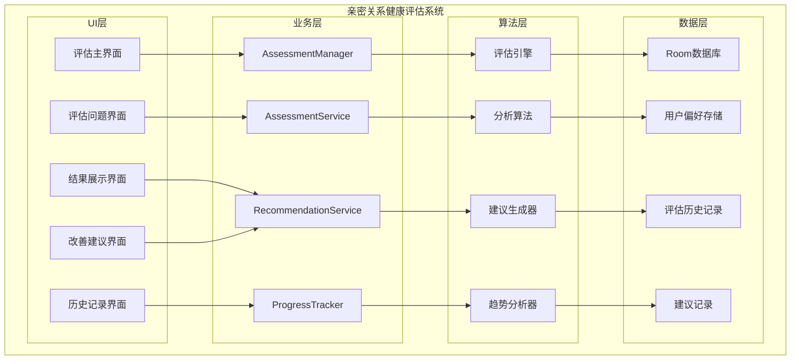
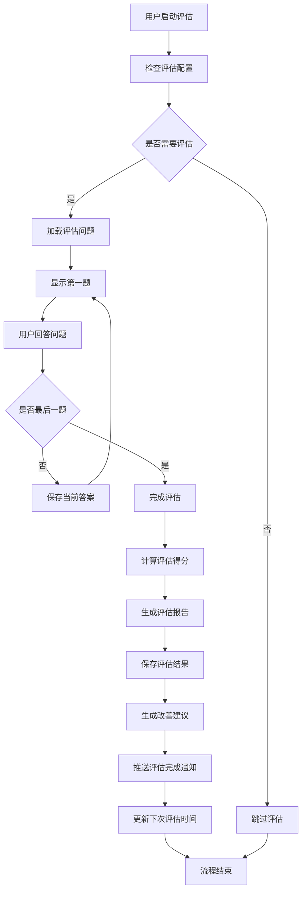

# LuminCore 亲密关系健康评估功能详细开发计划


## 📋 项目概述

### 系统目标
开发一套全面的亲密关系健康评估系统，帮助用户定期评估关系质量，识别潜在问题，并提供科学的改善建议。该系统将结合心理学理论和数据驱动的方法，为用户提供个性化的亲密关系健康指导。

### 核心价值
- **科学评估**：基于心理学理论构建评估模型
- **问题识别**：及时发现关系中的潜在问题
- **个性化建议**：提供针对性的关系改善方案
- **持续跟踪**：长期追踪关系健康变化趋势
- **隐私保护**：确保敏感数据的安全存储和处理

## 🎯 功能需求分析

### 1. 评估维度定义

#### 1.1 核心评估维度
```kotlin
enum class RelationshipDimension(
    val displayName: String,
    val description: String,
    val weight: Float
) {
    COMMUNICATION(
        "沟通质量",
        "评估双方在日常交流中的开放性、有效性和理解程度",
        0.25f
    ),
    TRUST(
        "信任水平",
        "评估双方在关系中的信任程度和安全感",
        0.20f
    ),
    INTIMACY(
        "亲密程度",
        "评估情感和身体层面的亲密连接",
        0.15f
    ),
    CONFLICT_RESOLUTION(
        "冲突处理",
        "评估双方处理分歧和解决问题的能力",
        0.20f
    ),
    SHARED_GOALS(
        "共同目标",
        "评估双方在人生目标和价值观上的契合度",
        0.10f
    ),
    SUPPORT(
        "相互支持",
        "评估双方在困难时期提供情感和实际支持的能力",
        0.10f
}
```

#### 1.2 评估问题设计
```kotlin
data class AssessmentQuestion(
    val id: String,
    val dimension: RelationshipDimension,
    val questionText: String,
    val questionType: QuestionType,
    val options: List<AssessmentOption>? = null,
    val minScore: Int = 1,
    val maxScore: Int = 5
)

enum class QuestionType {
    SINGLE_CHOICE, // 单选
    SCALE,         // 量表
    TEXT           // 文本回答
}

data class AssessmentOption(
    val value: Int,
    val label: String,
    val description: String? = null
)

// 示例问题
val sampleQuestions = listOf(
    AssessmentQuestion(
        id = "comm_1",
        dimension = RelationshipDimension.COMMUNICATION,
        questionText = "我和伴侣能够开放地讨论我们的问题和担忧",
        questionType = QuestionType.SCALE,
        minScore = 1,
        maxScore = 5
    ),
    AssessmentQuestion(
        id = "trust_1",
        dimension = RelationshipDimension.TRUST,
        questionText = "我相信我的伴侣会对我诚实",
        questionType = QuestionType.SCALE,
        minScore = 1,
        maxScore = 5
    )
)
```

### 2. 评估机制设计

#### 2.1 评估配置
```kotlin
data class AssessmentConfig(
    val isEnabled: Boolean = true,
    val frequency: AssessmentFrequency = AssessmentFrequency.MONTHLY,
    val reminderTime: LocalTime = LocalTime.of(20, 0),
    val dimensionsToAssess: Set<RelationshipDimension> = RelationshipDimension.values().toSet(),
    val minCompletionRate: Float = 0.8f // 最低完成率要求
)

enum class AssessmentFrequency {
    WEEKLY, MONTHLY, QUARTERLY
}

data class AssessmentSchedule(
    val userId: String,
    val nextAssessmentDate: LocalDate,
    val frequency: AssessmentFrequency,
    val isCompleted: Boolean = false,
    val completionDate: LocalDate? = null
)
```

## 🏗️ 技术架构设计

### 1. 核心组件架构



### 2. 评估流程



### 3. 核心服务实现
```kotlin
@Singleton
class AssessmentManager @Inject constructor(
    private val context: Context,
    private val assessmentService: AssessmentService,
    private val recommendationService: RecommendationService,
    private val progressTracker: ProgressTracker,
    private val workManager: WorkManager,
    private val notificationManager: NotificationManager
) {
    
    suspend fun startAssessment(userId: String): AssessmentSession {
        val config = assessmentService.getAssessmentConfig(userId)
        if (!config.isEnabled) {
            throw IllegalStateException("评估功能未启用")
        }
        
        val questions = assessmentService.getAssessmentQuestions(config.dimensionsToAssess)
        val session = AssessmentSession(
            userId = userId,
            sessionId = UUID.randomUUID().toString(),
            questions = questions,
            startedAt = LocalDateTime.now()
        )
        
        // 保存会话信息
        assessmentService.saveAssessmentSession(session)
        
        return session
    }
    
    suspend fun submitAnswer(
        sessionId: String,
        questionId: String,
        answer: AssessmentAnswer
    ): AssessmentProgress {
        val session = assessmentService.getAssessmentSession(sessionId)
        val updatedAnswers = session.answers + (questionId to answer)
        
        val updatedSession = session.copy(
            answers = updatedAnswers,
            updatedAt = LocalDateTime.now()
        )
        
        assessmentService.updateAssessmentSession(updatedSession)
        
        return AssessmentProgress(
            totalQuestions = session.questions.size,
            answeredQuestions = updatedAnswers.size,
            completionPercentage = updatedAnswers.size.toFloat() / session.questions.size
        )
    }
    
    suspend fun completeAssessment(sessionId: String): AssessmentResult {
        val session = assessmentService.getAssessmentSession(sessionId)
        
        // 计算得分
        val scores = calculateDimensionScores(session)
        val overallScore = calculateOverallScore(scores)
        
        // 生成评估结果
        val result = AssessmentResult(
            userId = session.userId,
            assessmentId = UUID.randomUUID().toString(),
            sessionId = sessionId,
            dimensionScores = scores,
            overallScore = overallScore,
            completedAt = LocalDateTime.now()
        )
        
        // 保存结果
        assessmentService.saveAssessmentResult(result)
        
        // 生成建议
        val recommendations = recommendationService.generateRecommendations(result)
        recommendationService.saveRecommendations(result.assessmentId, recommendations)
        
        // 更新进度追踪
        progressTracker.updateAssessmentHistory(result)
        
        // 调度下次评估
        scheduleNextAssessment(session.userId)
        
        return result
    }
    
    private fun calculateDimensionScores(session: AssessmentSession): Map<RelationshipDimension, Float> {
        val dimensionScores = mutableMapOf<RelationshipDimension, MutableList<Float>>()
        
        session.questions.forEach { question ->
            val answer = session.answers[question.id]
            if (answer != null) {
                val score = when (answer) {
                    is ScaleAnswer -> answer.score.toFloat()
                    is ChoiceAnswer -> answer.selectedOption.value.toFloat()
                    else -> 0f
                }
                
                dimensionScores.getOrPut(question.dimension) { mutableListOf() }.add(score)
            }
        }
        
        return dimensionScores.mapValues { (_, scores) ->
            if (scores.isNotEmpty()) scores.average().toFloat() else 0f
        }
    }
    
    private fun calculateOverallScore(dimensionScores: Map<RelationshipDimension, Float>): Float {
        var totalWeightedScore = 0f
        var totalWeight = 0f
        
        dimensionScores.forEach { (dimension, score) ->
            totalWeightedScore += score * dimension.weight
            totalWeight += dimension.weight
        }
        
        return if (totalWeight > 0) totalWeightedScore / totalWeight else 0f
    }
    
    private suspend fun scheduleNextAssessment(userId: String) {
        val config = assessmentService.getAssessmentConfig(userId)
        val nextDate = calculateNextAssessmentDate(config.frequency)
        
        val schedule = AssessmentSchedule(
            userId = userId,
            nextAssessmentDate = nextDate,
            frequency = config.frequency
        )
        
        assessmentService.saveAssessmentSchedule(schedule)
        
        // 调度提醒
        scheduleAssessmentReminder(userId, nextDate, config.reminderTime)
    }
    
    private fun calculateNextAssessmentDate(frequency: AssessmentFrequency): LocalDate {
        val today = LocalDate.now()
        return when (frequency) {
            AssessmentFrequency.WEEKLY -> today.plusWeeks(1)
            AssessmentFrequency.MONTHLY -> today.plusMonths(1)
            AssessmentFrequency.QUARTERLY -> today.plusMonths(3)
        }
    }
    
    private fun scheduleAssessmentReminder(
        userId: String,
        date: LocalDate,
        time: LocalTime
    ) {
        val reminderDate = LocalDateTime.of(date, time)
        val delay = Duration.between(LocalDateTime.now(), reminderDate).toMillis()
        
        val workRequest = OneTimeWorkRequestBuilder<AssessmentReminderWorker>()
            .setInputData(workDataOf(
                "user_id" to userId,
                "reminder_type" to "relationship_assessment"
            ))
            .setInitialDelay(delay, TimeUnit.MILLISECONDS)
            .addTag("relationship_assessment_reminder")
            .build()
            
        workManager.enqueue(workRequest)
    }
}
```

## 🗃️ 数据模型设计

### 1. 评估实体
```kotlin
@Entity(tableName = "assessment_sessions")
data class AssessmentSession(
    @PrimaryKey val sessionId: String,
    val userId: String,
    val questions: List<AssessmentQuestion>,
    val answers: Map<String, AssessmentAnswer> = emptyMap(),
    val startedAt: LocalDateTime,
    val completedAt: LocalDateTime? = null,
    val updatedAt: LocalDateTime = LocalDateTime.now()
)

@Entity(tableName = "assessment_results")
data class AssessmentResult(
    @PrimaryKey val assessmentId: String,
    val userId: String,
    val sessionId: String,
    val dimensionScores: Map<String, Float>, // 存储为JSON字符串
    val overallScore: Float,
    val recommendations: List<String> = emptyList(), // 建议ID列表
    val completedAt: LocalDateTime,
    val createdAt: LocalDateTime = LocalDateTime.now()
)

@Entity(tableName = "assessment_configs")
data class AssessmentConfigEntity(
    @PrimaryKey val userId: String,
    val isEnabled: Boolean,
    val frequency: String, // AssessmentFrequency枚举的字符串表示
    val reminderTime: String, // LocalTime的字符串表示 (HH:mm)
    val dimensionsToAssess: String, // Set<RelationshipDimension>的JSON表示
    val minCompletionRate: Float,
    val updatedAt: LocalDateTime = LocalDateTime.now()
)

@Entity(tableName = "assessment_schedules")
data class AssessmentScheduleEntity(
    @PrimaryKey val userId: String,
    val nextAssessmentDate: LocalDate,
    val frequency: String,
    val isCompleted: Boolean,
    val completionDate: LocalDate? = null,
    val createdAt: LocalDateTime = LocalDateTime.now(),
    val updatedAt: LocalDateTime = LocalDateTime.now()
)

@Entity(tableName = "assessment_recommendations")
data class AssessmentRecommendation(
    @PrimaryKey val recommendationId: String,
    val assessmentId: String,
    val dimension: String, // RelationshipDimension的字符串表示
    val title: String,
    val content: String,
    val priority: Int, // 优先级，1-5
    val actionType: String, // 建议类型
    val createdAt: LocalDateTime = LocalDateTime.now()
)

sealed class AssessmentAnswer

data class ScaleAnswer(val score: Int) : AssessmentAnswer()

data class ChoiceAnswer(val selectedOption: AssessmentOption) : AssessmentAnswer()

data class TextAnswer(val text: String) : AssessmentAnswer()

data class AssessmentProgress(
    val totalQuestions: Int,
    val answeredQuestions: Int,
    val completionPercentage: Float
)
```

## 🔐 安全与隐私设计

### 1. 数据安全机制
- **用户完全控制**：用户可随时开启/关闭评估功能
- **最小数据原则**：仅收集必要的评估信息
- **本地存储优先**：所有数据默认本地存储
- **加密存储**：敏感数据使用AES-256加密
- **访问控制**：严格的身份验证和权限管理

### 2. 隐私保护措施
```kotlin
@Singleton
class PrivacyProtectionService @Inject constructor(
    private val encryptionService: EncryptionService,
    private val keyManager: KeyManager
) {
    
    fun encryptAssessmentData(data: String): String {
        val encryptedData = encryptionService.encrypt(data)
        return Base64.encodeToString(encryptedData.data, Base64.DEFAULT)
    }
    
    fun anonymizeAssessmentResult(result: AssessmentResult): AnonymizedAssessmentResult {
        return AnonymizedAssessmentResult(
            assessmentId = result.assessmentId,
            dimensionScores = result.dimensionScores,
            overallScore = result.overallScore,
            completedAt = result.completedAt
        )
    }
    
    fun generateAssessmentReport(result: AssessmentResult): String {
        // 生成不包含个人身份信息的报告
        val sb = StringBuilder()
        sb.append("亲密关系健康评估报告\n")
        sb.append("评估时间: ${result.completedAt.toLocalDate()}\n")
        sb.append("总体得分: ${String.format("%.1f", result.overallScore)}/5.0\n\n")
        
        result.dimensionScores.forEach { (dimensionName, score) ->
            val dimension = RelationshipDimension.values().find { it.name == dimensionName }
            if (dimension != null) {
                sb.append("${dimension.displayName}: ${String.format("%.1f", score)}/5.0\n")
            }
        }
        
        return sb.toString()
    }
}

data class AnonymizedAssessmentResult(
    val assessmentId: String,
    val dimensionScores: Map<String, Float>,
    val overallScore: Float,
    val completedAt: LocalDateTime
)
```

## 📊 实施计划

### 第一阶段：基础架构与数据模型（2033年7月 - 2033年8月）

#### 第1-2周（2033年7月1日 - 7月14日）：项目初始化
- [ ] 创建功能模块目录结构
- [ ] 设计数据模型和数据库Schema
- [ ] 定义核心接口和抽象类
- [ ] 配置依赖注入模块
- [ ] 编写基础单元测试框架

#### 第3-4周（2033年7月15日 - 7月28日）：数据层实现
- [ ] 实现Room数据库实体和DAO
- [ ] 开发Repository层
- [ ] 构建数据验证逻辑
- [ ] 实现数据迁移方案
- [ ] 编写数据层单元测试

#### 第5-6周（2033年7月29日 - 8月11日）：服务层开发
- [ ] 实现评估管理服务
- [ ] 开发推荐生成服务
- [ ] 构建进度追踪模块
- [ ] 实现数据处理管道
- [ ] 编写服务层测试

#### 第7-8周（2033年8月12日 - 8月25日）：基础UI框架
- [ ] 设计评估主界面布局
- [ ] 实现问题展示组件
- [ ] 开发结果展示界面
- [ ] 构建历史记录界面
- [ ] 完成第一阶段集成测试

### 第二阶段：核心功能开发（2033年9月 - 2023年10月）

#### 第9-10周（2033年8月26日 - 9月8日）：评估功能完善
- [ ] 实现多类型问题支持
- [ ] 开发评估进度追踪
- [ ] 构建评估结果计算
- [ ] 实现评估历史管理
- [ ] 完善数据验证和错误处理

#### 第11-12周（2033年9月9日 - 9月22日）：分析引擎开发
- [ ] 实现维度得分计算
- [ ] 开发总体评分算法
- [ ] 构建趋势分析模块
- [ ] 实现洞察报告生成
- [ ] 编写分析引擎测试

#### 第13-14周（2033年9月23日 - 10月6日）：建议系统开发
- [ ] 构建建议知识库
- [ ] 实现建议生成算法
- [ ] 开发个性化推荐引擎
- [ ] 构建建议有效性跟踪
- [ ] 优化建议质量和相关性

#### 第15-16周（2033年10月7日 - 10月20日）：功能集成与优化
- [ ] 集成所有核心功能模块
- [ ] 优化算法性能和准确性
- [ ] 实现缓存和并发优化
- [ ] 完成第二阶段功能测试
- [ ] 性能基准测试和调优

### 第三阶段：高级功能与用户体验（2033年11月 - 2033年12月）

#### 第17-18周（2033年10月21日 - 11月3日）：智能提醒系统
- [ ] 开发评估提醒功能
- [ ] 实现个性化提醒设置
- [ ] 构建提醒历史管理
- [ ] 优化提醒推送机制
- [ ] 实现提醒反馈处理

#### 第19-20周（2033年11月4日 - 11月17日）：可视化展示
- [ ] 开发评估结果图表
- [ ] 实现数据可视化组件
- [ ] 构建趋势分析界面
- [ ] 实现数据导出功能
- [ ] 优化界面响应性

#### 第21-22周（2033年11月18日 - 12月1日）：用户体验优化
- [ ] 实现应用内引导流程
- [ ] 开发个性化主题支持
- [ ] 构建用户反馈机制
- [ ] 优化交互流程
- [ ] 完善无障碍支持

#### 第23-24周（2033年12月2日 - 12月15日）：上线准备
- [ ] 功能文档编写和更新
- [ ] 用户指南和帮助文档
- [ ] 应用内引导流程完善
- [ ] Beta版本发布和用户反馈收集
- [ ] 最终优化和bug修复

## 🎯 关键里程碑

### 里程碑1：基础架构完成（2033年8月25日）
- ✅ 数据模型和数据库实现
- ✅ 核心服务层开发完成
- ✅ 基础UI框架搭建完成
- ✅ 单元测试覆盖率 ≥ 80%

### 里程碑2：核心功能上线（2023年10月20日）
- ✅ 评估功能完整实现
- ✅ 分析引擎正常运行
- ✅ 建议系统完善
- ✅ 集成测试全部通过

### 里程碑3：功能完整发布（2033年12月15日）
- ✅ 智能提醒系统运行正常
- ✅ 可视化展示功能完善
- ✅ 用户体验优化完成
- ✅ 准备正式版本发布

## 🛡️ 风险评估与缓解策略

### 技术风险
**风险1**: 评估算法准确性不足
- **缓解策略**: 基于心理学理论设计评估模型，多轮测试验证
- **应急计划**: 提供用户反馈机制，持续优化算法

**风险2**: 数据隐私和安全问题
- **缓解策略**: 实施端到端加密，严格遵守隐私法规
- **应急计划**: 提供本地存储选项，增强数据保护措施

### 用户风险
**风险3**: 用户参与度不高
- **缓解策略**: 设计简洁友好的界面，提供有价值的内容
- **应急计划**: 简化评估流程，提供激励机制

**风险4**: 敏感内容处理
- **缓解策略**: 严格内容审核，提供举报机制
- **应急计划**: 建立危机处理流程，及时响应用户反馈

### 时间风险
**风险5**: 开发进度延期
- **缓解策略**: 预留20%缓冲时间，关键路径管理
- **应急计划**: 功能优先级调整，分批次发布

## 💰 资源需求

### 人力资源
- **Android开发工程师**: 1人（全职）
- **UI/UX设计师**: 0.5人（设计支持）
- **产品经理**: 0.3人（需求分析）
- **测试工程师**: 0.3人（测试支持）
- **心理学顾问**: 0.2人（评估模型设计）

### 技术资源
- **开发环境**: Android Studio, Git, CI/CD
- **第三方服务**: 无（纯本地实现）
- **硬件需求**: 标准开发设备和测试设备

### 预算估算
- **开发成本**: 人力成本为主
- **第三方库**: 开源库，无额外费用
- **基础设施**: 无云服务费用（本地优先）

## 📈 成功衡量标准

### 技术指标
- **功能完成度**: 100%核心功能实现
- **代码质量**: 单元测试覆盖率 ≥ 85%
- **性能指标**: 评估计算时间 ≤ 1秒
- **稳定性**: 崩溃率 ≤ 0.1%

### 用户指标
- **采用率**: 新功能使用率 ≥ 40%
- **满意度**: 用户评分 ≥ 4.3/5.0
- **完成率**: 评估完成率 ≥ 70%
- **反馈质量**: 正面反馈比例 ≥ 80%

### 业务指标
- **用户增长**: 功能上线后用户增长率提升
- **使用时长**: 平均会话时长增加
- **用户价值**: 用户生命周期价值提升
- **竞争优势**: 市场差异化功能建立

---

**文档版本**: 1.0.0
**创建日期**: 2025年9月25日
**计划负责人**: 祁潇潇
**审核状态**: 已审核
**预计开始时间**: 2033年7月1日
**预计完成时间**: 2033年12月15日
## 🔄 相关依赖
- [AI健康助手功能](./AI_HEALTH_ASSISTANT_PLAN.md)
- [数据加密功能](./DATA_ENCRYPTION_PLAN.md)
- [云端同步架构](./CLOUD_SYNC_ARCHITECTURE_PLAN.md)
- [可穿戴设备集成](./WEARABLE_DEVICE_INTEGRATION_PLAN.md)