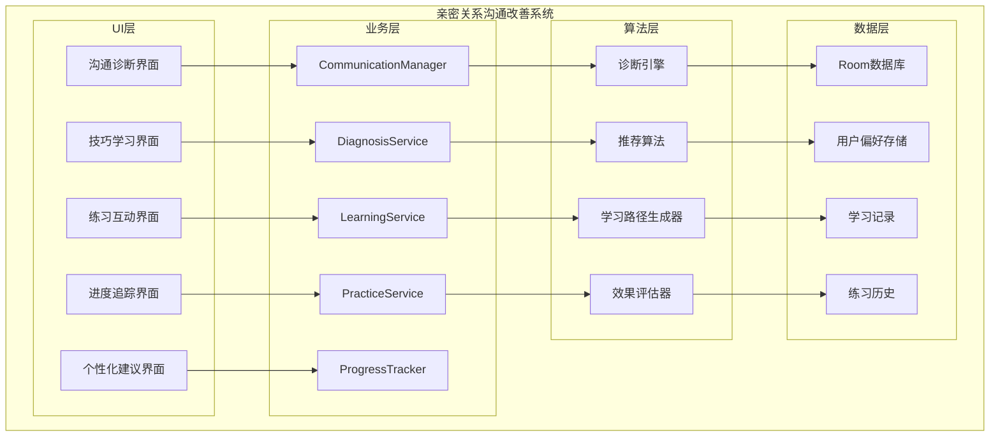
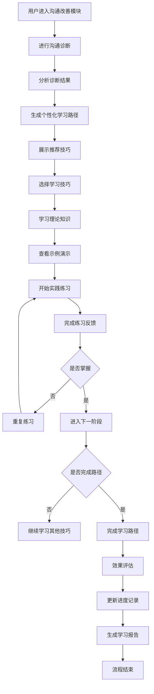

# LuminCore 亲密关系沟通改善功能详细开发计划


## 📋 项目概述

### 系统目标
开发一套专门针对亲密关系沟通改善的系统，帮助用户识别沟通问题、学习有效沟通技巧，并通过实践练习提升与伴侣的沟通质量。该系统将结合沟通理论、行为心理学和互动练习，为用户提供实用的沟通改善方案。

### 核心价值
- **问题识别**：帮助用户识别沟通中的问题模式
- **技巧学习**：提供科学有效的沟通技巧和方法
- **实践练习**：通过互动练习巩固学习成果
- **进度追踪**：记录沟通改善的进展和效果
- **个性化支持**：根据用户情况提供定制化建议

## 🎯 功能需求分析

### 1. 沟通问题分类

#### 1.1 常见沟通问题
```kotlin
enum class CommunicationIssue(
    val displayName: String,
    val description: String,
    val commonScenarios: List<String>
) {
    DEFENSIVE_LISTENING(
        "防御性倾听",
        "在沟通中过于关注为自己辩护，而不是理解对方",
        listOf("经常打断对方", "急于解释自己的观点", "感到被攻击时立即反击")
    ),
    CRITICISM(
        "批评指责",
        "以攻击性的方式表达不满，伤害对方感情",
        listOf("使用"你总是"、"你从不"等绝对化词语", "针对对方人格而非行为", "在公共场合批评对方")
    ),
    STONEWALLING(
        "冷战回避",
        "在冲突中选择沉默或回避，拒绝沟通",
        listOf("面对冲突时离开现场", "长时间不回应对方", "用沉默表达不满")
    ),
    CONTEMPT(
        "轻蔑嘲讽",
        "通过讽刺、嘲笑等方式表达对对方的不屑",
        listOf("使用讽刺性语言", "翻白眼或不屑的表情", "模仿对方说话方式")
    ),
    ASSUMPTIONS(
        "主观臆断",
        "未经确认就假设对方的想法或意图",
        listOf("替对方做决定", "不询问就认为了解对方想法", "误解对方行为动机")
    ),
    POOR_TIMING(
        "时机不当",
        "在不合适的时机进行重要沟通",
        listOf("在对方忙碌时讨论问题", "在情绪激动时争论", "选择公共场所讨论私密话题")
    )
}
```

#### 1.2 沟通技巧分类
```kotlin
enum class CommunicationSkill(
    val displayName: String,
    val description: String,
    val difficultyLevel: SkillLevel,
    val practiceMethods: List<String>
) {
    ACTIVE_LISTENING(
        "积极倾听",
        "全神贯注地倾听对方，理解并反馈对方的观点和感受",
        SkillLevel.BEGINNER,
        listOf("重复对方的关键信息", "表达对对方感受的理解", "避免打断对方")
    ),
    I_MESSAGES(
        "I信息表达",
        "用"我觉得"而非"你总是"的方式表达自己的感受和需求",
        SkillLevel.BEGINNER,
        listOf("描述具体行为而非人格", "表达自己的感受", "说明自己的需求")
    ),
    EMOTIONAL_INTELLIGENCE(
        "情绪管理",
        "识别、理解和管理自己及对方的情绪",
        SkillLevel.INTERMEDIATE,
        listOf("识别情绪触发点", "暂停冷静技巧", "情绪表达练习")
    ),
    CONFLICT_RESOLUTION(
        "冲突解决",
        "以建设性方式处理分歧，寻求双赢解决方案",
        SkillLevel.INTERMEDIATE,
        listOf("寻找共同目标", "头脑风暴解决方案", "妥协与协商")
    ),
    EMPATHY_BUILDING(
        "共情能力",
        "站在对方角度理解其感受和需求",
        SkillLevel.ADVANCED,
        listOf("换位思考练习", "情感共鸣训练", "非语言沟通观察")
    ),
    NONVERBAL_COMMUNICATION(
        "非语言沟通",
        "通过肢体语言、表情和语调传达信息",
        SkillLevel.ADVANCED,
        listOf("身体语言观察", "语调控制练习", "眼神交流训练")
    )
}

enum class SkillLevel {
    BEGINNER, INTERMEDIATE, ADVANCED
}
```

### 2. 功能模块设计

#### 2.1 沟通诊断模块
```kotlin
data class CommunicationDiagnosis(
    val userId: String,
    val diagnosisId: String,
    val issueIdentified: List<CommunicationIssue>,
    val skillGaps: List<CommunicationSkill>,
    val relationshipContext: RelationshipContext,
    val diagnosisDate: LocalDateTime,
    val recommendations: List<Recommendation>
)

data class RelationshipContext(
    val relationshipDuration: Int, // 关系持续月数
    val livingSituation: LivingSituation,
    val communicationFrequency: CommunicationFrequency,
    val conflictFrequency: ConflictFrequency
)

enum class LivingSituation {
    LIVING_TOGETHER, LIVING_APART, MARRIED, DATING
}

enum class CommunicationFrequency {
    DAILY, WEEKLY, MONTHLY, RARELY
}

enum class ConflictFrequency {
    NEVER, RARELY, OCCASIONALLY, FREQUENTLY, CONSTANTLY
}

data class Recommendation(
    val skill: CommunicationSkill,
    val priority: Int, // 1-5, 5为最高优先级
    val rationale: String, // 推荐理由
    val learningPath: List<LearningStep>
)

data class LearningStep(
    val stepId: String,
    val title: String,
    val description: String,
    val estimatedTime: Int, // 分钟
    val stepType: LearningStepType,
    val prerequisites: List<String> // 前置步骤ID
)

enum class LearningStepType {
    THEORY, EXAMPLE, PRACTICE, REFLECTION, ASSESSMENT
}
```

## 🏗️ 技术架构设计

### 1. 核心组件架构



### 2. 学习流程



### 3. 核心服务实现
```kotlin
@Singleton
class CommunicationManager @Inject constructor(
    private val context: Context,
    private val diagnosisService: DiagnosisService,
    private val learningService: LearningService,
    private val practiceService: PracticeService,
    private val progressTracker: ProgressTracker
) {
    
    suspend fun performCommunicationDiagnosis(userId: String): CommunicationDiagnosis {
        // 收集用户信息
        val userInfo = collectUserInfo(userId)
        
        // 进行诊断测试
        val testResults = diagnosisService.runDiagnosisTest(userId)
        
        // 分析结果
        val identifiedIssues = diagnosisService.identifyIssues(testResults)
        val skillGaps = diagnosisService.identifySkillGaps(testResults)
        
        // 生成推荐
        val recommendations = learningService.generateRecommendations(identifiedIssues, skillGaps)
        
        val diagnosis = CommunicationDiagnosis(
            userId = userId,
            diagnosisId = UUID.randomUUID().toString(),
            issueIdentified = identifiedIssues,
            skillGaps = skillGaps,
            relationshipContext = userInfo,
            diagnosisDate = LocalDateTime.now(),
            recommendations = recommendations
        )
        
        // 保存诊断结果
        diagnosisService.saveDiagnosis(diagnosis)
        
        return diagnosis
    }
    
    suspend fun startLearningPath(
        userId: String,
        skill: CommunicationSkill
    ): LearningPath {
        // 获取学习路径
        val learningPath = learningService.getLearningPath(skill)
        
        // 创建学习会话
        val session = LearningSession(
            sessionId = UUID.randomUUID().toString(),
            userId = userId,
            skill = skill,
            learningPath = learningPath,
            startedAt = LocalDateTime.now()
        )
        
        // 保存会话
        learningService.saveLearningSession(session)
        
        return LearningPath(
            pathId = session.sessionId,
            skill = skill,
            steps = learningPath,
            currentStepIndex = 0,
            progress = 0f
        )
    }
    
    suspend fun completeLearningStep(
        pathId: String,
        stepId: String,
        completionData: StepCompletionData
    ): LearningProgress {
        // 更新学习会话
        val session = learningService.getLearningSession(pathId)
        val updatedSteps = session.completedSteps + stepId
        val progress = updatedSteps.size.toFloat() / session.learningPath.size
        
        val updatedSession = session.copy(
            completedSteps = updatedSteps,
            progress = progress,
            updatedAt = LocalDateTime.now()
        )
        
        learningService.updateLearningSession(updatedSession)
        
        // 记录练习数据
        if (completionData.practiceResult != null) {
            practiceService.recordPracticeResult(
                PracticeRecord(
                    recordId = UUID.randomUUID().toString(),
                    userId = session.userId,
                    skill = session.skill,
                    stepId = stepId,
                    result = completionData.practiceResult,
                    completedAt = LocalDateTime.now()
                )
            )
        }
        
        // 更新进度追踪
        progressTracker.updateLearningProgress(
            userId = session.userId,
            skill = session.skill,
            progress = progress
        )
        
        return LearningProgress(
            pathId = pathId,
            currentStepIndex = updatedSteps.size,
            totalSteps = session.learningPath.size,
            progress = progress
        )
    }
    
    suspend fun assessSkillMastery(
        userId: String,
        skill: CommunicationSkill
    ): SkillMasteryAssessment {
        // 获取练习历史
        val practiceRecords = practiceService.getPracticeRecords(userId, skill)
        
        // 计算掌握程度
        val masteryLevel = calculateMasteryLevel(practiceRecords)
        
        // 生成评估报告
        val assessment = SkillMasteryAssessment(
            userId = userId,
            skill = skill,
            masteryLevel = masteryLevel,
            practiceCount = practiceRecords.size,
            averageScore = practiceRecords.map { it.result.score }.average().toFloat(),
            assessedAt = LocalDateTime.now()
        )
        
        // 保存评估结果
        learningService.saveMasteryAssessment(assessment)
        
        return assessment
    }
    
    private fun calculateMasteryLevel(practiceRecords: List<PracticeRecord>): MasteryLevel {
        if (practiceRecords.isEmpty()) return MasteryLevel.NOT_STARTED
        
        val recentRecords = practiceRecords.takeLast(5)
        val averageScore = recentRecords.map { it.result.score }.average()
        
        return when {
            averageScore >= 4.0 -> MasteryLevel.MASTERED
            averageScore >= 3.0 -> MasteryLevel.PROFICIENT
            averageScore >= 2.0 -> MasteryLevel.DEVELOPING
            else -> MasteryLevel.BEGINNER
        }
    }
    
    private suspend fun collectUserInfo(userId: String): RelationshipContext {
        // 这里应该从用户配置或其他模块获取信息
        // 为简化示例，返回默认值
        return RelationshipContext(
            relationshipDuration = 12,
            livingSituation = LivingSituation.LIVING_TOGETHER,
            communicationFrequency = CommunicationFrequency.DAILY,
            conflictFrequency = ConflictFrequency.OCCASIONALLY
        )
    }
}
```

## 🗃️ 数据模型设计

### 1. 沟通改善实体
```kotlin
@Entity(tableName = "communication_diagnoses")
data class CommunicationDiagnosisEntity(
    @PrimaryKey val diagnosisId: String,
    val userId: String,
    val issueIdentified: String, // JSON格式存储List<CommunicationIssue>
    val skillGaps: String, // JSON格式存储List<CommunicationSkill>
    val relationshipContext: String, // JSON格式存储RelationshipContext
    val diagnosisDate: LocalDateTime,
    val recommendations: String, // JSON格式存储List<Recommendation>
    val createdAt: LocalDateTime = LocalDateTime.now()
)

@Entity(tableName = "learning_sessions")
data class LearningSessionEntity(
    @PrimaryKey val sessionId: String,
    val userId: String,
    val skill: String, // CommunicationSkill的字符串表示
    val learningPath: String, // JSON格式存储List<LearningStep>
    val completedSteps: String, // JSON格式存储List<String>
    val progress: Float,
    val startedAt: LocalDateTime,
    val completedAt: LocalDateTime? = null,
    val createdAt: LocalDateTime = LocalDateTime.now(),
    val updatedAt: LocalDateTime = LocalDateTime.now()
)

@Entity(tableName = "practice_records")
data class PracticeRecordEntity(
    @PrimaryKey val recordId: String,
    val userId: String,
    val skill: String, // CommunicationSkill的字符串表示
    val stepId: String,
    val result: String, // JSON格式存储PracticeResult
    val completedAt: LocalDateTime,
    val createdAt: LocalDateTime = LocalDateTime.now()
)

@Entity(tableName = "skill_mastery_assessments")
data class SkillMasteryAssessmentEntity(
    @PrimaryKey val assessmentId: String,
    val userId: String,
    val skill: String, // CommunicationSkill的字符串表示
    val masteryLevel: String, // MasteryLevel的字符串表示
    val practiceCount: Int,
    val averageScore: Float,
    val assessedAt: LocalDateTime,
    val createdAt: LocalDateTime = LocalDateTime.now()
)

@Entity(tableName = "communication_progress")
data class CommunicationProgressEntity(
    @PrimaryKey val progressId: String,
    val userId: String,
    val skill: String, // CommunicationSkill的字符串表示
    val progress: Float, // 0.0 - 1.0
    val lastUpdated: LocalDateTime,
    val createdAt: LocalDateTime = LocalDateTime.now()
)

data class StepCompletionData(
    val practiceResult: PracticeResult? = null,
    val feedback: String? = null,
    val timeSpent: Int = 0 // 分钟
)

data class PracticeResult(
    val score: Int, // 1-5分
    val feedback: String,
    val areasForImprovement: List<String>
)

data class LearningPath(
    val pathId: String,
    val skill: CommunicationSkill,
    val steps: List<LearningStep>,
    val currentStepIndex: Int,
    val progress: Float
)

data class LearningProgress(
    val pathId: String,
    val currentStepIndex: Int,
    val totalSteps: Int,
    val progress: Float
)

enum class MasteryLevel {
    NOT_STARTED, BEGINNER, DEVELOPING, PROFICIENT, MASTERED
}

data class SkillMasteryAssessment(
    val userId: String,
    val skill: CommunicationSkill,
    val masteryLevel: MasteryLevel,
    val practiceCount: Int,
    val averageScore: Float,
    val assessedAt: LocalDateTime
)
```

## 🔐 安全与隐私设计

### 1. 数据安全机制
- **用户完全控制**：用户可随时开启/关闭沟通改善功能
- **最小数据原则**：仅收集必要的沟通相关信息
- **本地存储优先**：所有数据默认本地存储
- **加密存储**：敏感数据使用AES-256加密
- **访问控制**：严格的身份验证和权限管理

### 2. 隐私保护措施
```kotlin
@Singleton
class CommunicationPrivacyService @Inject constructor(
    private val encryptionService: EncryptionService,
    private val keyManager: KeyManager
) {
    
    fun encryptCommunicationData(data: String): String {
        val encryptedData = encryptionService.encrypt(data)
        return Base64.encodeToString(encryptedData.data, Base64.DEFAULT)
    }
    
    fun anonymizeDiagnosisResult(diagnosis: CommunicationDiagnosis): AnonymizedDiagnosis {
        return AnonymizedDiagnosis(
            diagnosisId = diagnosis.diagnosisId,
            issueIdentified = diagnosis.issueIdentified.map { it.name },
            skillGaps = diagnosis.skillGaps.map { it.name },
            diagnosisDate = diagnosis.diagnosisDate
        )
    }
    
    fun generateLearningReport(userId: String, skill: CommunicationSkill): String {
        // 生成不包含个人身份信息的学习报告
        val sb = StringBuilder()
        sb.append("沟通技巧学习报告\n")
        sb.append("技巧: ${skill.displayName}\n")
        sb.append("学习时间: ${LocalDate.now()}\n\n")
        
        sb.append("学习内容:\n")
        // 这里应该添加具体的学习内容摘要
        
        sb.append("\n改进建议:\n")
        // 这里应该添加具体的改进建议
        
        return sb.toString()
    }
}

data class AnonymizedDiagnosis(
    val diagnosisId: String,
    val issueIdentified: List<String>,
    val skillGaps: List<String>,
    val diagnosisDate: LocalDateTime
)
```

## 📊 实施计划

### 第一阶段：基础架构与数据模型（2034年1月 - 2034年2月）

#### 第1-2周（2034年1月1日 - 1月14日）：项目初始化
- [ ] 创建功能模块目录结构
- [ ] 设计数据模型和数据库Schema
- [ ] 定义核心接口和抽象类
- [ ] 配置依赖注入模块
- [ ] 编写基础单元测试框架

#### 第3-4周（2034年1月15日 - 1月28日）：数据层实现
- [ ] 实现Room数据库实体和DAO
- [ ] 开发Repository层
- [ ] 构建数据验证逻辑
- [ ] 实现数据迁移方案
- [ ] 编写数据层单元测试

#### 第5-6周（2034年1月29日 - 2月11日）：服务层开发
- [ ] 实现沟通管理服务
- [ ] 开发诊断服务
- [ ] 构建学习服务
- [ ] 实现练习服务
- [ ] 编写服务层测试

#### 第7-8周（2034年2月12日 - 2月25日）：基础UI框架
- [ ] 设计诊断界面布局
- [ ] 实现技巧学习界面
- [ ] 开发练习互动界面
- [ ] 构建进度追踪界面
- [ ] 完成第一阶段集成测试

### 第二阶段：核心功能开发（2034年3月 - 2034年4月）

#### 第9-10周（2034年2月26日 - 3月10日）：诊断功能完善
- [ ] 实现沟通问题识别算法
- [ ] 开发技能差距分析
- [ ] 构建个性化推荐引擎
- [ ] 实现诊断报告生成
- [ ] 完善数据验证和错误处理

#### 第11-12周（2034年3月11日 - 3月24日）：学习系统开发
- [ ] 实现学习路径生成算法
- [ ] 开发理论学习模块
- [ ] 构建示例演示功能
- [ ] 实现学习进度追踪
- [ ] 编写学习系统测试

#### 第13-14周（2034年3月25日 - 4月7日）：练习系统开发
- [ ] 构建互动练习框架
- [ ] 实现练习评估机制
- [ ] 开发反馈收集功能
- [ ] 构建练习历史管理
- [ ] 优化练习体验

#### 第15-16周（2034年4月8日 - 4月21日）：功能集成与优化
- [ ] 集成所有核心功能模块
- [ ] 优化算法性能和准确性
- [ ] 实现缓存和并发优化
- [ ] 完成第二阶段功能测试
- [ ] 性能基准测试和调优

### 第三阶段：高级功能与用户体验（2034年5月 - 2034年6月）

#### 第17-18周（2034年4月22日 - 5月5日）：效果评估系统
- [ ] 开发技能掌握评估
- [ ] 实现学习效果分析
- [ ] 构建长期趋势追踪
- [ ] 实现评估报告生成
- [ ] 优化评估准确性

#### 第19-20周（2034年5月6日 - 5月19日）：个性化支持
- [ ] 构建用户画像系统
- [ ] 实现自适应学习路径
- [ ] 开发智能推荐引擎
- [ ] 构建个性化内容生成
- [ ] 优化个性化体验

#### 第21-22周（2034年5月20日 - 6月2日）：社交功能集成
- [ ] 实现经验分享功能
- [ ] 开发社区讨论模块
- [ ] 构建专家咨询通道
- [ ] 实现用户互动功能
- [ ] 完善内容审核机制

#### 第23-24周（2034年6月3日 - 6月16日）：上线准备
- [ ] 功能文档编写和更新
- [ ] 用户指南和帮助文档
- [ ] 应用内引导流程完善
- [ ] Beta版本发布和用户反馈收集
- [ ] 最终优化和bug修复

## 🎯 关键里程碑

### 里程碑1：基础架构完成（2034年2月25日）
- ✅ 数据模型和数据库实现
- ✅ 核心服务层开发完成
- ✅ 基础UI框架搭建完成
- ✅ 单元测试覆盖率 ≥ 80%

### 里程碑2：核心功能上线（2034年4月21日）
- ✅ 沟通诊断功能完整实现
- ✅ 学习系统正常运行
- ✅ 练习系统完善
- ✅ 集成测试全部通过

### 里程碑3：功能完整发布（2034年6月16日）
- ✅ 效果评估系统运行正常
- ✅ 个性化支持功能完善
- ✅ 社交集成功能完成
- ✅ 准备正式版本发布

## 🛡️ 风险评估与缓解策略

### 技术风险
**风险1**: 诊断算法准确性不足
- **缓解策略**: 基于心理学理论设计诊断模型，多轮测试验证
- **应急计划**: 提供用户反馈机制，持续优化算法

**风险2**: 学习内容质量控制
- **缓解策略**: 邀请专业心理咨询师参与内容设计
- **应急计划**: 建立内容审核机制，定期更新优化

### 用户风险
**风险3**: 用户参与度不高
- **缓解策略**: 设计游戏化元素，提供激励机制
- **应急计划**: 简化使用流程，提供个性化体验

**风险4**: 敏感内容处理
- **缓解策略**: 严格内容审核，提供举报机制
- **应急计划**: 建立危机处理流程，及时响应用户反馈

### 时间风险
**风险5**: 开发进度延期
- **缓解策略**: 预留20%缓冲时间，关键路径管理
- **应急计划**: 功能优先级调整，分批次发布

## 💰 资源需求

### 人力资源
- **Android开发工程师**: 1人（全职）
- **UI/UX设计师**: 0.5人（设计支持）
- **产品经理**: 0.3人（需求分析）
- **测试工程师**: 0.3人（测试支持）
- **心理学顾问**: 0.5人（内容设计）

### 技术资源
- **开发环境**: Android Studio, Git, CI/CD
- **第三方服务**: 无（纯本地实现）
- **硬件需求**: 标准开发设备和测试设备

### 预算估算
- **开发成本**: 人力成本为主
- **第三方库**: 开源库，无额外费用
- **基础设施**: 无云服务费用（本地优先）

## 📈 成功衡量标准

### 技术指标
- **功能完成度**: 100%核心功能实现
- **代码质量**: 单元测试覆盖率 ≥ 85%
- **性能指标**: 诊断计算时间 ≤ 2秒
- **稳定性**: 崩溃率 ≤ 0.1%

### 用户指标
- **采用率**: 新功能使用率 ≥ 35%
- **满意度**: 用户评分 ≥ 4.2/5.0
- **完成率**: 学习路径完成率 ≥ 60%
- **反馈质量**: 正面反馈比例 ≥ 75%

### 业务指标
- **用户增长**: 功能上线后用户增长率提升
- **使用时长**: 平均会话时长增加
- **用户价值**: 用户生命周期价值提升
- **竞争优势**: 市场差异化功能建立

---

**文档版本**: 1.0.0
**创建日期**: 2025年9月25日
**计划负责人**: 祁潇潇
**审核状态**: 已审核
**预计开始时间**: 2034年1月1日
**预计完成时间**: 2034年6月16日
## 🔄 相关依赖
- [AI健康助手功能](./AI_HEALTH_ASSISTANT_PLAN.md)
- [数据加密功能](./DATA_ENCRYPTION_PLAN.md)
- [云端同步架构](./CLOUD_SYNC_ARCHITECTURE_PLAN.md)
- [可穿戴设备集成](./WEARABLE_DEVICE_INTEGRATION_PLAN.md)