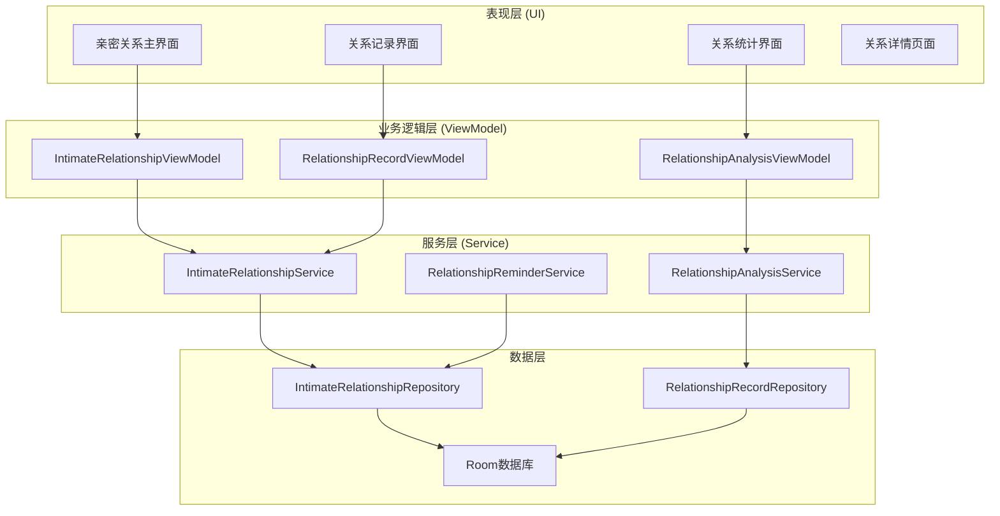
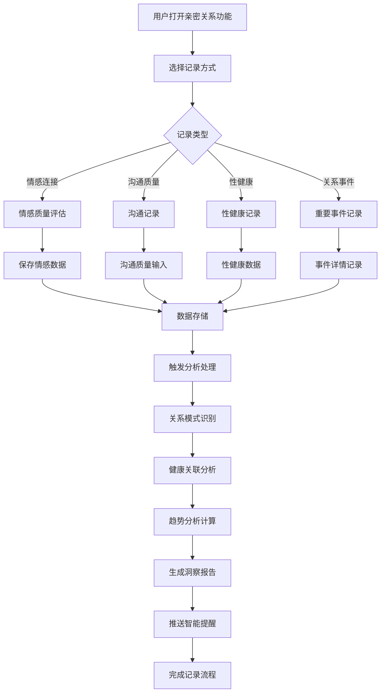

# LuminCore 亲密关系健康功能详细开发计划


## 📋 项目概述

亲密关系健康功能是LuminCore女性健康助手的重要扩展模块，旨在帮助用户记录、追踪和管理与亲密关系相关的健康数据，包括情感连接、性健康、沟通质量等多个维度，提供科学的指导和个性化的建议。

### 项目背景
- **用户痛点**：缺乏专门针对亲密关系健康的管理工具，难以系统性地关注和改善关系质量
- **市场需求**：现代女性对情感健康和亲密关系质量的关注度日益提升
- **技术基础**：基于现有心理健康模块和社区功能的技术积累
- **商业价值**：拓展应用功能边界，提升用户粘性和应用竞争力

### 核心价值主张
- **全面记录**：支持多维度亲密关系健康数据记录
- **智能分析**：发现关系质量与身心健康的关联模式
- **个性化建议**：基于数据提供改善关系质量的科学建议
- **隐私保护**：确保敏感数据的安全存储和传输

## 🎯 功能目标与成功指标

### 主要目标
1. **关系健康记录系统**：多维度亲密关系状态记录
2. **关系质量分析引擎**：关系质量与健康数据关联性分析
3. **可视化展示**：关系健康趋势图表和统计展示
4. **智能建议**：基于关系数据提供改善建议

### 成功指标
- **功能使用率**: ≥ 45%（用户使用亲密关系功能的比例）
- **记录连续性**: ≥ 60%（用户连续7天记录的比例）
- **用户满意度**: ≥ 4.3/5.0（功能使用评分）
- **关系洞察价值**: ≥ 70%（用户认为关系分析有价值的比例）
- **关系质量改善**: ≥ 55%（用户自报告关系质量改善）

## 🏗️ 技术架构设计

### 整体架构图



### 关系记录与分析流程



### 核心技术栈
- **数据存储**: Room Database 2.7.1
- **UI组件**: Material Design 3 + 自定义关系健康组件
- **异步处理**: Kotlin Coroutines 1.7.3
- **依赖注入**: Hilt 2.48
- **数据可视化**: MPAndroidChart 3.1.0
- **关系分析**: 自定义关系健康分析算法

## 📊 核心功能模块设计

### 1. 数据模型设计

#### 1.1 亲密关系实体
```
@Entity(tableName = "intimate_relationship_entries")
data class IntimateRelationshipEntry(
    @PrimaryKey val id: String = UUID.randomUUID().toString(),
    val date: LocalDate,                        // 记录日期
    val connectionQuality: ConnectionLevel,     // 情感连接质量
    val communicationQuality: CommunicationLevel, // 沟通质量
    val intimacyLevel: IntimacyLevel,           // 亲密程度
    val sexualHealth: SexualHealthRecord?,      // 性健康记录
    val significantEvents: List<RelationshipEvent>, // 重要事件
    val moodCorrelation: MoodCorrelation?,      // 与情绪的关联
    val notes: String? = null,                  // 文字备注
    val tags: List<String> = emptyList(),       // 标签
    val createdAt: LocalDateTime = LocalDateTime.now(),
    val updatedAt: LocalDateTime = LocalDateTime.now(),
    val userId: String
)

@Entity(tableName = "relationship_events")
data class RelationshipEvent(
    @PrimaryKey val id: String = UUID.randomUUID().toString(),
    val entryId: String,                        // 关联的记录ID
    val eventType: EventType,                   // 事件类型
    val description: String,                    // 事件描述
    val emotionalImpact: EmotionalImpact,       // 情感影响
    val resolution: String? = null,             // 解决方式
    val timestamp: LocalDateTime = LocalDateTime.now()
)

data class SexualHealthRecord(
    val satisfactionLevel: Int,                 // 满意度 (1-5)
    val frequency: Int,                         // 频率(每周)
    val concerns: List<String>,                 // 关注点
    val protectionMethod: ProtectionMethod?,    // 保护措施
    val healthNotes: String? = null             // 健康备注
)

enum class ConnectionLevel(val displayName: String, val value: Int) {
    VERY_POOR("很差", 1),
    POOR("较差", 2),
    AVERAGE("一般", 3),
    GOOD("良好", 4),
    EXCELLENT("很好", 5)
}

enum class CommunicationLevel(val displayName: String, val value: Int) {
    VERY_POOR("很差", 1),
    POOR("较差", 2),
    AVERAGE("一般", 3),
    GOOD("良好", 4),
    EXCELLENT("很好", 5)
}

enum class IntimacyLevel(val displayName: String, val value: Int) {
    VERY_LOW("很低", 1),
    LOW("较低", 2),
    MODERATE("中等", 3),
    HIGH("较高", 4),
    VERY_HIGH("很高", 5)
}

enum class EventType(val displayName: String, val category: String) {
    CELEBRATION("庆祝", "积极事件"),
    CONFLICT("冲突", "挑战事件"),
    MILESTONE("里程碑", "重要事件"),
    COMMUNICATION("沟通", "日常事件"),
    INTIMATE("亲密时刻", "积极事件"),
    STRESSFUL("压力事件", "挑战事件")
}

enum class EmotionalImpact(val displayName: String) {
    VERY_NEGATIVE("非常负面"),
    NEGATIVE("负面"),
    NEUTRAL("中性"),
    POSITIVE("正面"),
    VERY_POSITIVE("非常正面")
}

enum class ProtectionMethod(val displayName: String) {
    NONE("无保护"),
    CONDOM("避孕套"),
    PILL("避孕药"),
    IUD("宫内节育器"),
    OTHER("其他")
}
```

### 2. 核心服务实现

#### 2.1 亲密关系服务
```
@Singleton
class IntimateRelationshipService @Inject constructor(
    private val relationshipRepository: IntimateRelationshipRepository,
    private val analysisService: RelationshipAnalysisService
) {
    
    suspend fun createRelationshipEntry(entry: IntimateRelationshipEntry): Result<IntimateRelationshipEntry> {
        return withContext(Dispatchers.IO) {
            try {
                val savedEntry = relationshipRepository.insertEntry(entry)
                
                // 触发关系分析
                analysisService.analyzeNewEntry(savedEntry)
                
                Result.success(savedEntry)
            } catch (e: Exception) {
                Log.e("IntimateRelationshipService", "创建关系记录失败", e)
                Result.failure(e)
            }
        }
    }
    
    suspend fun getRelationshipEntries(
        userId: String,
        startDate: LocalDate? = null,
        endDate: LocalDate? = null
    ): List<IntimateRelationshipEntry> {
        return withContext(Dispatchers.IO) {
            if (startDate != null && endDate != null) {
                relationshipRepository.getEntriesBetween(userId, startDate, endDate)
            } else {
                relationshipRepository.getAllEntries(userId)
            }
        }
    }
    
    suspend fun updateRelationshipEntry(entry: IntimateRelationshipEntry): Result<IntimateRelationshipEntry> {
        return withContext(Dispatchers.IO) {
            try {
                val updatedEntry = entry.copy(updatedAt = LocalDateTime.now())
                val savedEntry = relationshipRepository.updateEntry(updatedEntry)
                Result.success(savedEntry)
            } catch (e: Exception) {
                Result.failure(e)
            }
        }
    }
}
```

#### 2.2 关系分析服务
```
@Singleton
class RelationshipAnalysisService @Inject constructor(
    private val relationshipRepository: IntimateRelationshipRepository,
    private val menstrualRecordRepository: MenstrualRecordRepository,
    private val moodRepository: MoodDiaryRepository? // 如果心情日记模块已实现
) {
    
    suspend fun analyzeRelationshipHealth(
        userId: String,
        analysisWindow: Int = 90
    ): RelationshipHealthAnalysis {
        return withContext(Dispatchers.Default) {
            val endDate = LocalDate.now()
            val startDate = endDate.minusDays(analysisWindow.toLong())
            
            val relationshipEntries = relationshipRepository.getEntriesBetween(userId, startDate, endDate)
            val cycleRecords = menstrualRecordRepository.getRecordsBetween(userId, startDate, endDate)
            
            val correlations = calculateHealthCorrelations(relationshipEntries, cycleRecords)
            val patterns = identifyRelationshipPatterns(relationshipEntries)
            val insights = generateRelationshipInsights(correlations, patterns)
            
            RelationshipHealthAnalysis(
                correlations = correlations,
                patterns = patterns,
                insights = insights,
                analysisDate = LocalDateTime.now()
            )
        }
    }
    
    private fun calculateHealthCorrelations(
        relationshipEntries: List<IntimateRelationshipEntry>,
        cycleRecords: List<MenstrualRecord>
    ): List<RelationshipHealthCorrelation> {
        val correlations = mutableListOf<RelationshipHealthCorrelation>()
        
        // 分析情感连接与周期的关系
        val connectionData = relationshipEntries.map { it.date to it.connectionQuality.value }
        val cyclePhases = mapCyclePhases(cycleRecords)
        
        cyclePhases.forEach { (phase, dayRange) ->
            val phaseConnections = relationshipEntries.filter { entry ->
                val dayInCycle = calculateDayInCycle(entry.date, cycleRecords)
                dayInCycle in dayRange
            }
            
            if (phaseConnections.isNotEmpty()) {
                val averageConnection = phaseConnections.map { it.connectionQuality.value }.average()
                
                correlations.add(
                    RelationshipHealthCorrelation(
                        healthFactor = "情感连接",
                        cyclePhase = phase,
                        correlationValue = averageConnection.toFloat(),
                        entryCount = phaseConnections.size
                    )
                )
            }
        }
        
        return correlations
    }
    
    private fun mapCyclePhases(cycleRecords: List<MenstrualRecord>): Map<String, IntRange> {
        return mapOf(
            "月经期" to 1..7,
            "卵泡期" to 8..13,
            "排卵期" to 14..16,
            "黄体期" to 17..28
        )
    }
}
```

### 3. 用户界面设计

#### 3.1 亲密关系记录界面
```
@AndroidEntryPoint
class RelationshipRecordFragment : Fragment() {
    
    private var _binding: FragmentRelationshipRecordBinding? = null
    private val binding get() = _binding!!
    
    private val viewModel: RelationshipRecordViewModel by viewModels()
    private lateinit var eventAdapter: RelationshipEventAdapter
    
    override fun onViewCreated(view: View, savedInstanceState: Bundle?) {
        super.onViewCreated(view, savedInstanceState)
        setupUI()
        observeViewModel()
    }
    
    private fun setupUI() {
        // 设置情感连接质量选择器
        binding.connectionQualitySelector.setOnQualitySelectedListener { quality ->
            viewModel.setConnectionQuality(quality)
        }
        
        // 设置沟通质量选择器
        binding.communicationQualitySelector.setOnQualitySelectedListener { quality ->
            viewModel.setCommunicationQuality(quality)
        }
        
        // 设置亲密程度选择器
        binding.intimacyLevelSelector.setOnLevelSelectedListener { level ->
            viewModel.setIntimacyLevel(level)
        }
        
        // 设置事件记录适配器
        eventAdapter = RelationshipEventAdapter { event ->
            // 处理事件点击
        }
        
        binding.eventRecyclerView.apply {
            adapter = eventAdapter
            layoutManager = LinearLayoutManager(requireContext())
        }
        
        // 设置保存按钮
        binding.saveEntryButton.setOnClickListener {
            viewModel.saveEntry()
        }
    }
    
    private fun observeViewModel() {
        // 观察ViewModel状态变化
    }
}
```

#### 3.2 自定义关系质量选择组件
```
class RelationshipQualitySelectorView @JvmOverloads constructor(
    context: Context,
    attrs: AttributeSet? = null
) : LinearLayout(context, attrs) {
    
    private val binding = ViewRelationshipQualitySelectorBinding.inflate(
        LayoutInflater.from(context), this, true
    )
    
    private var selectedQuality: ConnectionLevel? = null
    private var onQualitySelectedListener: ((ConnectionLevel) -> Unit)? = null
    
    init {
        orientation = HORIZONTAL
        setupQualityButtons()
    }
    
    private fun setupQualityButtons() {
        val qualityButtons = listOf(
            binding.qualityVeryPoor to ConnectionLevel.VERY_POOR,
            binding.qualityPoor to ConnectionLevel.POOR,
            binding.qualityAverage to ConnectionLevel.AVERAGE,
            binding.qualityGood to ConnectionLevel.GOOD,
            binding.qualityExcellent to ConnectionLevel.EXCELLENT
        )
        
        qualityButtons.forEach { (button, quality) ->
            button.setOnClickListener {
                setSelectedQuality(quality)
                onQualitySelectedListener?.invoke(quality)
            }
        }
    }
    
    fun setSelectedQuality(quality: ConnectionLevel) {
        // 更新UI状态
        selectedQuality = quality
        updateButtonStates()
    }
    
    fun setOnQualitySelectedListener(listener: (ConnectionLevel) -> Unit) {
        onQualitySelectedListener = listener
    }
    
    private fun updateButtonStates() {
        // 更新按钮选中状态
    }
}
```

## 📅 详细实施计划

### 第一阶段：基础架构与数据模型（2033年1月 - 2033年2月）

#### 第1-2周（2033年1月1日 - 1月14日）：项目初始化
- [ ] 创建功能模块目录结构
- [ ] 设计数据模型和数据库Schema
- [ ] 定义核心接口和抽象类
- [ ] 配置依赖注入模块
- [ ] 编写基础单元测试框架

#### 第3-4周（2033年1月15日 - 1月28日）：数据层实现
- [ ] 实现Room数据库实体和DAO
- [ ] 开发Repository层
- [ ] 构建数据验证逻辑
- [ ] 实现数据迁移方案
- [ ] 编写数据层单元测试

#### 第5-6周（2033年1月29日 - 2月11日）：服务层开发
- [ ] 实现亲密关系服务
- [ ] 开发关系分析服务
- [ ] 构建数据处理管道
- [ ] 实现数据同步机制
- [ ] 编写服务层测试

#### 第7-8周（2033年2月12日 - 2月25日）：基础UI框架
- [ ] 设计亲密关系主界面布局
- [ ] 实现自定义质量选择组件
- [ ] 开发数据录入表单
- [ ] 构建用户交互逻辑
- [ ] 完成第一阶段集成测试

### 第二阶段：核心功能开发（2033年3月 - 2033年4月）

#### 第9-10周（2023年2月26日 - 3月11日）：记录功能完善
- [ ] 实现情感连接记录
- [ ] 开发沟通质量记录
- [ ] 构建性健康记录模块
- [ ] 实现重要事件记录
- [ ] 完善数据验证和错误处理

#### 第11-12周（2033年3月12日 - 3月25日）：分析引擎开发
- [ ] 实现关系质量分析算法
- [ ] 开发周期关联分析
- [ ] 构建趋势识别模块
- [ ] 实现洞察报告生成
- [ ] 编写分析引擎测试

#### 第13-14周（2023年3月26日 - 4月8日）：统计展示功能
- [ ] 开发关系健康图表
- [ ] 实现数据可视化组件
- [ ] 构建统计分析界面
- [ ] 实现数据导出功能
- [ ] 优化界面响应性

#### 第15-16周（2023年4月9日 - 4月22日）：功能集成与优化
- [ ] 集成所有核心功能模块
- [ ] 优化算法性能和准确性
- [ ] 实现缓存和并发优化
- [ ] 完成第二阶段功能测试
- [ ] 性能基准测试和调优

### 第三阶段：高级功能与用户体验（2023年5月 - 2023年6月）

#### 第17-18周（2023年4月23日 - 5月6日）：智能提醒系统
- [ ] 开发关系记录提醒
- [ ] 实现重要日期提醒
- [ ] 构建个性化提醒设置
- [ ] 实现提醒历史管理
- [ ] 优化提醒推送机制

#### 第19-20周（2023年5月7日 - 5月20日）：个性化建议系统
- [ ] 构建关系改善知识库
- [ ] 实现建议生成算法
- [ ] 开发个性化推荐引擎
- [ ] 构建建议有效性跟踪
- [ ] 优化建议质量和相关性

#### 第21-22周（2023年5月21日 - 6月3日）：社区集成
- [ ] 实现匿名经验分享
- [ ] 开发关系健康话题
- [ ] 构建专家建议模块
- [ ] 实现用户互动功能
- [ ] 完善内容审核机制

#### 第23-24周（2023年6月4日 - 6月17日）：上线准备
- [ ] 功能文档编写和更新
- [ ] 用户指南和帮助文档
- [ ] 应用内引导流程
- [ ] Beta版本发布和用户反馈收集
- [ ] 最终优化和bug修复

## 🎯 关键里程碑

### 里程碑1：基础架构完成（2033年2月25日）
- ✅ 数据模型和数据库实现
- ✅ 核心服务层开发完成
- ✅ 基础UI框架搭建完成
- ✅ 单元测试覆盖率 ≥ 80%

### 里程碑2：核心功能上线（2033年4月22日）
- ✅ 关系记录功能完整实现
- ✅ 分析引擎正常运行
- ✅ 统计展示功能完善
- ✅ 集成测试全部通过

### 里程碑3：功能完整发布（2033年6月17日）
- ✅ 智能提醒系统运行正常
- ✅ 个性化建议系统完善
- ✅ 社区集成功能完成
- ✅ 准备正式版本发布

## 🛡️ 风险评估与缓解策略

### 技术风险
**风险1**: 数据隐私和安全问题
- **缓解策略**: 实施端到端加密，严格遵守隐私法规
- **应急计划**: 提供本地存储选项，增强数据保护措施

**风险2**: 算法准确性不足
- **缓解策略**: 多算法对比验证，持续优化模型
- **应急计划**: 提供用户反馈机制，人工审核关键分析结果

### 用户风险
**风险3**: 用户接受度不高
- **缓解策略**: 用户调研先行，渐进式功能推出
- **应急计划**: 简化功能流程，提供使用指导

**风险4**: 敏感内容处理
- **缓解策略**: 严格内容审核，提供举报机制
- **应急计划**: 建立危机处理流程，及时响应用户反馈

### 时间风险
**风险5**: 开发进度延期
- **缓解策略**: 预留20%缓冲时间，关键路径管理
- **应急计划**: 功能优先级调整，分批次发布

## 💰 资源需求

### 人力资源
- **Android开发工程师**: 1人（全职）
- **UI/UX设计师**: 0.5人（设计支持）
- **产品经理**: 0.3人（需求分析）
- **测试工程师**: 0.3人（测试支持）

### 技术资源
- **开发环境**: Android Studio, Git, CI/CD
- **第三方服务**: 无（纯本地实现）
- **硬件需求**: 标准开发设备和测试设备

### 预算估算
- **开发成本**: 人力成本为主
- **第三方库**: 开源库，无额外费用
- **基础设施**: 无云服务费用（本地优先）

## 📈 成功衡量标准

### 技术指标
- **功能完成度**: 100%核心功能实现
- **代码质量**: 单元测试覆盖率 ≥ 85%
- **性能指标**: 分析响应时间 ≤ 2秒
- **稳定性**: 崩溃率 ≤ 0.1%

### 用户指标
- **采用率**: 新功能使用率 ≥ 35%
- **满意度**: 用户评分 ≥ 4.2/5.0
- **留存率**: 功能使用30天留存 ≥ 65%
- **反馈质量**: 正面反馈比例 ≥ 75%

### 业务指标
- **用户增长**: 功能上线后用户增长率提升
- **使用时长**: 平均会话时长增加
- **用户价值**: 用户生命周期价值提升
- **竞争优势**: 市场差异化功能建立

---

**文档版本**: 1.0.0
**创建日期**: 2025年9月25日
**计划负责人**: 祁潇潇
**审核状态**: 已审核
**预计开始时间**: 2033年1月1日
**预计完成时间**: 2033年6月17日
## 🔄 相关依赖
- [AI健康助手功能](./AI_HEALTH_ASSISTANT_PLAN.md)
- [数据加密功能](./DATA_ENCRYPTION_PLAN.md)
- [云端同步架构](./CLOUD_SYNC_ARCHITECTURE_PLAN.md)
- [可穿戴设备集成](./WEARABLE_DEVICE_INTEGRATION_PLAN.md)