# LuminCore 医疗记录管理功能详细计划


## 📋 项目概述

### 功能目标
开发一套完整的医疗记录管理系统，为用户提供妇科检查记录、用药管理、医生预约和健康报告生成等功能，帮助用户更好地管理个人医疗健康信息。

### 核心价值
- **完整记录**：系统化管理妇科检查和用药记录
- **智能提醒**：用药和检查的智能提醒功能
- **便捷预约**：集成医院预约服务，简化就医流程
- **数据报告**：自动生成健康数据报告，便于医生诊断

## 🎯 功能需求分析

### 1. 妇科检查记录系统

#### 1.1 检查项目管理
```kotlin
data class GynecologicalCheckup(
    val id: Long = 0,
    val userId: String,
    val checkupType: CheckupType, // 检查类型
    val checkupDate: Date, // 检查日期
    val nextCheckupDate: Date?, // 下次检查日期
    val hospitalName: String?, // 医院名称
    val doctorName: String?, // 医生姓名
    val checkupResult: String?, // 检查结果
    val attachments: List<Attachment>?, // 附件（图片、PDF等）
    val notes: String?, // 备注
    val isCompleted: Boolean = true, // 是否已完成
    val createdAt: Date = Date(),
    val updatedAt: Date = Date()
)

enum class CheckupType(
    val displayName: String,
    val typicalFrequency: CheckupFrequency // 典型频率
) {
    ROUTINE_EXAM("常规妇科检查", CheckupFrequency.ANNUALLY),
    PAP_SMEAR("宫颈涂片检查", CheckupFrequency.ANNUALLY),
    BREAST_EXAM("乳腺检查", CheckupFrequency.ANNUALLY),
    BLOOD_TEST("血液检查", CheckupFrequency.ANNUALLY),
    ULTRASOUND("B超检查", CheckupFrequency.AS_NEEDED),
    HORMONE_TEST("激素检查", CheckupFrequency.AS_NEEDED),
    BONE_DENSITY("骨密度检查", CheckupFrequency.EVERY_FIVE_YEARS)
}

enum class CheckupFrequency {
    ANNUALLY, // 每年
    EVERY_SIX_MONTHS, // 每半年
    EVERY_FIVE_YEARS, // 每五年
    AS_NEEDED // 按需
}
```

#### 1.2 检查提醒系统
```kotlin
data class CheckupReminder(
    val id: Long = 0,
    val userId: String,
    val checkupType: CheckupType,
    val scheduledDate: Date, // 预定提醒日期
    val isNotified: Boolean = false, // 是否已通知
    val notificationTime: Date? // 实际通知时间
)
```

### 2. 用药管理系统

#### 2.1 药物记录
```kotlin
data class MedicationRecord(
    val id: Long = 0,
    val userId: String,
    val medicationName: String, // 药物名称
    val dosage: String, // 剂量
    val frequency: MedicationFrequency, // 服用频率
    val startDate: Date, // 开始日期
    val endDate: Date?, // 结束日期
    val doctorName: String?, // 开药医生
    val prescriptionNumber: String?, // 处方编号
    val notes: String?, // 备注
    val isActive: Boolean = true, // 是否正在服用
    val sideEffects: List<SideEffect>?, // 副作用记录
    val createdAt: Date = Date(),
    val updatedAt: Date = Date()
)

enum class MedicationFrequency {
    DAILY, // 每日
    EVERY_OTHER_DAY, // 隔日
    TWICE_DAILY, // 每日两次
    THREE_TIMES_DAILY, // 每日三次
    WEEKLY, // 每周
    AS_NEEDED // 按需
}

data class SideEffect(
    val id: Long = 0,
    val medicationId: Long,
    val symptom: String, // 症状描述
    val severity: SideEffectSeverity, // 严重程度
    val date: Date, // 发生日期
    val notes: String? // 备注
)

enum class SideEffectSeverity {
    MILD, // 轻度
    MODERATE, // 中度
    SEVERE // 严重
}
```

#### 2.2 用药提醒系统
```kotlin
data class MedicationReminder(
    val id: Long = 0,
    val userId: String,
    val medicationId: Long,
    val scheduledTime: Date, // 预定提醒时间
    val isTaken: Boolean = false, // 是否已服用
    val takenTime: Date?, // 实际服用时间
    val isNotified: Boolean = false // 是否已通知
)
```

### 3. 医生预约系统

#### 3.1 预约管理
```kotlin
data class DoctorAppointment(
    val id: Long = 0,
    val userId: String,
    val doctorName: String, // 医生姓名
    val hospitalName: String, // 医院名称
    val department: String?, // 科室
    val appointmentDate: Date, // 预约日期
    val appointmentTime: String, // 预约时间
    val status: AppointmentStatus, // 预约状态
    val confirmationCode: String?, // 确认码
    val notes: String?, // 备注
    val createdAt: Date = Date(),
    val updatedAt: Date = Date()
)

enum class AppointmentStatus {
    SCHEDULED, // 已预约
    CONFIRMED, // 已确认
    COMPLETED, // 已完成
    CANCELLED, // 已取消
    NO_SHOW // 未出现
}
```

#### 3.2 预约提醒
```kotlin
data class AppointmentReminder(
    val id: Long = 0,
    val userId: String,
    val appointmentId: Long,
    val reminderType: ReminderType, // 提醒类型
    val scheduledTime: Date, // 预定提醒时间
    val isNotified: Boolean = false // 是否已通知
)

enum class ReminderType {
    DAY_BEFORE, // 前一天
    HOUR_BEFORE, // 前一小时
    CUSTOM // 自定义
}
```

### 4. 健康报告生成系统

#### 4.1 报告模板
```kotlin
data class HealthReport(
    val id: Long = 0,
    val userId: String,
    val reportType: ReportType, // 报告类型
    val generatedDate: Date, // 生成日期
    val period: ReportPeriod, // 报告周期
    val content: String, // 报告内容（HTML/Markdown格式）
    val attachments: List<Attachment>?, // 附件
    val isShared: Boolean = false, // 是否已分享
    val createdAt: Date = Date()
)

enum class ReportType {
    COMPREHENSIVE, // 综合报告
    MENSTRUAL_CYCLE, // 月经周期报告
    SYMPTOM_TRACKING, // 症状追踪报告
    MEDICATION_HISTORY, // 用药历史报告
    CHECKUP_SUMMARY // 检查汇总报告
}

enum class ReportPeriod {
    LAST_MONTH, // 上月
    LAST_THREE_MONTHS, // 最近三个月
    LAST_SIX_MONTHS, // 最近六个月
    LAST_YEAR, // 最近一年
    CUSTOM // 自定义
}
```

## 🏗️ 技术架构设计

### 1. 核心组件架构

```mermaid
graph TB
    subgraph "医疗记录管理系统"
        subgraph "UI层"
            A[检查记录界面]
            B[用药管理界面]
            C[预约系统界面]
            D[报告生成界面]
        end
        
        subgraph "业务逻辑层"
            E[MedicalRecordManager]
            F[CheckupManager]
            G[MedicationManager]
            H[AppointmentManager]
            I[ReportGenerator]
        end
        
        subgraph "服务层"
            J[ReminderService]
            K[NotificationService]
            L[ExportService]
        end
        
        subgraph "数据层"
            M[Room数据库]
            N[本地存储]
            O[云端同步]
        end
    end
    
    A --> F
    B --> G
    C --> H
    D --> I
    
    E --> F
    E --> G
    E --> H
    E --> I
    
    F --> J
    G --> J
    H --> J
    
    J --> K
    I --> L
    
    F --> M
    G --> M
    H --> M
    I --> M
    
    M --> N
    N --> O
```



### 2. 数据流设计

```mermaid
flowchart TD
    A[用户数据输入] --> B[数据验证]
    B --> C{数据类型}
    
    C -->|检查记录| D[检查管理模块]
    C -->|用药记录| E[用药管理模块]
    C -->|预约信息| F[预约管理模块]
    C -->|报告请求| G[报告生成模块]
    
    D --> H[检查提醒调度]
    E --> I[用药提醒调度]
    F --> J[预约提醒调度]
    G --> K[数据整合与分析]
    
    H --> L[提醒通知]
    I --> L
    J --> L
    K --> M[报告生成]
    
    L --> N[通知服务]
    M --> O[报告导出]
    
    N --> P[用户界面]
    O --> P
    
    D --> Q[数据存储]
    E --> Q
    F --> Q
    G --> Q
    
    Q --> R[本地数据库]
    R --> S[云端同步]
```



## 🗃️ 数据模型设计

### 1. 妇科检查实体
```kotlin
@Entity(tableName = "gynecological_checkups")
data class GynecologicalCheckupEntity(
    @PrimaryKey(autoGenerate = true)
    val id: Long = 0,
    
    @ColumnInfo(name = "user_id")
    val userId: String,
    
    @ColumnInfo(name = "checkup_type")
    val checkupType: String,
    
    @ColumnInfo(name = "checkup_date")
    val checkupDate: Date,
    
    @ColumnInfo(name = "next_checkup_date")
    val nextCheckupDate: Date?,
    
    @ColumnInfo(name = "hospital_name")
    val hospitalName: String?,
    
    @ColumnInfo(name = "doctor_name")
    val doctorName: String?,
    
    @ColumnInfo(name = "checkup_result")
    val checkupResult: String?,
    
    @ColumnInfo(name = "attachments")
    val attachments: String?, // JSON格式存储附件信息
    
    @ColumnInfo(name = "notes")
    val notes: String?,
    
    @ColumnInfo(name = "is_completed")
    val isCompleted: Boolean = true,
    
    @ColumnInfo(name = "created_at")
    val createdAt: Date = Date(),
    
    @ColumnInfo(name = "updated_at")
    val updatedAt: Date = Date()
)
```

### 2. 用药记录实体
```kotlin
@Entity(tableName = "medication_records")
data class MedicationRecordEntity(
    @PrimaryKey(autoGenerate = true)
    val id: Long = 0,
    
    @ColumnInfo(name = "user_id")
    val userId: String,
    
    @ColumnInfo(name = "medication_name")
    val medicationName: String,
    
    @ColumnInfo(name = "dosage")
    val dosage: String,
    
    @ColumnInfo(name = "frequency")
    val frequency: String,
    
    @ColumnInfo(name = "start_date")
    val startDate: Date,
    
    @ColumnInfo(name = "end_date")
    val endDate: Date?,
    
    @ColumnInfo(name = "doctor_name")
    val doctorName: String?,
    
    @ColumnInfo(name = "prescription_number")
    val prescriptionNumber: String?,
    
    @ColumnInfo(name = "notes")
    val notes: String?,
    
    @ColumnInfo(name = "is_active")
    val isActive: Boolean = true,
    
    @ColumnInfo(name = "side_effects")
    val sideEffects: String?, // JSON格式存储副作用信息
    
    @ColumnInfo(name = "created_at")
    val createdAt: Date = Date(),
    
    @ColumnInfo(name = "updated_at")
    val updatedAt: Date = Date()
)
```

### 3. 医生预约实体
```kotlin
@Entity(tableName = "doctor_appointments")
data class DoctorAppointmentEntity(
    @PrimaryKey(autoGenerate = true)
    val id: Long = 0,
    
    @ColumnInfo(name = "user_id")
    val userId: String,
    
    @ColumnInfo(name = "doctor_name")
    val doctorName: String,
    
    @ColumnInfo(name = "hospital_name")
    val hospitalName: String,
    
    @ColumnInfo(name = "department")
    val department: String?,
    
    @ColumnInfo(name = "appointment_date")
    val appointmentDate: Date,
    
    @ColumnInfo(name = "appointment_time")
    val appointmentTime: String,
    
    @ColumnInfo(name = "status")
    val status: String,
    
    @ColumnInfo(name = "confirmation_code")
    val confirmationCode: String?,
    
    @ColumnInfo(name = "notes")
    val notes: String?,
    
    @ColumnInfo(name = "created_at")
    val createdAt: Date = Date(),
    
    @ColumnInfo(name = "updated_at")
    val updatedAt: Date = Date()
)
```

### 4. 健康报告实体
```kotlin
@Entity(tableName = "health_reports")
data class HealthReportEntity(
    @PrimaryKey(autoGenerate = true)
    val id: Long = 0,
    
    @ColumnInfo(name = "user_id")
    val userId: String,
    
    @ColumnInfo(name = "report_type")
    val reportType: String,
    
    @ColumnInfo(name = "generated_date")
    val generatedDate: Date,
    
    @ColumnInfo(name = "period")
    val period: String,
    
    @ColumnInfo(name = "content")
    val content: String, // 存储HTML/Markdown格式的报告内容
    
    @ColumnInfo(name = "attachments")
    val attachments: String?, // JSON格式存储附件信息
    
    @ColumnInfo(name = "is_shared")
    val isShared: Boolean = false,
    
    @ColumnInfo(name = "created_at")
    val createdAt: Date = Date()
)
```

## 📊 实施计划

### 第一阶段：基础功能开发（2031年Q1）

#### 第1-4周（2031年1月-1月）
- [ ] 设计数据模型和数据库表结构
- [ ] 实现妇科检查记录核心功能
- [ ] 开发检查记录界面
- [ ] 实现检查提醒功能

#### 第5-8周（2031年2月-2月）
- [ ] 实现用药管理核心功能
- [ ] 开发用药记录界面
- [ ] 构建用药提醒系统
- [ ] 完成用药管理模块测试

#### 第9-12周（2031年3月-3月）
- [ ] 实现医生预约系统功能
- [ ] 开发预约管理界面
- [ ] 构建预约提醒机制
- [ ] 实现预约状态管理

### 第二阶段：报告生成与集成（2031年Q2）

#### 第13-16周（2031年4月-4月）
- [ ] 实现健康报告生成核心功能
- [ ] 开发报告模板系统
- [ ] 构建数据整合引擎
- [ ] 实现报告导出功能

#### 第17-20周（2031年5月-5月）
- [ ] 集成所有模块功能
- [ ] 开发统一管理界面
- [ ] 构建数据同步机制
- [ ] 实现云端备份功能

#### 第21-24周（2031年6月-6月）
- [ ] 系统集成测试
- [ ] 用户体验优化
- [ ] 性能调优
- [ ] Bug修复和完善

### 第三阶段：优化与完善（2031年Q3）

#### 第25-28周（2031年7月-7月）
- [ ] 高级功能开发
- [ ] 界面美化和动画效果
- [ ] 多语言支持
- [ ] 无障碍功能优化

#### 第29-32周（2031年8月-8月）
- [ ] 集成测试和Bug修复
- [ ] 用户反馈收集和改进
- [ ] 文档完善和用户指南
- [ ] 准备发布版本

#### 第33-36周（2031年9月-9月）
- [ ] Beta测试和优化
- [ ] 安全性审查
- [ ] 最终版本发布准备
- [ ] 上线和推广

## 🎯 成功指标

### 技术指标
- 系统响应时间 < 2秒
- 数据同步延迟 < 5秒
- 应用崩溃率 < 0.1%
- 报告生成时间 < 10秒

### 用户体验指标
- 功能使用率 > 70%
- 用户满意度 > 4.5/5
- 留存率（30天）> 65%
- 报告分享率 > 40%

### 业务指标
- 新用户增长 > 25%
- 付费转化率 > 8%
- 用户平均使用时长 > 15分钟/天
- 医疗记录完整率 > 80%

## 🛡️ 风险评估与缓解策略

### 技术风险
**风险1**: 数据同步安全问题
- **缓解策略**: 实施端到端加密，严格权限控制
- **应急计划**: 提供本地存储选项，增加数据备份功能

**风险2**: 报告生成性能问题
- **缓解策略**: 优化数据查询和处理算法
- **应急计划**: 提供简化版报告模板

### 用户体验风险
**风险3**: 功能复杂度高导致用户流失
- **缓解策略**: 设计渐进式引导，提供个性化设置
- **应急计划**: 简化核心功能，提供快速入门模式

### 数据风险
**风险4**: 用户隐私数据泄露
- **缓解策略**: 实施严格的数据加密和访问控制
- **应急计划**: 建立紧急响应机制，及时通知用户

## 💰 资源需求与预算

### 人力资源
- **Android开发工程师**: 1.5人（全职6个月）
- **UI/UX设计师**: 0.3人（界面设计）
- **测试工程师**: 0.3人（功能测试）

### 技术资源
- **开发工具**: Android Studio, Git, CI/CD
- **第三方库**: MPAndroidChart, WorkManager
- **测试工具**: 自动化测试框架

### 预算估算
- **人力成本**: 主要成本，约6个月开发周期
- **工具和库**: 主要使用开源方案，成本较低
- **测试和部署**: 标准开发流程，无额外成本

## 📈 长期发展规划

### 短期目标（1年内）
- 完善基础功能，提升用户体验
- 增加更多医疗记录类型支持
- 优化性能和稳定性

### 中期目标（1-3年）
- 集成更多医疗机构服务
- 增加AI健康分析功能
- 扩展到更多语言和地区

### 长期目标（3-5年）
- 构建完整的医疗健康生态系统
- 与医疗机构深度合作提供专业服务
- 发展智能诊断辅助平台

---

**文档版本**: 1.0.0
**创建日期**: 2026年5月20日
**计划负责人**: 祁潇潇
**审核状态**: 已审核
**预计开始时间**: 2031年1月1日
**预计完成时间**: 2031年9月30日
## 🔄 相关依赖
- [智能提醒系统](./SMART_REMINDER_SYSTEM_PLAN.md)
- [云端同步架构](./CLOUD_SYNC_ARCHITECTURE_PLAN.md)
- [数据加密功能](./DATA_ENCRYPTION_PLAN.md)