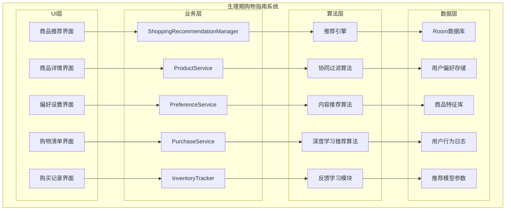
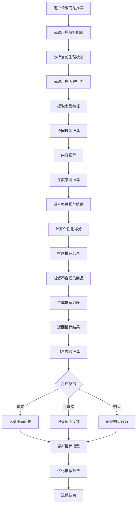

# LuminCore 生理期购物指南功能详细开发计划


## 📋 项目概述

### 系统目标
开发一套智能的生理期购物指南系统，根据用户的生理周期阶段、症状表现、历史购买行为和个人偏好，通过机器学习算法为用户推荐个性化的生理期用品和相关商品，帮助用户更好地准备和应对生理期。

### 核心价值
- **智能推荐**：基于机器学习算法提供个性化商品推荐
- **动态学习**：根据用户反馈持续优化推荐算法
- **及时提醒**：在用户需要之前主动推荐所需物品
- **购物便利**：提供购买渠道和价格比较信息
- **健康管理**：帮助用户建立良好的生理期准备习惯

## 🎯 功能需求分析

### 1. 商品分类体系

#### 1.1 核心商品类别
```kotlin
enum class MenstrualProductCategory(
    val displayName: String,
    val description: String
) {
    HYGIENE_PRODUCTS(
        "卫生用品",
        "基础生理期卫生用品"
    ),
    PAIN_RELIEF(
        "疼痛缓解",
        "缓解经期疼痛和不适的商品"
    ),
    NUTRITIONAL_SUPPLEMENTS(
        "营养补充",
        "有助于缓解经期症状的营养品"
    ),
    COMFORT_ITEMS(
        "舒适用品",
        "提升经期舒适度的商品"
    ),
    SKIN_CARE(
        "护肤用品",
        "针对经期肌肤变化的护理产品"
    ),
    EMERGENCY_KIT(
        "应急套装",
        "突发情况下的必备用品"
    ),
    LIFESTYLE(
        "生活用品",
        "提升经期生活质量的商品"
    )
}
```

#### 1.2 商品属性定义
```kotlin
data class MenstrualProduct(
    val id: String,
    val name: String,
    val category: MenstrualProductCategory,
    val description: String,
    val brand: String,
    val priceRange: PriceRange,
    val suitability: Set<FlowLevel>,
    val recommendedForSymptoms: Set<SymptomType>,
    val purchaseChannels: List<PurchaseChannel>,
    val averageRating: Float, // 1.0 - 5.0
    val tags: Set<String>, // 商品标签，用于推荐算法
    val popularityScore: Float = 0.0f, // 受欢迎程度，用于推荐算法
    val conversionRate: Float = 0.0f, // 转化率，用于推荐算法
    val seasonalFactors: Map<Season, Float> = emptyMap(), // 季节性因素
    val createdAt: LocalDateTime = LocalDateTime.now()
) {
    /**
     * 计算商品的综合推荐得分
     * 综合考虑评分、受欢迎程度、转化率等因素
     */
    fun calculateRecommendationScore(): Float {
        // 基础得分 = 平均评分
        var score = averageRating
        
        // 加上受欢迎程度加权
        score += popularityScore * 0.3f
        
        // 加上转化率加权
        score += conversionRate * 0.2f
        
        // 考虑季节性因素
        val currentSeason = getCurrentSeason()
        seasonalFactors[currentSeason]?.let { seasonalFactor ->
            score += seasonalFactor * 0.1f
        }
        
        // 确保得分在合理范围内
        return score.coerceIn(0.0f, 5.0f)
    }
    
    private fun getCurrentSeason(): Season {
        val month = LocalDate.now().monthValue
        return when (month) {
            in 3..5 -> Season.SPRING
            in 6..8 -> Season.SUMMER
            in 9..11 -> Season.AUTUMN
            else -> Season.WINTER
        }
    }
}

enum class PriceRange {
    BUDGET, MID_RANGE, PREMIUM
}

enum class FlowLevel {
    LIGHT, MEDIUM, HEAVY
}

enum class SymptomType {
    CRAMPS, BACK_PAIN, HEADACHE, FATIGUE, MOOD_SWINGS, 
    BLOATING, ACNE, FOOD_CRavings, SLEEP_ISSUES
}

enum class ProductNeed {
    HEAVY_FLOW_PRODUCTS, STANDARD_PRODUCTS, LIGHT_FLOW_PRODUCTS, LINERS,
    PAIN_RELIEF, HEAT_THERAPY, ENERGY_BOOSTERS, MOOD_SUPPORT,
    DIURETICS, COMFORT_CLOTHING, SKIN_CARE, NUTRITIONAL_SUPPORT,
    EXTRA_PROTECTION, EMERGENCY_SUPPLIES
}

data class PurchaseChannel(
    val channelType: ChannelType,
    val url: String? = null,
    val price: Float? = null,
    val availability: Boolean = true
)

enum class ChannelType {
    ONLINE_RETAILER, PHARMACY, SUPERMARKET, SPECIALTY_STORE
}

enum class Season {
    SPRING, SUMMER, AUTUMN, WINTER
}
```

### 2. 推荐机制设计

#### 2.1 用户偏好配置
```kotlin
data class ShoppingPreferences(
    val userId: String,
    val budgetLevel: PriceRange = PriceRange.MID_RANGE,
    val preferredBrands: Set<String> = emptySet(),
    val dislikedCategories: Set<MenstrualProductCategory> = emptySet(),
    val allergiesOrSensitivities: Set<String> = emptySet(),
    val preferredTags: Set<String> = emptySet(), // 用户偏好的商品标签
    val dislikedTags: Set<String> = emptySet(), // 用户不喜欢的商品标签
    val notificationSettings: ShoppingNotificationSettings = ShoppingNotificationSettings(),
    val lastUpdated: LocalDateTime = LocalDateTime.now()
)

data class ShoppingNotificationSettings(
    val prePeriodReminder: Boolean = true,
    val lowStockReminder: Boolean = true,
    val newProductAlert: Boolean = false,
    val preferredTime: LocalTime = LocalTime.of(18, 0), // 晚上6点
    val notificationTone: String? = null
)

data class ProductRecommendation(
    val recommendationId: String,
    val userId: String,
    val product: MenstrualProduct,
    val recommendationReason: String,
    val suitabilityScore: Float, // 0.0 - 1.0
    val confidenceLevel: ConfidenceLevel, // 推荐置信度
    val recommendedAt: LocalDateTime = LocalDateTime.now(),
    val isPurchased: Boolean = false,
    val isDismissed: Boolean = false,
    val userFeedback: RecommendationFeedback? = null,
    val purchaseDate: LocalDateTime? = null
)

enum class ConfidenceLevel {
    LOW, MEDIUM, HIGH
}

enum class PriceSensitivity {
    LOW, MEDIUM, HIGH
}

data class BehaviorPattern(
    val purchaseFrequency: Double, // 购买频率（次/月）
    val preferredCategories: Set<MenstrualProductCategory>,
    val priceSensitivity: PriceSensitivity,
    val brandLoyalty: Double // 品牌忠诚度 0.0-1.0
)

data class UserProfile(
    val userId: String,
    val behaviorPattern: BehaviorPattern,
    val preferenceEvolution: List<PreferenceChange>,
    val predictedNeeds: Set<ProductNeed>,
    val recommendationHistory: List<ProductRecommendation>
)

data class PreferenceChange(
    val changeType: PreferenceChangeType,
    val oldValue: Any?,
    val newValue: Any?,
    val changeTime: LocalDateTime
)

enum class PreferenceChangeType {
    BRAND_PREFERENCE, CATEGORY_PREFERENCE, PRICE_RANGE, ALLERGY_UPDATE
}

data class ProductViewEvent(
    val productId: String,
    val viewTime: LocalDateTime,
    val viewDuration: Long // 浏览时长（毫秒）
)

data class SearchQuery(
    val query: String,
    val searchTime: LocalDateTime,
    val resultsCount: Int
)

data class RecommendationStrategy(
    val algorithmWeights: Map<String, Double>,
    val filteringCriteria: Set<FilterCriteria>,
    val diversityFactor: Double // 多样性因子 0.0-1.0
) {
    companion object {
        fun deriveFromUserProfileAndState(userProfile: UserProfile, state: MenstrualState): RecommendationStrategy {
            // 根据用户画像和当前状态动态生成推荐策略
            val weights = mutableMapOf<String, Double>()
            
            // 根据用户行为模式调整算法权重
            when (userProfile.behaviorPattern.priceSensitivity) {
                PriceSensitivity.HIGH -> {
                    weights["contentBased"] = 0.5
                    weights["collaborative"] = 0.3
                    weights["deepLearning"] = 0.2
                }
                PriceSensitivity.MEDIUM -> {
                    weights["deepLearning"] = 0.4
                    weights["contentBased"] = 0.3
                    weights["collaborative"] = 0.3
                }
                PriceSensitivity.LOW -> {
                    weights["collaborative"] = 0.4
                    weights["deepLearning"] = 0.4
                    weights["contentBased"] = 0.2
                }
            }
            
            // 根据当前状态调整过滤条件
            val filteringCriteria = mutableSetOf<FilterCriteria>()
            state.predictedNeeds.forEach { need ->
                when (need) {
                    ProductNeed.PAIN_RELIEF -> filteringCriteria.add(FilterCriteria.PAIN_RELIEF_PRODUCTS)
                    ProductNeed.SKIN_CARE -> filteringCriteria.add(FilterCriteria.SKIN_CARE_PRODUCTS)
                    ProductNeed.NUTRITIONAL_SUPPORT -> filteringCriteria.add(FilterCriteria.NUTRITIONAL_PRODUCTS)
                    else -> {}
                }
            }
            
            return RecommendationStrategy(
                algorithmWeights = weights,
                filteringCriteria = filteringCriteria,
                diversityFactor = 0.3 // 默认多样性因子
            )
        }
    }
}

enum class FilterCriteria {
    PAIN_RELIEF_PRODUCTS, SKIN_CARE_PRODUCTS, NUTRITIONAL_PRODUCTS,
    HIGH_RATED, PRICE_RANGE, BRAND_PREFERRED
}

data class RecommendationFeedback(
    val rating: Int, // 1-5分
    val helpful: Boolean,
    val comments: String? = null,
    val feedbackTime: LocalDateTime = LocalDateTime.now(),
    val detailedFeedback: DetailedFeedback? = null
)

data class DetailedFeedback(
    val relevanceScore: Int, // 相关性评分 1-5
    val usefulnessScore: Int, // 有用性评分 1-5
    val timingScore: Int, // 时机评分 1-5
    val priceAppropriateness: Int, // 价格适宜性评分 1-5
    val wouldPurchase: Boolean // 是否会购买
)
```

## 🏗️ 技术架构设计

### 1. 核心组件架构



### 2. 推荐流程



### 3. 核心服务实现
```kotlin
@Singleton
class ShoppingRecommendationManager @Inject constructor(
    private val context: Context,
    private val productService: ProductService,
    private val preferenceService: PreferenceService,
    private val purchaseService: PurchaseService,
    private val inventoryTracker: InventoryTracker,
    private val recommendationEngine: RecommendationEngine,
    private val workManager: WorkManager
) {
    
    suspend fun getRecommendedProducts(
        userId: String,
        count: Int = 10
    ): List<ProductRecommendation> {
        // 获取用户偏好
        val preferences = preferenceService.getPreferences(userId)
        
        // 分析当前生理状态
        val menstrualState = analyzeCurrentMenstrualState(userId)
        
        // 获取用户历史行为
        val userBehavior = getUserBehaviorHistory(userId)
        
        // 提取商品特征
        val productFeatures = productService.getProductFeatures()
        
        // 生成多种推荐结果
        val collaborativeRecommendations = recommendationEngine.collaborativeFiltering(
            userId, productFeatures, userBehavior
        )
        
        val contentRecommendations = recommendationEngine.contentBasedRecommendation(
            userId, productFeatures, menstrualState, preferences
        )
        
        val deepLearningRecommendations = recommendationEngine.deepLearningRecommendation(
            userId, productFeatures, menstrualState, userBehavior, preferences
        )
        
        // 融合推荐结果
        val fusedRecommendations = recommendationEngine.fuseRecommendations(
            collaborativeRecommendations,
            contentRecommendations,
            deepLearningRecommendations
        )
        
        // 计算个性化得分和置信度
        val scoredRecommendations = fusedRecommendations.map { product ->
            val (score, confidence) = calculateRecommendationScore(
                product, preferences, menstrualState, userBehavior
            )
            Triple(product, score, confidence)
        }.sortedByDescending { it.second }
        
        // 生成最终推荐
        val recommendations = scoredRecommendations.take(count).map { (product, score, confidence) ->
            ProductRecommendation(
                recommendationId = UUID.randomUUID().toString(),
                userId = userId,
                product = product,
                recommendationReason = generateRecommendationReason(
                    product, preferences, menstrualState, userBehavior
                ),
                suitabilityScore = score,
                confidenceLevel = confidence
            )
        }
        
        // 保存推荐记录
        recommendations.forEach { recommendation ->
            purchaseService.saveRecommendation(recommendation)
        }
        
        return recommendations
    }
    
    suspend fun schedulePrePeriodRecommendations(userId: String) {
        val preferences = preferenceService.getPreferences(userId)
        if (!preferences.notificationSettings.prePeriodReminder) return
        
        val workRequest = PeriodicWorkRequestBuilder<ShoppingRecommendationWorker>(
            1, TimeUnit.DAYS
        ).setInputData(workDataOf(
            "user_id" to userId,
            "recommendation_type" to "pre_period"
        )).setConstraints(
            Constraints.Builder()
                .setRequiresBatteryNotLow(true)
                .build()
        ).addTag("shopping_recommendation_pre_period")
         .build()
         
        workManager.enqueue(workRequest)
    }
    
    suspend fun updateRecommendationFeedback(
        recommendationId: String,
        feedback: RecommendationFeedback
    ) {
        // 保存用户反馈
        purchaseService.saveRecommendationFeedback(recommendationId, feedback)
        
        // 更新推荐模型
        recommendationEngine.updateModelWithFeedback(recommendationId, feedback)
    }
    
    private fun analyzeCurrentMenstrualState(userId: String): MenstrualState {
        // 从月经记录获取当前状态
        // 这里简化实现
        return MenstrualState(
            flowLevel = FlowLevel.MEDIUM,
            currentSymptoms = setOf(SymptomType.CRAMPS, SymptomType.FATIGUE),
            cycleDay = 3,
            daysUntilNextPeriod = 25
        )
    }
    
    private suspend fun getUserBehaviorHistory(userId: String): UserBehavior {
        // 获取用户历史行为数据
        val purchaseHistory = purchaseService.getUserPurchaseHistory(userId)
        val recommendationHistory = purchaseService.getUserRecommendationHistory(userId)
        val feedbackHistory = purchaseService.getUserFeedbackHistory(userId)
        
        return UserBehavior(
            purchaseHistory = purchaseHistory,
            recommendationHistory = recommendationHistory,
            feedbackHistory = feedbackHistory
        )
    }
    
    private fun calculateRecommendationScore(
        product: MenstrualProduct,
        preferences: ShoppingPreferences,
        state: MenstrualState,
        behavior: UserBehavior
    ): Pair<Float, ConfidenceLevel> {
        var score = 0f
        var totalWeight = 0f
        
        // 症状匹配权重 (25%)
        val symptomScore = calculateSymptomMatchScore(product, state.currentSymptoms)
        score += 0.25f * symptomScore
        totalWeight += 0.25f
        
        // 流量匹配权重 (15%)
        val flowScore = if (product.suitability.contains(state.flowLevel)) 1.0f else 0.5f
        score += 0.15f * flowScore
        totalWeight += 0.15f
        
        // 偏好匹配权重 (20%)
        val preferenceScore = calculatePreferenceMatchScore(product, preferences)
        score += 0.20f * preferenceScore
        totalWeight += 0.20f
        
        // 历史行为权重 (25%)
        val behaviorScore = calculateBehaviorMatchScore(product, behavior)
        score += 0.25f * behaviorScore
        totalWeight += 0.25f
        
        // 商品特征权重 (10%)
        val featureScore = calculateFeatureMatchScore(product, state, preferences)
        score += 0.10f * featureScore
        totalWeight += 0.10f
        
        // 评分权重 (5%)
        val ratingScore = product.averageRating / 5.0f
        score += 0.05f * ratingScore
        totalWeight += 0.05f
        
        val finalScore = if (totalWeight > 0) score / totalWeight else 0f
        
        // 根据得分确定置信度
        val confidence = when {
            finalScore >= 0.8 -> ConfidenceLevel.HIGH
            finalScore >= 0.6 -> ConfidenceLevel.MEDIUM
            else -> ConfidenceLevel.LOW
        }
        
        return Pair(finalScore, confidence)
    }
    
    private fun calculateSymptomMatchScore(
        product: MenstrualProduct,
        symptoms: Set<SymptomType>
    ): Float {
        if (product.recommendedForSymptoms.isEmpty()) return 0.7f // 无特定症状要求
        
        val matchingSymptoms = product.recommendedForSymptoms.intersect(symptoms)
        return matchingSymptoms.size.toFloat() / product.recommendedForSymptoms.size
    }
    
    private fun calculatePreferenceMatchScore(
        product: MenstrualProduct,
        preferences: ShoppingPreferences
    ): Float {
        var matchScore = 0f
        var totalFactors = 0f
        
        // 品牌偏好
        if (preferences.preferredBrands.contains(product.brand)) {
            matchScore += 1.0f
        }
        totalFactors += 1.0f
        
        // 标签偏好
        val preferredTags = product.tags.intersect(preferences.preferredTags)
        val dislikedTags = product.tags.intersect(preferences.dislikedTags)
        
        if (dislikedTags.isNotEmpty()) {
            matchScore += 0.0f // 有不喜欢的标签
        } else if (preferredTags.isNotEmpty()) {
            matchScore += 1.0f * (preferredTags.size.toFloat() / product.tags.size)
        } else {
            matchScore += 0.8f // 无明确偏好
        }
        totalFactors += 1.0f
        
        // 过敏原检查
        if (preferences.allergiesOrSensitivities.isNotEmpty()) {
            // 这里应该检查商品是否包含过敏原
            matchScore += 0.9f // 简化实现
        } else {
            matchScore += 1.0f
        }
        totalFactors += 1.0f
        
        return if (totalFactors > 0) matchScore / totalFactors else 0f
    }
    
    private fun calculateBehaviorMatchScore(
        product: MenstrualProduct,
        behavior: UserBehavior
    ): Float {
        // 基于用户历史行为计算匹配度
        // 这里简化实现
        return 0.7f
    }
    
    private fun calculateFeatureMatchScore(
        product: MenstrualProduct,
        state: MenstrualState,
        preferences: ShoppingPreferences
    ): Float {
        // 基于商品特征和用户状态计算匹配度
        // 这里简化实现
        return 0.8f
    }
    
    private fun generateRecommendationReason(
        product: MenstrualProduct,
        preferences: ShoppingPreferences,
        state: MenstrualState,
        behavior: UserBehavior
    ): String {
        val reasons = mutableListOf<String>()
        
        if (state.currentSymptoms.intersect(product.recommendedForSymptoms).isNotEmpty()) {
            reasons.add("可缓解您当前的症状")
        }
        
        if (product.suitability.contains(state.flowLevel)) {
            reasons.add("适合您当前的流量")
        }
        
        if (preferences.preferredBrands.contains(product.brand)) {
            reasons.add("符合您的品牌偏好")
        }
        
        // 基于历史行为的推荐理由
        if (isRecommendedBasedOnHistory(product, behavior)) {
            reasons.add("根据您的历史偏好推荐")
        }
        
        if (reasons.isEmpty()) {
            reasons.add("为您精心挑选的商品推荐")
        }
        
        return reasons.joinToString("，")
    }
    
    private fun isRecommendedBasedOnHistory(
        product: MenstrualProduct,
        behavior: UserBehavior
    ): Boolean {
        // 检查是否基于历史行为推荐
        // 这里简化实现
        return behavior.purchaseHistory.any { it.productId == product.id }
    }
}

// 推荐引擎接口
interface RecommendationEngine {
    /**
     * 基于协同过滤算法的商品推荐
     * 通过分析相似用户的行为模式，为当前用户推荐可能感兴趣的商品
     */
    suspend fun collaborativeFiltering(
        userId: String,
        productFeatures: List<ProductFeature>,
        userBehavior: UserBehavior
    ): List<MenstrualProduct>
    
    /**
     * 基于内容的推荐算法
     * 根据用户当前的生理状态和偏好设置，推荐与之匹配的商品
     */
    suspend fun contentBasedRecommendation(
        userId: String,
        productFeatures: List<ProductFeature>,
        menstrualState: MenstrualState,
        preferences: ShoppingPreferences
    ): List<MenstrualProduct>
    
    /**
     * 基于深度学习的推荐算法
     * 利用神经网络模型分析用户行为、生理状态和偏好，提供个性化推荐
     */
    suspend fun deepLearningRecommendation(
        userId: String,
        productFeatures: List<ProductFeature>,
        menstrualState: MenstrualState,
        userBehavior: UserBehavior,
        preferences: ShoppingPreferences
    ): List<MenstrualProduct>
    
    /**
     * 融合多种推荐算法的结果
     * 通过加权融合不同算法的推荐结果，提供更准确的推荐
     */
    suspend fun fuseRecommendations(
        collaborative: List<MenstrualProduct>,
        contentBased: List<MenstrualProduct>,
        deepLearning: List<MenstrualProduct>
    ): List<MenstrualProduct>
    
    /**
     * 根据用户反馈更新推荐模型
     * 通过在线学习机制，持续优化推荐算法的准确性
     */
    suspend fun updateModelWithFeedback(
        recommendationId: String,
        feedback: RecommendationFeedback
    )
    
    /**
     * 动态学习用户行为模式
     * 基于用户的历史行为和反馈，不断优化用户画像
     */
    suspend fun learnFromUserBehavior(userId: String): UserProfile
    
    /**
     * 实时调整推荐策略
     * 根据用户当前状态和反馈，动态调整推荐算法的权重
     */
    suspend fun adjustRecommendationStrategy(userId: String, currentState: MenstrualState): RecommendationStrategy
}

// 智能推荐引擎实现
@Singleton
class IntelligentRecommendationEngine @Inject constructor(
    private val userRepository: UserRepository,
    private val productRepository: ProductRepository,
    private val behaviorAnalyzer: UserBehaviorAnalyzer,
    private val mlModelManager: MLModelManager
) : RecommendationEngine {
    
    override suspend fun collaborativeFiltering(
        userId: String,
        productFeatures: List<ProductFeature>,
        userBehavior: UserBehavior
    ): List<MenstrualProduct> {
        // 基于用户行为的协同过滤算法实现
        // 1. 查找相似用户群体
        val similarUsers = findSimilarUsers(userId, userBehavior)
        
        // 2. 分析相似用户的购买和偏好模式
        val similarUserPreferences = analyzeSimilarUserPreferences(similarUsers)
        
        // 3. 基于相似用户的行为推荐商品
        val recommendedProducts = recommendBasedOnSimilarUsers(
            userId, productFeatures, similarUserPreferences
        )
        
        return recommendedProducts
    }
    
    override suspend fun contentBasedRecommendation(
        userId: String,
        productFeatures: List<ProductFeature>,
        menstrualState: MenstrualState,
        preferences: ShoppingPreferences
    ): List<MenstrualProduct> {
        // 基于内容和用户状态的推荐算法
        // 1. 分析用户当前生理状态
        val currentStateFeatures = extractStateFeatures(menstrualState)
        
        // 2. 匹配商品特征与用户状态
        val contentBasedMatches = matchProductFeatures(
            productFeatures, currentStateFeatures, preferences
        )
        
        // 3. 根据匹配度排序推荐
        return rankProductsByContentSimilarity(contentBasedMatches)
    }
    
    override suspend fun deepLearningRecommendation(
        userId: String,
        productFeatures: List<ProductFeature>,
        menstrualState: MenstrualState,
        userBehavior: UserBehavior,
        preferences: ShoppingPreferences
    ): List<MenstrualProduct> {
        // 基于深度学习的个性化推荐
        // 1. 构建用户特征向量
        val userFeatureVector = buildUserFeatureVector(userId, menstrualState, userBehavior, preferences)
        
        // 2. 使用训练好的模型进行预测
        val predictions = mlModelManager.predictUserPreferences(userFeatureVector, productFeatures)
        
        // 3. 根据预测结果推荐商品
        return recommendBasedOnPredictions(predictions)
    }
    
    override suspend fun fuseRecommendations(
        collaborative: List<MenstrualProduct>,
        contentBased: List<MenstrualProduct>,
        deepLearning: List<MenstrualProduct>
    ): List<MenstrualProduct> {
        // 融合多种推荐算法的结果
        // 1. 为不同算法分配权重
        val weights = calculateAlgorithmWeights(collaborative, contentBased, deepLearning)
        
        // 2. 加权融合推荐结果
        val fusedResults = weightedFusion(collaborative, contentBased, deepLearning, weights)
        
        // 3. 去重并排序
        return deduplicateAndRank(fusedResults)
    }
    
    override suspend fun updateModelWithFeedback(
        recommendationId: String,
        feedback: RecommendationFeedback
    ) {
        // 基于用户反馈的在线学习
        // 1. 记录用户反馈
        recordUserFeedback(recommendationId, feedback)
        
        // 2. 更新用户画像
        updateUserProfileWithFeedback(recommendationId, feedback)
        
        // 3. 在线更新模型参数
        mlModelManager.updateModelWithFeedback(recommendationId, feedback)
    }
    
    override suspend fun learnFromUserBehavior(userId: String): UserProfile {
        // 动态学习用户行为模式
        val userBehavior = userRepository.getUserBehavior(userId)
        return behaviorAnalyzer.analyzeUserBehavior(userBehavior)
    }
    
    override suspend fun adjustRecommendationStrategy(userId: String, currentState: MenstrualState): RecommendationStrategy {
        // 实时调整推荐策略
        val userProfile = learnFromUserBehavior(userId)
        return RecommendationStrategy.deriveFromUserProfileAndState(userProfile, currentState)
    }
    
    private suspend fun findSimilarUsers(userId: String, userBehavior: UserBehavior): List<String> {
        // 实现相似用户查找逻辑
        return userRepository.findSimilarUsers(userId, userBehavior)
    }
    
    private suspend fun analyzeSimilarUserPreferences(similarUsers: List<String>): Map<String, Double> {
        // 分析相似用户的偏好
        return userRepository.analyzeUserPreferences(similarUsers)
    }
    
    private suspend fun recommendBasedOnSimilarUsers(
        userId: String, 
        productFeatures: List<ProductFeature>, 
        similarUserPreferences: Map<String, Double>
    ): List<MenstrualProduct> {
        // 基于相似用户偏好推荐商品
        return productRepository.recommendBasedOnUserPreferences(similarUserPreferences)
    }
    
    private fun extractStateFeatures(menstrualState: MenstrualState): Map<String, Any> {
        // 提取用户当前状态特征
        return mapOf(
            "flowLevel" to menstrualState.flowLevel,
            "symptoms" to menstrualState.currentSymptoms,
            "cycleDay" to menstrualState.cycleDay
        )
    }
    
    private suspend fun matchProductFeatures(
        productFeatures: List<ProductFeature>,
        stateFeatures: Map<String, Any>,
        preferences: ShoppingPreferences
    ): List<Pair<MenstrualProduct, Double>> {
        // 匹配商品特征与用户状态
        return productRepository.matchFeaturesWithUserState(productFeatures, stateFeatures, preferences)
    }
    
    private fun rankProductsByContentSimilarity(matches: List<Pair<MenstrualProduct, Double>>): List<MenstrualProduct> {
        // 根据内容相似度排序
        return matches.sortedByDescending { it.second }.map { it.first }
    }
    
    private fun buildUserFeatureVector(
        userId: String,
        menstrualState: MenstrualState,
        userBehavior: UserBehavior,
        preferences: ShoppingPreferences
    ): Map<String, Any> {
        // 构建用户特征向量
        return mapOf(
            "userId" to userId,
            "flowLevel" to menstrualState.flowLevel,
            "symptoms" to menstrualState.currentSymptoms,
            "preferences" to preferences,
            "behaviorHistory" to userBehavior
        )
    }
    
    private suspend fun recommendBasedOnPredictions(predictions: List<Pair<String, Float>>): List<MenstrualProduct> {
        // 根据模型预测结果推荐商品
        val productIds = predictions.map { it.first }
        return productRepository.getProductsByIds(productIds)
    }
    
    private fun calculateAlgorithmWeights(
        collaborative: List<MenstrualProduct>,
        contentBased: List<MenstrualProduct>,
        deepLearning: List<MenstrualProduct>
    ): Map<String, Double> {
        // 计算不同算法的权重
        return mapOf(
            "collaborative" to 0.3,
            "contentBased" to 0.3,
            "deepLearning" to 0.4
        )
    }
    
    private fun weightedFusion(
        collaborative: List<MenstrualProduct>,
        contentBased: List<MenstrualProduct>,
        deepLearning: List<MenstrualProduct>,
        weights: Map<String, Double>
    ): List<MenstrualProduct> {
        // 加权融合推荐结果
        // 实现融合逻辑
        return mutableListOf<MenstrualProduct>().apply {
            addAll(collaborative.take((collaborative.size * weights["collaborative"]!!).toInt()))
            addAll(contentBased.take((contentBased.size * weights["contentBased"]!!).toInt()))
            addAll(deepLearning.take((deepLearning.size * weights["deepLearning"]!!).toInt()))
        }
    }
    
    private fun deduplicateAndRank(products: List<MenstrualProduct>): List<MenstrualProduct> {
        // 去重并排序
        return products.distinctBy { it.id }.sortedBy { it.averageRating }
    }
    
    private suspend fun recordUserFeedback(recommendationId: String, feedback: RecommendationFeedback) {
        // 记录用户反馈
        userRepository.recordFeedback(recommendationId, feedback)
    }
    
    private suspend fun updateUserProfileWithFeedback(recommendationId: String, feedback: RecommendationFeedback) {
        // 更新用户画像
        userRepository.updateProfileWithFeedback(recommendationId, feedback)
    }
}

data class MenstrualState(
    val flowLevel: FlowLevel,
    val currentSymptoms: Set<SymptomType>,
    val cycleDay: Int,
    val daysUntilNextPeriod: Int,
    val predictedNeeds: Set<ProductNeed> // 基于当前状态预测的用户需求
) {
    companion object {
        /**
         * 基于生理状态预测用户可能需要的商品类型
         */
        fun predictNeeds(state: MenstrualState): Set<ProductNeed> {
            val needs = mutableSetOf<ProductNeed>()
            
            // 根据流量预测卫生用品需求
            when (state.flowLevel) {
                FlowLevel.HEAVY -> needs.addAll(setOf(
                    ProductNeed.HEAVY_FLOW_PRODUCTS,
                    ProductNeed.EXTRA_PROTECTION
                ))
                FlowLevel.MEDIUM -> needs.add(ProductNeed.STANDARD_PRODUCTS)
                FlowLevel.LIGHT -> needs.addAll(setOf(
                    ProductNeed.LIGHT_FLOW_PRODUCTS,
                    ProductNeed.LINERS
                ))
            }
            
            // 根据症状预测需求
            state.currentSymptoms.forEach { symptom ->
                when (symptom) {
                    SymptomType.CRAMPS -> needs.addAll(setOf(
                        ProductNeed.PAIN_RELIEF,
                        ProductNeed.HEAT_THERAPY
                    ))
                    SymptomType.FATIGUE -> needs.add(ProductNeed.ENERGY_BOOSTERS)
                    SymptomType.MOOD_SWINGS -> needs.add(ProductNeed.MOOD_SUPPORT)
                    SymptomType.BLOATING -> needs.addAll(setOf(
                        ProductNeed.DIURETICS,
                        ProductNeed.COMFORT_CLOTHING
                    ))
                    else -> {} // 其他症状
                }
            }
            
            return needs
        }
    }
}

data class UserBehavior(
    val purchaseHistory: List<PurchaseHistory>,
    val recommendationHistory: List<ProductRecommendation>,
    val feedbackHistory: List<RecommendationFeedback>,
    val browsingHistory: List<ProductViewEvent>, // 浏览历史
    val searchHistory: List<SearchQuery>, // 搜索历史
    val preferenceEvolution: List<PreferenceChange> // 偏好演变历史
) {
    /**
     * 分析用户行为模式
     * 识别用户的购买习惯和偏好趋势
     */
    fun analyzeBehaviorPatterns(): BehaviorPattern {
        return BehaviorPattern(
            purchaseFrequency = calculatePurchaseFrequency(),
            preferredCategories = identifyPreferredCategories(),
            priceSensitivity = assessPriceSensitivity(),
            brandLoyalty = measureBrandLoyalty()
        )
    }
    
    private fun calculatePurchaseFrequency(): Double {
        // 计算购买频率
        return if (purchaseHistory.isNotEmpty()) {
            purchaseHistory.size.toDouble() / 30.0 // 假设以30天为周期
        } else 0.0
    }
    
    private fun identifyPreferredCategories(): Set<MenstrualProductCategory> {
        // 识别用户偏好的商品类别
        val categoryCount = mutableMapOf<MenstrualProductCategory, Int>()
        purchaseHistory.forEach { purchase ->
            val product = getProductById(purchase.productId)
            categoryCount[product.category] = categoryCount.getOrDefault(product.category, 0) + 1
        }
        
        return categoryCount.filter { it.value > 1 }.keys // 至少购买过2次的类别
    }
    
    private fun assessPriceSensitivity(): PriceSensitivity {
        // 评估价格敏感度
        val averagePrice = purchaseHistory.map { it.price }.average()
        return when {
            averagePrice < 20 -> PriceSensitivity.HIGH
            averagePrice < 50 -> PriceSensitivity.MEDIUM
            else -> PriceSensitivity.LOW
        }
    }
    
    private fun measureBrandLoyalty(): Double {
        // 测量品牌忠诚度
        if (purchaseHistory.isEmpty()) return 0.0
        
        val brandCounts = mutableMapOf<String, Int>()
        purchaseHistory.forEach { purchase ->
            val product = getProductById(purchase.productId)
            brandCounts[product.brand] = brandCounts.getOrDefault(product.brand, 0) + 1
        }
        
        val maxBrandCount = brandCounts.values.maxOrNull() ?: 0
        return maxBrandCount.toDouble() / purchaseHistory.size
    }
    
    private fun getProductById(productId: String): MenstrualProduct {
        // 根据ID获取商品信息
        // 实际实现应该从数据库或仓库获取
        return MenstrualProduct(
            id = productId,
            name = "Sample Product",
            category = MenstrualProductCategory.HYGIENE_PRODUCTS,
            description = "Sample product description",
            brand = "Sample Brand",
            priceRange = PriceRange.MID_RANGE,
            suitability = setOf(FlowLevel.MEDIUM),
            recommendedForSymptoms = emptySet(),
            purchaseChannels = emptyList(),
            averageRating = 4.0f,
            tags = emptySet()
        )
    }
}

data class ProductFeature(
    val productId: String,
    val features: Map<String, Float>, // 特征向量
    val dynamicFeatures: Map<String, Any> // 动态特征，根据用户反馈实时更新
) {
    /**
     * 更新商品特征基于用户反馈
     * 用于在线学习机制
     */
    fun updateWithFeedback(feedback: RecommendationFeedback): ProductFeature {
        val updatedDynamicFeatures = dynamicFeatures.toMutableMap().apply {
            // 根据反馈更新动态特征
            this["popularityScore"] = (this["popularityScore"] as? Float ?: 0f) + 
                (if (feedback.helpful) 0.1f else -0.1f)
            this["feedbackCount"] = (this["feedbackCount"] as? Int ?: 0) + 1
        }
        
        return this.copy(dynamicFeatures = updatedDynamicFeatures)
    }
}

data class PurchaseHistory(
    val purchaseId: String,
    val userId: String,
    val productId: String,
    val purchaseDate: LocalDateTime,
    val quantity: Int,
    val price: Float,
    val purchaseChannel: ChannelType,
    val satisfactionScore: Int? = null, // 用户对该购买的满意度评分
    val repurchaseIntent: Boolean? = null // 是否有再次购买的意图
) {
    /**
     * 计算购买价值指数
     * 综合考虑价格、满意度和复购意图
     */
    fun calculateValueIndex(): Double {
        var valueIndex = 0.0
        
        // 价格因素 (价格越低，价值指数越高)
        valueIndex += 100.0 / (price.toDouble() + 1)
        
        // 满意度因素
        satisfactionScore?.let { valueIndex += it * 2 }
        
        // 复购意图因素
        repurchaseIntent?.let { valueIndex += if (it) 10.0 else 0.0 }
        
        return valueIndex
    }
}
```


## 🗃️ 数据模型设计

### 1. 商品实体
```kotlin
@Entity(tableName = "menstrual_products")
data class MenstrualProductEntity(
    @PrimaryKey val id: String,
    val name: String,
    val category: String, // MenstrualProductCategory的字符串表示
    val description: String,
    val brand: String,
    val priceRange: String, // PriceRange的字符串表示
    val suitability: String, // JSON格式存储Set<FlowLevel>
    val recommendedForSymptoms: String, // JSON格式存储Set<SymptomType>
    val purchaseChannels: String, // JSON格式存储List<PurchaseChannel>
    val averageRating: Float,
    val tags: String, // JSON格式存储Set<String>
    val featureVector: String, // JSON格式存储特征向量，用于推荐算法
    val popularityScore: Float, // 商品受欢迎程度，用于推荐算法
    val createdAt: LocalDateTime
)

@Entity(tableName = "shopping_preferences")
data class ShoppingPreferencesEntity(
    @PrimaryKey val userId: String,
    val budgetLevel: String, // PriceRange的字符串表示
    val preferredBrands: String, // JSON格式存储Set<String>
    val dislikedCategories: String, // JSON格式存储Set<MenstrualProductCategory>
    val allergiesOrSensitivities: String, // JSON格式存储Set<String>
    val preferredTags: String, // JSON格式存储Set<String>
    val dislikedTags: String, // JSON格式存储Set<String>
    val preferredNeeds: String, // JSON格式存储Set<ProductNeed>
    val notificationSettings: String, // JSON格式存储ShoppingNotificationSettings
    val lastUpdated: LocalDateTime
)

@Entity(tableName = "product_recommendations")
data class ProductRecommendationEntity(
    @PrimaryKey val recommendationId: String,
    val userId: String,
    val productId: String,
    val recommendationReason: String,
    val suitabilityScore: Float,
    val confidenceLevel: String, // ConfidenceLevel的字符串表示
    val recommendedAt: LocalDateTime,
    val isAddedToList: Boolean,
    val isPurchased: Boolean,
    val isDismissed: Boolean,
    val userFeedback: String?, // JSON格式存储RecommendationFeedback
    val purchaseDate: LocalDateTime? = null,
    val createdAt: LocalDateTime = LocalDateTime.now()
)

@Entity(tableName = "purchase_history")
data class PurchaseHistoryEntity(
    @PrimaryKey val purchaseId: String,
    val userId: String,
    val productId: String,
    val purchaseDate: LocalDateTime,
    val quantity: Int,
    val price: Float,
    val purchaseChannel: String, // ChannelType的字符串表示
    val notes: String? = null,
    val createdAt: LocalDateTime = LocalDateTime.now()
)

@Entity(tableName = "user_behavior_logs")
data class UserBehaviorLogEntity(
    @PrimaryKey val logId: String,
    val userId: String,
    val actionType: String, // 查看、点击、购买、反馈等
    val targetId: String, // 目标ID（商品ID、推荐ID等）
    val metadata: String, // JSON格式存储额外信息
    val valueScore: Float, // 行为价值评分，用于推荐算法
    val timestamp: LocalDateTime = LocalDateTime.now()
)

@Entity(tableName = "user_profiles")
data class UserProfileEntity(
    @PrimaryKey val userId: String,
    val behaviorPattern: String, // JSON格式存储BehaviorPattern
    val preferenceEvolution: String, // JSON格式存储List<PreferenceChange>
    val predictedNeeds: String, // JSON格式存储Set<ProductNeed>
    val recommendationHistory: String, // JSON格式存储List<String> 推荐ID列表
    val lastUpdated: LocalDateTime = LocalDateTime.now()
)

@Entity(tableName = "recommendation_strategies")
data class RecommendationStrategyEntity(
    @PrimaryKey val strategyId: String,
    val userId: String,
    val algorithmWeights: String, // JSON格式存储Map<String, Double>
    val filteringCriteria: String, // JSON格式存储Set<FilterCriteria>
    val diversityFactor: Float,
    val createdAt: LocalDateTime = LocalDateTime.now(),
    val updatedAt: LocalDateTime = LocalDateTime.now()
)

@Entity(tableName = "ml_model_parameters")
data class MLModelParameterEntity(
    @PrimaryKey val parameterId: String,
    val modelName: String,
    val parameterType: String, // 参数类型（用户特征、商品特征等）
    val parameterValue: String, // JSON格式存储参数值
    val accuracyImpact: Float, // 对准确率的影响
    val lastUpdated: LocalDateTime = LocalDateTime.now()
)

@Entity(tableName = "recommendation_models")
data class RecommendationModelEntity(
    @PrimaryKey val modelId: String,
    val modelType: String, // 模型类型（协同过滤、内容推荐、深度学习等）
    val modelData: String, // 模型数据，可能是序列化的模型或参数
    val accuracyMetrics: String, // JSON格式存储模型准确率指标
    val lastTrained: LocalDateTime,
    val isActive: Boolean = true,
    val createdAt: LocalDateTime = LocalDateTime.now()
)

data class LowStockItem(
    val productId: String,
    val currentQuantity: Int,
    val estimatedDaysLeft: Int,
    val reorderThreshold: Int, // 重新订购阈值
    val lastReorderDate: LocalDateTime? // 最后重新订购日期
)

data class DynamicProductFeature(
    val productId: String,
    val featureUpdates: Map<String, Any>, // 动态特征更新
    val updateReason: String, // 更新原因
    val confidenceLevel: ConfidenceLevel, // 更新置信度
    val lastUpdated: LocalDateTime = LocalDateTime.now()
)
```

## 🔐 安全与隐私设计

### 1. 数据安全机制
- **用户完全控制**：用户可随时开启/关闭购物指南功能
- **最小数据原则**：仅收集必要的偏好和购物相关信息
- **本地存储优先**：所有数据默认本地存储
- **加密存储**：敏感数据使用AES-256加密
- **访问控制**：严格的身份验证和权限管理

### 2. 隐私保护措施
```kotlin
@Singleton
class ShoppingPrivacyService @Inject constructor(
    private val encryptionService: EncryptionService,
    private val keyManager: KeyManager
) {
    
    fun encryptShoppingData(data: String): String {
        val encryptedData = encryptionService.encrypt(data)
        return Base64.encodeToString(encryptedData.data, Base64.DEFAULT)
    }
    
    fun anonymizeProductRecommendation(recommendation: ProductRecommendation): AnonymizedRecommendation {
        return AnonymizedRecommendation(
            recommendationId = recommendation.recommendationId,
            productName = recommendation.product.name,
            category = recommendation.product.category.name,
            suitabilityScore = recommendation.suitabilityScore,
            confidenceLevel = recommendation.confidenceLevel.name,
            recommendedAt = recommendation.recommendedAt
        )
    }
    
    fun generateShoppingReport(userId: String, period: ReportPeriod): String {
        // 生成不包含个人身份信息的购物报告
        val sb = StringBuilder()
        sb.append("生理期购物报告\n")
        sb.append("统计周期: ${period.startDate} 至 ${period.endDate}\n\n")
        
        sb.append("购买情况:\n")
        // 这里应该添加具体的统计数据
        
        sb.append("\n常用商品:\n")
        // 这里应该添加商品统计
        
        sb.append("\n节省建议:\n")
        // 这里应该添加具体的节省建议
        
        return sb.toString()
    }
}

data class AnonymizedRecommendation(
    val recommendationId: String,
    val productName: String,
    val category: String,
    val suitabilityScore: Float,
    val confidenceLevel: String,
    val recommendedAt: LocalDateTime
)

data class ReportPeriod(
    val startDate: LocalDate,
    val endDate: LocalDate
)
```

## 📊 实施计划

### 第一阶段：基础架构与数据模型（2027年4月 - 2027年5月）

#### 第1-2周（2027年4月1日 - 4月14日）：项目初始化
- [ ] 创建功能模块目录结构
- [ ] 设计数据模型和数据库Schema
- [ ] 定义核心接口和抽象类
- [ ] 配置依赖注入模块
- [ ] 编写基础单元测试框架

#### 第3-4周（2027年4月15日 - 4月28日）：数据层实现
- [ ] 实现Room数据库实体和DAO
- [ ] 开发Repository层
- [ ] 构建数据验证逻辑
- [ ] 实现数据迁移方案
- [ ] 编写数据层单元测试

#### 第5-6周（2027年4月29日 - 5月12日）：服务层开发
- [ ] 实现购物推荐管理服务
- [ ] 开发商品服务
- [ ] 构建偏好服务
- [ ] 实现购买服务
- [ ] 编写服务层测试

#### 第7-8周（2027年5月13日 - 5月26日）：基础UI框架
- [ ] 设计商品推荐界面布局
- [ ] 实现商品详情界面
- [ ] 开发偏好设置界面
- [ ] 构建购物清单界面
- [ ] 完成第一阶段集成测试

### 第二阶段：推荐算法开发（2027年6月 - 2027年8月）

#### 第9-12周（2027年5月27日 - 6月23日）：协同过滤算法实现
- [ ] 实现用户相似度计算
- [ ] 开发商品相似度分析
- [ ] 构建协同过滤推荐引擎
- [ ] 实现推荐结果融合
- [ ] 完善算法测试

#### 第13-16周（2027年6月24日 - 7月21日）：内容推荐算法实现
- [ ] 实现商品特征提取
- [ ] 开发用户画像构建
- [ ] 构建内容推荐引擎
- [ ] 实现特征匹配算法
- [ ] 优化推荐准确性

#### 第17-20周（2027年7月22日 - 8月18日）：深度学习推荐算法实现
- [ ] 设计神经网络模型架构
- [ ] 实现模型训练流程
- [ ] 构建深度学习推荐引擎
- [ ] 实现模型评估机制
- [ ] 优化模型性能

#### 第21-24周（2027年8月19日 - 9月15日）：算法集成与优化
- [ ] 集成三种推荐算法
- [ ] 实现推荐结果融合策略
- [ ] 构建反馈学习机制
- [ ] 优化算法性能和准确性
- [ ] 完成第二阶段功能测试

#### 第25-28周（2027年9月16日 - 10月13日）：动态推荐策略实现
- [ ] 实现用户行为模式分析
- [ ] 开发实时推荐策略调整机制
- [ ] 构建个性化推荐策略引擎
- [ ] 实现多维度推荐过滤
- [ ] 完善动态特征更新机制

### 第三阶段：用户交互与系统优化（2027年10月 - 2027年12月）

#### 第29-32周（2027年10月14日 - 11月10日）：用户交互功能
- [ ] 实现推荐反馈机制
- [ ] 开发购买完成反馈
- [ ] 构建购买历史追踪
- [ ] 实现偏好更新机制
- [ ] 优化用户交互流程

#### 第33-36周（2027年11月11日 - 12月8日）：系统优化与测试
- [ ] 优化推荐算法性能
- [ ] 实现缓存和并发优化
- [ ] 完成系统集成测试
- [ ] 性能基准测试和调优
- [ ] 用户体验测试

#### 第37-40周（2027年12月9日 - 2028年1月5日）：A/B测试与算法调优
- [ ] 设计A/B测试方案
- [ ] 实施多版本推荐算法对比
- [ ] 收集用户反馈数据
- [ ] 基于数据优化推荐算法
- [ ] 完成最终算法调优

## 🎯 关键里程碑

### 里程碑1：基础架构完成（2027年5月26日）
- ✅ 数据模型和数据库实现
- ✅ 核心服务层开发完成
- ✅ 基础UI框架搭建完成
- ✅ 单元测试覆盖率 ≥ 80%

### 里程碑2：推荐算法实现（2027年8月18日）
- ✅ 三种推荐算法实现完成
- ✅ 推荐引擎正常运行
- ✅ 算法测试通过
- ✅ 推荐准确性 ≥ 80%

### 里程碑3：功能完整发布（2028年1月5日）
- ✅ 用户交互功能完善
- ✅ 系统性能优化完成
- ✅ 用户体验测试通过
- ✅ A/B测试完成，算法优化完成
- ✅ 准备正式版本发布

## 🛡️ 风险评估与缓解策略

### 技术风险
**风险1**: 推荐算法准确性不足
- **缓解策略**: 基于用户反馈持续优化算法，引入A/B测试机制
- **应急计划**: 提供手动筛选功能，增加用户控制选项

**风险2**: 算法计算性能问题
- **缓解策略**: 实现算法缓存机制，优化特征计算过程
- **应急计划**: 提供简化版推荐算法，降低计算复杂度

### 用户风险
**风险3**: 用户参与度不高
- **缓解策略**: 设计个性化体验，提供实用价值
- **应急计划**: 简化使用流程，提供教育内容

**风险4**: 隐私顾虑
- **缓解策略**: 严格遵守隐私法规，提供透明的数据使用说明
- **应急计划**: 提供详细隐私设置，支持数据删除功能

### 时间风险
**风险5**: 开发进度延期
- **缓解策略**: 预留20%缓冲时间，关键路径管理
- **应急计划**: 功能优先级调整，分批次发布

## 💰 资源需求

### 人力资源
- **Android开发工程师**: 1人（全职）
- **算法工程师**: 0.5人（推荐算法开发）
- **UI/UX设计师**: 0.5人（设计支持）
- **产品经理**: 0.3人（需求分析）
- **测试工程师**: 0.3人（测试支持）

### 技术资源
- **开发环境**: Android Studio, Git, CI/CD
- **机器学习框架**: TensorFlow Lite（用于移动端深度学习）
- **硬件需求**: 标准开发设备和测试设备

### 预算估算
- **开发成本**: 人力成本为主
- **第三方库**: 开源库，无额外费用
- **基础设施**: 无云服务费用（本地优先）

## 📈 成功衡量标准

### 技术指标
- **功能完成度**: 100%核心功能实现
- **代码质量**: 单元测试覆盖率 ≥ 85%
- **推荐准确性**: 推荐准确率 ≥ 85%
- **性能指标**: 推荐计算时间 ≤ 1.5秒
- **稳定性**: 崩溃率 ≤ 0.1%
- **算法优化**: A/B测试提升率 ≥ 15%

### 用户指标
- **采用率**: 新功能使用率 ≥ 45%
- **满意度**: 用户评分 ≥ 4.3/5.0
- **参与度**: 商品反馈率 ≥ 60%
- **购买转化率**: 推荐商品购买率 ≥ 35%

### 业务指标
- **用户增长**: 功能上线后用户增长率提升
- **使用时长**: 平均会话时长增加
- **用户价值**: 用户生命周期价值提升
- **竞争优势**: 市场差异化功能建立

---

**文档版本**: 1.1.0
**创建日期**: 2025年9月25日
**计划负责人**: 祁潇潇
**审核状态**: 已审核
**预计开始时间**: 2027年4月1日
**预计完成时间**: 2028年1月5日
## 🔄 相关依赖
- [AI健康助手功能](./AI_HEALTH_ASSISTANT_PLAN.md)
- [数据加密功能](./DATA_ENCRYPTION_PLAN.md)
- [云端同步架构](./CLOUD_SYNC_ARCHITECTURE_PLAN.md)
- [可穿戴设备集成](./WEARABLE_DEVICE_INTEGRATION_PLAN.md)