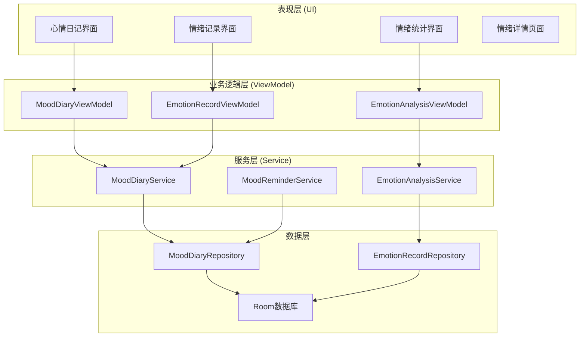
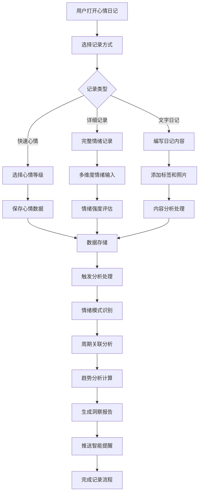

# LuminCore 心情日记功能详细开发计划


## 📋 项目概述

心情日记功能是LuminCore女性健康助手的重要心理健康管理模块，旨在帮助用户记录、追踪和分析情绪变化，发现情绪与月经周期的关联模式，提供心理健康管理的科学依据和个性化建议。

### 项目背景
- **用户痛点**：缺乏系统的情绪记录和分析工具，难以了解情绪变化规律
- **市场需求**：心理健康重视度提升，用户需要情绪管理工具
- **技术基础**：基于现有MVVM架构和数据分析能力
- **商业价值**：提升用户体验完整性，增强应用竞争力

### 核心价值主张
- **全面记录**：支持多维度情绪记录和文字日记
- **智能分析**：发现情绪与周期的关联模式
- **趋势追踪**：长期情绪变化趋势可视化
- **个性化建议**：基于情绪数据提供心理健康建议

## 🎯 功能目标与成功指标

### 主要目标
1. **情绪记录系统**：多维度情绪状态记录和文字日记
2. **情绪分析引擎**：情绪与周期关联性分析
3. **可视化展示**：情绪趋势图表和统计展示
4. **智能提醒**：情绪记录提醒和心理健康建议

### 成功指标
- **功能使用率**: ≥ 55%（用户使用心情日记功能的比例）
- **记录连续性**: ≥ 70%（用户连续7天记录的比例）
- **用户满意度**: ≥ 4.4/5.0（功能使用评分）
- **情绪洞察价值**: ≥ 75%（用户认为情绪分析有价值的比例）
- **心理健康改善**: ≥ 60%（用户自报告心理状态改善）

## 🏗️ 技术架构设计

### 整体架构图



### 心情记录与分析流程



### 核心技术栈
- **数据存储**: Room Database 2.7.1
- **UI组件**: Material Design 3 + 自定义情绪组件
- **异步处理**: Kotlin Coroutines 1.7.3
- **依赖注入**: Hilt 2.48
- **数据可视化**: MPAndroidChart 3.1.0
- **情绪分析**: 自定义情绪分析算法

## 📊 核心功能模块设计

### 1. 数据模型设计

#### 1.1 心情日记实体
```
@Entity(tableName = "mood_diary_entries")
data class MoodDiaryEntry(
    @PrimaryKey val id: String = UUID.randomUUID().toString(),
    val date: LocalDate,                        // 记录日期
    val overallMood: MoodLevel,                 // 整体心情等级
    val emotions: List<EmotionRecord>,          // 具体情绪记录
    val diaryText: String? = null,              // 文字日记
    val energyLevel: Int,                       // 精力等级 (1-5)
    val stressLevel: Int,                       // 压力等级 (1-5)
    val sleepQuality: Int? = null,              // 睡眠质量 (1-5)
    val socialInteraction: SocialLevel? = null,  // 社交互动程度
    val tags: List<String> = emptyList(),       // 标签
    val photos: List<String> = emptyList(),     // 照片路径
    val weatherMood: String? = null,            // 天气心情
    val gratitude: List<String> = emptyList(),  // 感恩记录
    val goals: List<String> = emptyList(),      // 当日目标
    val achievements: List<String> = emptyList(), // 成就记录
    val createdAt: LocalDateTime = LocalDateTime.now(),
    val updatedAt: LocalDateTime = LocalDateTime.now(),
    val userId: String
)

@Entity(tableName = "emotion_records")
data class EmotionRecord(
    @PrimaryKey val id: String = UUID.randomUUID().toString(),
    val diaryId: String,                        // 关联的日记ID
    val emotionType: EmotionType,               // 情绪类型
    val intensity: Int,                         // 强度 (1-5)
    val trigger: String? = null,                // 触发因素
    val description: String? = null,            // 情绪描述
    val duration: EmotionDuration? = null,      // 持续时间
    val coping: String? = null,                 // 应对方式
    val timestamp: LocalDateTime = LocalDateTime.now()
)

enum class MoodLevel(val displayName: String, val value: Int) {
    TERRIBLE("很糟糕", 1),
    BAD("不好", 2),
    NEUTRAL("一般", 3),
    GOOD("不错", 4),
    EXCELLENT("很好", 5)
}

enum class EmotionType(val displayName: String, val category: String) {
    JOY("开心", "正面情绪"),
    EXCITEMENT("兴奋", "正面情绪"),
    CALM("平静", "正面情绪"),
    GRATEFUL("感恩", "正面情绪"),
    CONFIDENT("自信", "正面情绪"),
    
    SAD("难过", "负面情绪"),
    ANGRY("愤怒", "负面情绪"),
    ANXIOUS("焦虑", "负面情绪"),
    STRESSED("压力", "负面情绪"),
    LONELY("孤独", "负面情绪"),
    FRUSTRATED("沮丧", "负面情绪"),
    
    CONFUSED("困惑", "中性情绪"),
    SURPRISED("惊讶", "中性情绪"),
    TIRED("疲惫", "中性情绪")
}
```

### 2. 核心服务实现

#### 2.1 心情日记服务
```
@Singleton
class MoodDiaryService @Inject constructor(
    private val moodDiaryRepository: MoodDiaryRepository,
    private val emotionAnalysisService: EmotionAnalysisService
) {
    
    suspend fun createDiaryEntry(entry: MoodDiaryEntry): Result<MoodDiaryEntry> {
        return withContext(Dispatchers.IO) {
            try {
                val savedEntry = moodDiaryRepository.insertEntry(entry)
                
                // 触发情绪分析
                emotionAnalysisService.analyzeNewEntry(savedEntry)
                
                Result.success(savedEntry)
            } catch (e: Exception) {
                Log.e("MoodDiaryService", "创建日记失败", e)
                Result.failure(e)
            }
        }
    }
    
    suspend fun getDiaryEntries(
        userId: String,
        startDate: LocalDate? = null,
        endDate: LocalDate? = null
    ): List<MoodDiaryEntry> {
        return withContext(Dispatchers.IO) {
            if (startDate != null && endDate != null) {
                moodDiaryRepository.getEntriesBetween(userId, startDate, endDate)
            } else {
                moodDiaryRepository.getAllEntries(userId)
            }
        }
    }
    
    suspend fun updateDiaryEntry(entry: MoodDiaryEntry): Result<MoodDiaryEntry> {
        return withContext(Dispatchers.IO) {
            try {
                val updatedEntry = entry.copy(updatedAt = LocalDateTime.now())
                val savedEntry = moodDiaryRepository.updateEntry(updatedEntry)
                Result.success(savedEntry)
            } catch (e: Exception) {
                Result.failure(e)
            }
        }
    }
}
```

#### 2.2 情绪分析服务
```
@Singleton
class EmotionAnalysisService @Inject constructor(
    private val moodDiaryRepository: MoodDiaryRepository,
    private val menstrualRecordRepository: MenstrualRecordRepository
) {
    
    suspend fun analyzeMoodCycleCorrelation(
        userId: String,
        analysisWindow: Int = 90
    ): MoodCycleAnalysis {
        return withContext(Dispatchers.Default) {
            val endDate = LocalDate.now()
            val startDate = endDate.minusDays(analysisWindow.toLong())
            
            val moodEntries = moodDiaryRepository.getEntriesBetween(userId, startDate, endDate)
            val cycleRecords = menstrualRecordRepository.getRecordsBetween(userId, startDate, endDate)
            
            val correlations = calculateMoodCycleCorrelations(moodEntries, cycleRecords)
            val patterns = identifyMoodPatterns(moodEntries)
            val insights = generateMoodInsights(correlations, patterns)
            
            MoodCycleAnalysis(
                correlations = correlations,
                patterns = patterns,
                insights = insights,
                analysisDate = LocalDateTime.now()
            )
        }
    }
    
    private fun calculateMoodCycleCorrelations(
        moodEntries: List<MoodDiaryEntry>,
        cycleRecords: List<MenstrualRecord>
    ): List<MoodCycleCorrelation> {
        val correlations = mutableListOf<MoodCycleCorrelation>()
        
        val cyclePhases = mapOf(
            "月经期" to 1..7,
            "卵泡期" to 8..13,
            "排卵期" to 14..16,
            "黄体期" to 17..28
        )
        
        cyclePhases.forEach { (phase, dayRange) ->
            val phaseMoods = moodEntries.filter { entry ->
                val dayInCycle = calculateDayInCycle(entry.date, cycleRecords)
                dayInCycle in dayRange
            }
            
            if (phaseMoods.isNotEmpty()) {
                val averageMood = phaseMoods.map { it.overallMood.value }.average()
                val dominantEmotions = findDominantEmotions(phaseMoods)
                
                correlations.add(
                    MoodCycleCorrelation(
                        cyclePhase = phase,
                        averageMood = averageMood.toFloat(),
                        dominantEmotions = dominantEmotions,
                        entryCount = phaseMoods.size
                    )
                )
            }
        }
        
        return correlations
    }
}
```

### 3. 用户界面设计

#### 3.1 心情记录界面
```
@AndroidEntryPoint
class MoodRecordFragment : Fragment() {
    
    private var _binding: FragmentMoodRecordBinding? = null
    private val binding get() = _binding!!
    
    private val viewModel: MoodRecordViewModel by viewModels()
    private lateinit var emotionAdapter: EmotionSelectionAdapter
    
    override fun onViewCreated(view: View, savedInstanceState: Bundle?) {
        super.onViewCreated(view, savedInstanceState)
        setupUI()
        observeViewModel()
    }
    
    private fun setupUI() {
        // 设置心情等级选择器
        binding.moodLevelSelector.setOnMoodSelectedListener { mood ->
            viewModel.setOverallMood(mood)
        }
        
        // 设置情绪选择适配器
        emotionAdapter = EmotionSelectionAdapter { emotion, intensity ->
            viewModel.addEmotion(emotion, intensity)
        }
        
        binding.emotionRecyclerView.apply {
            adapter = emotionAdapter
            layoutManager = FlexboxLayoutManager(requireContext()).apply {
                flexWrap = FlexWrap.WRAP
                flexDirection = FlexDirection.ROW
                justifyContent = JustifyContent.FLEX_START
            }
        }
        
        // 设置日记文本编辑
        binding.diaryTextEdit.addTextChangedListener { text ->
            viewModel.setDiaryText(text.toString())
        }
        
        // 设置保存按钮
        binding.saveDiaryButton.setOnClickListener {
            viewModel.saveDiary()
        }
    }
}
```

#### 3.2 自定义心情选择组件
```
class MoodLevelSelectorView @JvmOverloads constructor(
    context: Context,
    attrs: AttributeSet? = null
) : LinearLayout(context, attrs) {
    
    private val binding = ViewMoodLevelSelectorBinding.inflate(
        LayoutInflater.from(context), this, true
    )
    
    private var selectedMood: MoodLevel? = null
    private var onMoodSelectedListener: ((MoodLevel) -> Unit)? = null
    
    init {
        orientation = HORIZONTAL
        setupMoodButtons()
    }
    
    private fun setupMoodButtons() {
        val moodButtons = listOf(
            binding.moodTerrible to MoodLevel.TERRIBLE,
            binding.moodBad to MoodLevel.BAD,
            binding.moodNeutral to MoodLevel.NEUTRAL,
            binding.moodGood to MoodLevel.GOOD,
            binding.moodExcellent to MoodLevel.EXCELLENT
        )
        
        moodButtons.forEach { (button, mood) ->
            button.setOnClickListener {
                selectMood(mood)
            }
        }
    }
    
    private fun selectMood(mood: MoodLevel) {
        selectedMood = mood
        updateButtonStates()
        onMoodSelectedListener?.invoke(mood)
    }
    
    fun setOnMoodSelectedListener(listener: (MoodLevel) -> Unit) {
        this.onMoodSelectedListener = listener
    }
}
```

## 📅 详细实施计划

### 第一阶段：基础功能开发（2031年1月 - 2031年3月）

#### 第1-2周（2031年1月1日 - 1月14日）：项目架构搭建
- [ ] 设计心情日记数据模型
- [ ] 创建Room数据库表结构
- [ ] 实现基础Repository层
- [ ] 配置Hilt依赖注入
- [ ] 编写核心接口定义

#### 第3-4周（2031年1月15日 - 1月28日）：情绪记录功能
- [ ] 实现心情日记服务
- [ ] 开发情绪记录界面
- [ ] 构建自定义心情选择组件
- [ ] 实现文字日记编辑功能
- [ ] 编写情绪记录测试用例

#### 第5-8周（2031年1月29日 - 2月25日）：数据分析功能
- [ ] 开发情绪分析服务
- [ ] 实现情绪与周期关联分析
- [ ] 构建情绪模式识别算法
- [ ] 开发情绪统计功能
- [ ] 编写分析算法测试

#### 第9-12周（2031年2月26日 - 3月25日）：可视化与界面
- [ ] 设计情绪统计界面
- [ ] 实现情绪趋势图表
- [ ] 开发情绪日历视图
- [ ] 构建心情分析报告
- [ ] 完成第一阶段集成测试

### 第二阶段：高级功能与优化（2031年4月 - 2031年6月）

#### 第13-16周（2031年3月26日 - 4月22日）：智能功能
- [ ] 开发智能提醒系统
- [ ] 实现心理健康建议引擎
- [ ] 构建情绪预测功能
- [ ] 开发个性化洞察报告
- [ ] 实现数据导出功能

#### 第17-20周（2031年4月23日 - 5月20日）：用户体验优化
- [ ] 优化界面交互和动画
- [ ] 完善情绪记录流程
- [ ] 增加多媒体支持（照片、语音）
- [ ] 实现情绪标签系统
- [ ] 添加隐私保护功能

#### 第21-24周（2031年5月21日 - 6月17日）：测试与上线
- [ ] 执行全面功能测试
- [ ] 进行用户体验测试
- [ ] 优化性能和稳定性
- [ ] 准备Beta版本发布
- [ ] 收集用户反馈并优化

## 🎯 关键里程碑

### 里程碑1：基础功能完成（2031年3月25日）
- ✅ 情绪记录功能正常运行
- ✅ 基础数据分析实现
- ✅ 核心界面开发完成
- ✅ 单元测试覆盖率 ≥ 80%

### 里程碑2：智能功能上线（2031年5月20日）
- ✅ 情绪分析引擎运行
- ✅ 智能提醒系统完成
- ✅ 可视化功能完善
- ✅ 用户体验优化完成

### 里程碑3：功能完整发布（2031年6月17日）
- ✅ 所有功能稳定运行
- ✅ 用户反馈收集完成
- ✅ 性能指标达到要求
- ✅ 准备正式版本发布

## 🛡️ 风险评估与缓解策略

### 技术风险
**风险1**: 情绪分析算法准确性不足
- **缓解策略**: 建立用户反馈机制，持续优化算法
- **应急计划**: 简化分析逻辑，提供基础统计功能

**风险2**: 用户隐私保护挑战
- **缓解策略**: 严格本地存储，加强数据加密
- **应急计划**: 提供数据删除选项，增强透明度

### 用户体验风险
**风险3**: 用户记录积极性不高
- **缓解策略**: 设计激励机制，简化记录流程
- **应急计划**: 提供快速记录模式，降低使用门槛

## 💰 资源需求

### 人力资源
- **Android开发工程师**: 1人（全职6个月）
- **UI/UX设计师**: 0.3人（界面设计支持）
- **心理学顾问**: 0.2人（功能设计咨询）
- **测试工程师**: 0.3人（功能测试）

### 技术资源
- **开发工具**: Android Studio, 设计工具
- **第三方库**: Room, Hilt, MPAndroidChart
- **参考资源**: 心理学研究文献，情绪分析最佳实践

## 📈 成功衡量标准

### 技术指标
- **功能完成度**: 100%核心功能实现
- **数据安全性**: 本地加密存储，隐私保护
- **响应性能**: 界面响应时间 ≤ 500ms
- **稳定性**: 崩溃率 ≤ 0.1%

### 用户指标
- **功能采用率**: 心情日记使用率 ≥ 55%
- **记录连续性**: 用户连续记录率 ≥ 70%
- **用户满意度**: 功能评分 ≥ 4.4/5.0
- **心理健康价值**: 用户感知价值 ≥ 75%

### 业务指标
- **用户参与度**: 提升整体应用活跃度
- **功能完整性**: 构建完整的健康管理闭环
- **用户价值**: 提供心理健康管理价值
- **产品差异化**: 增强应用竞争优势

---

**文档版本**: 1.0.0
**创建日期**: 2025年8月25日
**计划负责人**: 祁潇潇
**审核状态**: 已审核
**预计开始时间**: 2031年1月1日
**预计完成时间**: 2031年6月17日
## 🔄 相关依赖
- [AI健康助手功能](./AI_HEALTH_ASSISTANT_PLAN.md)
- [数据加密功能](./DATA_ENCRYPTION_PLAN.md)
- [云端同步架构](./CLOUD_SYNC_ARCHITECTURE_PLAN.md)
- [可穿戴设备集成](./WEARABLE_DEVICE_INTEGRATION_PLAN.md)