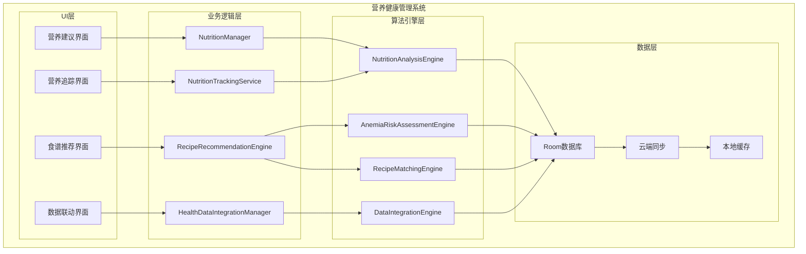
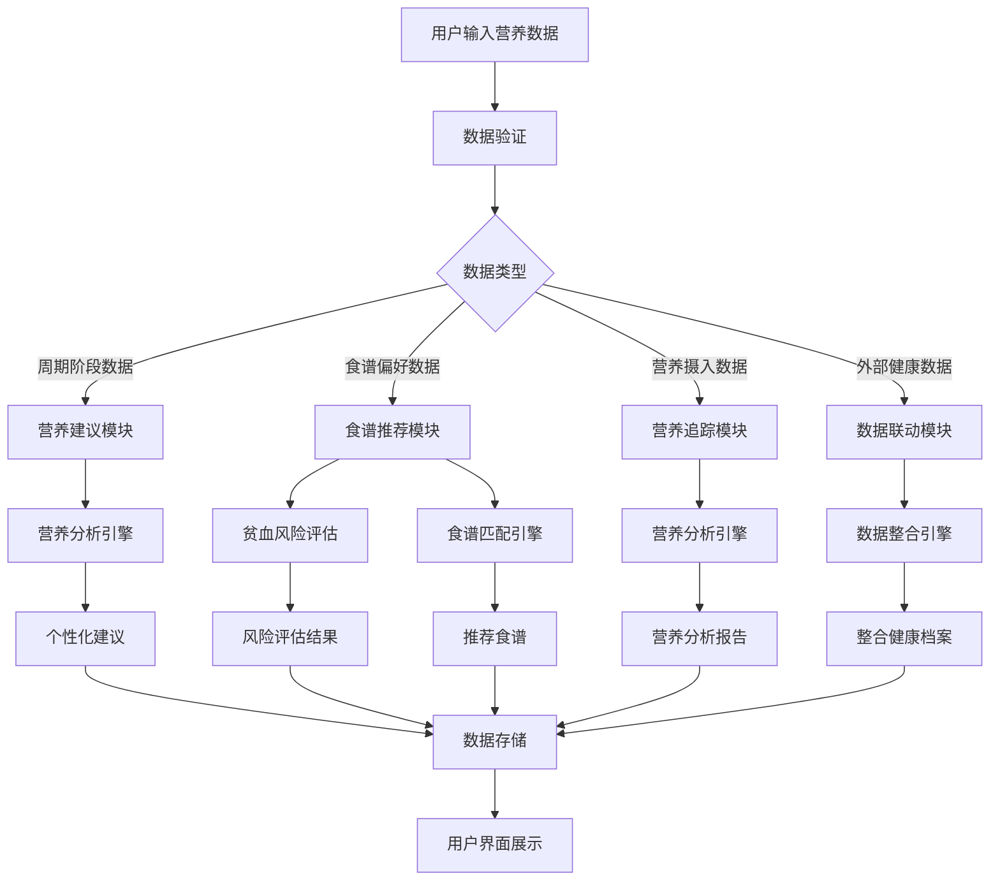

# LuminCore 营养健康管理系统详细开发计划


## 📋 项目概述

### 功能目标
开发一套完整的营养健康管理系统，为女性用户提供经期营养建议、补血食谱推荐、维生素追踪等个性化营养健康管理服务，并支持与其他健康APP数据联动。

### 核心价值
- **个性化营养建议**：基于月经周期阶段提供定制化饮食指导
- **健康管理追踪**：记录和分析关键营养素摄入情况
- **风险评估预警**：基于个人数据评估贫血等健康风险
- **数据整合共享**：与其他健康应用数据联动，提供全面健康管理

## 🎯 功能需求分析

### 1. 经期营养建议系统

#### 1.1 周期阶段营养需求分析
```kotlin
data class CyclePhaseNutrition(
    val phase: MenstrualCyclePhase,
    val keyNutrients: List<NutrientRequirement>,
    val dietaryRecommendations: List<DietaryRecommendation>,
    val foodsToAvoid: List<String>
)

enum class MenstrualCyclePhase {
    MENSTRUAL, // 月经期
    FOLLICULAR, // 卵泡期
    OVULATION, // 排卵期
    LUTEAL // 黄体期
}

data class NutrientRequirement(
    val nutrient: NutrientType,
    val recommendedAmount: String,
    val unit: String,
    val importance: NutrientImportance
)

enum class NutrientImportance {
    ESSENTIAL, // 必需
    IMPORTANT, // 重要
    BENEFICIAL // 有益
}
```

#### 1.2 个性化营养建议引擎
```kotlin
class NutritionRecommendationEngine {
    
    fun generateCyclePhaseRecommendations(
        userHealthData: UserHealthData,
        currentPhase: MenstrualCyclePhase
    ): CyclePhaseNutrition {
        val baseRecommendations = getBaseRecommendations(currentPhase)
        val personalizedAdjustments = adjustForUserFactors(userHealthData)
        
        return CyclePhaseNutrition(
            phase = currentPhase,
            keyNutrients = applyAdjustments(baseRecommendations.keyNutrients, personalizedAdjustments),
            dietaryRecommendations = applyAdjustments(baseRecommendations.dietaryRecommendations, personalizedAdjustments),
            foodsToAvoid = baseRecommendations.foodsToAvoid
        )
    }
    
    private fun getBaseRecommendations(phase: MenstrualCyclePhase): CyclePhaseNutrition {
        return when (phase) {
            MenstrualCyclePhase.MENSTRUAL -> menstrualPhaseRecommendations()
            MenstrualCyclePhase.FOLLICULAR -> follicularPhaseRecommendations()
            MenstrualCyclePhase.OVULATION -> ovulationPhaseRecommendations()
            MenstrualCyclePhase.LUTEAL -> lutealPhaseRecommendations()
        }
    }
}
```

### 2. 补血食谱推荐系统

#### 2.1 贫血风险评估
```kotlin
data class AnemiaRiskAssessment(
    val riskLevel: AnemiaRiskLevel,
    val riskFactors: List<RiskFactor>,
    val recommendedIntake: NutrientIntakeTarget,
    val monitoringFrequency: MonitoringFrequency
)

enum class AnemiaRiskLevel {
    LOW, // 低风险
    MEDIUM, // 中等风险
    HIGH, // 高风险
    VERY_HIGH // 极高风险
}

data class RiskFactor(
    val factorType: RiskFactorType,
    val severity: RiskFactorSeverity,
    val description: String
)

enum class RiskFactorType {
    MENSTRUATION_HEAVY, // 月经量大
    DIETARY_IRON_DEFICIENCY, // 饮食缺铁
    RECENT_BLOOD_LOSS, // 近期失血
    FAMILY_HISTORY, // 家族史
    VEGETARIAN_DIET // 素食饮食
}
```

#### 2.2 个性化食谱推荐
```kotlin
data class PersonalizedRecipe(
    val recipeId: String,
    val name: String,
    val ingredients: List<Ingredient>,
    val preparationSteps: List<String>,
    val nutritionalInfo: NutritionalInfo,
    val estimatedPreparationTime: Int, // 分钟
    val difficultyLevel: DifficultyLevel,
    val suitabilityScore: Float // 0.0-1.0 适配度评分
)

data class NutritionalInfo(
    val calories: Int,
    val protein: Float,
    val iron: Float,
    val vitaminC: Float,
    val folate: Float,
    val otherNutrients: Map<String, Float>
)

class RecipeRecommendationEngine {
    
    fun recommendRecipesForAnemia(
        userPreferences: UserPreferences,
        anemiaRisk: AnemiaRiskAssessment
    ): List<PersonalizedRecipe> {
        val baseRecipes = getIronRichRecipes()
        val filteredRecipes = filterByUserPreferences(baseRecipes, userPreferences)
        val scoredRecipes = scoreRecipesBySuitability(filteredRecipes, anemiaRisk)
        
        return scoredRecipes
            .sortedByDescending { it.suitabilityScore }
            .take(10) // 返回前10个最合适的食谱
    }
}
```

### 3. 维生素追踪系统

#### 3.1 关键营养素追踪
```kotlin
data class VitaminTracking(
    val userId: String,
    val nutrientType: NutrientType,
    val dailyIntake: Float,
    val targetIntake: Float,
    val unit: String,
    val trackingDate: Date,
    val source: IntakeSource
)

enum class NutrientType {
    FOLIC_ACID, // 叶酸
    IRON, // 铁
    CALCIUM, // 钙
    VITAMIN_D, // 维生素D
    VITAMIN_B12, // 维生素B12
    VITAMIN_C, // 维生素C
    VITAMIN_E, // 维生素E
    MAGNESIUM, // 镁
    ZINC // 锌
}

enum class IntakeSource {
    FOOD, // 食物
    SUPPLEMENT, // 补充剂
    BOTH // 食物+补充剂
}
```

#### 3.2 摄入记录与分析
```kotlin
data class DailyNutritionSummary(
    val date: Date,
    val nutrientIntakes: Map<NutrientType, NutrientIntakeSummary>,
    val overallScore: Float, // 0.0-1.0 营养均衡度评分
    val recommendations: List<NutritionRecommendation>
)

data class NutrientIntakeSummary(
    val nutrientType: NutrientType,
    val actualIntake: Float,
    val targetIntake: Float,
    val percentageAchieved: Float, // 达成率
    val status: IntakeStatus
)

enum class IntakeStatus {
    BELOW_TARGET, // 低于目标
    MEETS_TARGET, // 达到目标
    ABOVE_TARGET // 超过目标
}
```

### 4. 健康APP数据联动

#### 4.1 数据同步接口
```kotlin
data class ExternalHealthData(
    val sourceApp: HealthAppSource,
    val dataType: HealthDataType,
    val dataValue: String,
    val timestamp: Date,
    val unit: String?
)

enum class HealthAppSource {
    GOOGLE_FIT, // Google Fit
    APPLE_HEALTH, // Apple Health
    MY_FITNESS_PAL, // MyFitnessPal
    FITBIT, // Fitbit
    STRAVA, // Strava
    OTHER // 其他
}

enum class HealthDataType {
    STEPS, // 步数
    CALORIES_BURNED, // 消耗卡路里
    HEART_RATE, // 心率
    SLEEP_DURATION, // 睡眠时长
    WATER_INTAKE, // 饮水量
    FOOD_LOG // 饮食记录
}
```

#### 4.2 数据整合与分析
```kotlin
class HealthDataIntegrationManager {
    
    fun integrateExternalData(
        userId: String,
        externalData: List<ExternalHealthData>
    ): IntegratedHealthProfile {
        val processedData = processExternalData(externalData)
        val existingData = getExistingUserData(userId)
        val integratedProfile = mergeData(processedData, existingData)
        
        return integratedProfile
    }
    
    fun generateNutritionInsights(
        integratedProfile: IntegratedHealthProfile
    ): List<NutritionInsight> {
        val insights = mutableListOf<NutritionInsight>()
        
        // 基于运动量调整营养建议
        insights.addAll(analyzeActivityBasedNutritionNeeds(integratedProfile))
        
        // 基于睡眠质量调整营养建议
        insights.addAll(analyzeSleepBasedNutritionNeeds(integratedProfile))
        
        // 基于体重变化调整营养建议
        insights.addAll(analyzeWeightBasedNutritionNeeds(integratedProfile))
        
        return insights
    }
}
```

## 🏗️ 技术架构设计

### 1. 核心组件架构



### 2. 数据流设计



## 🗃️ 数据模型设计

### 1. 营养摄入记录实体
```kotlin
@Entity(tableName = "nutrition_intake")
data class NutritionIntake(
    @PrimaryKey(autoGenerate = true)
    val id: Long = 0,
    
    @ColumnInfo(name = "user_id")
    val userId: String,
    
    @ColumnInfo(name = "nutrient_type")
    val nutrientType: String,
    
    @ColumnInfo(name = "amount")
    val amount: Float,
    
    @ColumnInfo(name = "unit")
    val unit: String,
    
    @ColumnInfo(name = "intake_date")
    val intakeDate: Date,
    
    @ColumnInfo(name = "source")
    val source: String,
    
    @ColumnInfo(name = "meal_type")
    val mealType: String?, // 早餐、午餐、晚餐、加餐
    
    @ColumnInfo(name = "food_item")
    val foodItem: String?, // 食物名称
    
    @ColumnInfo(name = "created_at")
    val createdAt: Date = Date(),
    
    @ColumnInfo(name = "updated_at")
    val updatedAt: Date = Date()
)
```

### 2. 食谱实体
```kotlin
@Entity(tableName = "recipes")
data class Recipe(
    @PrimaryKey
    val id: String,
    
    @ColumnInfo(name = "name")
    val name: String,
    
    @ColumnInfo(name = "description")
    val description: String,
    
    @ColumnInfo(name = "ingredients")
    val ingredients: String, // JSON格式存储
    
    @ColumnInfo(name = "preparation_steps")
    val preparationSteps: String, // JSON格式存储
    
    @ColumnInfo(name = "nutritional_info")
    val nutritionalInfo: String, // JSON格式存储
    
    @ColumnInfo(name = "prep_time")
    val prepTime: Int, // 分钟
    
    @ColumnInfo(name = "difficulty_level")
    val difficultyLevel: String,
    
    @ColumnInfo(name = "suitable_conditions")
    val suitableConditions: String, // JSON格式存储适用条件
    
    @ColumnInfo(name = "category")
    val category: String, // 分类：补血、补钙、维生素等
    
    @ColumnInfo(name = "tags")
    val tags: String?, // 标签：素食、无麸质等
    
    @ColumnInfo(name = "is_active")
    val isActive: Boolean = true,
    
    @ColumnInfo(name = "created_at")
    val createdAt: Date = Date(),
    
    @ColumnInfo(name = "updated_at")
    val updatedAt: Date = Date()
)
```

### 3. 用户营养档案实体
```kotlin
@Entity(tableName = "user_nutrition_profile")
data class UserNutritionProfile(
    @PrimaryKey
    val userId: String,
    
    @ColumnInfo(name = "height")
    val height: Float?, // 身高(cm)
    
    @ColumnInfo(name = "weight")
    val weight: Float?, // 体重(kg)
    
    @ColumnInfo(name = "age")
    val age: Int?,
    
    @ColumnInfo(name = "dietary_preferences")
    val dietaryPreferences: String?, // JSON格式存储饮食偏好
    
    @ColumnInfo(name = "allergies")
    val allergies: String?, // JSON格式存储过敏信息
    
    @ColumnInfo(name = "health_conditions")
    val healthConditions: String?, // JSON格式存储健康状况
    
    @ColumnInfo(name = "target_nutrients")
    val targetNutrients: String?, // JSON格式存储目标营养素
    
    @ColumnInfo(name = "last_anemia_assessment")
    val lastAnemiaAssessment: Date?,
    
    @ColumnInfo(name = "anemia_risk_level")
    val anemiaRiskLevel: String?,
    
    @ColumnInfo(name = "created_at")
    val createdAt: Date = Date(),
    
    @ColumnInfo(name = "updated_at")
    val updatedAt: Date = Date()
)
```

### 4. 外部健康数据实体
```kotlin
@Entity(tableName = "external_health_data")
data class ExternalHealthDataRecord(
    @PrimaryKey(autoGenerate = true)
    val id: Long = 0,
    
    @ColumnInfo(name = "user_id")
    val userId: String,
    
    @ColumnInfo(name = "source_app")
    val sourceApp: String,
    
    @ColumnInfo(name = "data_type")
    val dataType: String,
    
    @ColumnInfo(name = "data_value")
    val dataValue: String,
    
    @ColumnInfo(name = "timestamp")
    val timestamp: Date,
    
    @ColumnInfo(name = "unit")
    val unit: String?,
    
    @ColumnInfo(name = "is_synced")
    val isSynced: Boolean = false,
    
    @ColumnInfo(name = "synced_at")
    val syncedAt: Date?,
    
    @ColumnInfo(name = "created_at")
    val createdAt: Date = Date()
)
```

## 📊 实施计划

### 第一阶段：基础功能开发（2031年Q1）

#### 第1-4周（2031年1月-1月）
- [ ] 设计数据模型和数据库表结构
- [ ] 实现营养摄入记录核心功能
- [ ] 开发营养追踪界面
- [ ] 实现基础营养分析算法

#### 第5-8周（2031年2月-2月）
- [ ] 开发经期营养建议系统
- [ ] 实现周期阶段识别算法
- [ ] 构建营养建议数据库
- [ ] 完成营养建议模块测试

#### 第9-12周（2031年3月-3月）
- [ ] 实现维生素追踪功能
- [ ] 开发营养摄入记录界面
- [ ] 构建营养素数据库
- [ ] 实现营养均衡度计算

### 第二阶段：高级功能开发（2031年Q2）

#### 第13-16周（2031年4月-4月）
- [ ] 实现补血食谱推荐系统
- [ ] 开发贫血风险评估算法
- [ ] 构建食谱数据库
- [ ] 实现个性化食谱推荐

#### 第17-20周（2031年5月-5月）
- [ ] 实现健康APP数据联动功能
- [ ] 开发数据同步接口
- [ ] 构建数据整合引擎
- [ ] 实现多平台数据兼容

#### 第21-24周（2031年6月-6月）
- [ ] 实现数据整合分析功能
- [ ] 开发营养洞察生成引擎
- [ ] 构建数据可视化组件
- [ ] 完成数据联动模块测试

### 第三阶段：优化与完善（2031年Q3）

#### 第25-28周（2031年7月-7月）
- [ ] 性能优化和测试
- [ ] 用户体验优化
- [ ] 界面美化和动画效果
- [ ] 多语言支持

#### 第29-32周（2031年8月-8月）
- [ ] 集成测试和Bug修复
- [ ] 用户反馈收集和改进
- [ ] 文档完善和用户指南
- [ ] 准备发布版本

#### 第33-36周（2031年9月-9月）
- [ ] Beta测试和优化
- [ ] 安全性审查
- [ ] 最终版本发布准备
- [ ] 上线和推广

## 🎯 成功指标

### 技术指标
- 营养建议准确率 > 85%
- 食谱推荐匹配度 > 80%
- 系统响应时间 < 2秒
- 数据同步延迟 < 5秒
- 应用崩溃率 < 0.1%

### 用户体验指标
- 功能使用率 > 70%
- 用户满意度 > 4.5/5
- 留存率（30天）> 65%
- 数据联动使用率 > 40%

### 业务指标
- 新用户增长 > 25%
- 付费转化率 > 8%
- 用户平均使用时长 > 15分钟/天
- 社区互动率 > 30%

## 🛡️ 风险评估与缓解策略

### 技术风险
**风险1**: 营养建议算法准确性不足
- **缓解策略**: 基于权威营养学研究，持续优化算法
- **应急计划**: 提供算法准确度说明，增加用户手动调整功能

**风险2**: 数据同步兼容性问题
- **缓解策略**: 实现标准化数据接口，支持主流健康APP
- **应急计划**: 提供手动数据导入功能

### 用户体验风险
**风险3**: 功能复杂度高导致用户流失
- **缓解策略**: 设计渐进式引导，提供个性化设置
- **应急计划**: 简化核心功能，提供快速入门模式

### 数据风险
**风险4**: 用户隐私数据泄露
- **缓解策略**: 实施严格的数据加密和访问控制
- **应急计划**: 建立紧急响应机制，及时通知用户

## 💰 资源需求与预算

### 人力资源
- **Android开发工程师**: 1.5人（全职6个月）
- **营养学专家**: 0.2人（营养建议算法咨询）
- **UI/UX设计师**: 0.3人（界面设计）
- **测试工程师**: 0.3人（功能测试）

### 技术资源
- **开发工具**: Android Studio, Git, CI/CD
- **第三方库**: MPAndroidChart, WorkManager
- **测试工具**: 自动化测试框架

### 预算估算
- **人力成本**: 主要成本，约6个月开发周期
- **工具和库**: 主要使用开源方案，成本较低
- **测试和部署**: 标准开发流程，无额外成本

## 📈 长期发展规划

### 短期目标（1年内）
- 完善基础功能，提升用户体验
- 增加更多营养和健康建议内容
- 优化算法准确性和性能

### 中期目标（1-3年）
- 集成更多健康设备数据
- 增加AI营养助手功能
- 扩展到更多语言和地区

### 长期目标（3-5年）
- 构建完整的营养健康生态系统
- 与医疗机构合作提供专业服务
- 发展社区和专家咨询平台

---

**文档版本**: 1.0.0
**创建日期**: 2026年5月20日
**计划负责人**: 祁潇潇
**审核状态**: 待审核
**预计开始时间**: 2031年1月1日
**预计完成时间**: 2031年9月30日
## 🔄 相关依赖
- [AI健康助手功能](./AI_HEALTH_ASSISTANT_PLAN.md)
- [数据加密功能](./DATA_ENCRYPTION_PLAN.md)
- [云端同步架构](./CLOUD_SYNC_ARCHITECTURE_PLAN.md)
- [可穿戴设备集成](./WEARABLE_DEVICE_INTEGRATION_PLAN.md)