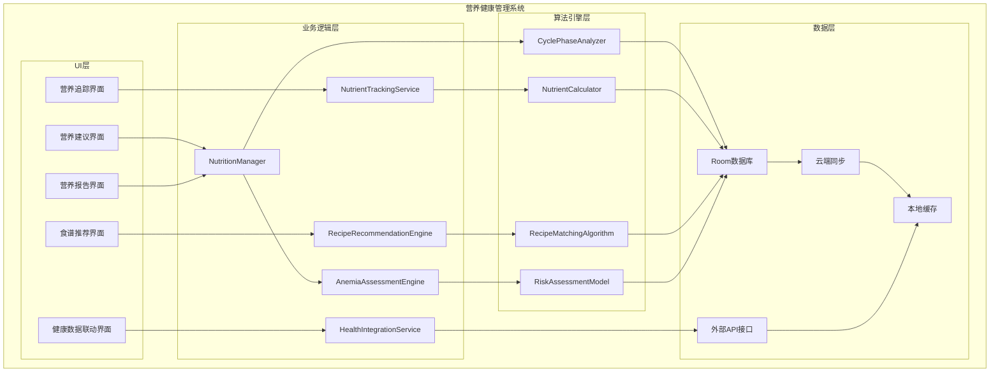
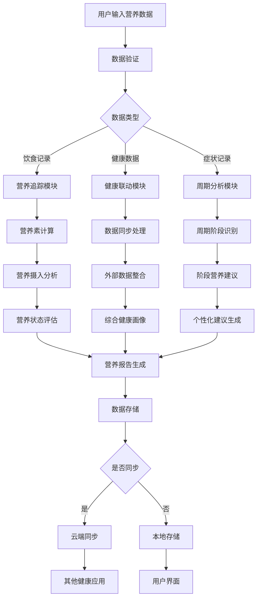

# LuminCore 营养健康管理系统详细计划


## 📋 项目概述

### 功能目标
开发一套完整的营养健康管理系统，为女性用户提供个性化的营养建议、饮食指导和营养素追踪功能，特别是在月经周期不同阶段提供科学的饮食建议，帮助用户改善营养状况，提升整体健康水平。

### 核心价值
- **周期性营养指导**：根据月经周期不同阶段提供个性化饮食建议
- **贫血风险评估**：基于个人健康数据评估贫血风险并提供针对性食谱
- **营养素追踪**：记录和分析关键营养素摄入情况
- **健康生态整合**：与其他健康应用数据联动，提供全面的健康管理

## 🎯 功能需求分析

### 1. 经期营养建议系统

#### 1.1 月经周期阶段划分
```kotlin
enum class MenstrualCyclePhase(
    val displayName: String,
    val typicalDays: IntRange,
    val nutritionalFocus: List<NutrientType>
) {
    MENSTRUAL("月经期", 1..5, listOf(NutrientType.IRON, NutrientType.VITAMIN_C, NutrientType.MAGNESIUM)),
    FOLLICULAR("卵泡期", 6..14, listOf(NutrientType.PROTEIN, NutrientType.VITAMIN_B6, NutrientType.ZINC)),
    OVULATION("排卵期", 15..16, listOf(NutrientType.VITAMIN_E, NutrientType.OMEGA_3, NutrientType.FOLIC_ACID)),
    LUTEAL("黄体期", 17..28, listOf(NutrientType.VITAMIN_B6, NutrientType.MAGNESIUM, NutrientType.CALCIUM))
}
```

#### 1.2 阶段性营养建议
```kotlin
data class CyclePhaseNutritionAdvice(
    val phase: MenstrualCyclePhase,
    val keyNutrients: List<NutrientRecommendation>,
    val foodRecommendations: List<FoodRecommendation>,
    val foodsToLimit: List<FoodItem>,
    val hydrationGuidance: HydrationAdvice
)

data class NutrientRecommendation(
    val nutrient: NutrientType,
    val recommendedAmount: String,
    val unit: String,
    val bestSources: List<FoodSource>
)

data class FoodRecommendation(
    val foodItem: FoodItem,
    val servingSize: String,
    val benefits: String,
    val preparationTips: String
)
```

### 2. 补血食谱推荐系统

#### 2.1 贫血风险评估
```kotlin
data class AnemiaRiskAssessment(
    val riskLevel: AnemiaRiskLevel,
    val keyIndicators: List<HealthIndicator>,
    val contributingFactors: List<RiskFactor>,
    val personalizedRecommendations: List<DietaryRecommendation>
)

enum class AnemiaRiskLevel {
    LOW, MEDIUM, HIGH, VERY_HIGH
}

data class HealthIndicator(
    val type: IndicatorType,
    val currentValue: Float,
    val normalRange: ClosedFloatingPointRange<Float>,
    val riskContribution: Float
)

enum class IndicatorType {
    HEMOGLOBIN, // 血红蛋白
    FERRITIN, // 铁蛋白
    TRANSFERRIN_SATURATION, // 转铁蛋白饱和度
    RED_BLOOD_CELL_COUNT // 红细胞计数
}
```

#### 2.2 个性化食谱推荐
```kotlin
data class IronRichRecipe(
    val id: String,
    val name: String,
    val description: String,
    val ingredients: List<RecipeIngredient>,
    val preparationSteps: List<PreparationStep>,
    val cookingTime: Int, // 分钟
    val servings: Int,
    val ironContent: Float, // 毫克
    val vitaminCContent: Float, // 毫克，有助于铁吸收
    val difficulty: RecipeDifficulty,
    val dietaryTags: Set<DietaryTag>,
    val suitabilityScore: Float // 基于用户个人数据的匹配度评分
)

data class RecipeIngredient(
    val name: String,
    val amount: Float,
    val unit: String,
    val nutritionalInfo: NutritionalInfo
)

data class NutritionalInfo(
    val calories: Int,
    val protein: Float,
    val iron: Float,
    val vitaminC: Float,
    val calcium: Float,
    val folate: Float
)
```

### 3. 维生素追踪系统

#### 3.1 关键营养素定义
```kotlin
enum class KeyNutrient(
    val displayName: String,
    val recommendedDailyIntake: Float,
    val unit: String,
    val upperLimit: Float,
    val deficiencySymptoms: List<String>,
    val foodSources: List<FoodSource>
) {
    FOLIC_ACID("叶酸", 400f, "μg", 1000f, 
        listOf("疲劳", "贫血", "口腔溃疡"), 
        listOf(FoodSource("绿叶蔬菜", 150f), FoodSource("豆类", 100f))),
    
    IRON("铁质", 18f, "mg", 45f,
        listOf("疲劳", "头晕", "心悸"),
        listOf(FoodSource("红肉", 2.5f), FoodSource("菠菜", 2.7f))),
    
    CALCIUM("钙质", 1000f, "mg", 2500f,
        listOf("骨质疏松", "肌肉痉挛", "牙齿问题"),
        listOf(FoodSource("牛奶", 300f), FoodSource("豆腐", 150f))),
    
    VITAMIN_D("维生素D", 15f, "μg", 100f,
        listOf("骨痛", "肌肉无力", "情绪低落"),
        listOf(FoodSource("鱼类", 10f), FoodSource("蛋黄", 1.5f))),
    
    VITAMIN_B12("维生素B12", 2.4f, "μg", 1000f,
        listOf("疲劳", "记忆力下降", "手脚麻木"),
        listOf(FoodSource("肉类", 2.5f), FoodSource("乳制品", 1.2f)))
}
```

#### 3.2 营养素摄入追踪
```kotlin
data class NutrientIntakeRecord(
    val date: Date,
    val nutrient: KeyNutrient,
    val amountConsumed: Float,
    val unit: String,
    val foodSources: List<FoodConsumption>,
    val completeness: IntakeCompleteness
)

enum class IntakeCompleteness {
    BELOW_TARGET, // 低于目标
    ADEQUATE, // 充足
    OPTIMAL, // 最佳
    EXCESSIVE // 过量
}

data class FoodConsumption(
    val foodItem: FoodItem,
    val servingSize: Float,
    val unit: String,
    val nutrientContribution: Map<KeyNutrient, Float>
)

data class DailyNutritionSummary(
    val date: Date,
    val nutrientIntakes: Map<KeyNutrient, NutrientIntakeSummary>,
    val overallScore: Int, // 0-100分
    val recommendations: List<NutritionRecommendation>
)

data class NutrientIntakeSummary(
    val nutrient: KeyNutrient,
    val targetAmount: Float,
    val consumedAmount: Float,
    val percentage: Float, // 达成率
    val status: IntakeStatus
)

enum class IntakeStatus {
    DEFICIENT, // 缺乏
    ADEQUATE, // 充足
    OPTIMAL, // 最佳
    EXCESSIVE // 过量
}
```

### 4. 健康APP联动系统

#### 4.1 数据同步机制
```kotlin
data class HealthAppIntegration(
    val appName: String,
    val integrationType: IntegrationType,
    val supportedDataTypes: Set<HealthDataType>,
    val syncFrequency: SyncFrequency,
    val lastSyncTime: Date?,
    val isActive: Boolean
)

enum class IntegrationType {
    GOOGLE_FIT, // Google Fit
    APPLE_HEALTH, // Apple Health
    MYFITNESSPAL, // MyFitnessPal
    FITBIT, // Fitbit
    STRAVA, // Strava
    CUSTOM // 自定义API
}

enum class HealthDataType {
    NUTRITION_LOGS, // 营养记录
    EXERCISE_DATA, // 运动数据
    WEIGHT_HISTORY, // 体重历史
    SLEEP_PATTERNS, // 睡眠模式
    HEART_RATE // 心率数据
}

enum class SyncFrequency {
    REAL_TIME, // 实时同步
    HOURLY, // 每小时
    DAILY, // 每日
    MANUAL // 手动同步
}
```

#### 4.2 数据融合与分析
```kotlin
data class IntegratedHealthProfile(
    val userId: String,
    val basicInfo: BasicHealthInfo,
    val nutritionData: List<NutrientIntakeRecord>,
    val exerciseData: List<ExerciseRecord>,
    val weightHistory: List<WeightRecord>,
    val sleepData: List<SleepRecord>,
    val derivedInsights: List<HealthInsight>
)

data class HealthInsight(
    val type: InsightType,
    val title: String,
    val description: String,
    val confidence: Float, // 0.0 - 1.0
    val supportingData: List<DataPoint>,
    val recommendations: List<ActionableRecommendation>
)

enum class InsightType {
    NUTRITION_DEFICIENCY, // 营养缺乏
    EXERCISE_NUTRITION_BALANCE, // 运动营养平衡
    WEIGHT_TREND, // 体重趋势
    SLEEP_NUTRITION_CORRELATION // 睡眠营养关联
}

data class ActionableRecommendation(
    val action: String,
    val priority: RecommendationPriority,
    val estimatedImpact: String,
    val timeframe: String
)

enum class RecommendationPriority {
    HIGH, MEDIUM, LOW
}
```

## 🏗️ 技术架构设计

### 1. 核心组件架构



### 2. 数据流设计



## 🗃️ 数据模型设计

### 1. 营养摄入记录实体
```kotlin
@Entity(tableName = "nutrient_intake_records")
data class NutrientIntakeRecord(
    @PrimaryKey(autoGenerate = true)
    val id: Long = 0,
    
    @ColumnInfo(name = "user_id")
    val userId: String,
    
    @ColumnInfo(name = "date")
    val date: Date,
    
    @ColumnInfo(name = "nutrient_type")
    val nutrientType: String,
    
    @ColumnInfo(name = "amount_consumed")
    val amountConsumed: Float,
    
    @ColumnInfo(name = "unit")
    val unit: String,
    
    @ColumnInfo(name = "food_sources")
    val foodSources: String?, // JSON格式存储
    
    @ColumnInfo(name = "completeness")
    val completeness: String,
    
    @ColumnInfo(name = "created_at")
    val createdAt: Date = Date(),
    
    @ColumnInfo(name = "updated_at")
    val updatedAt: Date = Date()
)
```

### 2. 食谱实体
```kotlin
@Entity(tableName = "recipes")
data class Recipe(
    @PrimaryKey
    val id: String,
    
    @ColumnInfo(name = "name")
    val name: String,
    
    @ColumnInfo(name = "description")
    val description: String,
    
    @ColumnInfo(name = "ingredients")
    val ingredients: String, // JSON格式存储
    
    @ColumnInfo(name = "preparation_steps")
    val preparationSteps: String, // JSON格式存储
    
    @ColumnInfo(name = "cooking_time")
    val cookingTime: Int,
    
    @ColumnInfo(name = "servings")
    val servings: Int,
    
    @ColumnInfo(name = "iron_content")
    val ironContent: Float,
    
    @ColumnInfo(name = "vitamin_c_content")
    val vitaminCContent: Float,
    
    @ColumnInfo(name = "difficulty")
    val difficulty: String,
    
    @ColumnInfo(name = "dietary_tags")
    val dietaryTags: String?, // JSON格式存储
    
    @ColumnInfo(name = "suitability_score")
    val suitabilityScore: Float,
    
    @ColumnInfo(name = "is_active")
    val isActive: Boolean = true,
    
    @ColumnInfo(name = "created_at")
    val createdAt: Date = Date(),
    
    @ColumnInfo(name = "updated_at")
    val updatedAt: Date = Date()
)
```

### 3. 健康应用集成实体
```kotlin
@Entity(tableName = "health_app_integrations")
data class HealthAppIntegration(
    @PrimaryKey(autoGenerate = true)
    val id: Long = 0,
    
    @ColumnInfo(name = "user_id")
    val userId: String,
    
    @ColumnInfo(name = "app_name")
    val appName: String,
    
    @ColumnInfo(name = "integration_type")
    val integrationType: String,
    
    @ColumnInfo(name = "supported_data_types")
    val supportedDataTypes: String, // JSON格式存储
    
    @ColumnInfo(name = "sync_frequency")
    val syncFrequency: String,
    
    @ColumnInfo(name = "last_sync_time")
    val lastSyncTime: Date?,
    
    @ColumnInfo(name = "access_token")
    val accessToken: String?, // 加密存储
    
    @ColumnInfo(name = "refresh_token")
    val refreshToken: String?, // 加密存储
    
    @ColumnInfo(name = "is_active")
    val isActive: Boolean = true,
    
    @ColumnInfo(name = "created_at")
    val createdAt: Date = Date(),
    
    @ColumnInfo(name = "updated_at")
    val updatedAt: Date = Date()
)
```

### 4. 贫血风险评估实体
```kotlin
@Entity(tableName = "anemia_risk_assessments")
data class AnemiaRiskAssessment(
    @PrimaryKey(autoGenerate = true)
    val id: Long = 0,
    
    @ColumnInfo(name = "user_id")
    val userId: String,
    
    @ColumnInfo(name = "assessment_date")
    val assessmentDate: Date,
    
    @ColumnInfo(name = "risk_level")
    val riskLevel: String,
    
    @ColumnInfo(name = "key_indicators")
    val keyIndicators: String, // JSON格式存储
    
    @ColumnInfo(name = "contributing_factors")
    val contributingFactors: String, // JSON格式存储
    
    @ColumnInfo(name = "recommendations")
    val recommendations: String, // JSON格式存储
    
    @ColumnInfo(name = "confidence_score")
    val confidenceScore: Float,
    
    @ColumnInfo(name = "next_assessment_date")
    val nextAssessmentDate: Date?,
    
    @ColumnInfo(name = "created_at")
    val createdAt: Date = Date()
)
```

## 📊 实施计划

### 第一阶段：基础功能开发（2030年Q2）

#### 第1-4周（2030年4月-4月）
- [ ] 设计数据模型和数据库表结构
- [ ] 实现营养摄入记录核心功能
- [ ] 开发营养追踪界面
- [ ] 实现基础营养素计算

#### 第5-8周（2030年5月-5月）
- [ ] 实现周期性营养建议算法
- [ ] 开发营养建议界面
- [ ] 构建营养数据库
- [ ] 实现个性化营养推荐

#### 第9-12周（2030年6月-6月）
- [ ] 实现贫血风险评估功能
- [ ] 开发风险评估界面
- [ ] 构建食谱数据库
- [ ] 实现食谱推荐算法

### 第二阶段：健康APP联动（2030年Q3）

#### 第13-16周（2030年7月-7月）
- [ ] 实现健康应用集成框架
- [ ] 开发数据同步功能
- [ ] 构建外部API接口
- [ ] 实现Google Fit集成

#### 第17-20周（2030年8月-8月）
- [ ] 实现Apple Health集成
- [ ] 开发数据融合算法
- [ ] 构建综合健康画像
- [ ] 实现MyFitnessPal集成

#### 第21-24周（2030年9月-9月）
- [ ] 实现Fitbit集成
- [ ] 开发数据同步调度器
- [ ] 构建健康洞察引擎
- [ ] 实现Strava集成

### 第三阶段：优化与完善（2030年Q4）

#### 第25-28周（2030年10月-10月）
- [ ] 性能优化和测试
- [ ] 用户体验优化
- [ ] 界面美化和动画效果
- [ ] 多语言支持

#### 第29-32周（2030年11月-11月）
- [ ] 集成测试和Bug修复
- [ ] 用户反馈收集和改进
- [ ] 文档完善和用户指南
- [ ] 准备发布版本

#### 第33-36周（2030年12月-12月）
- [ ] Beta测试和优化
- [ ] 安全性审查
- [ ] 最终版本发布准备
- [ ] 上线和推广

## 🎯 成功指标

### 技术指标
- 营养建议准确率 > 85%
- 系统响应时间 < 2秒
- 数据同步延迟 < 5秒
- 应用崩溃率 < 0.1%

### 用户体验指标
- 功能使用率 > 70%
- 用户满意度 > 4.5/5
- 留存率（30天）> 65%
- 健康应用集成使用率 > 40%

### 业务指标
- 新用户增长 > 25%
- 付费转化率 > 8%
- 用户平均使用时长 > 15分钟/天
- 社区互动率 > 30%

## 🛡️ 风险评估与缓解策略

### 技术风险
**风险1**: 营养建议算法准确性不足
- **缓解策略**: 使用权威营养学数据，持续优化算法
- **应急计划**: 提供算法准确度说明，增加用户手动调整功能

**风险2**: 健康数据同步安全问题
- **缓解策略**: 实施端到端加密，严格权限控制
- **应急计划**: 提供本地存储选项，增加数据备份功能

### 用户体验风险
**风险3**: 功能复杂度高导致用户流失
- **缓解策略**: 设计渐进式引导，提供个性化设置
- **应急计划**: 简化核心功能，提供快速入门模式

### 数据风险
**风险4**: 用户隐私数据泄露
- **缓解策略**: 实施严格的数据加密和访问控制
- **应急计划**: 建立紧急响应机制，及时通知用户

## 💰 资源需求与预算

### 人力资源
- **Android开发工程师**: 1.5人（全职6个月）
- **营养学专家**: 0.3人（营养建议算法）
- **UI/UX设计师**: 0.3人（界面设计）
- **测试工程师**: 0.3人（功能测试）

### 技术资源
- **开发工具**: Android Studio, Git, CI/CD
- **第三方库**: MPAndroidChart, WorkManager
- **测试工具**: 自动化测试框架

### 预算估算
- **人力成本**: 主要成本，约6个月开发周期
- **工具和库**: 主要使用开源方案，成本较低
- **测试和部署**: 标准开发流程，无额外成本

## 📈 长期发展规划

### 短期目标（1年内）
- 完善基础功能，提升用户体验
- 增加更多营养和健康建议内容
- 优化算法准确性和性能

### 中期目标（1-3年）
- 集成更多健康设备数据
- 增加AI营养助手功能
- 扩展到更多语言和地区

### 长期目标（3-5年）
- 构建完整的营养健康生态系统
- 与医疗机构合作提供专业服务
- 发展社区和专家咨询平台

---

**文档版本**: 1.0.0
**创建日期**: 2026年5月20日
**计划负责人**: 祁潇潇
**审核状态**: 已审核
**预计开始时间**: 2030年4月1日
**预计完成时间**: 2030年12月31日
## 🔄 相关依赖
- [智能提醒系统](./SMART_REMINDER_SYSTEM_PLAN.md)
- [AI健康助手功能](./AI_HEALTH_ASSISTANT_PLAN.md)
- [云端同步架构](./CLOUD_SYNC_ARCHITECTURE_PLAN.md)
- [数据加密功能](./DATA_ENCRYPTION_PLAN.md)