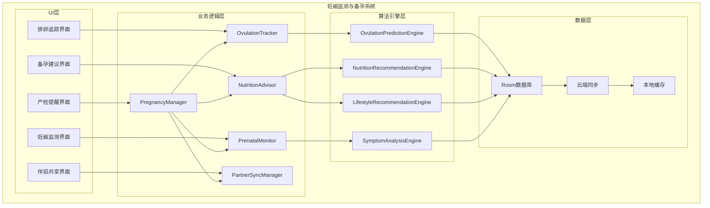
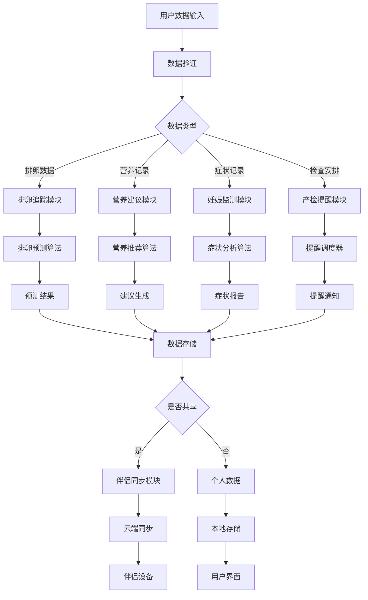

# LuminCore 妊娠监测与备孕功能详细计划


## 📋 项目概述

### 功能目标
开发一套完整的妊娠监测与备孕支持系统，为有备孕需求和早期妊娠的用户提供专业的健康监测、个性化建议和数据管理服务。

### 核心价值
- **科学备孕**：基于生理数据的精准排卵期预测
- **全程陪伴**：从备孕到妊娠早期的完整健康管理
- **伴侣协同**：支持伴侣间数据共享和协同管理
- **专业建议**：提供科学的营养和生活方式指导

## 🎯 功能需求分析

### 1. 排卵期追踪系统

#### 1.1 多维度数据采集
```kotlin
data class OvulationTrackingData(
    val basalBodyTemperature: List<TemperatureRecord>, // 基础体温记录
    val cervicalMucus: CervicalMucusRecord, // 宫颈粘液观察
    val luteinizingHormone: LHTestRecord?, // 排卵试纸检测
    val cervicalPosition: CervicalPositionRecord?, // 宫颈位置变化
    val symptoms: List<SymptomRecord>, // 相关症状记录
    val intercourse: List<IntercourseRecord> // 同房记录
)

data class TemperatureRecord(
    val date: Date,
    val temperature: Float, // 体温值(摄氏度)
    val timeOfDay: LocalTime, // 测量时间
    val measurementMethod: TemperatureMethod // 测量方式
)

enum class TemperatureMethod {
    ORAL, // 口腔测量
    VAGINAL, // 阴道测量
    RECTAL // 肛门测量
}

data class CervicalMucusRecord(
    val date: Date,
    val consistency: MucusConsistency, // 粘稠度
    val appearance: MucusAppearance, // 外观
    val sensation: MucusSensation // 感觉
)

enum class MucusConsistency {
    DRY, // 干燥
    STICKY, // 粘稠
    CREAMY, // 奶油状
    WATERY, // 水状
    EGG_WHITE // 蛋白状
}
```

#### 1.2 智能排卵预测算法
```kotlin
class OvulationPredictionEngine {
    
    fun predictOvulation(trackingData: OvulationTrackingData): OvulationPrediction {
        val temperaturePattern = analyzeTemperaturePattern(trackingData.basalBodyTemperature)
        val mucusPattern = analyzeMucusPattern(trackingData.cervicalMucus)
        val lhSurge = detectLHSurge(trackingData.luteinizingHormone)
        
        return OvulationPrediction(
            predictedOvulationDate = calculateOvulationDate(temperaturePattern, mucusPattern, lhSurge),
            fertileWindowStart = calculateFertileWindowStart(temperaturePattern),
            fertileWindowEnd = calculateFertileWindowEnd(temperaturePattern),
            confidence = calculatePredictionConfidence(temperaturePattern, mucusPattern, lhSurge),
            indicators = collectPredictionIndicators(temperaturePattern, mucusPattern, lhSurge)
        )
    }
    
    private fun analyzeTemperaturePattern(temperatures: List<TemperatureRecord>): TemperaturePattern {
        // 分析基础体温变化模式
        // 识别排卵后体温上升
        return TemperaturePattern()
    }
}
```

### 2. 备孕建议系统

#### 2.1 营养补充建议
```kotlin
data class NutritionRecommendation(
    val nutrient: NutrientType,
    val recommendedDosage: String,
    val timing: RecommendationTiming,
    val sources: List<NutritionSource>,
    val importance: RecommendationImportance
)

enum class NutrientType {
    FOLIC_ACID, // 叶酸
    IRON, // 铁
    CALCIUM, // 钙
    VITAMIN_D, // 维生素D
    OMEGA_3, // Omega-3脂肪酸
    VITAMIN_B12, // 维生素B12
    IODINE // 碘
}

enum class RecommendationTiming {
    PRECONCEPTION, // 备孕期
    FIRST_TRIMESTER, // 孕早期
    SECOND_TRIMESTER, // 孕中期
    THIRD_TRIMESTER, // 孕晚期
    BREASTFEEDING // 哺乳期
}
```

#### 2.2 生活方式优化建议
```kotlin
data class LifestyleRecommendation(
    val category: LifestyleCategory,
    val recommendation: String,
    val importance: RecommendationImportance,
    val evidenceLevel: EvidenceLevel
)

enum class LifestyleCategory {
    EXERCISE, // 运动
    SLEEP, // 睡眠
    STRESS_MANAGEMENT, // 压力管理
    SUBSTANCE_AVOIDANCE, // 避免有害物质
    ENVIRONMENTAL_EXPOSURE // 环境暴露
}

enum class EvidenceLevel {
    HIGH, // 高证据级别
    MODERATE, // 中等证据级别
    LOW // 低证据级别
}
```

### 3. 妊娠早期监测

#### 3.1 症状记录系统
```kotlin
data class PregnancySymptom(
    val symptomType: PregnancySymptomType,
    val severity: SymptomSeverity,
    val frequency: SymptomFrequency,
    val duration: Int, // 持续天数
    val notes: String?
)

enum class PregnancySymptomType {
    NAUSEA, // 恶心
    VOMITING, // 呕吐
    FATIGUE, // 疲劳
    BREAST_TENDERNESS, // 乳房胀痛
    FREQUENT_URINATION, // 尿频
    FOOD_AVERSIONS, // 食物厌恶
    MOOD_SWINGS, // 情绪波动
    DIZZINESS, // 头晕
    CONSTIPATION, // 便秘
    HEARTBURN // 胃灼热
}
```

#### 3.2 产检提醒系统
```kotlin
data class PrenatalCheckup(
    val checkupType: CheckupType,
    val scheduledDate: Date,
    val reminderDate: Date,
    val location: String?,
    val doctor: String?,
    val notes: String?,
    val isCompleted: Boolean = false
)

enum class CheckupType(
    val displayName: String,
    val typicalWeek: Int, // 通常在孕几周进行
    val importance: CheckupImportance
) {
    FIRST_VISIT("首次产检", 8, CheckupImportance.HIGH),
    BLOOD_TEST("血检", 10, CheckupImportance.HIGH),
    ULTRASOUND_1("NT检查", 12, CheckupImportance.HIGH),
    DOWN_SYNDROME_SCREENING("唐氏筛查", 16, CheckupImportance.MEDIUM),
    ANOMALY_SCAN("大排畸", 20, CheckupImportance.HIGH),
    GESTATIONAL_DIABETES("糖耐量试验", 26, CheckupImportance.HIGH),
    GROWTH_SCAN("生长发育检查", 32, CheckupImportance.MEDIUM),
    GROUP_B_STREP("B族链球菌检查", 36, CheckupImportance.HIGH)
}
```

### 4. 伴侣数据同步

#### 4.1 数据共享机制
```kotlin
data class PartnerDataSharing(
    val ownerId: String, // 数据所有者ID
    val partnerId: String, // 伴侣ID
    val sharedDataTypes: Set<SharedDataType>, // 共享的数据类型
    val sharingPermissions: SharingPermissions, // 共享权限
    val lastSyncTime: Date? // 最后同步时间
)

enum class SharedDataType {
    OVULATION_DATA, // 排卵数据
    NUTRITION_LOG, // 营养记录
    EXERCISE_LOG, // 运动记录
    SYMPTOM_LOG, // 症状记录
    CHECKUP_SCHEDULE // 检查安排
}

data class SharingPermissions(
    val canView: Boolean = true, // 是否可查看
    val canComment: Boolean = true, // 是否可评论
    val canEdit: Boolean = false // 是否可编辑
)
```

## 🏗️ 技术架构设计

### 1. 核心组件架构



### 2. 数据流设计



## 🗃️ 数据模型设计

### 1. 排卵追踪实体
```kotlin
@Entity(tableName = "ovulation_tracking")
data class OvulationTracking(
    @PrimaryKey(autoGenerate = true)
    val id: Long = 0,
    
    @ColumnInfo(name = "user_id")
    val userId: String,
    
    @ColumnInfo(name = "date")
    val date: Date,
    
    @ColumnInfo(name = "basal_temperature")
    val basalTemperature: Float?,
    
    @ColumnInfo(name = "mucus_consistency")
    val mucusConsistency: String?,
    
    @ColumnInfo(name = "lh_test_result")
    val lhTestResult: String?,
    
    @ColumnInfo(name = "cervical_position")
    val cervicalPosition: String?,
    
    @ColumnInfo(name = "symptoms")
    val symptoms: String?, // JSON格式存储
    
    @ColumnInfo(name = "intercourse")
    val intercourse: Boolean = false,
    
    @ColumnInfo(name = "notes")
    val notes: String?,
    
    @ColumnInfo(name = "created_at")
    val createdAt: Date = Date(),
    
    @ColumnInfo(name = "updated_at")
    val updatedAt: Date = Date()
)
```

### 2. 营养建议实体
```kotlin
@Entity(tableName = "nutrition_recommendations")
data class NutritionRecommendationRecord(
    @PrimaryKey(autoGenerate = true)
    val id: Long = 0,
    
    @ColumnInfo(name = "user_id")
    val userId: String,
    
    @ColumnInfo(name = "nutrient_type")
    val nutrientType: String,
    
    @ColumnInfo(name = "recommended_dosage")
    val recommendedDosage: String,
    
    @ColumnInfo(name = "timing")
    val timing: String,
    
    @ColumnInfo(name = "importance")
    val importance: String,
    
    @ColumnInfo(name = "personalized")
    val personalized: Boolean = false, // 是否个性化
    
    @ColumnInfo(name = "start_date")
    val startDate: Date?,
    
    @ColumnInfo(name = "end_date")
    val endDate: Date?,
    
    @ColumnInfo(name = "is_active")
    val isActive: Boolean = true,
    
    @ColumnInfo(name = "created_at")
    val createdAt: Date = Date()
)
```

### 3. 妊娠监测实体
```kotlin
@Entity(tableName = "pregnancy_monitoring")
data class PregnancyMonitoring(
    @PrimaryKey(autoGenerate = true)
    val id: Long = 0,
    
    @ColumnInfo(name = "user_id")
    val userId: String,
    
    @ColumnInfo(name = "last_menstrual_period")
    val lastMenstrualPeriod: Date,
    
    @ColumnInfo(name = "confirmed_pregnancy")
    val confirmedPregnancy: Boolean = false,
    
    @ColumnInfo(name = "confirmation_date")
    val confirmationDate: Date?,
    
    @ColumnInfo(name = "estimated_due_date")
    val estimatedDueDate: Date?,
    
    @ColumnInfo(name = "current_week")
    val currentWeek: Int = 0,
    
    @ColumnInfo(name = "baby_gender")
    val babyGender: String?,
    
    @ColumnInfo(name = "weight_gain")
    val weightGain: Float,
    
    @ColumnInfo(name = "notes")
    val notes: String?,
    
    @ColumnInfo(name = "created_at")
    val createdAt: Date = Date(),
    
    @ColumnInfo(name = "updated_at")
    val updatedAt: Date = Date()
)
```

### 4. 伴侣数据共享实体
```kotlin
@Entity(tableName = "partner_sharing")
data class PartnerSharing(
    @PrimaryKey(autoGenerate = true)
    val id: Long = 0,
    
    @ColumnInfo(name = "owner_user_id")
    val ownerUserId: String,
    
    @ColumnInfo(name = "partner_user_id")
    val partnerUserId: String,
    
    @ColumnInfo(name = "shared_data_types")
    val sharedDataTypes: String, // JSON格式存储共享的数据类型
    
    @ColumnInfo(name = "can_view")
    val canView: Boolean = true,
    
    @ColumnInfo(name = "can_comment")
    val canComment: Boolean = true,
    
    @ColumnInfo(name = "can_edit")
    val canEdit: Boolean = false,
    
    @ColumnInfo(name = "is_active")
    val isActive: Boolean = true,
    
    @ColumnInfo(name = "created_at")
    val createdAt: Date = Date(),
    
    @ColumnInfo(name = "updated_at")
    val updatedAt: Date = Date()
)
```

## 📊 实施计划

### 第一阶段：基础功能开发（2030年Q1）

#### 第1-4周（2030年1月-1月）
- [ ] 设计数据模型和数据库表结构
- [ ] 实现排卵追踪核心功能
- [ ] 开发基础体温记录界面
- [ ] 实现宫颈粘液观察记录功能

#### 第5-8周（2030年2月-2月）
- [ ] 开发排卵预测算法
- [ ] 实现排卵试纸记录功能
- [ ] 构建排卵日历视图
- [ ] 完成排卵追踪模块测试

#### 第9-12周（2030年3月-3月）
- [ ] 实现营养建议系统
- [ ] 开发营养记录界面
- [ ] 构建营养数据库
- [ ] 实现个性化营养推荐

### 第二阶段：妊娠监测与伴侣共享（2030年Q2）

#### 第13-16周（2030年4月-4月）
- [ ] 实现妊娠早期监测功能
- [ ] 开发症状记录系统
- [ ] 构建妊娠计算器
- [ ] 实现预产期计算

#### 第17-20周（2030年5月-5月）
- [ ] 实现产检提醒系统
- [ ] 开发检查安排界面
- [ ] 构建提醒调度器
- [ ] 实现通知推送功能

#### 第21-24周（2030年6月-6月）
- [ ] 实现伴侣数据共享功能
- [ ] 开发共享设置界面
- [ ] 构建数据同步机制
- [ ] 实现权限管理系统

### 第三阶段：优化与完善（2030年Q3）

#### 第25-28周（2030年7月-7月）
- [ ] 性能优化和测试
- [ ] 用户体验优化
- [ ] 界面美化和动画效果
- [ ] 多语言支持

#### 第29-32周（2030年8月-8月）
- [ ] 集成测试和Bug修复
- [ ] 用户反馈收集和改进
- [ ] 文档完善和用户指南
- [ ] 准备发布版本

#### 第33-36周（2030年9月-9月）
- [ ] Beta测试和优化
- [ ] 安全性审查
- [ ] 最终版本发布准备
- [ ] 上线和推广

## 🎯 成功指标

### 技术指标
- 排卵预测准确率 > 85%
- 系统响应时间 < 2秒
- 数据同步延迟 < 5秒
- 应用崩溃率 < 0.1%

### 用户体验指标
- 功能使用率 > 70%
- 用户满意度 > 4.5/5
- 留存率（30天）> 65%
- 伴侣共享使用率 > 40%

### 业务指标
- 新用户增长 > 25%
- 付费转化率 > 8%
- 用户平均使用时长 > 15分钟/天
- 社区互动率 > 30%

## 🛡️ 风险评估与缓解策略

### 技术风险
**风险1**: 排卵预测算法准确性不足
- **缓解策略**: 使用多维度数据融合算法，持续优化模型
- **应急计划**: 提供算法准确度说明，增加用户手动调整功能

**风险2**: 数据同步安全问题
- **缓解策略**: 实施端到端加密，严格权限控制
- **应急计划**: 提供本地存储选项，增加数据备份功能

### 用户体验风险
**风险3**: 功能复杂度高导致用户流失
- **缓解策略**: 设计渐进式引导，提供个性化设置
- **应急计划**: 简化核心功能，提供快速入门模式

### 数据风险
**风险4**: 用户隐私数据泄露
- **缓解策略**: 实施严格的数据加密和访问控制
- **应急计划**: 建立紧急响应机制，及时通知用户

## 💰 资源需求与预算

### 人力资源
- **Android开发工程师**: 1.5人（全职6个月）
- **算法工程师**: 0.5人（排卵预测算法）
- **UI/UX设计师**: 0.3人（界面设计）
- **测试工程师**: 0.3人（功能测试）

### 技术资源
- **开发工具**: Android Studio, Git, CI/CD
- **第三方库**: MPAndroidChart, WorkManager
- **测试工具**: 自动化测试框架

### 预算估算
- **人力成本**: 主要成本，约6个月开发周期
- **工具和库**: 主要使用开源方案，成本较低
- **测试和部署**: 标准开发流程，无额外成本

## 📈 长期发展规划

### 短期目标（1年内）
- 完善基础功能，提升用户体验
- 增加更多营养和健康建议内容
- 优化算法准确性和性能

### 中期目标（1-3年）
- 集成更多健康设备数据
- 增加AI健康助手功能
- 扩展到更多语言和地区

### 长期目标（3-5年）
- 构建完整的孕产健康生态系统
- 与医疗机构合作提供专业服务
- 发展社区和专家咨询平台

---

**文档版本**: 1.0.0
**创建日期**: 2026年5月20日
**计划负责人**: 祁潇潇
**审核状态**: 待审核
**预计开始时间**: 2030年1月1日
**预计完成时间**: 2030年9月30日
## 🔄 相关依赖
- [智能提醒系统](./SMART_REMINDER_SYSTEM_PLAN.md)
- [AI健康助手功能](./AI_HEALTH_ASSISTANT_PLAN.md)
- [云端同步架构](./CLOUD_SYNC_ARCHITECTURE_PLAN.md)
- [数据加密功能](./DATA_ENCRYPTION_PLAN.md)
