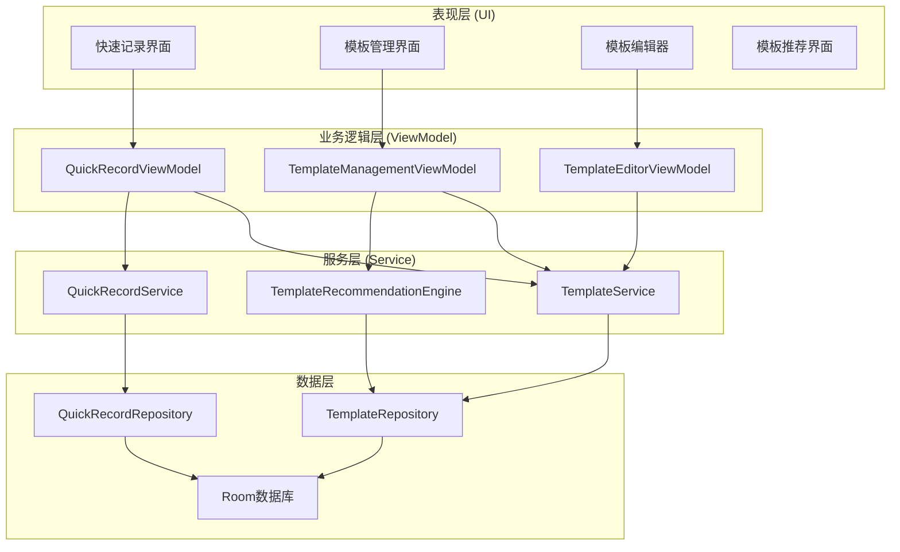
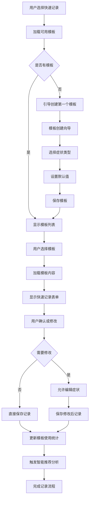

# LuminCore 快速模板记录功能详细开发计划


## 📋 项目概述

快速模板记录功能是LuminCore女性健康助手的核心效率提升功能，旨在通过智能模板系统，让用户能够快速、准确地记录常用的症状组合和健康状态，显著提升数据录入效率和用户体验。

### 项目背景
- **用户痛点**：重复录入相似症状组合耗时费力，降低使用积极性
- **市场需求**：用户需要更高效的数据录入方式，提升日常使用体验
- **技术基础**：基于现有症状记录系统的丰富数据和用户行为分析
- **商业价值**：显著提升用户体验，增强用户粘性和日活跃度

### 核心价值主张
- **效率优先**：将多步骤记录简化为一键操作
- **智能学习**：基于用户行为自动生成个性化模板
- **灵活定制**：支持用户自定义模板内容和快捷方式
- **无缝集成**：与现有记录系统完美融合，不改变用户习惯

## 🎯 功能目标与成功指标

### 主要目标
1. **模板管理系统**：创建、编辑、删除个性化症状记录模板
2. **一键快速记录**：通过模板实现快速症状和状态记录
3. **智能模板推荐**：基于历史数据自动推荐模板创建
4. **模板共享机制**：支持导入导出和社区模板分享

### 成功指标
- **录入效率提升**: ≥ 60%（相比传统录入方式）
- **模板使用率**: ≥ 80%（用户使用模板记录的比例）
- **用户满意度**: ≥ 4.6/5.0（功能使用评分）
- **日均使用频次**: ≥ 2次（用户日均使用模板次数）
- **模板创建率**: ≥ 70%（用户主动创建模板的比例）

## 🏗️ 技术架构设计

### 整体架构图



### 模板记录流程



### 核心技术栈
- **数据存储**: Room Database 2.7.1 + SQLite
- **UI组件**: Material Design 3 + 自定义快捷组件
- **异步处理**: Kotlin Coroutines 1.7.3 + Flow
- **依赖注入**: Hilt 2.48
- **数据分析**: 自定义模式识别算法
- **序列化**: Gson 2.11.0（模板数据）

## 📊 核心功能模块设计

### 1. 数据模型设计

#### 1.1 症状模板实体
``kotlin
@Entity(tableName = "symptom_templates")
data class SymptomTemplate(
    @PrimaryKey val id: String = UUID.randomUUID().toString(),
    val name: String,                          // 模板名称
    val description: String? = null,           // 模板描述
    val symptoms: List<SymptomItem>,          // 症状列表
    val tags: List<String> = emptyList(),     // 标签
    val color: String? = null,                // 模板颜色
    val icon: String? = null,                 // 模板图标
    val usageCount: Int = 0,                  // 使用次数
    val lastUsedAt: LocalDateTime? = null,    // 最后使用时间
    val createdAt: LocalDateTime = LocalDateTime.now(),
    val userId: String                        // 用户ID
)

data class SymptomItem(
    val type: SymptomType,        // 症状类型
    val name: String,             // 症状名称
    val defaultIntensity: Int,    // 默认强度 (1-5)
    val isRequired: Boolean = false // 是否必填
)
```

#### 1.2 快速记录实体
```
@Entity(tableName = "quick_records")
data class QuickRecord(
    @PrimaryKey val id: String = UUID.randomUUID().toString(),
    val templateId: String,                   // 使用的模板ID
    val templateName: String,                 // 模板名称快照
    val date: LocalDate,                      // 记录日期
    val symptoms: List<RecordedSymptom>,      // 实际记录的症状
    val notes: String? = null,                // 额外备注
    val createdAt: LocalDateTime = LocalDateTime.now(),
    val userId: String                        // 用户ID
)
```

### 2. 核心服务实现

#### 2.1 模板管理服务
```
@Singleton
class TemplateService @Inject constructor(
    private val templateRepository: TemplateRepository,
    private val templateValidator: TemplateValidator
) {
    
    suspend fun createTemplate(template: SymptomTemplate): Result<SymptomTemplate> {
        return withContext(Dispatchers.IO) {
            try {
                // 验证模板数据
                val validationResult = templateValidator.validate(template)
                if (!validationResult.isValid) {
                    return@withContext Result.failure(
                        IllegalArgumentException(validationResult.errors.joinToString())
                    )
                }
                
                // 保存模板
                val savedTemplate = templateRepository.insert(template)
                Result.success(savedTemplate)
                
            } catch (e: Exception) {
                Log.e("TemplateService", "创建模板失败", e)
                Result.failure(e)
            }
        }
    }
    
    suspend fun getUserTemplates(
        userId: String,
        sortBy: TemplateSortBy = TemplateSortBy.USAGE_COUNT
    ): List<SymptomTemplate> {
        return withContext(Dispatchers.IO) {
            val templates = templateRepository.findByUserId(userId)
            when (sortBy) {
                TemplateSortBy.USAGE_COUNT -> templates.sortedByDescending { it.usageCount }
                TemplateSortBy.LAST_USED -> templates.sortedByDescending { it.lastUsedAt }
                TemplateSortBy.NAME -> templates.sortedBy { it.name }
                TemplateSortBy.CREATED_DATE -> templates.sortedByDescending { it.createdAt }
            }
        }
    }
}
```

#### 2.2 智能推荐引擎
```
@Singleton
class TemplateRecommendationEngine @Inject constructor(
    private val recordRepository: MenstrualRecordRepository,
    private val patternAnalyzer: SymptomPatternAnalyzer
) {
    
    suspend fun generateTemplateRecommendations(
        userId: String,
        analysisWindow: Int = 90
    ): List<TemplateRecommendation> {
        return withContext(Dispatchers.Default) {
            val endDate = LocalDate.now()
            val startDate = endDate.minusDays(analysisWindow.toLong())
            
            val records = recordRepository.getRecordsBetween(userId, startDate, endDate)
            if (records.size < 10) return@withContext emptyList()
            
            val patterns = patternAnalyzer.analyzeSymptomPatterns(records)
            
            patterns.mapNotNull { pattern ->
                if (pattern.frequency >= 3 && pattern.confidence >= 0.7) {
                    createTemplateRecommendation(pattern)
                } else null
            }
        }
    }
    
    private fun createTemplateRecommendation(pattern: SymptomPattern): TemplateRecommendation {
        val suggestedName = generateTemplateName(pattern)
        val suggestedTemplate = SymptomTemplate(
            name = suggestedName,
            description = "基于您的记录模式自动推荐",
            symptoms = pattern.symptoms.map { symptom ->
                SymptomItem(
                    type = symptom.type,
                    name = symptom.name,
                    defaultIntensity = symptom.averageIntensity.roundToInt()
                )
            },
            userId = ""
        )
        
        return TemplateRecommendation(
            template = suggestedTemplate,
            confidence = pattern.confidence,
            frequency = pattern.frequency,
            reason = "该症状组合在过去${pattern.frequency}次记录中出现"
        )
    }
}
```

### 3. 用户界面核心

#### 3.1 快速记录主界面
```
@AndroidEntryPoint
class QuickRecordFragment : Fragment() {
    
    private var _binding: FragmentQuickRecordBinding? = null
    private val binding get() = _binding!!
    
    private val viewModel: QuickRecordViewModel by viewModels()
    private lateinit var templateAdapter: TemplateAdapter
    
    override fun onViewCreated(view: View, savedInstanceState: Bundle?) {
        super.onViewCreated(view, savedInstanceState)
        setupUI()
        observeViewModel()
        viewModel.loadUserTemplates()
    }
    
    private fun setupUI() {
        templateAdapter = TemplateAdapter(
            onTemplateClick = { template ->
                viewModel.useTemplate(template.id)
            },
            onTemplateEdit = { template ->
                findNavController().navigate(
                    QuickRecordFragmentDirections.actionToTemplateEditor(template.id)
                )
            }
        )
        
        binding.templateRecyclerView.apply {
            adapter = templateAdapter
            layoutManager = GridLayoutManager(requireContext(), 2)
        }
    }
    
    private fun observeViewModel() {
        viewLifecycleOwner.lifecycleScope.launch {
            viewModel.uiState.collect { state ->
                when (state) {
                    is QuickRecordUiState.Success -> {
                        templateAdapter.submitTemplates(state.templates)
                        updateStats(state)
                    }
                    is QuickRecordUiState.Error -> {
                        showError(state.message)
                    }
                }
            }
        }
    }
}
```

#### 3.2 模板卡片组件
```
class TemplateCardView @JvmOverloads constructor(
    context: Context,
    attrs: AttributeSet? = null,
    defStyleAttr: Int = 0
) : MaterialCardView(context, attrs, defStyleAttr) {
    
    private val binding = ViewTemplateCardBinding.inflate(
        LayoutInflater.from(context), this, true
    )
    
    fun setTemplate(template: SymptomTemplate) {
        binding.apply {
            templateName.text = template.name
            symptomCount.text = "${template.symptoms.size}个症状"
            usageCount.text = "使用${template.usageCount}次"
            
            // 设置模板颜色
            template.color?.let { color ->
                setCardBackgroundColor(Color.parseColor(color))
            }
            
            // 设置模板图标
            template.icon?.let { icon ->
                templateIcon.setImageResource(getIconResource(icon))
            }
            
            // 显示主要症状
            val mainSymptoms = template.symptoms.take(3).joinToString(", ") { it.name }
            symptomPreview.text = mainSymptoms
        }
    }
    
    private fun getIconResource(iconName: String): Int {
        return when (iconName) {
            "headache" -> R.drawable.ic_headache
            "cramps" -> R.drawable.ic_cramps
            "mood" -> R.drawable.ic_mood
            else -> R.drawable.ic_template_default
        }
    }
}
```

## 📅 详细实施计划

### 第一阶段：基础功能开发（2029年1月 - 2029年2月）

#### 第1-2周（2029年1月1日 - 1月14日）：数据模型与架构
- [ ] 设计模板和快速记录数据模型
- [ ] 创建Room数据库表结构
- [ ] 实现基础Repository层
- [ ] 配置Hilt依赖注入
- [ ] 编写数据层单元测试

#### 第3-4周（2029年1月15日 - 1月28日）：模板管理功能
- [ ] 实现TemplateService核心逻辑
- [ ] 开发模板CRUD操作
- [ ] 构建模板验证器
- [ ] 实现模板排序和过滤
- [ ] 编写模板管理测试用例

#### 第5-6周（2029年1月29日 - 2月11日）：快速记录功能
- [ ] 实现QuickRecordService
- [ ] 开发模板使用逻辑
- [ ] 构建与主记录系统的同步机制
- [ ] 实现记录历史管理
- [ ] 编写快速记录测试

#### 第7-8周（2029年2月12日 - 2月25日）：基础UI开发
- [ ] 设计快速记录主界面
- [ ] 实现模板卡片组件
- [ ] 开发模板编辑器基础功能
- [ ] 构建ViewModel层
- [ ] 完成第一阶段集成测试

### 第二阶段：智能功能与优化（2029年3月 - 2029年4月）

#### 第9-10周（2029年2月26日 - 3月11日）：智能推荐系统
- [ ] 实现症状模式分析算法
- [ ] 开发模板推荐引擎
- [ ] 构建推荐置信度计算
- [ ] 实现推荐界面和交互
- [ ] 测试推荐算法准确性

#### 第11-12周（2029年3月12日 - 3月25日）：用户体验优化
- [ ] 完善模板编辑器功能
- [ ] 实现拖拽排序和批量操作
- [ ] 优化界面动画和交互
- [ ] 添加使用引导和帮助
- [ ] 实现模板导入导出功能

#### 第13-14周（2029年3月26日 - 4月8日）：性能优化与测试
- [ ] 优化数据库查询性能
- [ ] 实现智能缓存机制
- [ ] 进行压力测试和优化
- [ ] 完善错误处理机制
- [ ] 执行全面功能测试

#### 第15-16周（2029年4月9日 - 4月22日）：上线准备
- [ ] 完善用户文档和指南
- [ ] 实现使用统计和分析
- [ ] 准备Beta版本发布
- [ ] 收集用户反馈
- [ ] 最终优化和bug修复

## 🎯 关键里程碑

### 里程碑1：基础功能完成（2029年2月25日）
- ✅ 模板管理系统正常运行
- ✅ 快速记录功能实现
- ✅ 基础UI界面完成
- ✅ 单元测试覆盖率 ≥ 80%

### 里程碑2：智能功能上线（2029年4月8日）
- ✅ 智能推荐系统运行
- ✅ 用户体验优化完成
- ✅ 性能指标达到要求
- ✅ 集成测试全部通过

### 里程碑3：功能完整发布（2029年4月22日）
- ✅ 所有功能稳定运行
- ✅ 用户反馈收集完成
- ✅ 准备正式版本发布
- ✅ 文档和支持材料完善

## 🛡️ 风险评估与缓解策略

### 技术风险
**风险1**: 智能推荐算法准确性不足
- **缓解策略**: 多算法对比验证，建立用户反馈循环
- **应急计划**: 简化推荐逻辑，依赖用户手动创建

**风险2**: 与现有系统集成复杂性
- **缓解策略**: 渐进式集成，保持向后兼容
- **应急计划**: 独立运行模式，后期优化集成

### 用户体验风险
**风险3**: 用户学习成本过高
- **缓解策略**: 设计直观界面，提供详细引导
- **应急计划**: 简化功能流程，分阶段推出

## 💰 资源需求

### 人力资源
- **Android开发工程师**: 1人（全职4个月）
- **UI/UX设计师**: 0.3人（界面设计支持）
- **算法工程师**: 0.2人（推荐算法优化）
- **测试工程师**: 0.3人（功能和性能测试）

### 技术资源
- **开发工具**: Android Studio, Git, 设计工具
- **第三方库**: Room, Hilt, Material Design组件
- **测试工具**: JUnit, Espresso, 性能分析工具

## 📈 成功衡量标准

### 技术指标
- **功能完成度**: 100%核心功能实现
- **响应性能**: 模板加载时间 ≤ 500ms
- **稳定性**: 崩溃率 ≤ 0.1%
- **代码质量**: 单元测试覆盖率 ≥ 80%

### 用户指标
- **功能采用率**: 新功能使用率 ≥ 60%
- **效率提升**: 录入时间减少 ≥ 60%
- **用户满意度**: 功能评分 ≥ 4.6/5.0
- **留存率**: 功能使用30天留存 ≥ 80%

### 业务指标
- **日活跃提升**: 用户日均使用次数增加
- **数据质量**: 记录完整性和准确性提升
- **用户价值**: 提升用户健康管理效率
- **产品差异化**: 建立竞争优势功能

---

**文档版本**: 1.0.0
**创建日期**: 2025年8月25日
**计划负责人**: 祁潇潇
**审核状态**: 已审核
**预计开始时间**: 2029年1月1日
**预计完成时间**: 2029年4月22日
## 🔄 相关依赖
- [AI健康助手功能](./AI_HEALTH_ASSISTANT_PLAN.md)
- [数据加密功能](./DATA_ENCRYPTION_PLAN.md)
- [云端同步架构](./CLOUD_SYNC_ARCHITECTURE_PLAN.md)
- [可穿戴设备集成](./WEARABLE_DEVICE_INTEGRATION_PLAN.md)