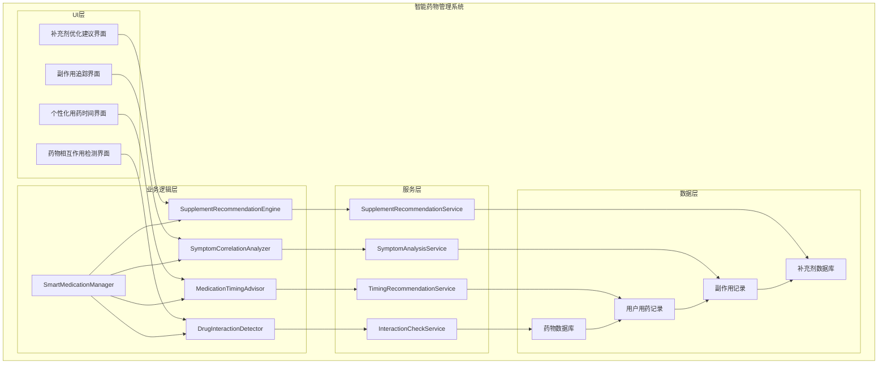
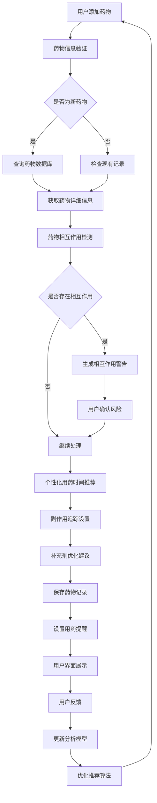

# LuminCore 智能药物管理详细计划


## 📋 项目概述

### 功能目标
开发一套智能药物管理系统，为用户提供药物相互作用检测、个性化用药时间安排、副作用追踪分析和补充剂优化建议等功能，帮助用户更安全、有效地管理个人用药和营养补充。

### 核心价值
- **安全保障**：智能检测药物相互作用，避免用药风险
- **个性化服务**：基于用户生活习惯推荐最佳用药时间
- **健康管理**：追踪药物副作用与症状关联，提供健康洞察
- **营养优化**：提供个性化的维生素和补充剂使用建议

## 🎯 功能需求分析

### 1. 药物相互作用检测系统

#### 1.1 药物数据库设计
```kotlin
data class Medication(
    val id: String,
    val name: String, // 药物名称
    val brandName: String?, // 品牌名称
    val genericName: String?, // 通用名称
    val drugClass: DrugClass, // 药物类别
    val mechanismOfAction: String?, // 作用机制
    val indications: List<String>, // 适应症
    val contraindications: List<String>, // 禁忌症
    val sideEffects: List<SideEffectProfile>, // 副作用档案
    val interactions: List<DrugInteraction> // 药物相互作用
)

enum class DrugClass {
    HORMONAL_CONTRACEPTIVE, // 激素避孕药
    NSAID, // 非甾体抗炎药
    ANTIBIOTIC, // 抗生素
    ANTICOAGULANT, // 抗凝血药
    ANTIDEPRESSANT, // 抗抑郁药
    ANTIEPILEPTIC, // 抗癫痫药
    BETA_BLOCKER, // β受体阻滞剂
    ACE_INHIBITOR, // ACE抑制剂
    STATIN, // 他汀类药物
    OTHER // 其他
}

data class DrugInteraction(
    val interactingDrugId: String, // 相互作用药物ID
    val interactionType: InteractionType, // 相互作用类型
    val severity: InteractionSeverity, // 严重程度
    val description: String, // 相互作用描述
    val recommendation: String // 建议
)

enum class InteractionType {
    PHARMACOKINETIC, // 药代动力学相互作用
    PHARMACODYNAMIC, // 药效学相互作用
    FOOD_INTERACTION, // 食物相互作用
    LAB_INTERFERENCE // 实验室检查干扰
}

enum class InteractionSeverity {
    MILD, // 轻度
    MODERATE, // 中度
    SEVERE, // 严重
    CONTRAINDICATED // 禁忌
}

data class SideEffectProfile(
    val symptom: SymptomType, // 症状类型
    val frequency: SideEffectFrequency, // 发生频率
    val severity: SideEffectSeverity // 严重程度
)

enum class SideEffectFrequency {
    RARE, // 罕见 (<1%)
    UNCOMMON, // 不常见 (1-10%)
    COMMON, // 常见 (10-50%)
    VERY_COMMON // 非常常见 (>50%)
}
```

#### 1.2 相互作用检测引擎
```kotlin
class DrugInteractionDetector {
    
    fun detectInteractions(
        currentMedications: List<MedicationRecord>,
        newMedication: Medication
    ): List<InteractionAlert> {
        val alerts = mutableListOf<InteractionAlert>()
        
        for (currentMed in currentMedications) {
            val interactions = findInteractions(currentMed.medication, newMedication)
            for (interaction in interactions) {
                alerts.add(
                    InteractionAlert(
                        medicationA = currentMed,
                        medicationB = newMedication,
                        interaction = interaction,
                        alertLevel = determineAlertLevel(interaction.severity)
                    )
                )
            }
        }
        
        return alerts
    }
    
    private fun findInteractions(
        medA: Medication,
        medB: Medication
    ): List<DrugInteraction> {
        // 查找药物A对药物B的相互作用
        val interactionsAtoB = medA.interactions.filter { 
            it.interactingDrugId == medB.id 
        }
        
        // 查找药物B对药物A的相互作用
        val interactionsBtoA = medB.interactions.filter { 
            it.interactingDrugId == medA.id 
        }
        
        return interactionsAtoB + interactionsBtoA
    }
    
    private fun determineAlertLevel(severity: InteractionSeverity): AlertLevel {
        return when (severity) {
            InteractionSeverity.MILD -> AlertLevel.LOW
            InteractionSeverity.MODERATE -> AlertLevel.MEDIUM
            InteractionSeverity.SEVERE -> AlertLevel.HIGH
            InteractionSeverity.CONTRAINDICATED -> AlertLevel.CRITICAL
        }
    }
}
```

### 2. 个性化用药时间系统

#### 2.1 生活习惯分析
```kotlin
data class MedicationTimingRecommendation(
    val medicationId: String,
    val recommendedTime: LocalTime, // 推荐用药时间
    val timingType: TimingType, // 用药时机类型
    val rationale: String, // 推荐理由
    val confidence: Float, // 置信度 0.0-1.0
    val alternativeTimes: List<LocalTime> // 备选时间
)

enum class TimingType {
    MORNING, // 早晨
    AFTERNOON, // 下午
    EVENING, // 晚上
    BEFORE_MEAL, // 餐前
    AFTER_MEAL, // 餐后
    WITH_FOOD, // 随餐
    ON_EMPTY_STOMACH // 空腹
}

data class UserHabitProfile(
    val wakeUpTime: LocalTime, // 起床时间
    val sleepTime: LocalTime, // 睡觉时间
    val mealTimes: Map<MealType, LocalTime>, // 用餐时间
    val exerciseTime: LocalTime?, // 运动时间
    val workSchedule: WorkSchedule, // 工作安排
    val complianceHistory: ComplianceHistory // 依从性历史
)

enum class MealType {
    BREAKFAST, // 早餐
    LUNCH, // 午餐
    DINNER, // 晚餐
    SNACK // 零食
}

enum class WorkSchedule {
    DAY_SHIFT, // 白班
    NIGHT_SHIFT, // 夜班
    FLEXIBLE, // 弹性工作
    WEEKEND_WORKER // 周末工作者
}

data class ComplianceHistory(
    val averageCompliance: Float, // 平均依从性 0.0-1.0
    val missedDoses: Int, // 错过剂量次数
    val lateDoses: Int, // 延迟剂量次数
    val preferredTiming: LocalTime? // 偏好用药时间
)
```

#### 2.2 智能时间推荐算法
```kotlin
class MedicationTimingAdvisor {
    
    fun recommendTiming(
        medication: Medication,
        userHabits: UserHabitProfile,
        currentMedications: List<MedicationRecord>
    ): MedicationTimingRecommendation {
        // 1. 基于药物特性确定基本时间要求
        val basicTiming = determineBasicTiming(medication)
        
        // 2. 考虑用户生活习惯调整
        val habitAdjustedTiming = adjustForHabits(basicTiming, userHabits)
        
        // 3. 考虑与其他药物的时间冲突
        val conflictAdjustedTiming = resolveTimingConflicts(
            habitAdjustedTiming, currentMedications
        )
        
        // 4. 生成最终推荐
        return generateRecommendation(
            medication, conflictAdjustedTiming, userHabits
        )
    }
    
    private fun determineBasicTiming(medication: Medication): LocalTime {
        // 根据药物特性和说明书推荐基本用药时间
        return when (medication.drugClass) {
            DrugClass.HORMONAL_CONTRACEPTIVE -> LocalTime.of(20, 0) // 晚上8点
            DrugClass.NSAID -> LocalTime.of(8, 0) // 早上8点
            else -> LocalTime.of(12, 0) // 中午12点作为默认
        }
    }
    
    private fun adjustForHabits(
        basicTime: LocalTime,
        habits: UserHabitProfile
    ): LocalTime {
        // 根据用户起床和睡觉时间调整用药时间
        val wakeUpBuffer = 1 // 起床后1小时
        val sleepBuffer = 2 // 睡觉前2小时
        
        val adjustedTime = if (basicTime.isBefore(habits.wakeUpTime.plusHours(wakeUpBuffer.toLong()))) {
            habits.wakeUpTime.plusHours(wakeUpBuffer.toLong())
        } else if (basicTime.isAfter(habits.sleepTime.minusHours(sleepBuffer.toLong()))) {
            habits.sleepTime.minusHours(sleepBuffer.toLong())
        } else {
            basicTime
        }
        
        return adjustedTime
    }
}
```

### 3. 副作用追踪系统

#### 3.1 副作用记录模型
```kotlin
data class MedicationSideEffect(
    val id: Long = 0,
    val medicationId: Long, // 药物记录ID
    val symptomType: SymptomType, // 症状类型
    val severity: SymptomSeverity, // 严重程度
    val startTime: Date, // 开始时间
    val endTime: Date?, // 结束时间
    val notes: String?, // 备注
    val isReportedToDoctor: Boolean = false, // 是否已告知医生
    val createdAt: Date = Date(),
    val updatedAt: Date = Date()
)

data class SymptomCorrelationAnalysis(
    val medicationId: Long,
    val symptomType: SymptomType,
    val correlationStrength: Float, // 关联强度 0.0-1.0
    val statisticalSignificance: Float, // 统计显著性
    val confidenceInterval: Pair<Float, Float>, // 置信区间
    val analysisPeriod: DateRange, // 分析周期
    val supportingEvidence: List<SymptomEvidence> // 支持证据
)

data class SymptomEvidence(
    val date: Date,
    val symptomSeverity: SymptomSeverity,
    val medicationTaken: Boolean,
    val notes: String?
)
```

#### 3.2 症状关联分析引擎
```kotlin
class SymptomCorrelationAnalyzer {
    
    fun analyzeSymptomCorrelations(
        medicationId: Long,
        symptomRecords: List<SymptomRecord>,
        medicationSchedule: List<MedicationDose>
    ): List<SymptomCorrelationAnalysis> {
        val correlations = mutableListOf<SymptomCorrelationAnalysis>()
        
        // 按症状类型分组
        val symptomsByType = symptomRecords.groupBy { it.type }
        
        for ((symptomType, symptoms) in symptomsByType) {
            val correlation = calculateCorrelation(
                symptomType, symptoms, medicationSchedule
            )
            
            if (correlation.correlationStrength > 0.3) { // 只返回中等以上关联
                correlations.add(correlation)
            }
        }
        
        return correlations
    }
    
    private fun calculateCorrelation(
        symptomType: SymptomType,
        symptoms: List<SymptomRecord>,
        medicationSchedule: List<MedicationDose>
    ): SymptomCorrelationAnalysis {
        // 实现症状与用药时间的关联分析算法
        // 这里使用简化的相关性计算
        
        val symptomDates = symptoms.map { it.date }.toSet()
        val medicationDates = medicationSchedule.map { it.scheduledTime.toInstant().atZone(ZoneId.systemDefault()).toLocalDate() }.toSet()
        
        // 计算交集和并集
        val intersection = symptomDates.intersect(medicationDates)
        val union = symptomDates.union(medicationDates)
        
        // 简单的Jaccard相关系数
        val correlationStrength = if (union.isNotEmpty()) {
            intersection.size.toFloat() / union.size.toFloat()
        } else {
            0f
        }
        
        return SymptomCorrelationAnalysis(
            medicationId = medicationSchedule.firstOrNull()?.medicationId ?: 0,
            symptomType = symptomType,
            correlationStrength = correlationStrength,
            statisticalSignificance = calculateStatisticalSignificance(symptoms, medicationSchedule),
            confidenceInterval = calculateConfidenceInterval(symptoms, medicationSchedule),
            analysisPeriod = DateRange(
                start = medicationSchedule.minByOrNull { it.scheduledTime }?.scheduledTime ?: Date(),
                end = medicationSchedule.maxByOrNull { it.scheduledTime }?.scheduledTime ?: Date()
            ),
            supportingEvidence = createSupportingEvidence(symptoms, medicationSchedule)
        )
    }
    
    private fun calculateStatisticalSignificance(
        symptoms: List<SymptomRecord>,
        medicationSchedule: List<MedicationDose>
    ): Float {
        // 简化的统计显著性计算
        return 0.85f
    }
    
    private fun calculateConfidenceInterval(
        symptoms: List<SymptomRecord>,
        medicationSchedule: List<MedicationDose>
    ): Pair<Float, Float> {
        // 简化的置信区间计算
        return Pair(0.75f, 0.95f)
    }
    
    private fun createSupportingEvidence(
        symptoms: List<SymptomRecord>,
        medicationSchedule: List<MedicationDose>
    ): List<SymptomEvidence> {
        return symptoms.map { symptom ->
            SymptomEvidence(
                date = symptom.date,
                symptomSeverity = symptom.severity,
                medicationTaken = wasMedicationTakenOnDate(symptom.date, medicationSchedule),
                notes = symptom.notes
            )
        }
    }
    
    private fun wasMedicationTakenOnDate(
        date: Date,
        medicationSchedule: List<MedicationDose>
    ): Boolean {
        return medicationSchedule.any { dose ->
            val doseDate = dose.scheduledTime.toInstant().atZone(ZoneId.systemDefault()).toLocalDate()
            val symptomDate = date.toInstant().atZone(ZoneId.systemDefault()).toLocalDate()
            doseDate == symptomDate && dose.isTaken
        }
    }
}
```

### 4. 补充剂优化建议系统

#### 4.1 营养补充剂模型
```kotlin
data class Supplement(
    val id: String,
    val name: String, // 补充剂名称
    val nutrientType: NutrientType, // 营养素类型
    val recommendedDosage: DosageRange, // 推荐剂量范围
    val upperLimit: Float, // 上限剂量
    val unit: String, // 单位
    val benefits: List<HealthBenefit>, // 健康益处
    val deficiencySymptoms: List<SymptomType>, // 缺乏症状
    val contraindications: List<String>, // 禁忌症
    val interactions: List<SupplementInteraction> // 相互作用
)

enum class NutrientType {
    VITAMIN_D, // 维生素D
    IRON, // 铁
    CALCIUM, // 钙
    FOLIC_ACID, // 叶酸
    VITAMIN_B12, // 维生素B12
    MAGNESIUM, // 镁
    OMEGA_3, // Omega-3脂肪酸
    PROBIOTIC // 益生菌
}

data class HealthBenefit(
    val benefitType: BenefitType,
    val description: String,
    val evidenceLevel: EvidenceLevel
)

enum class BenefitType {
    BONE_HEALTH, // 骨骼健康
    IMMUNE_SUPPORT, // 免疫支持
    ENERGY_PRODUCTION, // 能量产生
    HEART_HEALTH, // 心脏健康
    BRAIN_FUNCTION, // 大脑功能
    HORMONE_BALANCE // 激素平衡
}

enum class EvidenceLevel {
    HIGH, // 高证据级别
    MODERATE, // 中等证据级别
    LOW // 低证据级别
}

data class SupplementInteraction(
    val interactingSubstance: String, // 相互作用物质
    val interactionType: SupplementInteractionType, // 相互作用类型
    val effect: String // 影响
)

enum class SupplementInteractionType {
    ENHANCEMENT, // 增强
    REDUCTION, // 减弱
    NEUTRAL // 中性
}
```

#### 4.2 个性化补充剂推荐引擎
```kotlin
class SupplementRecommendationEngine {
    
    fun generatePersonalizedRecommendations(
        userProfile: UserProfile,
        healthData: HealthData,
        currentSupplements: List<SupplementRecord>
    ): List<SupplementRecommendation> {
        val recommendations = mutableListOf<SupplementRecommendation>()
        
        // 1. 基于用户特征推荐
        recommendations.addAll(recommendBasedOnProfile(userProfile))
        
        // 2. 基于健康数据分析推荐
        recommendations.addAll(recommendBasedOnHealthData(healthData))
        
        // 3. 检查重复和相互作用
        val filteredRecommendations = filterRecommendations(
            recommendations, currentSupplements
        )
        
        return filteredRecommendations
    }
    
    private fun recommendBasedOnProfile(profile: UserProfile): List<SupplementRecommendation> {
        val recommendations = mutableListOf<SupplementRecommendation>()
        
        // 根据年龄推荐
        if (profile.age >= 50) {
            recommendations.add(
                SupplementRecommendation(
                    supplement = getSupplement(NutrientType.CALCIUM),
                    recommendedDosage = Dosage(1200f, "mg"),
                    timing = "随餐服用",
                    rationale = "50岁后钙需求增加，预防骨质疏松"
                )
            )
        }
        
        // 根据性别和生理阶段推荐
        if (profile.gender == Gender.FEMALE) {
            if (profile.isPregnantOrTrying) {
                recommendations.add(
                    SupplementRecommendation(
                        supplement = getSupplement(NutrientType.FOLIC_ACID),
                        recommendedDosage = Dosage(0.4f, "mg"),
                        timing = "早餐前服用",
                        rationale = "备孕期和孕早期预防神经管缺陷"
                    )
                )
            }
            
            if (profile.age >= 19 && profile.age <= 50) {
                recommendations.add(
                    SupplementRecommendation(
                        supplement = getSupplement(NutrientType.IRON),
                        recommendedDosage = Dosage(18f, "mg"),
                        timing = "空腹服用，与维生素C同服增强吸收",
                        rationale = "育龄女性铁需求较高"
                    )
                )
            }
        }
        
        return recommendations
    }
    
    private fun recommendBasedOnHealthData(healthData: HealthData): List<SupplementRecommendation> {
        val recommendations = mutableListOf<SupplementRecommendation>()
        
        // 根据症状推荐
        if (healthData.symptoms.any { it.type == SymptomType.FATIGUE }) {
            recommendations.add(
                SupplementRecommendation(
                    supplement = getSupplement(NutrientType.VITAMIN_B12),
                    recommendedDosage = Dosage(2.4f, "mcg"),
                    timing = "早餐服用",
                    rationale = "维生素B12缺乏可能导致疲劳"
                )
            )
        }
        
        // 根据季节推荐
        val currentMonth = Calendar.getInstance().get(Calendar.MONTH)
        if (currentMonth in listOf(11, 0, 1)) { // 冬季
            recommendations.add(
                SupplementRecommendation(
                    supplement = getSupplement(NutrientType.VITAMIN_D),
                    recommendedDosage = Dosage(600f, "IU"),
                    timing = "随餐服用",
                    rationale = "冬季日照不足，需要额外补充维生素D"
                )
            )
        }
        
        return recommendations
    }
}
```

## 🏗️ 技术架构设计

### 1. 核心组件架构



### 2. 数据流设计



## 🗃️ 数据模型设计

### 1. 药物记录实体
```kotlin
@Entity(tableName = "medication_records")
data class MedicationRecordEntity(
    @PrimaryKey(autoGenerate = true)
    val id: Long = 0,
    
    @ColumnInfo(name = "user_id")
    val userId: String,
    
    @ColumnInfo(name = "medication_id")
    val medicationId: String,
    
    @ColumnInfo(name = "medication_name")
    val medicationName: String,
    
    @ColumnInfo(name = "dosage")
    val dosage: String,
    
    @ColumnInfo(name = "frequency")
    val frequency: String,
    
    @ColumnInfo(name = "start_date")
    val startDate: Date,
    
    @ColumnInfo(name = "end_date")
    val endDate: Date?,
    
    @ColumnInfo(name = "doctor_name")
    val doctorName: String?,
    
    @ColumnInfo(name = "prescription_number")
    val prescriptionNumber: String?,
    
    @ColumnInfo(name = "notes")
    val notes: String?,
    
    @ColumnInfo(name = "is_active")
    val isActive: Boolean = true,
    
    @ColumnInfo(name = "recommended_timing")
    val recommendedTiming: String?, // JSON格式存储推荐时间
    
    @ColumnInfo(name = "created_at")
    val createdAt: Date = Date(),
    
    @ColumnInfo(name = "updated_at")
    val updatedAt: Date = Date()
)
```

### 2. 药物相互作用实体
```kotlin
@Entity(tableName = "drug_interactions")
data class DrugInteractionEntity(
    @PrimaryKey(autoGenerate = true)
    val id: Long = 0,
    
    @ColumnInfo(name = "medication_a_id")
    val medicationAId: Long,
    
    @ColumnInfo(name = "medication_b_id")
    val medicationBId: Long,
    
    @ColumnInfo(name = "interaction_type")
    val interactionType: String,
    
    @ColumnInfo(name = "severity")
    val severity: String,
    
    @ColumnInfo(name = "description")
    val description: String,
    
    @ColumnInfo(name = "recommendation")
    val recommendation: String,
    
    @ColumnInfo(name = "detected_at")
    val detectedAt: Date = Date(),
    
    @ColumnInfo(name = "is_acknowledged")
    val isAcknowledged: Boolean = false,
    
    @ColumnInfo(name = "acknowledged_at")
    val acknowledgedAt: Date? = null
)
```

### 3. 副作用记录实体
```kotlin
@Entity(tableName = "medication_side_effects")
data class MedicationSideEffectEntity(
    @PrimaryKey(autoGenerate = true)
    val id: Long = 0,
    
    @ColumnInfo(name = "medication_record_id")
    val medicationRecordId: Long,
    
    @ColumnInfo(name = "symptom_type")
    val symptomType: String,
    
    @ColumnInfo(name = "severity")
    val severity: String,
    
    @ColumnInfo(name = "start_time")
    val startTime: Date,
    
    @ColumnInfo(name = "end_time")
    val endTime: Date?,
    
    @ColumnInfo(name = "notes")
    val notes: String?,
    
    @ColumnInfo(name = "is_reported_to_doctor")
    val isReportedToDoctor: Boolean = false,
    
    @ColumnInfo(name = "created_at")
    val createdAt: Date = Date(),
    
    @ColumnInfo(name = "updated_at")
    val updatedAt: Date = Date()
)
```

### 4. 补充剂记录实体
```kotlin
@Entity(tableName = "supplement_records")
data class SupplementRecordEntity(
    @PrimaryKey(autoGenerate = true)
    val id: Long = 0,
    
    @ColumnInfo(name = "user_id")
    val userId: String,
    
    @ColumnInfo(name = "supplement_id")
    val supplementId: String,
    
    @ColumnInfo(name = "supplement_name")
    val supplementName: String,
    
    @ColumnInfo(name = "dosage")
    val dosage: String,
    
    @ColumnInfo(name = "frequency")
    val frequency: String,
    
    @ColumnInfo(name = "start_date")
    val startDate: Date,
    
    @ColumnInfo(name = "end_date")
    val endDate: Date?,
    
    @ColumnInfo(name = "notes")
    val notes: String?,
    
    @ColumnInfo(name = "is_active")
    val isActive: Boolean = true,
    
    @ColumnInfo(name = "created_at")
    val createdAt: Date = Date(),
    
    @ColumnInfo(name = "updated_at")
    val updatedAt: Date = Date()
)
```

## 📊 实施计划

### 第一阶段：基础功能开发（2033年Q1）

#### 第1-4周（2033年1月-1月）
- [ ] 设计药物数据库和数据模型
- [ ] 实现药物相互作用检测核心功能
- [ ] 开发药物信息录入界面
- [ ] 实现基础相互作用警告功能

#### 第5-8周（2033年2月-2月）
- [ ] 实现个性化用药时间推荐系统
- [ ] 开发用药时间设置界面
- [ ] 构建用户习惯分析模块
- [ ] 完成时间推荐算法测试

#### 第9-12周（2033年3月-3月）
- [ ] 实现副作用追踪核心功能
- [ ] 开发副作用记录界面
- [ ] 构建症状关联分析引擎
- [ ] 实现副作用提醒功能

### 第二阶段：补充剂优化与集成（2033年Q2）

#### 第13-16周（2033年4月-4月）
- [ ] 实现补充剂优化建议系统
- [ ] 开发补充剂管理界面
- [ ] 构建个性化推荐引擎
- [ ] 实现补充剂相互作用检测

#### 第17-20周（2033年5月-5月）
- [ ] 集成所有模块功能
- [ ] 开发统一管理界面
- [ ] 构建数据同步机制
- [ ] 实现智能提醒系统

#### 第21-24周（2033年6月-6月）
- [ ] 系统集成测试
- [ ] 用户体验优化
- [ ] 性能调优
- [ ] Bug修复和完善

### 第三阶段：优化与完善（2033年Q3）

#### 第25-28周（2033年7月-7月）
- [ ] 高级功能开发
- [ ] 界面美化和动画效果
- [ ] 多语言支持
- [ ] 无障碍功能优化

#### 第29-32周（2033年8月-8月）
- [ ] 集成测试和Bug修复
- [ ] 用户反馈收集和改进
- [ ] 文档完善和用户指南
- [ ] 准备发布版本

#### 第33-36周（2033年9月-9月）
- [ ] Beta测试和优化
- [ ] 安全性审查
- [ ] 最终版本发布准备
- [ ] 上线和推广

## 🎯 成功指标

### 技术指标
- 药物相互作用检测准确率 > 95%
- 系统响应时间 < 2秒
- 个性化推荐准确率 > 85%
- 应用崩溃率 < 0.1%

### 用户体验指标
- 功能使用率 > 70%
- 用户满意度 > 4.5/5
- 留存率（30天）> 65%
- 药物依从性提升 > 20%

### 业务指标
- 新用户增长 > 25%
- 付费转化率 > 8%
- 用户平均使用时长 > 15分钟/天
- 副作用报告率 > 40%

## 🛡️ 风险评估与缓解策略

### 技术风险
**风险1**: 药物数据库更新不及时
- **缓解策略**: 建立定期更新机制，与权威数据库同步
- **应急计划**: 提供用户手动添加药物功能

**风险2**: 相互作用检测算法误报
- **缓解策略**: 多层验证机制，提供专业咨询入口
- **应急计划**: 允许用户标记误报并反馈

### 用户体验风险
**风险3**: 功能复杂度高导致用户流失
- **缓解策略**: 设计渐进式引导，提供个性化设置
- **应急计划**: 简化核心功能，提供快速入门模式

### 数据风险
**风险4**: 用户用药隐私数据泄露
- **缓解策略**: 实施严格的数据加密和访问控制
- **应急计划**: 建立紧急响应机制，及时通知用户

## 💰 资源需求与预算

### 人力资源
- **Android开发工程师**: 1.5人（全职6个月）
- **算法工程师**: 0.5人（药物相互作用算法）
- **UI/UX设计师**: 0.3人（界面设计）
- **测试工程师**: 0.3人（功能测试）

### 技术资源
- **开发工具**: Android Studio, Git, CI/CD
- **第三方库**: MPAndroidChart, WorkManager
- **测试工具**: 自动化测试框架

### 预算估算
- **人力成本**: 主要成本，约6个月开发周期
- **工具和库**: 主要使用开源方案，成本较低
- **测试和部署**: 标准开发流程，无额外成本

## 📈 长期发展规划

### 短期目标（1年内）
- 完善基础功能，提升用户体验
- 增加更多药物和补充剂数据
- 优化算法准确性和性能

### 中期目标（1-3年）
- 集成更多医疗机构服务
- 增加AI健康分析功能
- 扩展到更多语言和地区

### 长期目标（3-5年）
- 构建完整的药物健康管理生态系统
- 与医疗机构深度合作提供专业服务
- 发展智能用药助手平台

---

**文档版本**: 1.0.0
**创建日期**: 2026年5月20日
**计划负责人**: 祁潇潇
**审核状态**: 已审核
**预计开始时间**: 2033年1月1日
**预计完成时间**: 2033年9月30日
## 🔄 相关依赖
- [医疗记录管理系统](./MEDICAL_RECORDS_MANAGEMENT_PLAN.md)
- [智能提醒系统](./SMART_REMINDER_SYSTEM_PLAN.md)
- [云端同步架构](./CLOUD_SYNC_ARCHITECTURE_PLAN.md)
- [数据加密功能](./DATA_ENCRYPTION_PLAN.md)
