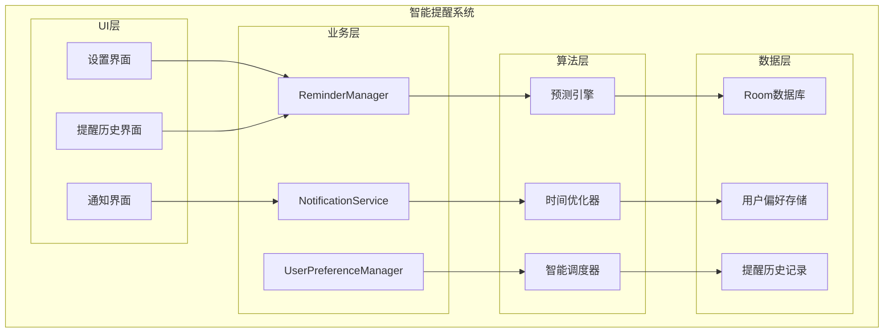
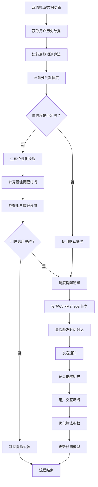

# LuminCore 智能提醒系统详细计划


## 📋 项目概述

### 系统目标
开发一套基于用户个人数据的智能提醒系统，通过分析用户的月经周期历史数据，提供个性化、准确的健康提醒服务。

### 核心价值
- **个性化体验**：基于个人周期数据的智能算法
- **健康管理**：及时的健康状态提醒和建议
- **用户粘性**：通过有价值的提醒增加用户使用频率
- **数据驱动**：利用历史数据提供精准预测

## 🎯 功能需求分析

### 1. 提醒类型定义

#### 1.1 月经周期提醒
```kotlin
enum class PeriodReminderType(
    val displayName: String,
    val defaultAdvanceDays: Int,
    val priority: ReminderPriority
) {
    PERIOD_COMING("月经即将来临", 2, ReminderPriority.HIGH),
    PERIOD_LATE("月经延迟提醒", 0, ReminderPriority.URGENT),
    PERIOD_END_PREDICTION("预计结束时间", 0, ReminderPriority.MEDIUM),
    OVULATION_COMING("排卵期即将开始", 1, ReminderPriority.MEDIUM),
    OVULATION_PEAK("排卵高峰期", 0, ReminderPriority.MEDIUM)
}
```

#### 1.2 健康记录提醒
```kotlin
enum class RecordReminderType(
    val displayName: String,
    val frequency: ReminderFrequency
) {
    DAILY_SYMPTOM_RECORD("记录今日症状", ReminderFrequency.DAILY),
    PERIOD_START_RECORD("记录月经开始", ReminderFrequency.AS_NEEDED),
    PERIOD_END_RECORD("记录月经结束", ReminderFrequency.AS_NEEDED),
    WEEKLY_HEALTH_CHECK("每周健康回顾", ReminderFrequency.WEEKLY)
}
```

### 2. 智能算法设计

#### 2.1 周期预测算法
```kotlin
data class CyclePrediction(
    val nextPeriodDate: Date,
    val confidence: Float, // 0.0 - 1.0
    val cycleLength: Int,
    val variability: Float,
    val ovulationDate: Date?
)

class CyclePredictionEngine @Inject constructor() {
    
    fun predictNextCycle(records: List<MenstrualRecord>): CyclePrediction {
        return when {
            records.size < 2 -> defaultPrediction()
            records.size < 6 -> simplePrediction(records)
            else -> advancedPrediction(records)
        }
    }
    
    private fun advancedPrediction(records: List<MenstrualRecord>): CyclePrediction {
        // 使用加权移动平均算法
        val recentWeight = 0.5f
        val mediumWeight = 0.3f
        val historicalWeight = 0.2f
        
        val recentCycles = records.take(3).map { calculateCycleLength(it, records) }
        val mediumCycles = records.drop(3).take(3).map { calculateCycleLength(it, records) }
        val historicalCycles = records.drop(6).map { calculateCycleLength(it, records) }
        
        val weightedAverage = (
            recentCycles.average() * recentWeight +
            mediumCycles.average() * mediumWeight +
            historicalCycles.average() * historicalWeight
        ).toInt()
        
        val lastPeriod = records.first().startDate
        val nextPeriod = Calendar.getInstance().apply {
            time = lastPeriod
            add(Calendar.DAY_OF_MONTH, weightedAverage)
        }.time
        
        val variability = calculateVariability(records)
        val confidence = calculateConfidence(variability, records.size)
        
        return CyclePrediction(
            nextPeriodDate = nextPeriod,
            confidence = confidence,
            cycleLength = weightedAverage,
            variability = variability,
            ovulationDate = calculateOvulationDate(nextPeriod, weightedAverage)
        )
    }
}
```

## 🏗️ 技术架构设计

### 1. 核心组件架构



### 2. 智能提醒流程



### 2. 提醒管理器实现
```
@Singleton
class ReminderManager @Inject constructor(
    private val context: Context,
    private val repository: MenstrualRepository,
    private val userPreferencesRepository: UserPreferencesRepository,
    private val predictionEngine: CyclePredictionEngine,
    private val notificationManager: NotificationManager,
    private val workManager: WorkManager
) {
    
    suspend fun scheduleAllReminders(userId: String) {
        val userRecords = repository.getAllRecords()
        val userPreferences = userPreferencesRepository.getReminderPreferences(userId)
        
        if (!userPreferences.isReminderEnabled) return
        
        // 取消现有提醒
        cancelAllReminders()
        
        // 预测下次周期
        val prediction = predictionEngine.predictNextCycle(userRecords)
        
        // 调度各类提醒
        schedulePeriodReminders(prediction, userPreferences)
        scheduleOvulationReminders(prediction, userPreferences)
        scheduleRecordReminders(userPreferences)
    }
    
    private suspend fun schedulePeriodReminders(
        prediction: CyclePrediction,
        preferences: UserReminderPreferences
    ) {
        if (!preferences.isPeriodReminderEnabled) return
        
        val reminderDate = Calendar.getInstance().apply {
            time = prediction.nextPeriodDate
            add(Calendar.DAY_OF_MONTH, -preferences.periodAdvanceDays)
        }.time
        
        val workRequest = OneTimeWorkRequestBuilder<PeriodReminderWorker>()
            .setInputData(workDataOf(
                "reminder_type" to PeriodReminderType.PERIOD_COMING.name,
                "scheduled_date" to prediction.nextPeriodDate.time,
                "confidence" to prediction.confidence
            ))
            .setInitialDelay(
                reminderDate.time - System.currentTimeMillis(),
                TimeUnit.MILLISECONDS
            )
            .addTag("period_reminder")
            .build()
            
        workManager.enqueue(workRequest)
    }
}
```

## 🗃️ 数据模型设计

### 1. 提醒实体
```
@Entity(tableName = "reminders")
data class Reminder(
    @PrimaryKey(autoGenerate = true)
    val id: Long = 0,
    
    @ColumnInfo(name = "user_id")
    val userId: String,
    
    @ColumnInfo(name = "reminder_type")
    val reminderType: String,
    
    @ColumnInfo(name = "scheduled_time")
    val scheduledTime: Date,
    
    @ColumnInfo(name = "is_sent")
    val isSent: Boolean = false,
    
    @ColumnInfo(name = "user_action")
    val userAction: String? = null, // OPENED, DISMISSED, QUICK_RECORD
    
    @ColumnInfo(name = "created_at")
    val createdAt: Date = Date()
)

@Entity(tableName = "user_reminder_preferences")
data class UserReminderPreferences(
    @PrimaryKey
    @ColumnInfo(name = "user_id")
    val userId: String,
    
    @ColumnInfo(name = "is_reminder_enabled")
    val isReminderEnabled: Boolean = true,
    
    @ColumnInfo(name = "is_period_reminder_enabled")
    val isPeriodReminderEnabled: Boolean = true,
    
    @ColumnInfo(name = "period_advance_days")
    val periodAdvanceDays: Int = 2,
    
    @ColumnInfo(name = "period_reminder_time")
    val periodReminderTime: LocalTime = LocalTime.of(9, 0),
    
    @ColumnInfo(name = "is_ovulation_reminder_enabled")
    val isOvulationReminderEnabled: Boolean = true,
    
    @ColumnInfo(name = "is_daily_record_enabled")
    val isDailyRecordEnabled: Boolean = false,
    
    @ColumnInfo(name = "daily_record_time")
    val dailyRecordTime: LocalTime = LocalTime.of(20, 0)
)
```

## 📊 实施计划

### 第一阶段：基础架构（2周）
- [ ] 设计数据模型和数据库表结构
- [ ] 实现基础的提醒管理器框架
- [ ] 集成WorkManager进行任务调度
- [ ] 创建基础的通知系统

### 第二阶段：核心算法（3周）
- [ ] 实现周期预测算法
- [ ] 开发智能时间优化器
- [ ] 实现提醒类型分类和优先级
- [ ] 添加用户行为分析

### 第三阶段：用户界面（2周）
- [ ] 开发提醒设置页面
- [ ] 创建提醒历史查看界面
- [ ] 实现通知交互功能
- [ ] 添加快速操作按钮

### 第四阶段：测试优化（1周）
- [ ] 单元测试覆盖核心算法
- [ ] 集成测试验证提醒流程
- [ ] 性能测试和优化
- [ ] 用户体验测试

## 🎯 成功指标

### 技术指标
- 提醒准确率 > 85%
- 通知延迟 < 1分钟
- 电池消耗增加 < 5%
- 崩溃率 < 0.1%

### 用户体验指标
- 提醒交互率 > 60%
- 用户满意度 > 4.5/5
- 功能启用率 > 70%
- 每日活跃用户提升 20%

## 📚 技术依赖

### 新增依赖
```
// WorkManager for background tasks
implementation "androidx.work:work-runtime-ktx:2.9.0"

// Notification compatibility
implementation "androidx.core:core-ktx:1.12.0"

// Time handling
implementation "org.threeten:threetenbp:1.6.8"
```

### 权限要求
```
<!-- 发送通知 -->
<uses-permission android:name="android.permission.POST_NOTIFICATIONS" />

<!-- 后台任务 -->
<uses-permission android:name="android.permission.WAKE_LOCK" />

<!-- 启动时自动启动 -->
<uses-permission android:name="android.permission.RECEIVE_BOOT_COMPLETED" />
```

## 🔄 后续优化方向

1. **机器学习集成**：基于更多用户数据训练个性化模型
2. **跨设备同步**：支持多设备提醒同步
3. **语音交互**：集成语音助手进行提醒交互
4. **健康生态**：与其他健康应用数据互通

---

**文档版本**: 1.0.0
**创建日期**: 2025年8月25日
**计划负责人**: 祁潇潇
**审核状态**: 已审核
**预计开始时间**: 2029年4月1日
**预计完成时间**: 2029年6月30日
## 🔄 相关依赖
- [AI健康助手功能](./AI_HEALTH_ASSISTANT_PLAN.md)
- [数据加密功能](./DATA_ENCRYPTION_PLAN.md)
- [云端同步架构](./CLOUD_SYNC_ARCHITECTURE_PLAN.md)
- [可穿戴设备集成](./WEARABLE_DEVICE_INTEGRATION_PLAN.md)