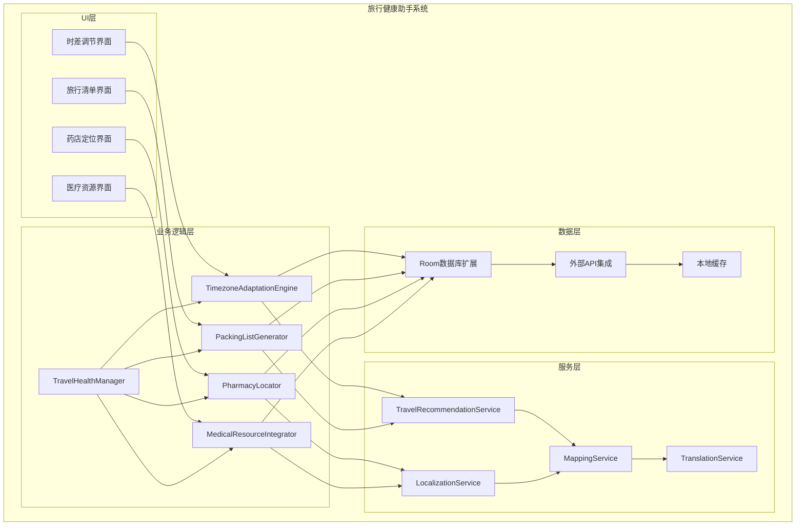
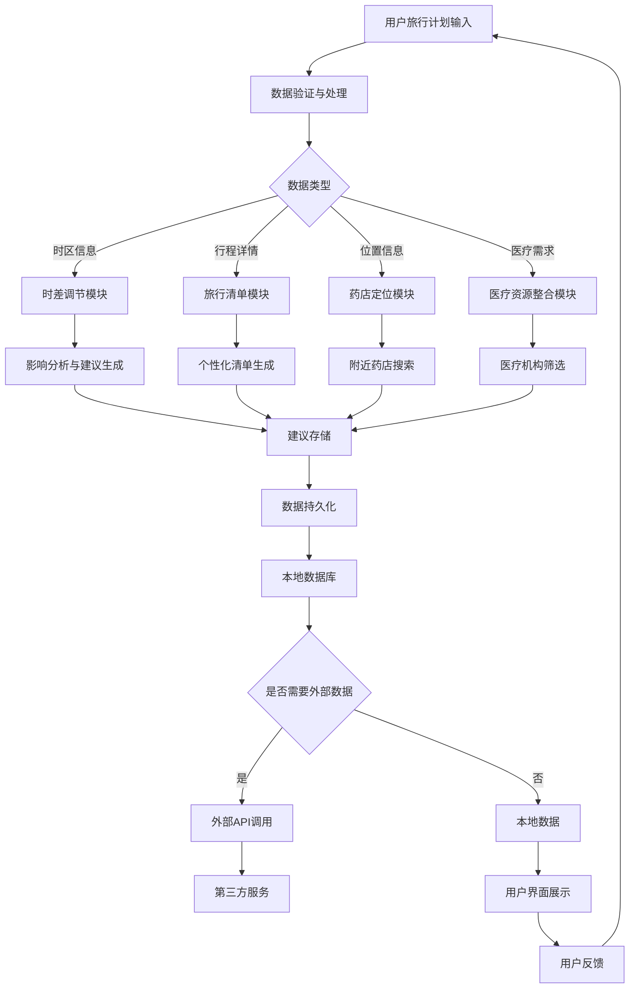

# LuminCore 旅行健康助手功能详细计划


## 📋 项目概述

### 功能目标
开发一套完整的旅行健康助手系统，为女性用户提供跨时区旅行的健康建议、个性化旅行用品清单、紧急医疗资源定位和当地医疗服务整合功能，帮助用户在旅行过程中维持良好的健康状态。

### 核心价值
- **时差调节建议**：预测跨时区旅行对月经周期的影响并提供调节建议
- **旅行用品清单**：基于目的地和个人周期的必需品提醒
- **紧急药店定位**：全球药店定位和常用药品翻译
- **当地医疗资源**：妇科医生和医院信息整合

## 🎯 功能需求分析

### 1. 时差调节建议系统

#### 1.1 时区影响分析
```kotlin
data class TimezoneImpactAnalysis(
    val userId: String,
    val travelRoute: TravelRoute,
    val estimatedCycleDisruption: CycleDisruption,
    val adaptationTimeline: AdaptationTimeline,
    val personalizedRecommendations: List<AdaptationRecommendation>,
    val riskAssessment: RiskAssessment
)

data class TravelRoute(
    val originTimezone: String,
    val destinationTimezone: String,
    val travelDate: Date,
    val returnDate: Date,
    val layovers: List<Layover>
)

data class CycleDisruption(
    val expectedShiftDays: Int,
    val severity: DisruptionSeverity,
    val affectedCyclePhases: List<MenstrualCyclePhase>,
    val symptomPredictions: List<SymptomPrediction>
)

enum class DisruptionSeverity {
    MINIMAL, // 轻微影响（1-2天）
    MODERATE, // 中等影响（3-5天）
    SIGNIFICANT // 显著影响（5天以上）
}

data class SymptomPrediction(
    val symptom: SymptomType,
    val likelihood: Float, // 0.0-1.0
    val intensity: SymptomSeverity,
    val affectedDays: List<Date>
)
```

#### 1.2 适应性建议引擎
```kotlin
data class AdaptationRecommendation(
    val recommendationType: RecommendationType,
    val title: String,
    val description: String,
    val implementationSteps: List<String>,
    val timing: RecommendationTiming,
    val priority: RecommendationPriority
)

enum class RecommendationType {
    LIGHT_EXPOSURE, // 光照调节
    SLEEP_SCHEDULE, // 睡眠时间调整
    NUTRITION_ADJUSTMENT, // 营养调节
    EXERCISE_MODIFICATION, // 运动调整
    STRESS_MANAGEMENT // 压力管理
}

data class RecommendationTiming(
    val startDate: Date,
    val endDate: Date?,
    val optimalTimes: List<TimeOfDay>,
    val frequency: Frequency
)

enum class TimeOfDay {
    MORNING, // 早晨
    AFTERNOON, // 下午
    EVENING, // 晚上
    NIGHT // 夜间
}

enum class Frequency {
    ONCE_DAILY, // 每日一次
    MULTIPLE_DAILY, // 每日多次
    AS_NEEDED, // 按需
    CONTINUOUS // 持续进行
}
```

### 2. 旅行用品清单系统

#### 2.1 个性化清单生成
```kotlin
data class TravelPackingList(
    val id: String,
    val userId: String,
    val tripDetails: TripDetails,
    val essentialItems: List<PackingItem>,
    val cycleSpecificItems: List<PackingItem>,
    val climateAdaptedItems: List<PackingItem>,
    val medicalItems: List<PackingItem>,
    val totalEstimatedWeight: Float // 克
)

data class TripDetails(
    val destination: String,
    val departureDate: Date,
    val returnDate: Date,
    val purpose: TripPurpose,
    val accommodationType: AccommodationType,
    val climate: ClimateType,
    val activities: List<ActivityType>
)

data class PackingItem(
    val id: String,
    val name: String,
    val category: ItemCategory,
    val quantity: Int,
    val weight: Float?, // 克，可选
    val importance: ItemImportance,
    val cycleRelevance: CycleRelevance?,
    val notes: String?
)

enum class ItemCategory {
    CLOTHING, // 服装
    TOILETRIES, // 洗漱用品
    MEDICATION, // 药物
    HYGIENE, // 卫生用品
    ELECTRONICS, // 电子产品
    DOCUMENTS, // 证件
    FOOD, // 食物
    MISC // 其他
}

enum class ItemImportance {
    ESSENTIAL, // 必需品
    IMPORTANT, // 重要
    RECOMMENDED, // 推荐
    OPTIONAL // 可选
}

data class CycleRelevance(
    val relevantPhases: List<MenstrualCyclePhase>,
    val usageTiming: UsageTiming,
    val quantityRecommendation: String
)

enum class UsageTiming {
    CONTINUOUS, // 持续使用
    CYCLE_START, // 周期开始时
    CYCLE_MID, // 周期中期
    CYCLE_END // 周期结束时
)
```

#### 2.2 智能提醒系统
```kotlin
data class PackingReminder(
    val id: Long = 0,
    val userId: String,
    val tripId: String,
    val itemId: String,
    val reminderType: ReminderType,
    val scheduledTime: Date,
    val isCompleted: Boolean = false,
    val completionTime: Date?
)

enum class ReminderType {
    PREPARATION_START, // 准备开始提醒
    ITEM_PURCHASE, // 物品购买提醒
    PACKING_CHECKLIST, // 打包清单提醒
    TRAVEL_DAY // 旅行日提醒
}
```

### 3. 紧急药店定位系统

#### 3.1 全球药店数据库
```kotlin
data class Pharmacy(
    val id: String,
    val name: String,
    val address: String,
    val location: GeoLocation,
    val contactInfo: ContactInfo,
    val languagesSpoken: List<String>,
    val services: Set<PharmacyService>,
    val operatingHours: OperatingHours,
    val emergencyAvailability: Boolean,
    val rating: Float? // 0.0-5.0
)

data class GeoLocation(
    val latitude: Double,
    val longitude: Double,
    val addressComponents: AddressComponents
)

data class AddressComponents(
    val country: String,
    val city: String,
    val district: String?,
    val street: String,
    val postalCode: String?
)

enum class PharmacyService {
    PRESCRIPTION_FILLING, // 处方配药
    OVER_THE_COUNTER, // 非处方药
    EMERGENCY_MEDICATION, // 紧急药物
    HEALTH_CONSULTATION, // 健康咨询
    VACCINATION, // 疫苗接种
    MEDICAL_EQUIPMENT // 医疗设备
}

data class OperatingHours(
    val monday: TimeRange?,
    val tuesday: TimeRange?,
    val wednesday: TimeRange?,
    val thursday: TimeRange?,
    val friday: TimeRange?,
    val saturday: TimeRange?,
    val sunday: TimeRange?
)

data class TimeRange(
    val openTime: String, // HH:mm格式
    val closeTime: String // HH:mm格式
)
```

#### 3.2 药品翻译系统
```kotlin
data class MedicationTranslation(
    val commonName: String, // 通用名
    val brandNames: Map<String, String>, // 国家 -> 品牌名
    val activeIngredients: List<ActiveIngredient>,
    val dosageForms: List<DosageForm>,
    val indications: List<String>, // 适应症
    val contraindications: List<String>, // 禁忌症
    val sideEffects: List<String>, // 副作用
    val warnings: List<String> // 警告
)

data class ActiveIngredient(
    val name: String,
    val strength: String,
    val unit: String
)

data class DosageForm(
    val form: MedicationForm,
    val typicalDosage: String
)

enum class MedicationForm {
    TABLET, // 片剂
    CAPSULE, // 胶囊
    SYRUP, // 糖浆
    INJECTION, // 注射剂
    CREAM, // 乳膏
    DROPS, // 滴剂
    INHALER // 吸入剂
}
```

### 4. 当地医疗资源整合系统

#### 4.1 医疗机构数据库
```kotlin
data class MedicalFacility(
    val id: String,
    val name: String,
    val type: FacilityType,
    val specialties: Set<MedicalSpecialty>,
    val address: String,
    val location: GeoLocation,
    val contactInfo: ContactInfo,
    val languagesSpoken: List<String>,
    val insuranceAccepted: List<String>,
    val operatingHours: OperatingHours,
    val emergencyServices: Boolean,
    val appointmentRequired: Boolean,
    val femaleDoctorAvailability: Boolean,
    val rating: Float? // 0.0-5.0
)

enum class FacilityType {
    HOSPITAL, // 医院
    CLINIC, // 诊所
    SPECIALIST_CENTER, // 专科中心
    EMERGENCY_CENTER // 急诊中心
}

enum class MedicalSpecialty {
    GYNECOLOGY, // 妇科
    OBSTETRICS, // 产科
    REPRODUCTIVE_HEALTH, // 生殖健康
    INTERNAL_MEDICINE, // 内科
    EMERGENCY_MEDICINE, // 急诊医学
    FAMILY_MEDICINE // 家庭医学
)

data class ContactInfo(
    val phone: String?,
    val email: String?,
    val website: String?,
    val socialMedia: Map<String, String>?
)
```

#### 4.2 医疗服务整合
```kotlin
data class MedicalService(
    val id: String,
    val facilityId: String,
    val serviceName: String,
    val specialty: MedicalSpecialty,
    val description: String,
    val duration: Int, // 分钟
    val costRange: CostRange,
    val appointmentBooking: AppointmentBookingInfo?,
    val availability: ServiceAvailability
)

data class CostRange(
    val currency: String,
    val minCost: Float,
    val maxCost: Float,
    val typicalCost: Float
)

data class AppointmentBookingInfo(
    val onlineBookingAvailable: Boolean,
    val bookingUrl: String?,
    val bookingPhone: String?,
    val advanceNoticeRequired: Int? // 小时
)

data class ServiceAvailability(
    val weekdays: List<DayAvailability>,
    val weekends: List<DayAvailability>,
    val holidays: List<DayAvailability>?
)

data class DayAvailability(
    val day: String,
    val availableSlots: List<TimeSlot>
)

data class TimeSlot(
    val startTime: String, // HH:mm格式
    val endTime: String, // HH:mm格式
    val isAvailable: Boolean
)
```

## 🏗️ 技术架构设计

### 1. 核心组件架构



### 2. 数据流设计



## 🗃️ 数据模型设计

### 1. 时差调节实体
```kotlin
@Entity(tableName = "timezone_impact_analyses")
data class TimezoneImpactAnalysisEntity(
    @PrimaryKey
    val id: String,
    
    @ColumnInfo(name = "user_id")
    val userId: String,
    
    @ColumnInfo(name = "travel_route")
    val travelRoute: String, // JSON格式存储
    
    @ColumnInfo(name = "estimated_disruption")
    val estimatedDisruption: String, // JSON格式存储
    
    @ColumnInfo(name = "adaptation_timeline")
    val adaptationTimeline: String, // JSON格式存储
    
    @ColumnInfo(name = "recommendations")
    val recommendations: String, // JSON格式存储
    
    @ColumnInfo(name = "risk_assessment")
    val riskAssessment: String, // JSON格式存储
    
    @ColumnInfo(name = "analysis_date")
    val analysisDate: Date,
    
    @ColumnInfo(name = "is_active")
    val isActive: Boolean = true,
    
    @ColumnInfo(name = "created_at")
    val createdAt: Date = Date(),
    
    @ColumnInfo(name = "updated_at")
    val updatedAt: Date = Date()
)
```

### 2. 旅行清单实体
```kotlin
@Entity(tableName = "travel_packing_lists")
data class TravelPackingListEntity(
    @PrimaryKey
    val id: String,
    
    @ColumnInfo(name = "user_id")
    val userId: String,
    
    @ColumnInfo(name = "trip_details")
    val tripDetails: String, // JSON格式存储
    
    @ColumnInfo(name = "essential_items")
    val essentialItems: String, // JSON格式存储
    
    @ColumnInfo(name = "cycle_specific_items")
    val cycleSpecificItems: String, // JSON格式存储
    
    @ColumnInfo(name = "climate_items")
    val climateItems: String, // JSON格式存储
    
    @ColumnInfo(name = "medical_items")
    val medicalItems: String, // JSON格式存储
    
    @ColumnInfo(name = "total_weight")
    val totalWeight: Float,
    
    @ColumnInfo(name = "generated_date")
    val generatedDate: Date,
    
    @ColumnInfo(name = "is_active")
    val isActive: Boolean = true,
    
    @ColumnInfo(name = "created_at")
    val createdAt: Date = Date(),
    
    @ColumnInfo(name = "updated_at")
    val updatedAt: Date = Date()
)
```

### 3. 药店定位实体
```kotlin
@Entity(tableName = "pharmacies")
data class PharmacyEntity(
    @PrimaryKey
    val id: String,
    
    @ColumnInfo(name = "name")
    val name: String,
    
    @ColumnInfo(name = "address")
    val address: String,
    
    @ColumnInfo(name = "latitude")
    val latitude: Double,
    
    @ColumnInfo(name = "longitude")
    val longitude: Double,
    
    @ColumnInfo(name = "address_components")
    val addressComponents: String, // JSON格式存储
    
    @ColumnInfo(name = "contact_info")
    val contactInfo: String, // JSON格式存储
    
    @ColumnInfo(name = "languages")
    val languages: String, // JSON格式存储
    
    @ColumnInfo(name = "services")
    val services: String, // JSON格式存储
    
    @ColumnInfo(name = "operating_hours")
    val operatingHours: String, // JSON格式存储
    
    @ColumnInfo(name = "emergency_available")
    val emergencyAvailable: Boolean,
    
    @ColumnInfo(name = "rating")
    val rating: Float?,
    
    @ColumnInfo(name = "last_updated")
    val lastUpdated: Date,
    
    @ColumnInfo(name = "created_at")
    val createdAt: Date = Date()
)
```

### 4. 医疗资源实体
```kotlin
@Entity(tableName = "medical_facilities")
data class MedicalFacilityEntity(
    @PrimaryKey
    val id: String,
    
    @ColumnInfo(name = "name")
    val name: String,
    
    @ColumnInfo(name = "type")
    val type: String,
    
    @ColumnInfo(name = "specialties")
    val specialties: String, // JSON格式存储
    
    @ColumnInfo(name = "address")
    val address: String,
    
    @ColumnInfo(name = "latitude")
    val latitude: Double,
    
    @ColumnInfo(name = "longitude")
    val longitude: Double,
    
    @ColumnInfo(name = "address_components")
    val addressComponents: String, // JSON格式存储
    
    @ColumnInfo(name = "contact_info")
    val contactInfo: String, // JSON格式存储
    
    @ColumnInfo(name = "languages")
    val languages: String, // JSON格式存储
    
    @ColumnInfo(name = "insurance_accepted")
    val insuranceAccepted: String, // JSON格式存储
    
    @ColumnInfo(name = "operating_hours")
    val operatingHours: String, // JSON格式存储
    
    @ColumnInfo(name = "emergency_services")
    val emergencyServices: Boolean,
    
    @ColumnInfo(name = "appointment_required")
    val appointmentRequired: Boolean,
    
    @ColumnInfo(name = "female_doctor_available")
    val femaleDoctorAvailable: Boolean,
    
    @ColumnInfo(name = "rating")
    val rating: Float?,
    
    @ColumnInfo(name = "last_updated")
    val lastUpdated: Date,
    
    @ColumnInfo(name = "created_at")
    val createdAt: Date = Date()
)
```

## 📊 实施计划

### 第一阶段：基础功能开发（2033年Q1）

#### 第1-4周（2033年1月-1月）
- [ ] 设计数据模型和数据库表结构
- [ ] 实现时差调节建议核心功能
- [ ] 开发时区影响分析界面
- [ ] 实现基础算法引擎

#### 第5-8周（2033年2月-2月）
- [ ] 实现旅行用品清单核心功能
- [ ] 开发个性化清单生成界面
- [ ] 构建物品数据库
- [ ] 实现智能提醒系统

#### 第9-12周（2033年3月-3月）
- [ ] 实现紧急药店定位功能
- [ ] 开发药店搜索界面
- [ ] 构建全球药店数据库
- [ ] 实现药品翻译系统

### 第二阶段：医疗资源整合与集成（2033年Q2）

#### 第13-16周（2033年4月-4月）
- [ ] 实现当地医疗资源整合功能
- [ ] 开发医疗机构搜索界面
- [ ] 构建医疗资源数据库
- [ ] 实现服务预约集成

#### 第17-20周（2033年5月-5月）
- [ ] 集成所有模块功能
- [ ] 开发统一管理界面
- [ ] 构建数据同步机制
- [ ] 实现离线功能支持

#### 第21-24周（2033年6月-6月）
- [ ] 系统集成测试
- [ ] 用户体验优化
- [ ] 性能调优
- [ ] Bug修复和完善

### 第三阶段：优化与完善（2033年Q3）

#### 第25-28周（2033年7月-7月）
- [ ] 高级功能开发
- [ ] 界面美化和动画效果
- [ ] 多语言支持
- [ ] 无障碍功能优化

#### 第29-32周（2033年8月-8月）
- [ ] 集成测试和Bug修复
- [ ] 用户反馈收集和改进
- [ ] 文档完善和用户指南
- [ ] 准备发布版本

#### 第33-36周（2033年9月-9月）
- [ ] Beta测试和优化
- [ ] 安全性审查
- [ ] 最终版本发布准备
- [ ] 上线和推广

## 🎯 成功指标

### 技术指标
- 系统响应时间 < 2秒
- 位置搜索延迟 < 3秒
- 应用崩溃率 < 0.1%
- 时区影响预测准确率 > 80%

### 用户体验指标
- 功能使用率 > 70%
- 用户满意度 > 4.5/5
- 留存率（30天）> 65%
- 旅行清单完成率 > 80%

### 业务指标
- 新用户增长 > 25%
- 付费转化率 > 8%
- 用户平均使用时长 > 15分钟/天
- 医疗资源查询成功率 > 90%

## 🛡️ 风险评估与缓解策略

### 技术风险
**风险1**: 全球医疗数据准确性问题
- **缓解策略**: 建立数据验证机制，与权威机构合作
- **应急计划**: 提供数据更新功能，允许用户反馈修正

**风险2**: 时区影响预测算法准确性不足
- **缓解策略**: 基于大量用户数据持续优化算法
- **应急计划**: 提供算法准确度说明，增加用户手动调整功能

### 用户体验风险
**风险3**: 功能复杂度高导致用户流失
- **缓解策略**: 设计渐进式引导，提供个性化设置
- **应急计划**: 简化核心功能，提供快速入门模式

### 数据风险
**风险4**: 用户隐私数据泄露
- **缓解策略**: 实施严格的数据加密和访问控制
- **应急计划**: 建立紧急响应机制，及时通知用户

## 💰 资源需求与预算

### 人力资源
- **Android开发工程师**: 1.5人（全职6个月）
- **算法工程师**: 0.5人（时区影响预测算法）
- **UI/UX设计师**: 0.3人（界面设计）
- **测试工程师**: 0.3人（功能测试）

### 技术资源
- **开发工具**: Android Studio, Git, CI/CD
- **第三方库**: MPAndroidChart, WorkManager, Google Maps SDK
- **测试工具**: 自动化测试框架

### 预算估算
- **人力成本**: 主要成本，约6个月开发周期
- **工具和库**: 主要使用开源方案，成本较低
- **测试和部署**: 标准开发流程，无额外成本

## 📈 长期发展规划

### 短期目标（1年内）
- 完善基础功能，提升用户体验
- 增加更多国家和地区的医疗资源数据
- 优化算法准确性和性能

### 中期目标（1-3年）
- 集成更多旅行服务（如保险、交通等）
- 增加AI旅行健康助手功能
- 扩展到更多语言和地区

### 长期目标（3-5年）
- 构建完整的旅行健康生态系统
- 与医疗机构深度合作提供专业服务
- 发展全球旅行健康服务平台

---

**文档版本**: 1.0.0
**创建日期**: 2025年9月27日
**计划负责人**: 祁潇潇
**审核状态**: 已审核
**预计开始时间**: 2033年1月1日
**预计完成时间**: 2033年9月30日
## 🔄 相关依赖
- [智能提醒系统](./SMART_REMINDER_SYSTEM_PLAN.md)
- [云端同步架构](./CLOUD_SYNC_ARCHITECTURE_PLAN.md)
- [数据加密功能](./DATA_ENCRYPTION_PLAN.md)