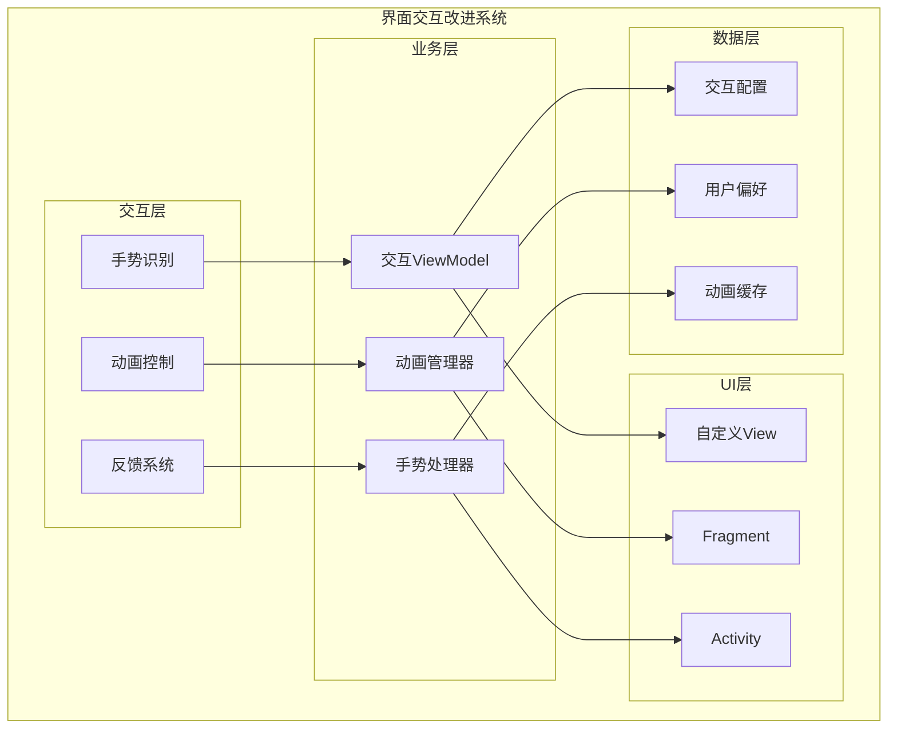
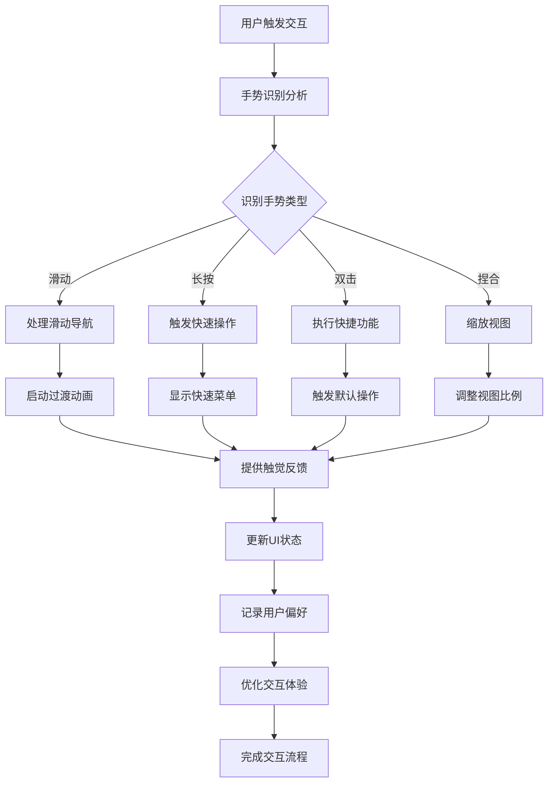

# LuminCore 界面交互改进详细计划


## 📋 项目概述

### 系统目标
全面提升LuminCore应用的用户界面交互体验，通过现代化的交互设计、流畅的动画效果和直观的操作方式，让用户在记录和管理健康数据时感受到愉悦和高效。

### 核心价值
- **直观操作**：简化用户操作流程，降低学习成本
- **流畅体验**：提供顺滑的动画和即时反馈
- **个性化交互**：支持用户自定义交互偏好
- **无障碍友好**：确保所有用户都能轻松使用

## 🎯 功能需求分析

### 1. 交互改进重点领域

#### 1.1 日历界面交互优化
```kotlin
enum class CalendarInteractionType(
    val displayName: String,
    val gestureType: GestureType
) {
    SWIPE_MONTH_NAVIGATION("滑动切换月份", GestureType.SWIPE_HORIZONTAL),
    LONG_PRESS_QUICK_ADD("长按快速添加", GestureType.LONG_PRESS),
    DOUBLE_TAP_TODAY("双击回到今天", GestureType.DOUBLE_TAP),
    PINCH_ZOOM_CALENDAR("捏合缩放日历", GestureType.PINCH_ZOOM)
}
```

#### 1.2 数据输入交互优化
```kotlin
enum class InputInteractionType(
    val displayName: String,
    val enhancement: String
) {
    SMART_AUTOCOMPLETE("智能自动完成", "基于历史数据的智能建议"),
    GESTURE_RATING("手势评分", "滑动手势快速评分症状强度"),
    VOICE_INPUT("语音输入", "语音转文字记录症状"),
    QUICK_SELECTION("快速选择", "常用选项快速点选")
}
```

### 2. 动画与过渡效果

#### 2.1 微交互动画
```kotlin
class MicroInteractionAnimator {
    
    fun createButtonPressAnimation(view: View): Animator {
        return AnimatorSet().apply {
            playTogether(
                ObjectAnimator.ofFloat(view, "scaleX", 1f, 0.95f, 1f),
                ObjectAnimator.ofFloat(view, "scaleY", 1f, 0.95f, 1f)
            )
            duration = 100L
            interpolator = OvershootInterpolator()
        }
    }
    
    fun createSuccessAnimation(view: ImageView): Animator {
        return AnimatorSet().apply {
            playSequentially(
                ObjectAnimator.ofFloat(view, "scaleX", 0f, 1.2f),
                ObjectAnimator.ofFloat(view, "scaleX", 1.2f, 1f)
            )
            duration = 300L
        }
    }
}
```

## 🏗️ 技术架构设计

### 1. 系统架构



### 2. 交互优化流程



### 3. 核心组件实现

#### 3.1 手势识别管理器
```kotlin
@Singleton
class GestureManager @Inject constructor(
    private val context: Context,
    private val hapticFeedback: HapticFeedbackManager
) {
    
    fun setupCalendarGestures(calendarView: RecyclerView): GestureDetector {
        return GestureDetector(context, object : GestureDetector.SimpleOnGestureListener() {
            
            override fun onFling(
                e1: MotionEvent,
                e2: MotionEvent,
                velocityX: Float,
                velocityY: Float
            ): Boolean {
                val deltaX = e2.x - e1.x
                
                return when {
                    abs(deltaX) > SWIPE_THRESHOLD -> {
                        if (deltaX > 0) {
                            onSwipeRight() // 上个月
                        } else {
                            onSwipeLeft()  // 下个月
                        }
                        hapticFeedback.performLightImpact()
                        true
                    }
                    else -> false
                }
            }
            
            override fun onLongPress(e: MotionEvent) {
                val position = calendarView.findChildViewUnder(e.x, e.y)?.let {
                    calendarView.getChildAdapterPosition(it)
                }
                position?.let { pos ->
                    onCalendarLongPress(pos, e.x, e.y)
                    hapticFeedback.performHeavyImpact()
                }
            }
            
            override fun onDoubleTap(e: MotionEvent): Boolean {
                onCalendarDoubleTap()
                hapticFeedback.performMediumImpact()
                return true
            }
        })
    }
    
    private fun onSwipeLeft() {
        EventBus.getDefault().post(CalendarNavigationEvent.NEXT_MONTH)
    }
    
    private fun onSwipeRight() {
        EventBus.getDefault().post(CalendarNavigationEvent.PREVIOUS_MONTH)
    }
    
    companion object {
        private const val SWIPE_THRESHOLD = 100
    }
}
```

#### 3.2 动画管理器
```kotlin
@Singleton
class AnimationManager @Inject constructor(
    private val context: Context
) {
    
    fun createPageTransition(transitionType: TransitionType): Transition {
        return when (transitionType) {
            TransitionType.SLIDE_HORIZONTAL -> MaterialSharedAxis(MaterialSharedAxis.X, true)
            TransitionType.FADE_THROUGH -> MaterialFadeThrough()
            TransitionType.CONTAINER_TRANSFORM -> MaterialContainerTransform()
            else -> MaterialFadeThrough()
        }.apply {
            duration = 300L
        }
    }
    
    fun animateValueChange(
        targetView: View,
        fromValue: Float,
        toValue: Float,
        property: String
    ): ValueAnimator {
        return ValueAnimator.ofFloat(fromValue, toValue).apply {
            duration = 250L
            interpolator = FastOutSlowInInterpolator()
            
            addUpdateListener { animator ->
                val value = animator.animatedValue as Float
                when (property) {
                    "alpha" -> targetView.alpha = value
                    "scaleX" -> targetView.scaleX = value
                    "scaleY" -> targetView.scaleY = value
                    "translationX" -> targetView.translationX = value
                    "translationY" -> targetView.translationY = value
                }
            }
            start()
        }
    }
}
```

### 4. 自定义UI组件

#### 4.1 增强型日历视图
``kotlin
class EnhancedCalendarView @JvmOverloads constructor(
    context: Context,
    attrs: AttributeSet? = null,
    defStyleAttr: Int = 0
) : RecyclerView(context, attrs, defStyleAttr) {
    
    private lateinit var gestureDetector: GestureDetector
    private var onMonthChangeListener: ((Int) -> Unit)? = null
    private var onDateLongPressListener: ((Int, Float, Float) -> Unit)? = null
    
    init {
        setupGestureDetection()
    }
    
    private fun setupGestureDetection() {
        gestureDetector = GestureDetector(context, object : GestureDetector.SimpleOnGestureListener() {
            override fun onFling(
                e1: MotionEvent,
                e2: MotionEvent,
                velocityX: Float,
                velocityY: Float
            ): Boolean {
                val deltaX = e2.x - e1.x
                
                if (abs(deltaX) > SWIPE_THRESHOLD) {
                    if (deltaX > 0) {
                        onMonthChangeListener?.invoke(-1) // 上个月
                    } else {
                        onMonthChangeListener?.invoke(1)  // 下个月
                    }
                    animateMonthTransition(deltaX > 0)
                    return true
                }
                return false
            }
            
            override fun onLongPress(e: MotionEvent) {
                findChildViewUnder(e.x, e.y)?.let { child ->
                    val position = getChildAdapterPosition(child)
                    onDateLongPressListener?.invoke(position, e.x, e.y)
                }
            }
        })
    }
    
    private fun animateMonthTransition(isNext: Boolean) {
        val direction = if (isNext) 1f else -1f
        
        animate()
            .translationX(direction * width * 0.1f)
            .setDuration(100L)
            .withEndAction {
                animate()
                    .translationX(0f)
                    .setDuration(200L)
                    .start()
            }
            .start()
    }
    
    override fun onTouchEvent(e: MotionEvent): Boolean {
        gestureDetector.onTouchEvent(e)
        return super.onTouchEvent(e)
    }
    
    companion object {
        private const val SWIPE_THRESHOLD = 100
    }
}
```

#### 4.2 智能输入组件
``kotlin
class SmartInputLayout @JvmOverloads constructor(
    context: Context,
    attrs: AttributeSet? = null,
    defStyleAttr: Int = 0
) : LinearLayout(context, attrs, defStyleAttr) {
    
    private val editText: EditText
    private val suggestionRecyclerView: RecyclerView
    private val suggestionAdapter: SuggestionAdapter
    private var suggestions = mutableListOf<String>()
    
    init {
        orientation = VERTICAL
        
        editText = EditText(context).apply {
            hint = "输入症状或备注..."
        }
        
        suggestionRecyclerView = RecyclerView(context).apply {
            layoutManager = LinearLayoutManager(context)
            visibility = GONE
        }
        
        suggestionAdapter = SuggestionAdapter { suggestion ->
            selectSuggestion(suggestion)
        }
        
        suggestionRecyclerView.adapter = suggestionAdapter
        
        addView(editText)
        addView(suggestionRecyclerView)
        
        setupTextWatcher()
    }
    
    private fun setupTextWatcher() {
        editText.addTextChangedListener(object : TextWatcher {
            override fun onTextChanged(s: CharSequence?, start: Int, before: Int, count: Int) {
                val query = s?.toString() ?: ""
                if (query.length >= 2) {
                    showSuggestions(filterSuggestions(query))
                } else {
                    hideSuggestions()
                }
            }
            
            override fun beforeTextChanged(s: CharSequence?, start: Int, count: Int, after: Int) {}
            override fun afterTextChanged(s: Editable?) {}
        })
    }
    
    private fun filterSuggestions(query: String): List<String> {
        return suggestions.filter { 
            it.contains(query, ignoreCase = true) 
        }.take(5)
    }
    
    private fun showSuggestions(filteredSuggestions: List<String>) {
        if (filteredSuggestions.isNotEmpty()) {
            suggestionAdapter.updateSuggestions(filteredSuggestions)
            suggestionRecyclerView.visibility = VISIBLE
            suggestionRecyclerView.alpha = 0f
            suggestionRecyclerView.animate().alpha(1f).setDuration(150L).start()
        } else {
            hideSuggestions()
        }
    }
    
    private fun hideSuggestions() {
        suggestionRecyclerView.animate()
            .alpha(0f)
            .setDuration(150L)
            .withEndAction { suggestionRecyclerView.visibility = GONE }
            .start()
    }
    
    private fun selectSuggestion(suggestion: String) {
        editText.setText(suggestion)
        editText.setSelection(suggestion.length)
        hideSuggestions()
        performHapticFeedback(HapticFeedbackConstants.KEYBOARD_TAP)
    }
}
```

## 📱 用户界面改进实现

### 1. Fragment交互增强
```kotlin
@HiltViewModel
class InteractionViewModel @Inject constructor(
    private val userPreferencesRepository: UserPreferencesRepository
) : ViewModel() {
    
    private val _animationEnabled = MutableLiveData<Boolean>()
    val animationEnabled: LiveData<Boolean> = _animationEnabled
    
    private val _hapticEnabled = MutableLiveData<Boolean>()
    val hapticEnabled: LiveData<Boolean> = _hapticEnabled
    
    fun updateAnimationEnabled(enabled: Boolean) {
        viewModelScope.launch {
            userPreferencesRepository.updateAnimationEnabled(enabled)
            _animationEnabled.value = enabled
        }
    }
    
    fun updateHapticEnabled(enabled: Boolean) {
        viewModelScope.launch {
            userPreferencesRepository.updateHapticEnabled(enabled)
            _hapticEnabled.value = enabled
        }
    }
}
```

## 📊 实施计划

### 第一阶段：基础交互优化（2周）
- [ ] 实现手势识别管理器
- [ ] 开发基础动画效果
- [ ] 创建交互反馈系统
- [ ] 优化触摸响应性能

### 第二阶段：高级交互功能（3周）
- [ ] 开发智能输入组件
- [ ] 实现增强型日历交互
- [ ] 创建浮动操作菜单
- [ ] 添加语音交互支持

### 第三阶段：个性化交互（2周）
- [ ] 实现交互偏好设置
- [ ] 开发自适应交互模式
- [ ] 添加无障碍功能支持
- [ ] 创建交互教程系统

### 第四阶段：测试优化（1周）
- [ ] 交互性能测试
- [ ] 用户体验测试
- [ ] 无障碍功能测试
- [ ] 交互流程优化

## 🎯 成功指标

### 技术指标
- 手势识别准确率 > 95%
- 动画流畅度 60fps
- 交互响应时间 < 100ms
- 内存使用增加 < 15MB

### 用户体验指标
- 交互满意度 > 4.7/5
- 操作错误率降低 40%
- 功能发现率提升 50%
- 新用户上手时间减少 30%

## 📚 技术依赖

### 新增依赖
```kotlin
// Material Design Motion
implementation 'com.google.android.material:material:1.10.0'

// 动画库
implementation 'com.airbnb.android:lottie:6.1.0'

// 手势识别
implementation 'androidx.customview:customview:1.1.0'
```

## 🔄 后续优化方向

1. **AI驱动交互**：基于用户行为的智能交互优化
2. **语音控制**：完整的语音交互系统
3. **AR交互**：增强现实的数据展示交互
4. **手势库扩展**：更多自定义手势支持
5. **跨设备交互**：多设备间的协同交互

---

**文档版本**: 1.0.0
**创建日期**: 2025年8月25日
**计划负责人**: 祁潇潇
**审核状态**: 已审核
**预计开始时间**: 2029年10月1日
**预计完成时间**: 2029年12月31日
## 🔄 相关依赖
- [AI健康助手功能](./AI_HEALTH_ASSISTANT_PLAN.md)
- [数据加密功能](./DATA_ENCRYPTION_PLAN.md)
- [云端同步架构](./CLOUD_SYNC_ARCHITECTURE_PLAN.md)
- [可穿戴设备集成](./WEARABLE_DEVICE_INTEGRATION_PLAN.md)